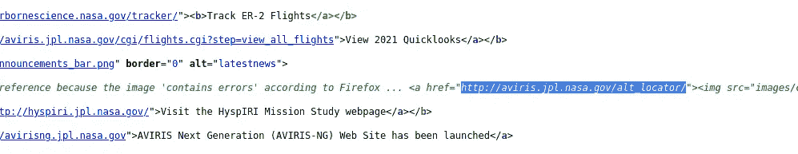
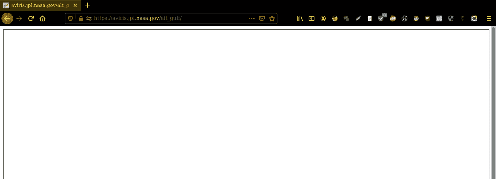
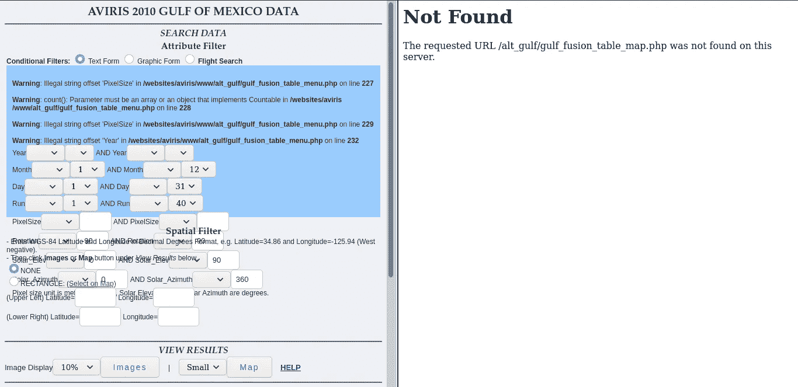
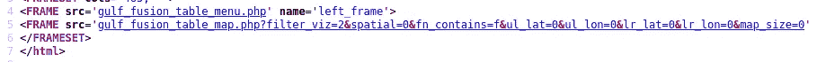
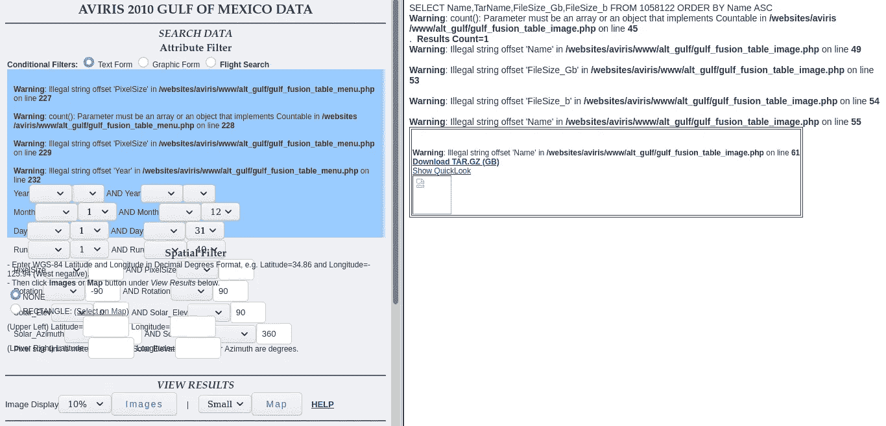
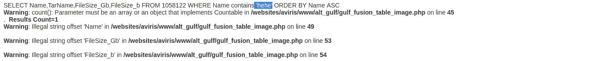
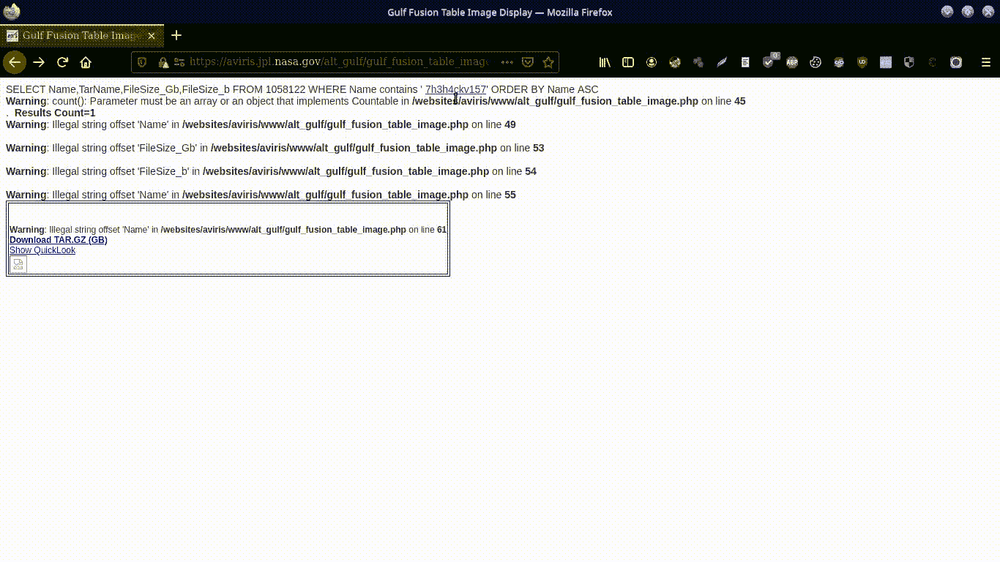
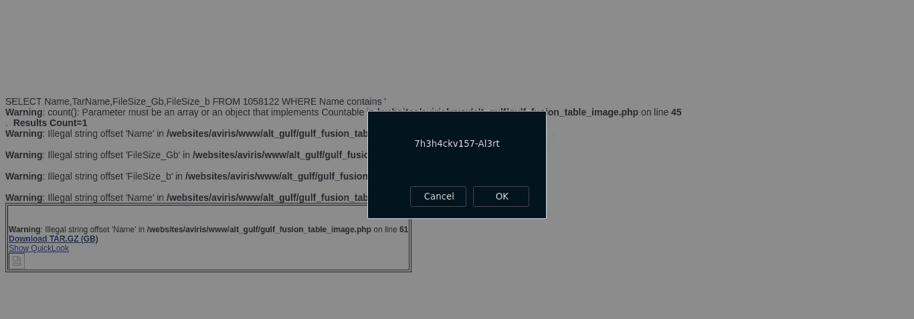

# 利用美国宇航局的漏洞

> 原文：<https://infosecwriteups.com/about-the-existing-vulnerability-in-nasa-d4451a106fc0?source=collection_archive---------0----------------------->

这个标题可能会让你有点困惑，因为我知道，你不会期待 **NASA** 。但是我保证，如果你跟着我，没有跳过一行，我会让我的观点完美😉。如果你理解其中的逻辑，你就可以忘掉那些神话。这个概念很简单，没有人能够净化数百万行没有漏洞的代码，即使他们是技术大师，因为他们是人类😊。首先，**我不是在引向一条非法的道路&这篇文章背后的意图是证明一切都是脆弱的**在大多数情况下，我们并没有意识到这一点。所以让我们开始吧，

不到一个月，我只是出于好奇进入了 NASA 的领域&结果，我发现了一个子域。jpl，希望挺有名的。走进去是我经典的一步，我成功地发现。阿维里斯在。jpl 域。所以我更接近了。通过查看源代码，我找到了另一个方向。

新目录(alt_locator)

> locator 意味着一个地方在地球上的绝对位置。这些信息足以生成自定义单词列表，对吗？？

“ **alt_locator** 在我脑海中闪现，于是我开始蛮力&我的单词列表点击&响应是 200 for / **alt_gulf** 。( **OK** 成功状态**响应**代码表示请求已成功)

空白页

这一页是空白的，但我不准备退出。我以前有很多经验，我完全知道以后该做什么。通过阅读源代码我找到了一个链接，那是另一个目录:**/gulfoilspip _ adv . html**

/gulfoilspip _ adv . html

这种情况更糟，但很有趣，我访问了那个页面&它似乎被分区了。左侧显示**警告、年月、像素大小图像显示**、 **bla bla bla。**另一端显示“**未发现**错误”。

!!!!!!!!

在检查页面源代码时，我发现了另一个有趣的参数。

重要的

> **filter_viz，fn_contains，spatial，ul_lat，ul_lon** 等。

之后，我点击了按钮“**图像**”(左侧)，然后，另一个错误出现在右侧。

**警告**:第 **54** 行**/websites/aviris/www/alt _ gulf/gulf _ fusion _ table _ image . PHP**中非法字符串偏移量‘FileSize _ b’

> **警告**:在**/websites/avi ris/www/alt _ gulf/gulf _ fusion _ table _ image . PHP**的第 **49** 行有非法的字符串偏移量‘Name’
> 
> **警告**:在**/websites/aviris/www/alt _ gulf/gulf _ fusion _ table _ image . PHP**的第 **53** 行有非法的字符串偏移量‘FileSize _ Gb’
> 
> **警告**:第 **54** 行**/websites/aviris/www/alt _ gulf/gulf _ fusion _ table _ image . PHP**中非法字符串偏移量‘FileSize _ b’
> 
> **警告**:第 **55** 行**/websites/avi ris/www/alt _ gulf/gulf _ fusion _ table _ image . PHP**中的字符串偏移量‘Name’非法

看完错误之后，我想我得换个地方了😂。

在访问了目录**gulf _ fusion _ table _ image . PHP**后，我的脑海里嘀咕着之前找到的那个参数。现在是渗透的时候了😌😌。在几分钟的响应检查之后，我组合了参数 filter_viz 和 fn_contains。输入的内容对页面本身是可见的

> 唯一的条件是:
> 
> **filter_viz=2** (其他数字不起作用)**fn _ contains = " your INPUT "**的值。

例子

这里我用“呵呵”作为输入值&它成功了。！！现在是招牌动作的时候了→利用脆弱点。标签定义了一个超链接，用来从一个页面链接到另一个页面。我成功地注入了& link 的目的地是我的介质配置文件(下面给出了 POC)。

成功注入

在这之后，我也尝试了 XSS &在同一点注射，结果如下所示:)

反映成功

# 嘣…！！！预期的目标完成了。

你可以看看我上传到 youtube (POC)的视频

无线一键通

> ***随时在推特上连接*** [@7h3h4ckv157](https://twitter.com/7h3h4ckv157)

阿雅..！