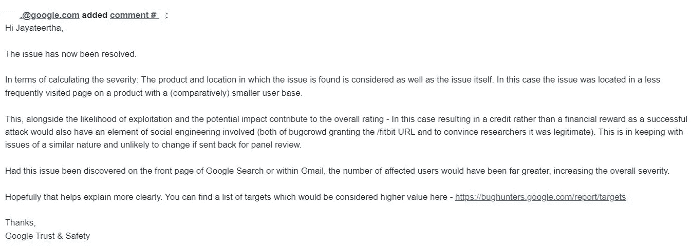

# 滥用 Fitbit(谷歌收购)中的断链，代表谷歌收集 BugBounty 报告！

> 原文：<https://infosecwriteups.com/abusing-broken-link-in-fitbit-google-acquisition-to-collect-bugbounty-reports-on-behalf-of-google-5885a556eb7c?source=collection_archive---------4----------------------->

我定期跟踪谷歌所有收购的照片🤑

我通常会跟踪我定期搜索的网站的收购情况。

我知道 Fitbit 收购已经被谷歌完成，有资格在 GoogleVRP 平台获得赏金。

但是，我以前记得，在谷歌收购之前，Fitbit 也是其他 bugbounty 平台的一部分，所以想确保我向正确的平台报告。

于是，我做了一个简单的 Google [**搜索**](https://www.google.com/search?q=fitbit+bugbounty) ，在 Google 结果的第一个 [**页面**](https://help.fitbit.com/articles/en_US/Help_article/1758.htm) 中发现了这个 Fitbit 官网的 [**链接**](https://bugcrowd.com/fitbit) 。

现在，由于报告的漏洞已被修复，您可以访问 [**存档**](https://web.archive.org/web/20220320194903/https://help.fitbit.com/articles/en_US/Help_article/1758.htm) 来查看我报告时的情况。

****

虽然 Bugcrowd 可能不会在这个断开的 [**链接**](https://bugcrowd.com/fitbit) 上托管恶意页面，并开始从安全研究人员那里收集 Bugbounty 报告，但为了更好的安全性，请遵循零信任— 建议不要盲目信任任何实体，无论是内部还是外部！

> **影响**:
> 
> 攻击者可能使用该 url 在 bugcrowd 中创建新公司，并可能从实际报告和利用中获取漏洞报告。
> 
> Bugcrowd 平台本身可能会利用这一点。(尽管他们可能不会，但仍有可能)

因此，创建了一份很好的报告，并通过 GoogleVRP 平台提交，该报告被分发给**信任&安全团队**，因为报告的问题被确定为**滥用风险**。

我原本希望获得丰厚的奖金，但不幸的是，我只获得了荣誉奖，但由于我已经在谷歌的名人堂**(排行榜)中，这对我没多大好处。**

**由于这是我的第一份滥用风险报告，而不是通常的漏洞报告，我询问了团队如何评估严重性以了解更多信息。**

****

****时间线**:**

**已报告—2022 年 8 月 10 日**

**已分流—2022 年 8 月 11 日**

**接受—2022 年 8 月 16 日**

**固定—2022 年 9 月 9 日**

# **喜欢我的文章吗？在 Twitter([@ jayaterthag](https://twitter.com/jayateerthaG))和 medium 上关注我，了解更多关于 bugbounty、Infosec、网络安全和黑客的内容。**

## **来自 Infosec 的报道:Infosec 每天都有很多内容，很难跟上。[加入我们的每周时事通讯](https://weekly.infosecwriteups.com/)以 5 篇文章、4 个线程、3 个视频、2 个 Github Repos 和工具以及 1 个工作提醒的形式免费获取所有最新的 Infosec 趋势！**