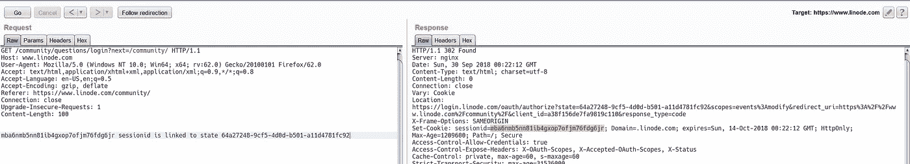
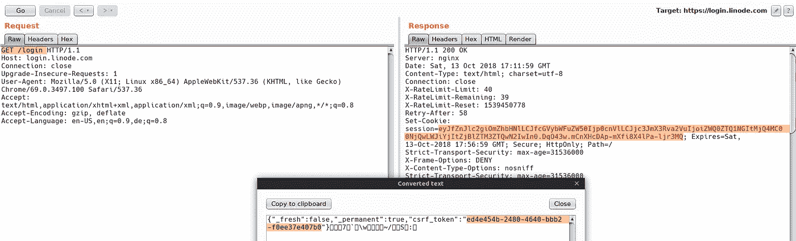
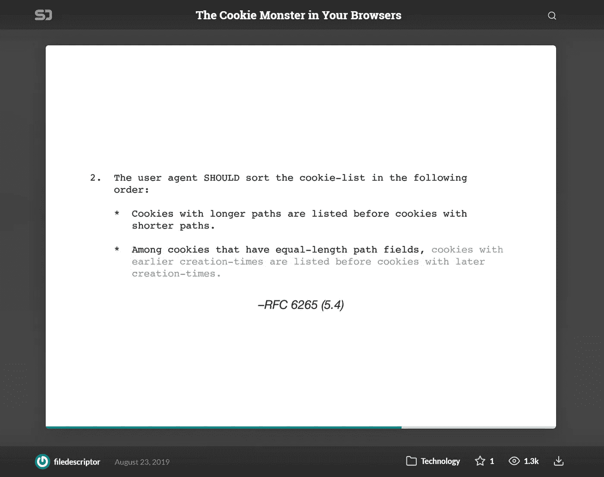
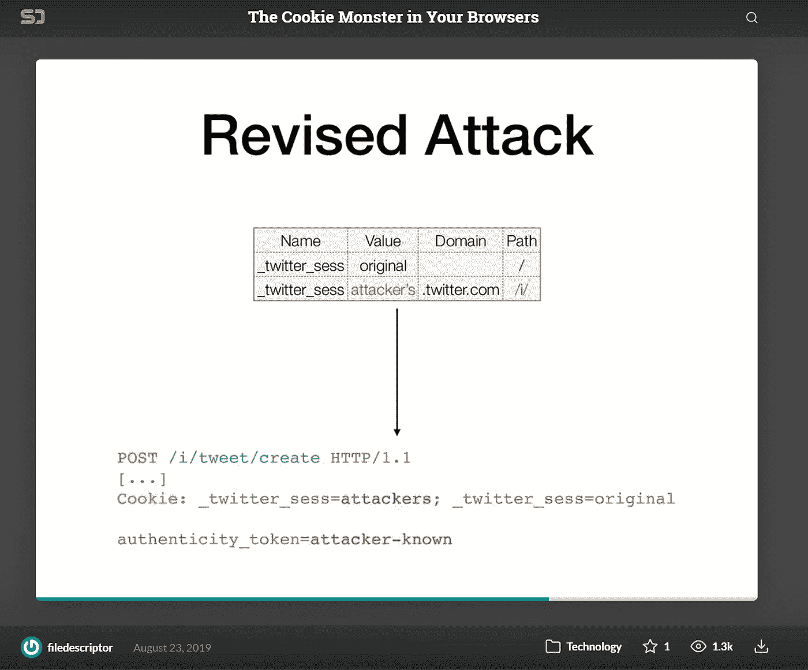
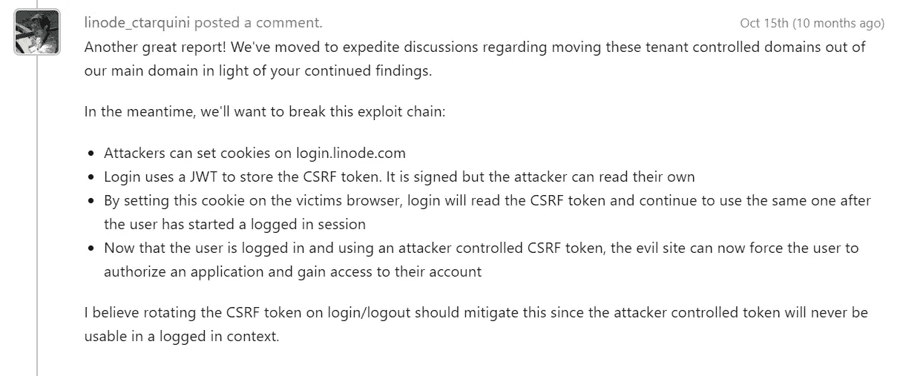

# 滥用功能窃取您的代币

> 原文：<https://infosecwriteups.com/abusing-feature-to-steal-your-tokens-f15f78cebf74?source=collection_archive---------0----------------------->

2018 年年中，Linode private Hackerone 计划让我参与进来，因为该计划管理得非常好。我在 Hackerone 上发现了很多私下披露的问题，这两个问题特别有趣，所以我想公开披露。所以让我们不要浪费更多的时间，开始吧:)这个 bug 将涉及一些 OAuth 理解，所以我希望你们熟悉它。我觉得第二个更有趣。

正如你可能已经知道的，Linode 是一个 VPS 提供商，他们提供这个功能，你的 VPS 将解析到**<id>. members . Li node . com**，只要看着这个，我就知道我们可能会以这样或那样的方式滥用它。这基本上意味着我们完全控制 Linode.com 的子域，甚至在 Linode 的子域上执行服务器端脚本语言。

## 调查李诺德的身份认证

Linode 有 4 款面向用户的网络应用；

[https://manager.linode.com](https://manager.linode.com)经典/老里诺德经理

[https://linode.com/community](https://linode.com/community)社区门户

[https://login.linode.com](https://login.linode.com)OAuth 发布服务器

[https://cloud.linode.com](https://cloud.linode.com)新任林诺德经理

由于我们完全控制了子域，我们可以读取设置为`.linode.com`的**任何**cookie(cookie 设置为通配符域)，我开始检查[https://manager.linode.com](https://manager.linode.com)的会话/CSRF cookie，但所有 cookie 都被正确设置为仅`manager.linode.com`，然后我转移到另一个应用程序，即`https://linode.com/community`，它通过“login.linode.com”做许多 OAuth 事情。

让我们了解一下这里的身份验证是如何工作的。

在点击`Login`时，向`https://www.linode.com/community/questions/login?next=/community/`发出一个 GET 请求，下面是请求的响应。



```
HTTP/1.1 302 Found
Server: nginx
Date: Sat, 29 Sep 2018 23:36:51 GMT
Content-Type: text/html; charset=utf-8
Content-Length: 0
Connection: close
Vary: CookieLocation: [https://login.linode.com/oauth/authorize?scopes=events%3Amodify&state=bce45f7c-6a37-46c7-9ede-c9979c152081&client_id=a38f156de7fa9819c110&redirect_uri=https%3A%2F%2Fwww.linode.com%2Fcommunity%2F&response_type=code](https://login.linode.com/oauth/authorize?scopes=events%3Amodify&state=bce45f7c-6a37-46c7-9ede-c9979c152081&client_id=a38f156de7fa9819c110&redirect_uri=https%3A%2F%2Fwww.linode.com%2Fcommunity%2F&response_type=code)Set-Cookie: sessionid=dgagljcsrcg0m3klfd2o16x9q1smbgvd; Domain=.linode.com; expires=Sat, 13-Oct-2018 23:36:51 GMT; HttpOnly; Max-Age=1209600; Path=/; Secure
.....
```

它执行以下操作，

*   设置 cookie:

`sessionid=dgagljcsrcg0m3klfd2o16x9q1smbgvd`；其链接到状态令牌`state=bce45f7c-6a37-46c7-9ede-c9979c152081`。cookie 设置为. linode.com

*   重定向至 OAuth 页面:

`https://login.linode.com/oauth/authorize?scopes=events%3Amodify&state=bce45f7c-6a37-46c7-9ede-c9979c152081&client_id=a38f156de7fa9819c110&redirect_uri=https%3A%2F%2Fwww.linode.com%2Fcommunity%2F&response_type=code`

*   如果在`https://login.linode.com/`登录，用户将被重定向到

`[https://www.linode.com/community/?state=bce45f7c-6a37-46c7-9ede-c9979c152081&code=6f422a104f5bf039f9dc](https://www.linode.com/community/?state=bce45f7c-6a37-46c7-9ede-c9979c152081&code=6f422a104f5bf039f9dc)`

状态参数 token 对照之前设置的 sessionid 进行交叉检查，如果验证成功，我们将得到以下响应。

```
HTTP/1.1 302 Found
Server: nginx
Date: Sat, 29 Sep 2018 23:04:02 GMT
Content-Type: text/html; charset=utf-8
Content-Length: 0
Connection: close
Vary: Cookie
Location: /community/
Set-Cookie: sessionid=qaff7xdtoxxhnc6tds7ym2d7d9lpweci; Domain=.linode.com; expires=Sat, 13-Oct-2018 23:04:02 GMT; HttpOnly; Max-Age=1209600; Path=/; Secure
....
```

它执行以下操作

*   sessionid 被重置(再次重置为. linode.com ),这是社区门户的实际会话，用户登录到社区门户。

# 利用… OAuth + Cookies = ❤

我们的第一个目标是，我们希望从社区门户通配符(`*`)范围访问令牌。如果我们希望用户使用`*`范围访问令牌登录社区门户，我们需要绕过 CSRF 机制。登录机制寻找`sessionid`，并对照给定的`state`令牌进行交叉验证。
因为我们还可以设置`.linode.com`cookie，所以我们可以绕过它:)

下面是做这件事的简单 PHP 代码。

剥削开始

上面的代码只是 iframe setcookie.php，然后在 6 秒后 iframe 的 stc.php(stealcookie.php)

让我们了解一下 setcookie.php

设置要利用的所需 cookies，并使用* scope 启动登录流

*   从服务器端向登录端点发出请求，以获取有效的 cookies
*   从响应中提取所有标头
*   修改`Location`标头，位置标头包含 scopes = events %修改我们只需更改 scopes=*
*   提取`Set-Cookie`头，它由 sessionid 组成，session id 链接到`Location`头中的状态令牌。
*   将提取的会话设置到用户的会话中，继续重定向到 location 头，但是使用我们修改的 scope 参数值。

现在，由于 sessionid & state 将成功验证，用户将使用` * '范围访问令牌登录到社区门户。

现在，用户已经准备好窃取他/她的令牌，因为 Linode 将使用 sessionid 将合法会话设置为`.linode.com`,并且由于其设置为`. linode.com `，我们可以获取合法会话并使用它登录，因为访问令牌在页面的源中，所以我们最终可以从源中提取令牌。:)让我们使用 stc.php(stealcookies.php·贝娄)来自动化这个(它窃取 cookie 并提取令牌)

窃取会话并提取令牌

我们只需从用户会话中获取 sessionid，并从服务器端发出 curl 请求& user some regex 获取访问令牌，该令牌可用于进行 API 调用，无论是读取还是写入任何资源:)。

看起来很复杂？

查看漏洞视频。

## 本期时间表

2018 年 9 月 30 日:初步发现和报告

2018 年 10 月 1 日:分流

2018 年 10 月 3 日:奖励关键的 2000 美元

2018 年 10 月 4 日:已解决

# 但是等等，我们能在别的地方利用它吗？

让我们看看 CSRF 是如何处理这些应用的；

除了[https://login.linode.com](https://login.linode.com)之外，CSRF 的所有应用程序看起来都没有受到攻击

让我们在这里理解 CSRF 的实现；)



*   在`session` cookie 中设置了一个 JWT，这个 cookie 由一个 CSRF 令牌组成。该 cookie 的作用域不在任何域中，它通过浏览器自动作用域为 login.linode.com，**因此我们无法读取它。**
*   一旦用户登录，用户会话被绑定到 newsession cookie，但是 CSRF 令牌保持不变(CSRF 固定 FTW！)。
*   我们可以将这个 cookie 从我们控制的 VPS 设置为带有 HTTOnly 标志(cookie 首选项)，但是，我想这取决于浏览器和服务器哪个 cookie 获得首选项？

在我的例子中，我设置的 cookie 首先被服务器读取，因此丢弃了用户的工作会话，并要求用户再次登录，但是即使没有，Linode 设置的 cookie 也在 Path=/中，我们可以添加 Path=/login 来获取我们的 cookie 的首选项，现在任何位于/login/*下的路径都将获取我们的 cookie 作为所需端点上的首选项，我猜。虽然我不确定，但这里有一些来自 HITCON 2019 的 **filedescriptor** 演讲的幻灯片，详细解释了这种攻击。一定要看完这些幻灯片，太棒了！。



## **剥削...哦！我是❤·奥特，这些饼干让它变得更棒了**

Linode 是一个 OAuth 提供者，如前所述，所有授权都是在 login.linode.com(OAuth 发布服务器)上完成的。因此，我们的想法是强迫用户使用通配符范围来授权我们的客户端应用程序。

下面是利用这个 OAuth CRSF 的黑客 PHP 代码。

*   从服务器端发出请求并获得一个会话 JWT。
*   解码并提取 CSRF 令牌
*   用获得的 JWT 设置会话 cookie。
*   发出 POST 请求，用之前解码的 CSRF 令牌授权攻击者的 OAuth 应用程序。



来自 Linode 团队的故障

看起来很复杂？这里有一个利用的视频概念验证

**本期时间表**

2018 年 10 月 13 日:初步发现和报告

2018 年 10 月 15 日:审判

2018 年 10 月 18 日:由于互动，奖励高达 750 美元，但由于创造性的攻击，还增加了 1000 美元的奖金。

2018 年 11 月 14 日:通过登录后旋转 CSRF 令牌解决。

## 参考

[https://speaker deck . com/file descriptor/the-cookie-monster-in-your-browsers](https://speakerdeck.com/filedescriptor/the-cookie-monster-in-your-browsers?slide=55)

[https://github . blog/2013-04-09-yummy-cookies-跨域/](https://github.blog/2013-04-09-yummy-cookies-across-domains/)

就这样，伙计们，感谢阅读和制作到这里。这些问题可能会让你们中的一些人感到困惑，如果是这样，请在 https://twitter.com/rootxharsh[给我发 DM](https://twitter.com/rootxharsh)，我会尽力帮助你理解，直到下次:)

**感谢 Linode 团队允许披露这一信息。**