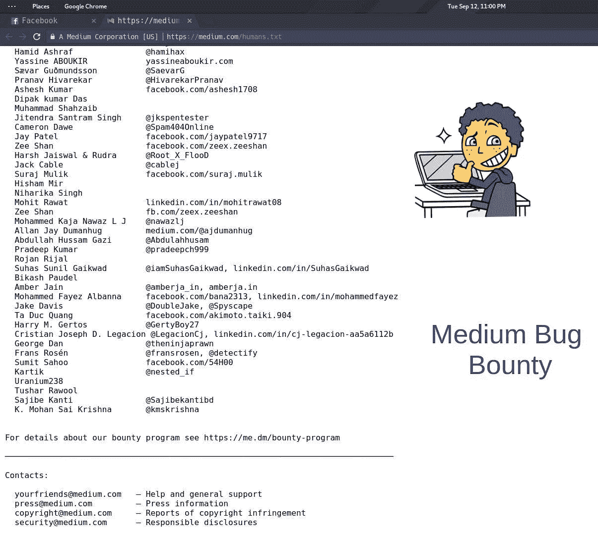
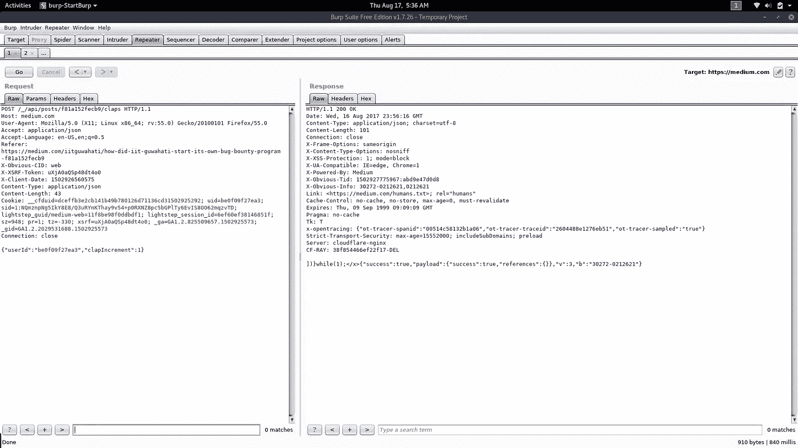
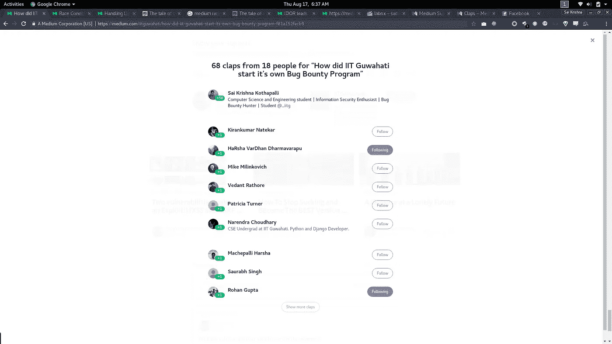
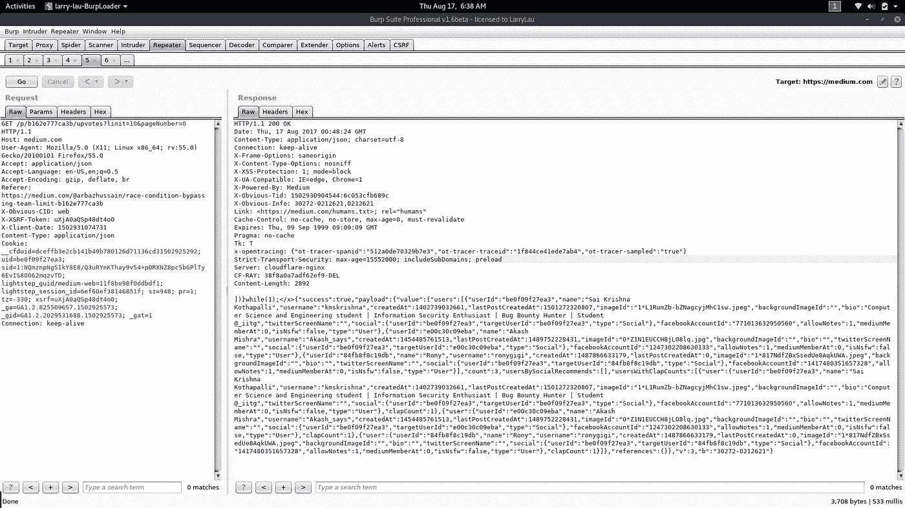

# 滥用媒体的新功能

> 原文：<https://infosecwriteups.com/abusing-new-claps-feature-in-medium-6bd8757a64a4?source=collection_archive---------2----------------------->

中等名人堂

这个故事是关于我如何进入媒体名人堂**。从这学期开始，我开始在媒体上写文章，题目是我感兴趣并正在研究的。选择 Medium 而不是其他平台的另一个原因是它的简单和使用方便。**

**一个不眠之夜后，我打开 Medium 写了些东西，然后注意到那个臭名昭著的心形符号不见了。它已经被“掌声”所取代。惊讶之余，我在推特上查看发生了什么。和我一样，许多其他用户也感到困惑。经过一番挖掘，我登陆了这个由 Medium 发布的博客[帖子](https://help.medium.com/hc/en-us/articles/115011350967-Claps)，它解释了这个新特性。**

**博客提到了新功能的工作原理。有几点引起了我的注意。**

> **你不能为自己的职位鼓掌。**
> 
> **只有帖子的作者才能看到个人用户给了多少掌声。读者只会看到鼓掌者的名单。**
> 
> **每个用户对一个帖子的鼓掌次数被限制在 50 次。**

**在这一点上，外面的臭虫赏金猎人会理解我是如何被这些新功能触发的，并想立即测试这些说法。**

> **你不能为自己的职位鼓掌。**

**您不能为您自己的故事鼓掌，因为所有您自己的故事的鼓掌按钮都被禁用。这让我想到:“好吧，但是发送一个 POST 请求怎么样？他们是在做后端检查，还是只是前端检查？”因此，我为 Medium 上的另一个故事鼓掌，并使用 Burp Suite 捕获了请求。**

**这个请求看起来像是鼓掌。如您所见，一个 POST 请求被发送到***/_/API/posts/STORY _ ID/claps****。***

**你可以看到在我更改了***STORY _ ID****并提出请求后。我得到了 200 状态响应和*成功:真。*也就是说成功了。伊多尔的经典案例。***

******

***发布请求***

***一个故事可以拍 50 次。我也试图绕过这个(鼓掌超过 50 次)。但是这些技术都不起作用。不过，我为自己的帖子鼓掌 50 次。幸运的是，在我报道了同样的事情后，媒体并没有取消对我的报道的鼓掌。***

******

***为我自己的故事鼓掌。***

> ***只有帖子的作者才能看到个人用户给了多少掌声。读者只会看到鼓掌者的名单。***

***再来一个**GET**request to***/p/POST _ ID/up votes****给你鼓掌的用户名单。Medium 表示，读者将只能看到鼓掌者的名单，而看不到每个用户鼓掌的次数。****

****在对 GET 请求的响应中，有一个名为 **clapCount** 的字段，分别对应于每个对特定帖子鼓掌的用户，顾名思义，这就是鼓掌次数。任何用户都可以看到任何帖子的点击数。他们再次使用前端检查，而不是后端检查。****

****************

****此问题已报告给 Medium，现已修复。因为这不涉及任何安全问题，所以没有奖金(反正我也没想到会有)。但是他们确实提供了一些照片，还把我的名字添加到了他们的[名人堂页面](https://medium.com/humans.txt)。从中吸取的一个教训是，永远不要仅仅依赖前端限制；在后端做所有事情。****

****对中型 Bug 赏金计划的几点看法:他们在修复问题上真的很慢。如果他们有一些高优先级的问题，这没关系。但是，他们回复你的邮件和报告甚至很慢，跟进也很糟糕。每当我想得到回复时，我都不得不在推特上联系他们。****

****嗯，这并不完全是滥用 claps 功能:p。标题只是一个点击诱饵。****

****页（page 的缩写）s:还是没拿到支票。****

****如果你是一个臭虫赏金猎人，并在博客上写一些技术或你的经验，或者在媒体上写文章，请考虑将它们提交给这个[出版物](https://medium.com/bugbountywriteup) (BugBountyWriteup)。****

****和平❤****