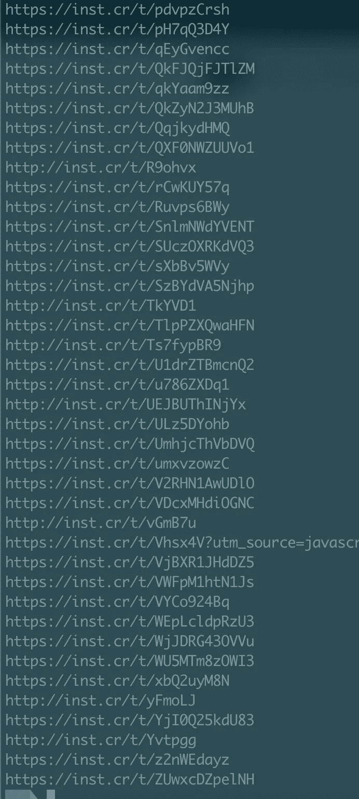
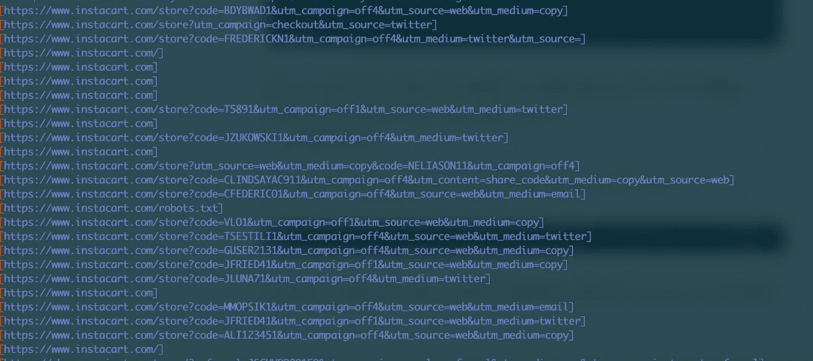
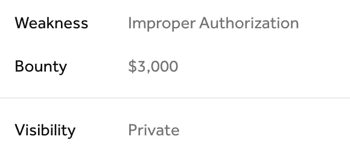
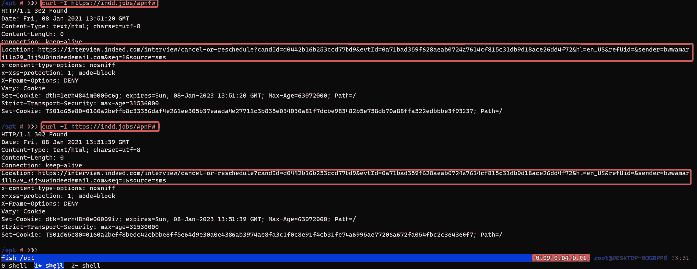

# 为了乐趣和利益滥用网址缩写

> 原文：<https://infosecwriteups.com/abusing-url-shortners-for-fun-and-profit-c83c67713916?source=collection_archive---------0----------------------->

由 [Boitumelo Phetla](https://unsplash.com/@writecodenow?utm_source=medium&utm_medium=referral) 在 [Unsplash](https://unsplash.com?utm_source=medium&utm_medium=referral) 上拍摄的照片

**你好安全人员**

您是否遇到过这样的错误:由于缺少对某个参数值的枚举，很难显示影响？
如果是的话，在这篇文章中，我将讨论如何找到并滥用指向 ATO 或信息泄露的网址缩写

许多公司使用 URL 缩写来发送私人邀请和无密码登录等类似的东西，这真的很难猜测或破解，但总有一种方法可以打破常规📦

**我们来谈谈网址缩写及其类型**:

网址缩写器大多链接到第三方服务，如 https://bitly.com[https://cutt.ly/](https://cutt.ly/)和其他由公司制造的，他们有定制的
如:[https://indd . jobs](https://indd.jobs)|[https://**inst . Cr**](https://inst.cr)

**我们该如何解决这个问题:**

我们可以使用多种场景首先，我们可以测试触发电子邮件的功能，并查看它们的来源，如果它们包含 URL shortner 检查公司的 twitter 帐户，并提取它们共享的所有链接

**网址缩写程序如何工作:**

大多数情况下，我们应该寻找有这种行为的东西
URLshortner.com/{HASH} = = =>Website.com/?token={YOU-CANT-GUESS-THIS}
基于此，我们可以列举更多，看到更多

**复杂程度:**

复杂性基于 URL 后使用的`HASH`，因此它或者是`integer` `strings`和/或两者都是从 5 个字符开始的哈希长度加上
示例:

https://url.com/12345 |[https://url.com/A2B4](https://url.com/12345)C |[https://url.com/A2B4](https://url.com/12345)cgfdff 33434

所以如果我们只面对`integers`这是最简单的情况，我们当然可以产生所有可能的情况，这对于其他情况来说有点困难**是吗？**😈

**剥削:**

对于我们的书面报告，我们将集中在`inst.cr`上，因为它有一个定制的构建，它很难猜测[【http://inst.cr/t/UEJBUThINjYx】](http://inst.cr/t/UEJBUThINjYx)
所以我们如何猜测`hash?`
我们不需要，我们基本上可以把域名扔进`waybackurls`或`gau`，然后看看结果

现在我们需要看看链接被重定向到哪里，看看是否有一些有用的路径，我们可以利用
我们只需这样做

gau inst . Cr | httpx-location-MC 301，302 | grep -Eo '\[(。*?)\]'

为了`grep`的价值，所有的预测和吐出来在你的终端

现在，根据应用程序逻辑，您可以搜索感兴趣的关键字，如`token` `id` `uuid`以及类似的内容
之后，您将有一个很好的论据来说服团队，您能够获得他们难以猜测的某个参数的值

**结果？**

由于 URL shortner
site.com/?上的有效令牌，私有程序中两次出现盲 ATO 篮子=代币

多个 IDORS 从无效变为有效

我希望你喜欢读这篇文章，我会在下一篇文章中看到你

你可以在:
不和谐:https://twitter.com/OriginalSicksec # 1969
推特:[不和谐](https://twitter.com/OriginalSicksec)

**❤保持好奇**

*来自 Infosec 的报道:Infosec 上每天都会出现很多难以跟上的内容。* [***加入我们的每周简讯***](https://weekly.infosecwriteups.com/) *以 5 篇文章、4 个线程、3 个视频、2 个 Github Repos 和工具以及 1 个工作提醒的形式免费获取所有最新的 Infosec 趋势！*