# 学院:黑客盒子演练

> 原文：<https://infosecwriteups.com/academy-hackthebox-walkthrough-9102c5d79dee?source=collection_archive---------0----------------------->

## 描述

另一个来自 [**的易 VM 如他们所说的 HackTheBox**](https://app.hackthebox.eu/machines/297) 。我在解决这个问题时吃了点苦头，并认为它有点难，但我学到了一些新东西。全拜[*egre 55*](https://app.hackthebox.eu/users/1190)&&[*mrb3n*](https://app.hackthebox.eu/users/2984)所赐。像往常一样，在/etc/hosts 文件中添加 academy.htb，就可以开始了。

> 获得的知识

1.  列举
2.  使用打嗝分析报头
3.  使用 Metasploit 获得立足点
4.  通过 composer 提升权限

> 端口扫描

运行 Nmap 扫描以了解用于枚举的开放端口。

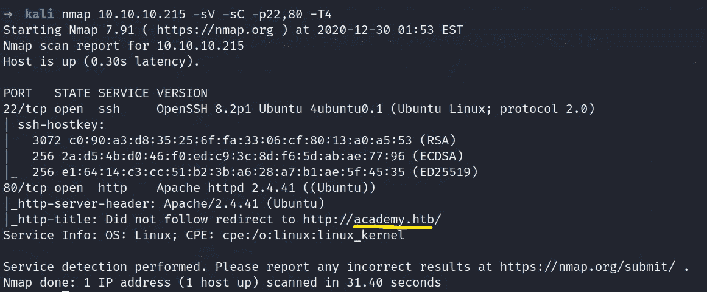

> 网络侦察

所以我们先列举一下 80 端口。我决定启动一个 gobuster 扫描，得到了一些有用的东西。

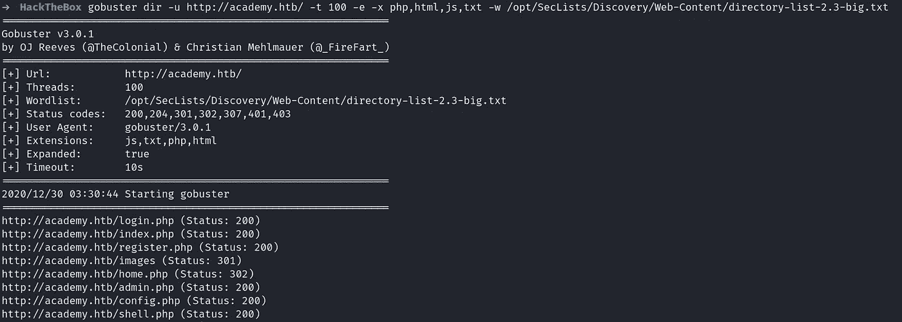

这么多。php 页面。先在平台上注册吧。注册后，我们被重定向到一个 login.php。输入凭据，我们成功登录。平台里没什么好玩的。

然后我决定拦截数据，当我们在平台上注册时，遇到了新的东西" **roleid =0** "。

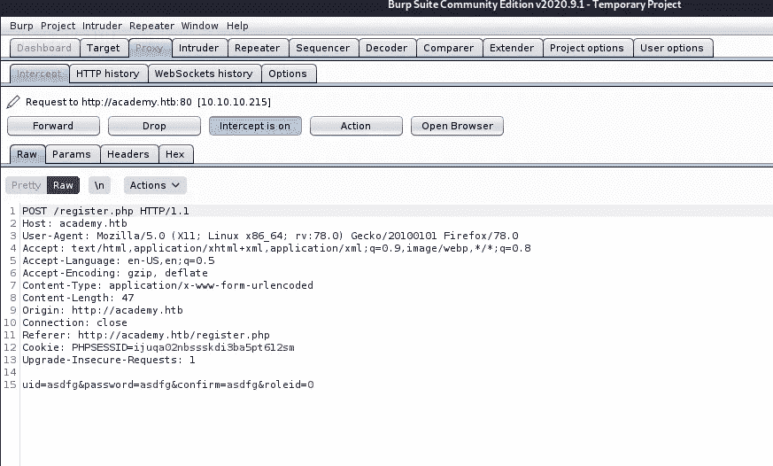

这一次，我将值更改为“1”并转发数据，但我再次被重定向到 login.php。

现在我重复了同样的过程，但是我没有去 login.php，而是去了 admin.php，然后我们就有了一些立足点。

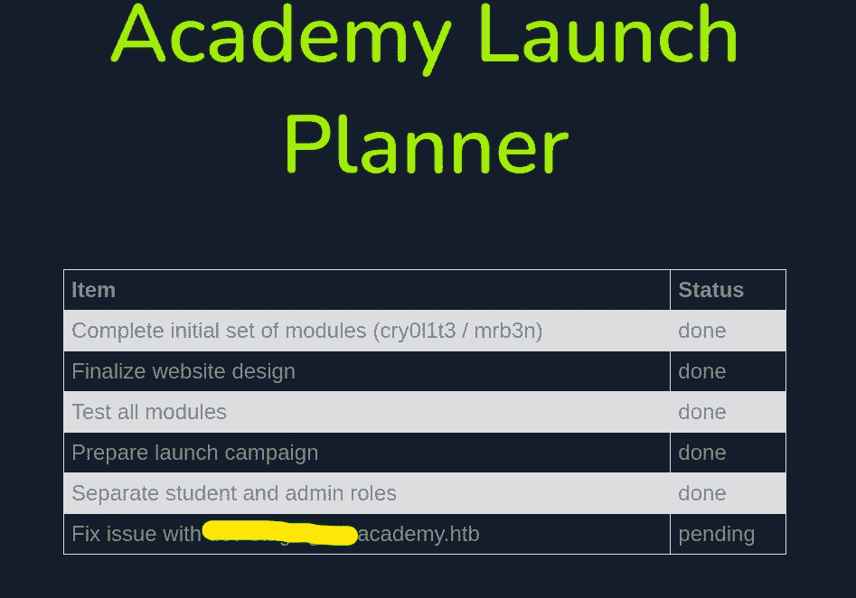

将这个[subdomin].academy.htb 添加到/etc/hosts 文件中，并在浏览器中访问它。

环顾页面，我得到了一些有用的信息，如 APP_NAME=Laravel 和 APP_KEY=………………

在网上搜索时，我发现了易受 **RCE 攻击的 [**Laravel 漏洞**](https://github.com/rapid7/metasploit-framework/blob/master/modules/exploits/unix/http/laravel_token_unserialize_exec.rb) 。**打开坏小子 Metasploit，搜索 Laravel 漏洞。设置选项。

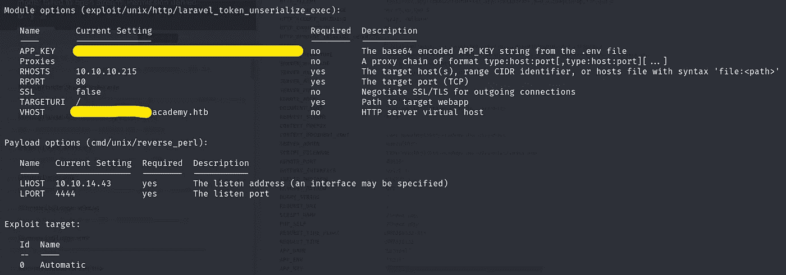

然后利用漏洞，然后我们得到了低级特权。

> **横向权限提升**

列出主目录，我们可以看到很多用户。我浪费了很多时间，然后意识到 [**图像**](https://cdn-images-1.medium.com/max/1000/1*DiKwRKATuVuBY4XNFWwUQQ.png) 提到了用户 cry0I1t3。因此，首先，我们必须将我们的权限横向提升到用户 cry..t3。耗尽了我的大脑，然后我搜索了 Laravel [**重要文件**](https://www.tutorialspoint.com/laravel/laravel_configuration.htm) **。**打开文件给我用户cry0I1t3 的密码。

现在切换到用户 cry0I1t3，检查他是否有任何 sudo 特权。

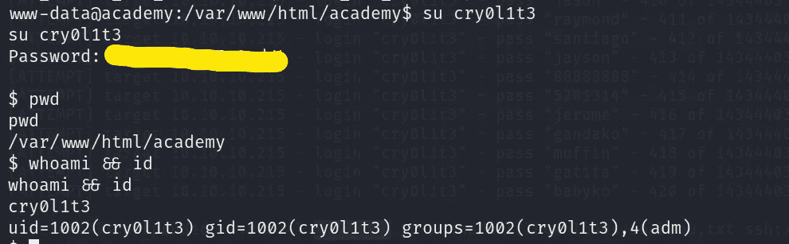

因为这个用户不在 sudoers 列表中，所以我决定查找与用户 mrb3n 相关的文件。

**注意:-** 通过 SSH 登录用户 cry0I1t3，体验更佳。

在搜索文件后，我决定查看这个用户的“组”信息，我发现这个用户在“adm”组中。转到/var/log/audit 并搜索 mrb3n 凭据。(提示-使用 grep)

现在切换到用户 mrb3n…

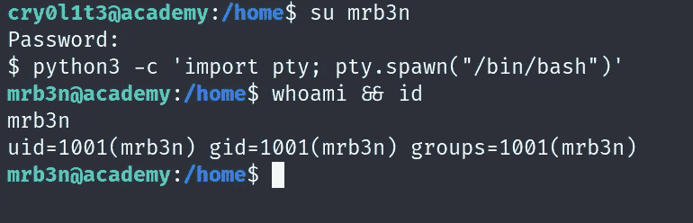

…并检查他/她拥有什么 sudo 权限。

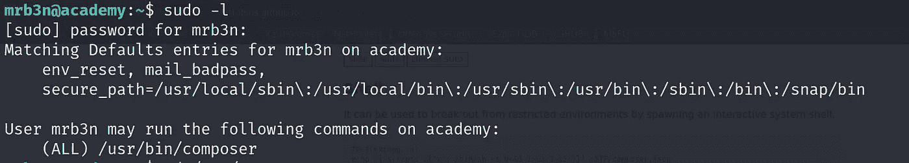

> **垂直权限提升**

因此，该用户可以运行“composer”命令。访问 [**GTFobins**](https://gtfobins.github.io/#composer) 进行权限升级。

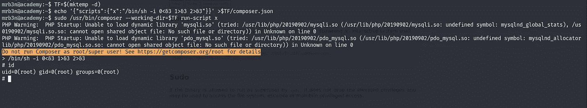

嘣我们在 **r** 🤠🥳 **t.**

**注意:-** 所以，在得到根哈希之后，我浏览了所有加密的文章，并且学到了一些新的东西。

使用 ssh-keygen 生成一对 SSH 密钥。现在复制公钥(id_rsa.pub)并像这样粘贴👇(x → SSH)

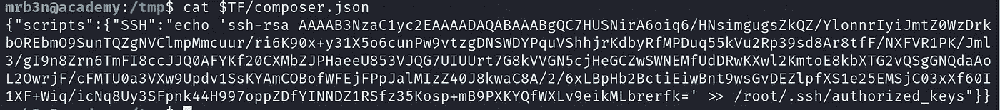

现在运行 composer，它会将密钥添加到/root/。ssh/authorized _ key。

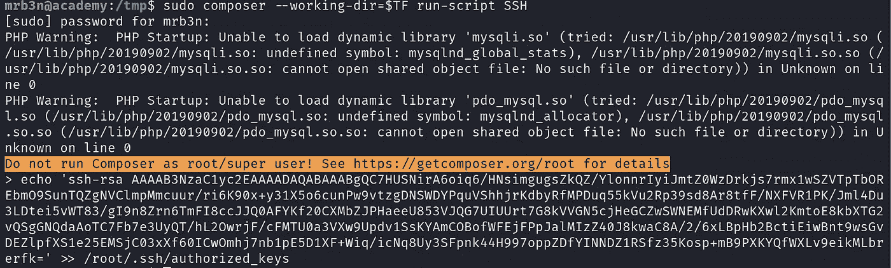

现在将公钥(id_rsa)的权限更改为 600，并使用以下内容👇以获得 root 访问权限。**访问所有标志**。

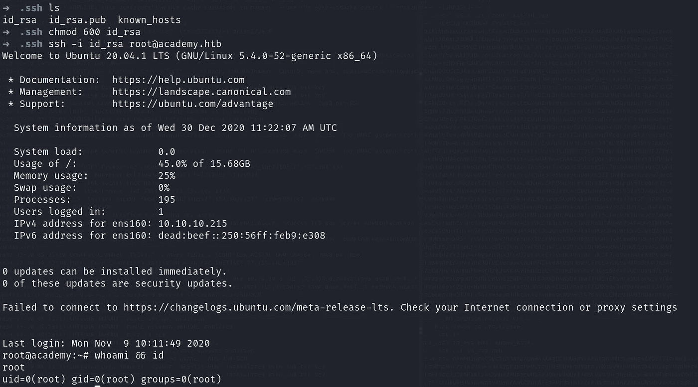

如需更多演练，请继续关注…

# 在你走之前

访问我的 Funbox 系列漫游的:-

 [## 医生:HTB 演练

### 描述

shubham-singh.medium.com](https://shubham-singh.medium.com/doctor-htb-walkthrough-70bcb9eedefd)  [## 懒人先生/Vulnhub _ 演练

### 在 GitHub 上创建一个帐户，为 Mr-lazy/Vulnhub _ walk through 开发做贡献。

github.com](https://github.com/Mr-Lazzy/Vulnhub_Walkthrough)