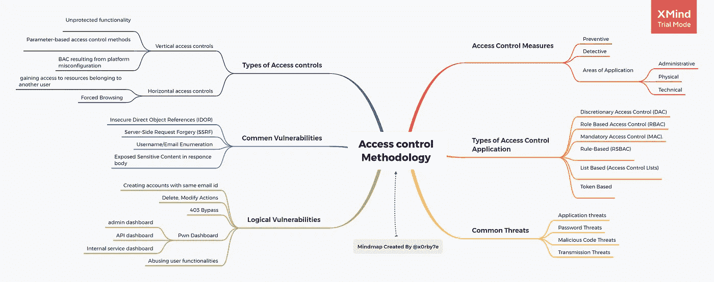

# 访问控制漏洞思维导图

> 原文：<https://infosecwriteups.com/access-control-vulnerabilities-mindmap-a0d177a31036?source=collection_archive---------1----------------------->

你好，黑客&爱好者 X0rby7e 在这里，在这篇文章中，你将获得访问控制漏洞的思维导图。

上述思维导图的资源

 [## 访问控制模型

### 访问控制系统被认为是公司最重要的资产之一，具有重要的价值。术语“访问…

westoahu.hawaii.edu](https://westoahu.hawaii.edu/cyber/best-practices/best-practices-weekly-summaries/access-control/)  [## 寻找 WEB 应用程序中访问控制漏洞的速成班:第 1 部分

### 这篇博文将帮助圣灵降临者和虫子赏金猎人完全熟悉这些…

infosecwriteups.com](/begineers-crash-course-for-finding-access-control-vulnerabilities-in-the-web-apps-part-1-5b61cf4396c4)  [## 访问控制漏洞和权限提升|网络安全学院

### 在本节中，我们将讨论什么是访问控制安全性，描述权限提升和权限提升的类型

portswigger.net](https://portswigger.net/web-security/access-control)