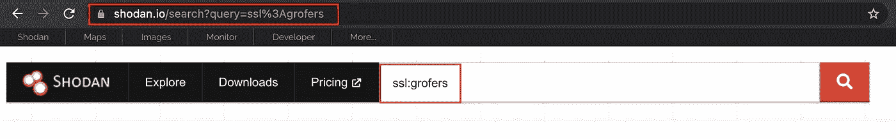
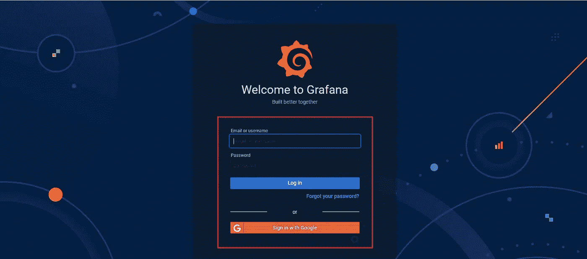
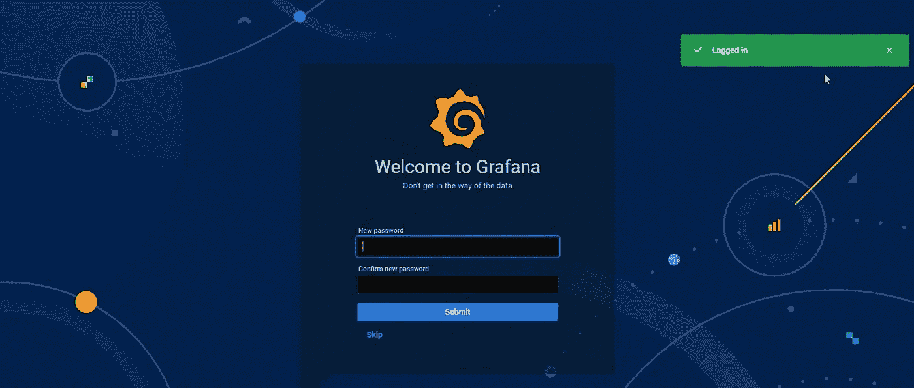
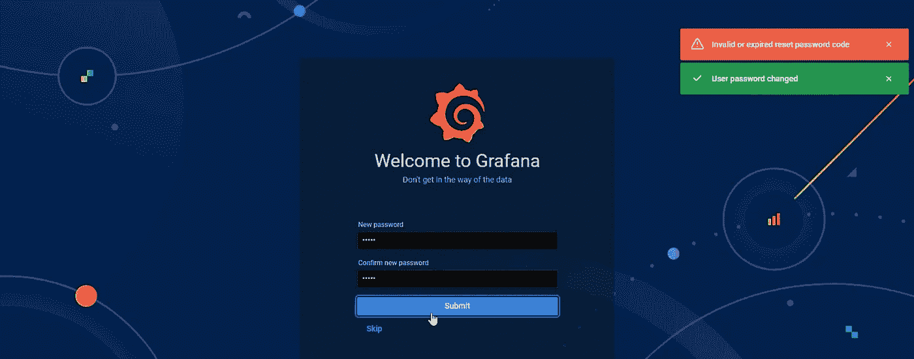
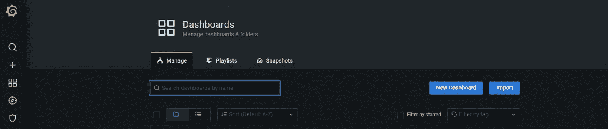
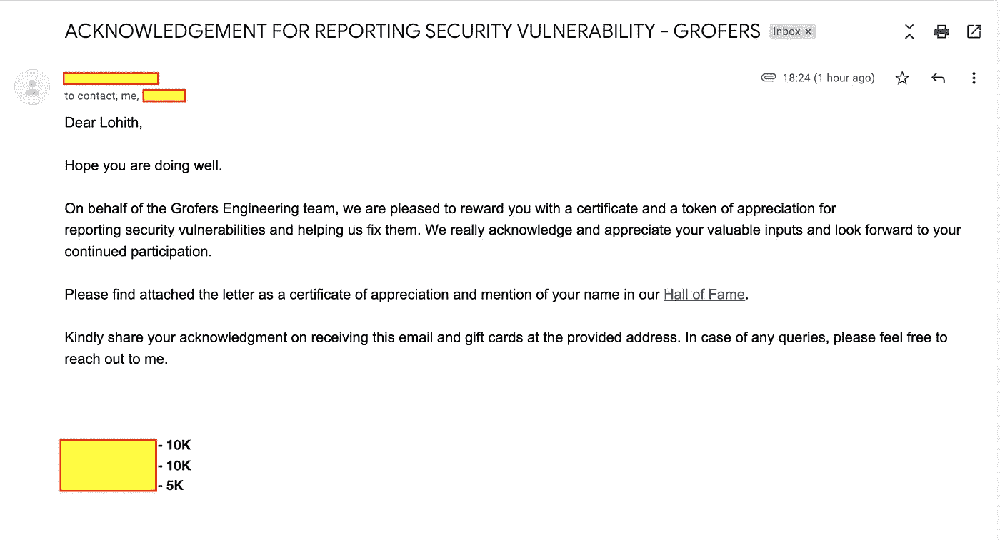

# 使用 Shodan 访问 Grofers Grafana 实例

> 原文：<https://infosecwriteups.com/accessing-grofers-grafana-instance-using-shodan-52c585ada797?source=collection_archive---------0----------------------->

大家好…

过了很长时间，我在使用简单的 **Shodan** 搜索的 **Grofers** 中发现了一个有趣的 bug。该漏洞可能允许攻击者访问 **Grofers** 的内部 API 监控仪表板。这是我第二次向 **Grofers 安全团队**报告。

我给不知道 [**shodan** 的小简介！](https://www.shodan.io/)

> *Shodan，互联网内所有端口的搜索引擎，可以帮助企业识别并锁定安全漏洞 Shodan 是互联网上一切的搜索引擎。*

**漏洞利用场景:**

总是我的 bug 赏金之旅我会从 shodan search 或者 [crt.sh](https://crt.sh/) (子域枚举)开始。最近我在使用 crt.sh 的 [**Dunzo**](/how-i-got-access-dunzo-internal-dashboard-177104e2786f) 上发现一个 bug

从简单的 shodan 呆子开始…

Shodan 呆子

我发现了多个与 **Grofers** 域相关的主机。但我观察到一个有趣的宿主。立即打开那台主机，它的一个 [**Grafana 实例**](https://grafana.com/) 登录仪表板…

Grofers Grafana 仪表板

但是…我不知道用户名和密码…

输入默认用户名和密码，如 **admin: admin。**

但这里有趣的部分是…当我输入用户名和密码( **admin: admin** )时，登录页面重定向到新密码页面，并得到一个警告“**已登录**”。

新密码页面

然后再次输入密码为 **admin。**同时，弹出两个警报…

*   无效或过期的重置密码
*   用户密码已更改

更新的密码页面

密码更新了。我可以访问完整的 Grafana 实例。

Grafana 仪表板

然后我和 POC 一起创建了一份报告，并提交给了 Grofers 安全团队。

**报告时间表:**

> ***2020 年 12 月 8 日*** *—向安全团队报告*
> 
> ***2020 年 12 月 9 日*** *—团队的首次回应*
> 
> ***2020 年 12 月 15 日*** *—问题已修复*
> 
> ***02 Sep 2021*** *—收到* ₹ ***25k*** *赏金+名人堂+感谢信*

格罗佛斯的赏金

**感谢 Grofers 团队！**

**感谢阅读！….黑客快乐！**

> ***Linkedin:****[*Lohith Gowda M*](https://www.linkedin.com/in/lohigowda/)*
> 
> ****推特:****[*lohigowda _ in*](https://twitter.com/lohigowda_in)**
> 
> *****insta gram:****[*lohigowda . in*](https://www.instagram.com/lohigowda.in/)***
> 
> *****作品集:****[*https://www.lohigowda.in/*](https://www.lohigowda.in/)***