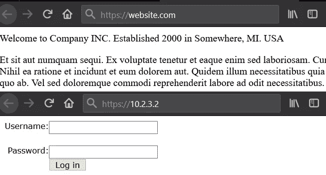
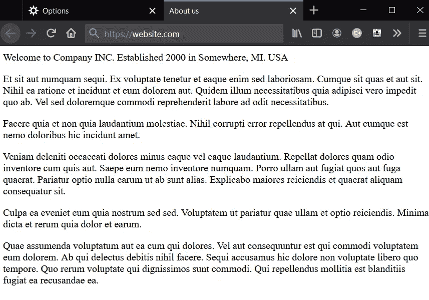
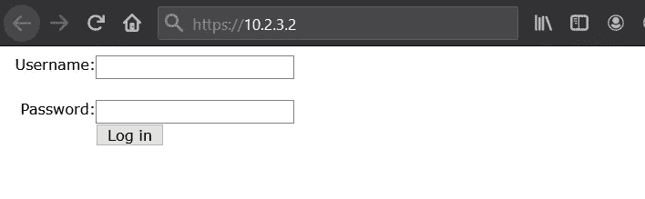

# 通过 IP 地址直接访问网站，这是一个隐藏性很差的 sql 注入案例

> 原文：<https://infosecwriteups.com/accessing-the-website-directly-through-its-ip-address-a-case-of-a-poorly-hidden-sql-injection-82833defbbc3?source=collection_archive---------0----------------------->

例如:website.com 解析为 ip 地址 10.2.3.2

你可能听过这样一句话:藏在众目睽睽之下。具体来说，在 IT 安全中还有另一种表达方式:通过模糊实现安全。这篇文章将是我对一个 bug 的体验，人们可能会认为这是通过模糊性实现安全性的情况，但这可能是一个巧合。这将是一个我偶然发现 sql 注入(一个简单的登录旁路，让我登录到管理面板)的故事，但不是以通常的方式。无论哪种方式，它应该给你一个或两个想法，在未来寻找什么。除非你已经知道了。

**第一印象，错误印象:**

问题中的 bbp 范围很广，trusty *.website.com。喜欢这些:)，这当然意味着需要时间来进行大量的侦察行动。使用 massdns、amass、一点 crt.sh 等工具。

当所有的子域都被收集后，我开始浏览那些听起来有趣的子域。还有，这个子域只显示了一个简单的帮助/关于我类型的页面。乍一看，什么也没有。没有表单，没有额外的链接，没有任何东西可以提供线索，除了一个静态页面。是时候向前看了。

一个静态/无聊网页的例子，这里没有错误？

**第二印象，透过不同的镜头:**

在寻找 bug 时，跳出框框思考是很重要的，这与不轻易放弃是分不开的。当目标网站看起来“空空如也”的时候，再想想。有一些标题你可以乱用(主机，引用，用户代理，等等。特别是对于盲 xss、sql 注入)，然后添加默认情况下不属于请求的头，比如 X-Forwarded 头族。但是，还有一件事值得一试，一件很容易被忘记或被错误地认为是浪费时间的事——IP 地址。

**晶圆或无晶圆:**

就个人而言，如果目标网站解析为一个 ip 地址，而这个 IP 地址又属于 akamai、cloudflare、aws 和类似的网站，我倾向于让它保持原样。关于找出 waf 背后的真正知识产权的整个事情是我运气不好的事情。但是，当 ip 最终没有解析到任何 waf-s 或云提供商时，尽管它可能仍然与某种类型的 vhosts 相关联，但您永远也不会知道，除非您直接转到有问题的 ip 地址。

**别样的精彩/简单 PoC:**

在浏览器中输入 ip 地址会加载一个不同的页面，非常不同。

当看到登录表单时，显而易见的事情是:

用户名:admin' #

通过:无关紧要

当然还有其他的 [sql 注入来绕过](https://www.netsparker.com/blog/web-security/sql-injection-cheat-sheet/)登录。而且，在极少数情况下，它们起作用，甚至在 2020 年，这是那些极少数情况之一。

猎虫的时候很容易不知所措。而且，当范围超宽时，挑起战争变得更加困难，有时甚至开始一场战争。但是，这并不意味着如果一个子域上没有任何感兴趣的东西，没有明显的攻击区域(意味着用户/bug 猎人可以与之交互)，您应该忘记最初的黑客基础知识—端口扫描。端口扫描反过来应该提醒你，为了做到这一点，你需要的 ip 地址。从那里开始，在解析子域时，它应该变得很明显，不管它是你想离开它还是追求它。