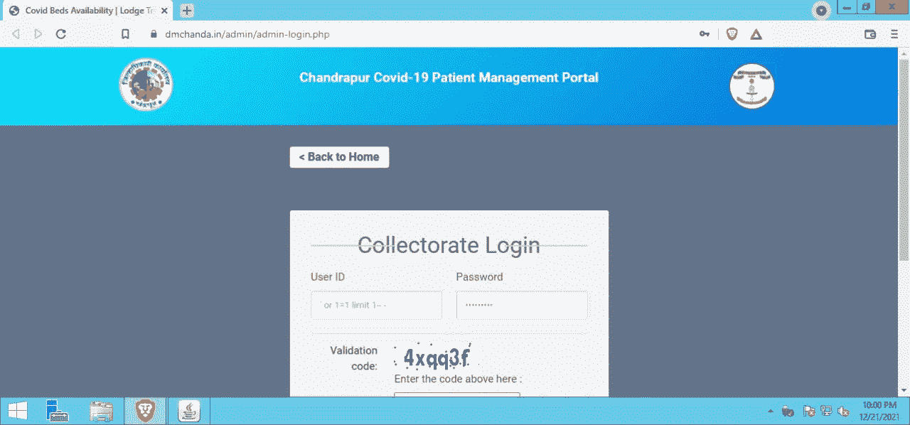
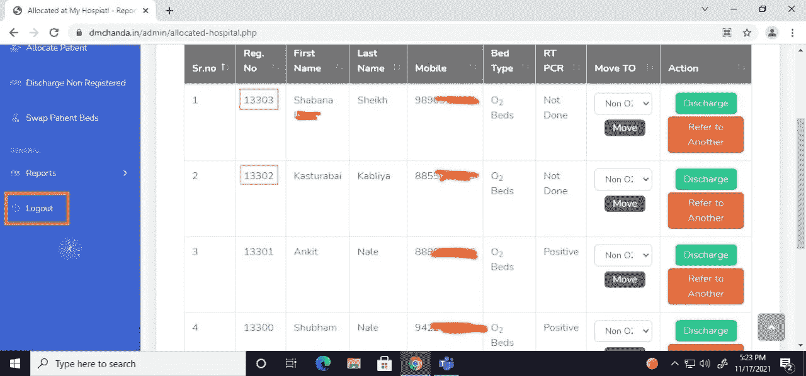
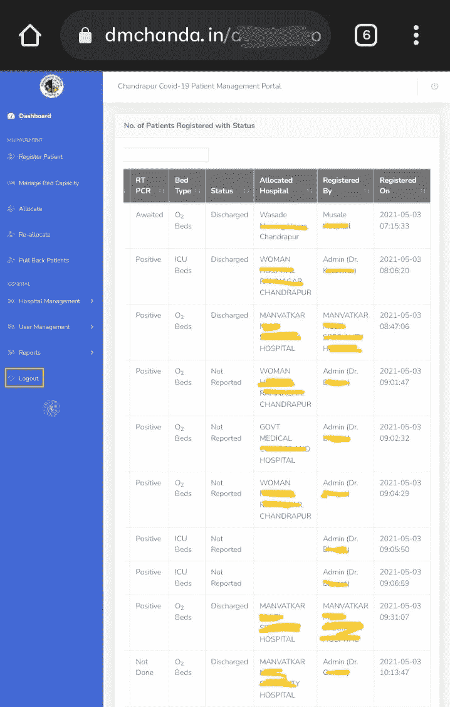
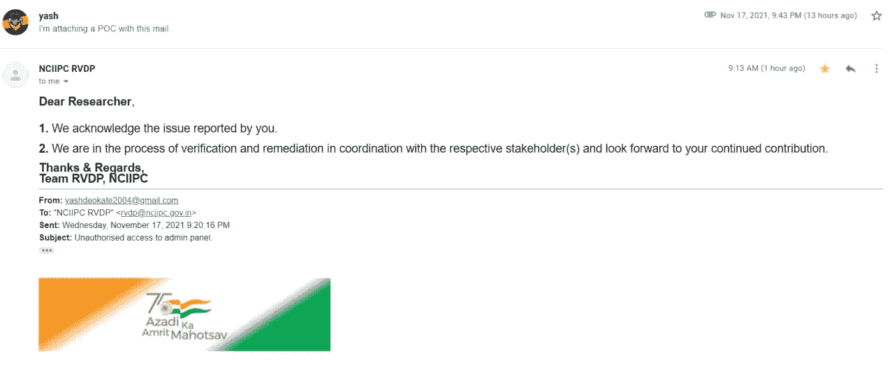

# 访问数千名新冠肺炎患者的机密信息。[CVE-2020–35276]

> 原文：<https://infosecwriteups.com/accessing-thousands-of-covid-19-patients-confidential-information-cve-2020-35276-46bfd3f3f037?source=collection_archive---------2----------------------->

> 你好，我是 Yash，我是来自印度的安全研究员 noob BB Hunter。

在这一节中，我将向您解释，我是如何绕过昌德拉普(马哈拉施特拉邦)政府的新冠肺炎门户网站的&从该网站可以获得对 Dashboard 的完全管理员访问控制。有数千名新冠肺炎患者的机密信息，如他们的姓名和手机号码、一些地址、治疗医生的姓名、患者所在的医院等等。

> 什么是 SQL 注入(SQLi)？

SQL 注入是一个 web 安全漏洞，使得攻击者能够干扰应用程序对其数据库的查询。它通常允许攻击者查看他们通常无法检索的数据。这可能包括属于其他用户的数据，或者应用程序本身能够访问的任何其他数据。在许多情况下，攻击者可以修改或删除这些数据，从而导致应用程序的内容或行为发生持久变化。
在某些情况下，攻击者可以升级 SQL 注入攻击来危害底层服务器或其他后端基础设施，或者执行拒绝服务攻击。

在我侦查的时候。我发现了一些终点，但有一个让我全神贯注。我发现了新冠肺炎门户网站的管理面板。

> 详细步骤:-

1.  使用以下 URL 打开管理员登录页面:https://dmchanda.in/admin/admin-login.php
2.  现在把有效载荷管理'或' 1'='1 -在用户名字段和任何随机密码&输入验证码，然后点击登录按钮。

嘣！！！

3.服务器接受了有效载荷，我成功地绕过了面板，没有任何凭证。我还能看到数千名新冠肺炎患者的信息，比如他们的姓名和手机号码、治疗的医生姓名、一些地址、患者所在的医院以及更多信息。

> 我立即记录了 poc 并向 NCIIPC 报告。

时间线:
2021 年 11 月 17 日，晚上 9 点 43 分:报道。
2021 年 11 月 18 日上午 9 点 13 分:分配了一张票。
2021 年 11 月 18 日:由 NCIIPC 确认。
2021 年 11 月 26 日:问题已解决(重新测试)。

感谢阅读。保持安全。

[https://twitter.com/rootxyash](https://twitter.com/rootxyash)