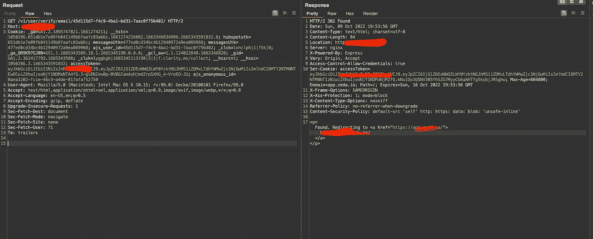
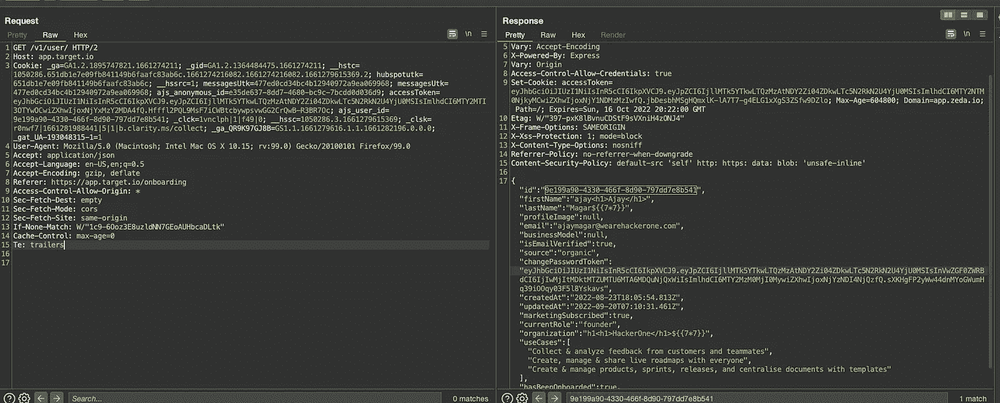
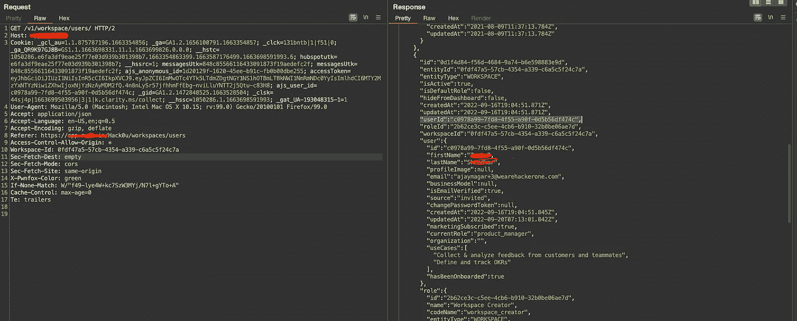
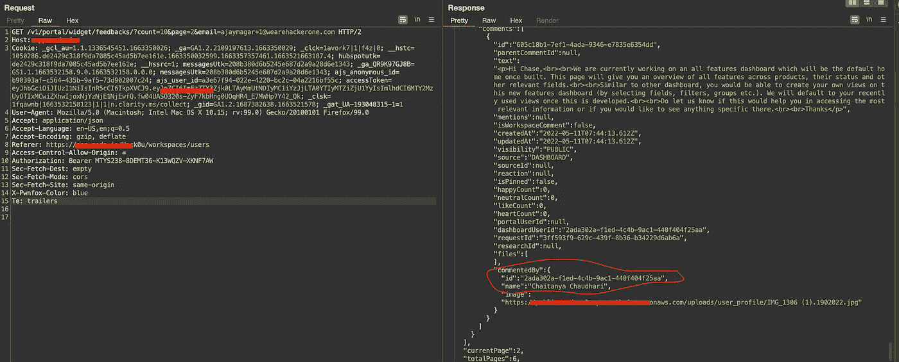

# 意外帐户接管

> 原文：<https://infosecwriteups.com/accidental-account-takeover-4301b56f4fb2?source=collection_archive---------2----------------------->

你好安全社区，

让我们开始写文章吧。我在测试一个团队管理应用程序。有多个角色和权限级别功能。在签名页有一个基于电子邮件地址和密码的认证系统。所以我用火狐容器注册了我的管理员、经理和只读账户。

使用令牌的电子邮件验证如下所示。

电子邮件验证令牌链接

我从 chrome 邮箱里复制了这个网址。我看到这个令牌是基于 uuid 和不可访问的。我在仪表板中向前移动，检查其他功能。测试应用程序时。我试图复制一个链接，但不知何故，它不工作。我打开了一个私人窗口并粘贴了那个链接，但是那个复制的链接不起作用，所以我的剪贴板已经有了一个电子邮件验证链接。我很匆忙，我没有看到我粘贴的内容，我点击了搜索，我看到了目标应用程序的仪表板。我以为这个代币是一次性使用的，但是我错了。然后，我在 burp 搜索功能中搜索该令牌，我知道它的用户 ID 是 user。

所以我开始在 api 的响应中寻找其他用户的 userID。它的基于团队的应用程序有一个用户页面，我捕获了这个请求，作为响应，我得到了那里列出的每个用户的 userId。

我能接触到我团队里的每个员工。

为了增加严重性，我开始在应用程序的其他部分寻找这个用户 ID。然后我发现了反馈页面，在那里多个用户和公司员工互相评论反馈。金矿。

我接管 poc 的员工帐户。

下次再见！

## 来自 Infosec 的报道:Infosec 每天都有很多内容，很难跟上。[加入我们的每周简讯](https://weekly.infosecwriteups.com/)以 5 篇文章、4 条线索、3 个视频、2 个 GitHub Repos 和工具以及 1 个工作提醒的形式免费获取所有最新的 Infosec 趋势！