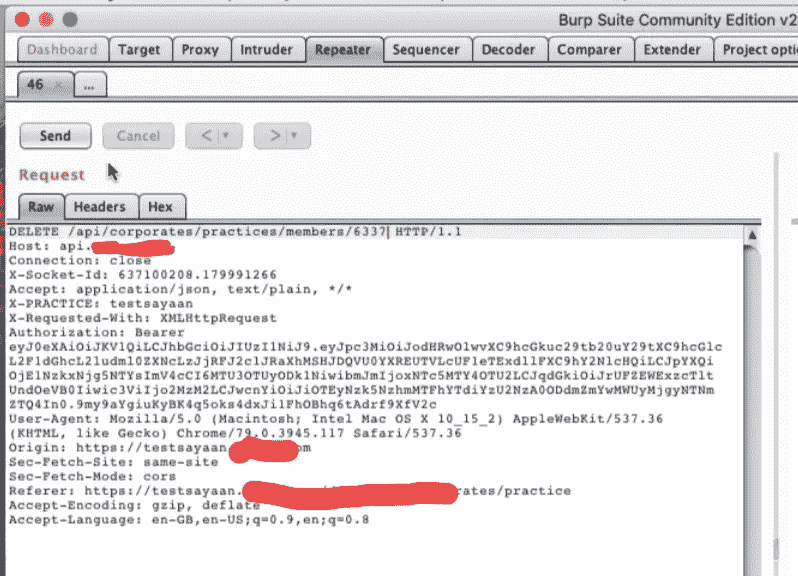

# 意外的 id 或已删除的管理员帐户。

> 原文：<https://infosecwriteups.com/accidental-idor-that-deleted-admin-account-d51264292b66?source=collection_archive---------0----------------------->

嗨，大家好，上周我被我的一个朋友邀请参加一个私人项目。

# 关于窃听器

## IDOR 是 OWASP 2013 年十大漏洞之一，由于暴露的引用，它允许您访问未经授权的数据。让我们转向实际场景。

所以我测试了这个程序，开始时我发现一个正常的限速值是 25 美元😅😅是的，太低了，我也不满意。
所以我开始在我的打嗝重复器上玩请求游戏，测试了一段时间后，我什么也没得到，所以我停下来，关掉了我的 mac。
几分钟后，我收到了管理员价值 300 美元的不和谐通知...猜猜那是什么？？？

我很惊讶，想起我在玩请求，我想我已经删除了它。
所以我立刻浏览了我的打嗝历史记录，搜索删除请求，希望我得到了。

该网站上有一个在我的帐户上添加和删除团队成员的功能，所以当我处理请求时，我发送了一个 user_id = 1 的删除请求，这就是为什么 admin 帐户被删除了。在这之后，我被确认我可以删除任何人的帐户。
我报告了 bug，发了 pic。不到一个小时，我就获得了 300 美元+ 25 美元的限制 Bug 奖励。这是 BB 航空公司有史以来最快的决议。

如果你对这篇文章有任何问题，请通过 twitter 联系我。我要打开我的 DM。

## 伙计们，请不要犹豫，鼓掌 50 次😊

# 下次见！

如果你喜欢我的博文和我的作品，请考虑看看我的“给我买杯咖啡”页面
[https://www.buymeacoffee.com/jgUFSPu](https://www.buymeacoffee.com/jgUFSPu)

*关注* [*Infosec 报道*](https://medium.com/bugbountywriteup) *获取更多此类精彩报道。*

 [## 信息安全报道

### 收集了世界上最好的黑客的文章，主题从 bug 奖金和 CTF 到 vulnhub…

medium.com](https://medium.com/bugbountywriteup)