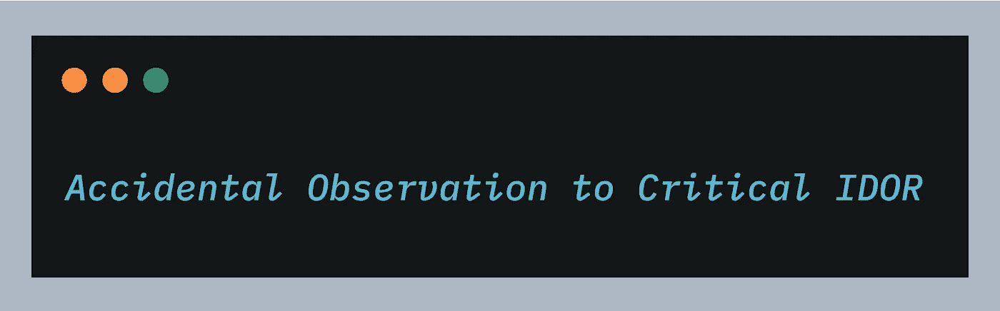

# 对临界 IDOR 的偶然观察

> 原文：<https://infosecwriteups.com/accidental-observation-to-critical-idor-d4d910a855bf?source=collection_archive---------0----------------------->



根据 OWASP TOP 10 (2017 版)，不安全的直接对象引用属于破坏的访问控制类别。这个问题通常是由于应用程序的访问控制逻辑实现不完善造成的，访问控制逻辑将标识符或对象链接到特定的资产，比如说 **user_id** 参数定义了要更新哪个用户的数据。IDORs 被比作服务器端的问题，被广泛观察，并且容易识别。然而，idor 通常很棘手，看起来非常健壮的应用程序也可能有 idor。

嗨，黑客和赏金猎人们，我希望你们都过得很好。过了很久，我开始回去寻找漏洞，最近遇到了一个有趣的 IDOR 漏洞，它最终成为了一个严重的(P1)问题。在这个博客中，我将讨论同样的问题。

【如果你喜欢读我的文章，请在推特上关注:[***【https://www.twitter.com/harshbothra_】***](https://www.twitter.com/harshbothra_)

我开始寻找一个老目标的子公司的问题，比如说**targetsub.com** 我在 3-4 个月后登录该帐户，成功登录后，它要求我更改密码，因为它的政策是每几个月轮换一次密码。在密码更改页面上，URL 如下所示:

```
[https://www.targetsub.com/change-password/?id=90](https://www.targetsub.com/change-password/?id=90)
```

望着**？id=** 参数，我试图更改值，但没有成功。后来，在用正常流程更改密码后，我登录到应用程序并导航回**更改密码**页面。

现在，这一次 URL 看起来像这样:

```
https://www.targetsub.com/change-password/
```

这次的**？id=** 参数不存在。现在，对于具有相同**端点**的应用程序来说，使用两个不同的流有点奇怪。接下来，我转到**我的账户**页面，网址如下:

```
https://www.targetsub.com/myaccount/
```

进一步，我修改了网址，增加了**？id=** 参数，值为 **88** ，新的 URL 如下所示:

```
https://www.targetsub.com/myaccount/?id=88
```

现在，我可以访问 id=88 的**用户的详细信息了。至此，我可以更改用户的电子邮件了。此外，我创建了另一个帐户，并将其电子邮件更改为攻击者电子邮件。现在，我可以调用攻击者控制的电子邮件上的密码重置链接，无需用户交互，我就能够执行完整的帐户接管。**

**外卖:**

1.  始终检查每个端点的所有可能的流。有时，您可能会发现一个有趣的流程，可以在应用程序的其他地方使用。
2.  每当你看到 **/myaccount** 或者类似的没有引用用户唯一标识符的端点时，试着用通用标识符参数比如 **uid，id，user_id，oid，**等等来混淆。

如果你喜欢阅读文章**，请鼓掌并在*媒体和推特上关注:***

***碎碎念:***[***https://www.twitter.com/harshbothra_***](https://www.twitter.com/harshbothra_)

***领英:***[***https://www.linkedin.com/in/harshbothra***](https://www.linkedin.com/in/harshbothra)

***网址:***[***https://harshbothra . tech***](https://harshbothra.tech/)

***会谈:***【https://www.youtube.com/playlist?】***list = plyn 5 _ MxRvV-fxpl 90 I-uebxqzqbxfiay 0***

***幻灯片:***[***https://speakerdeck.com/harshbothra***](https://speakerdeck.com/harshbothra)