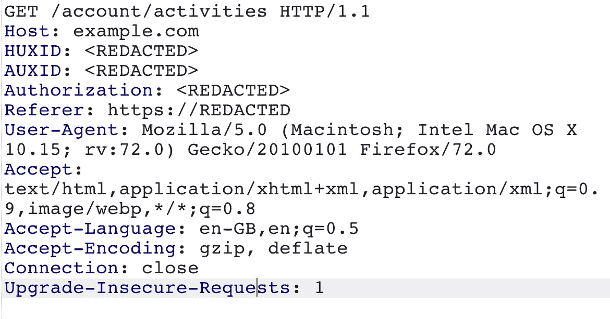
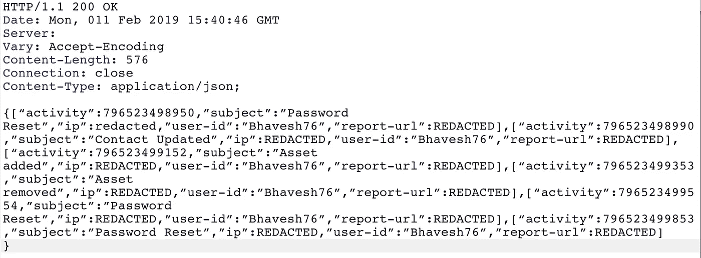
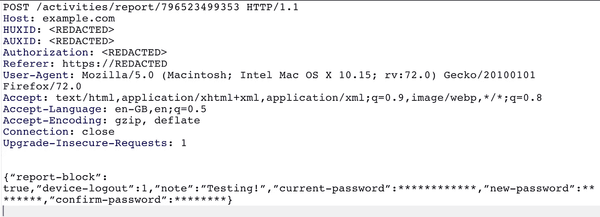
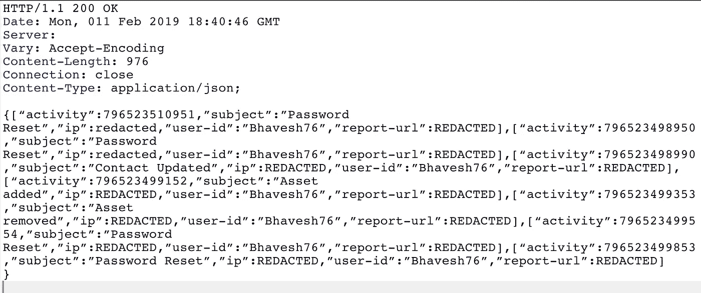
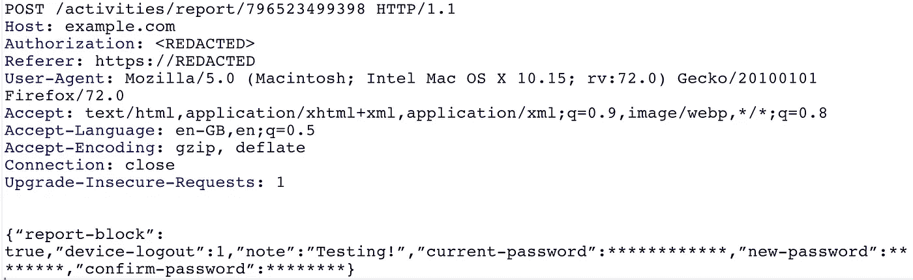
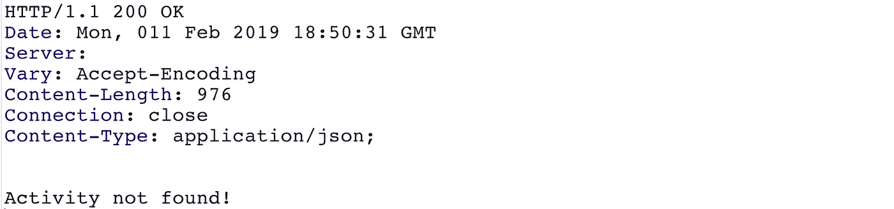
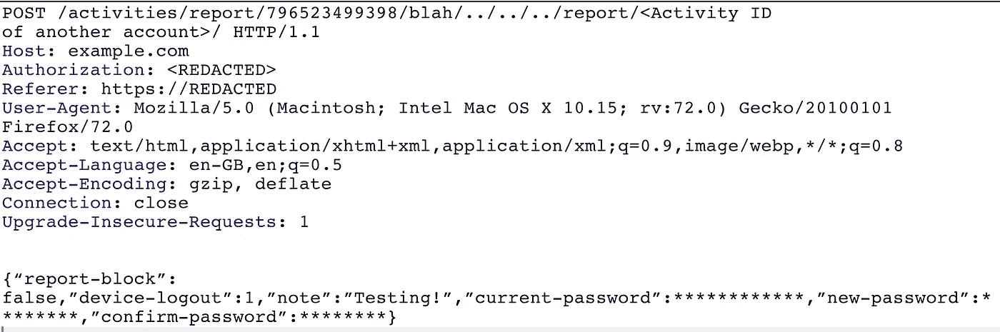

# 使用授权旁路的帐户劫持$$$$

> 原文：<https://infosecwriteups.com/account-hijack-using-authorization-bypass-which-made-me-richer-by-ba9dace72682?source=collection_archive---------0----------------------->

读者们好，

今天，我将分享我的一个发现，通过这个发现，我能够执行完全的账户接管。在继续之前，让我们了解什么是授权。这是一种机制，应用程序通过这种机制来决定经过身份验证的用户是否有资格访问特定的资源。通过下面的例子可以更简单地理解这一点:

一家公司有两名员工。他们都可以进入自己的办公室，但除了自己的柜子，他们不能进入别人的柜子。还有，这些员工除了自己的以外，看不到别人的工资条或个人详细信息。现在想一想，如果一名员工可以看到某人的个人资料或工资条或任何他无权看到的机密数据？这对公司的保密性将是一个很大的威胁。在这里，这被称为系统漏洞。

*还有一个例子是某人的驾照。驾照上的照片可以证明你是谁(身份证明),上面提到的允许你驾驶的车辆只是授权。可以清楚地理解，认证和授权都是遵循基于角色的访问的任何机制的组成部分。*

为了更清楚地理解授权，让我们先来理解身份验证，因为我看到许多开发人员没有将两者视为不同的实体，这使得他们的应用程序容易受到破坏的访问控制的攻击。

流行的身份验证机制

1. **HTTP 基本认证**:这种方法需要用户名和密码通过 HTTP 头本身，以 base64 编码。不建议这样做，因为它以纯文本形式发送用户名和密码，这很容易在中间攻击中通过 main 获得。为了避免这种情况，开发人员需要加密这些数据。但是这又会影响应用程序的速度，因为服务器必须解密每个 HTTP 请求。

2.**摘要认证**:在这种方法中，授权头包含用户名和密码，在发送给服务器之前，将用户名和密码发送给哈希函数，哈希函数使用带有随机数的 MD5 加密哈希。这种机制容易受到暴力攻击和 MD5 碰撞攻击。

3. **Cookies** :每当用户登录到应用服务器时，都会在用户的浏览器中生成会话 Cookies。如你所知，HTTP 是一个无状态协议，因此需要在每个请求中向服务器发送这些会话 cookies。一旦服务器收到来自用户的任何请求，它就检查有效的会话 cookies。如果 cookies 是有效的，应用程序识别谁是登录用户。

4.**承载令牌**:在这种机制中，通过令牌执行认证。提供正确的凭证后，服务器会生成一个令牌，并在每个请求中发送给服务器。

登录用户的唯一标识不能帮助定义与访问相关的问题。现在，为了确定该经过身份验证的用户应用程序需要执行授权检查的角色和用户权限。这可以通过以下方式实现。

1. **JWT 令牌**:这是一种将数据作为 JSON 对象传输的方法。该信息经过数字签名。可以使用 RSA 加密算法使用秘密或公共/私有密钥对其进行签名。一个 JSON Web Token 由三部分组成:*头*、*负载、*和*签名*。标头和有效负载是 Base64 编码的，然后用句点连接，最后，结果经过算法签名，生成[HEADER]形式的令牌。[索赔]。[签名]。报头由元数据组成，元数据包括令牌类型和用于对令牌进行签名的哈希算法。

2. **OAuth:** 该机制定义了一个委托协议，该协议有助于在支持 web 的应用程序和 API 的网络中传达授权决策。开放标准授权协议或框架的 OAuth 标准，描述了分布式和非连接的服务器和服务如何安全地允许对其资产进行身份验证访问，而无需实际共享初始的、相关的单一登录凭据。

3. **SAML(安全断言标记语言):**安全断言标记语言(SAML)是双方授权的框架。它有两种机制服务提供者和身份提供者。身份提供者向应用程序提供身份验证，服务提供者信任此信息来提供授权。这是通过交换数字签名的 XML 文档来完成的。

现在我将向您解释我是如何绕过应用程序的授权机制并能够访问某人的数据的。

现在我将描述我的一个发现，在这个发现中，我能够绕过特定模块上的授权。使用不正确的旧密码验证来劫持任何最终用户的帐户，同样的漏洞也被利用了！

在该应用程序的个人资料部分，有一个选项可以获取最终用户活动的详细信息。我发现已经执行了多个活动，如密码重置、图像上传、名字更新等。我注意到，每当我点击任何活动时，它都会向我显示日期、IP、与所执行的操作相关的信息以及活动 ID。根据这些信息，我应该做什么，我可以验证我是否执行了这些活动？否则，如果我看到任何恶意活动，我可以更改我的密码。当我点击任何特定活动时，我注意到 URL 如下所示:

网址:[https://example.com/account/activities/](https://example.com/account/activities/)

以下是实际的请求

以下是回应:

通过观察响应，我注意到每个活动都有一个 ID。幸运的是只有数字。此外，如果发现可疑活动，还有一个报告链接。当点击报告链接时，有一个重置密码和从所有设备注销的选项。我在下面的请求中观察到一个奇怪的行为。

如果发现该活动是恶意的，此请求将更改密码。我向服务器发送了一个原始请求，发现当前会话立即失效。什么！！这太酷了。我执行了相同的活动，但是将参数 report-block 更改为 false。这次什么都没发生。我没有被赶出会议。但我观察到的反应与之前的反应相同。为了验证这一点，我登录并尝试再次登录。奇怪的是，我成功登录。我认为报告块参数是导致这种行为的原因。我把它设置为 false，这就是为什么这个请求没有被服务器接受，即使响应是相同的。

但是等等…为什么我的帐户活动显示我刚刚重设了密码。

好的，根据应用程序，我的密码被更改了。但是怎么样，我在举报的时候没有输入我现在的密码。我执行了相同的操作，得出的结论是报告模块根本没有验证旧密码！这是一个发现，但严重性仍然很低。

我试图暴力报告 ID，但得到 403 响应。

现在，是时候检查这个请求的授权了。我观察到请求中有 3 个具有随机 id 的报头。首先，我删除了授权头，并将请求发送到服务器。应用程序立即抛出一个错误。好吧，这个标题是必不可少的。现在我删除了 HUXID 和 AUXID，并将请求发送到服务器。

尽管如此，我还是收到了服务器的 403 响应。现在除了篡改网址别无选择。我从服务器响应下面的请求中删除了报告 id。

我尝试了很多方法来绕过这个限制，最后，我用下面的方法成功了。

我只是补充废话/../../../report/ <activity id="" of="" another="" account="">/到原网址瞧！！我得到了 200 OK 的回复。我立即尝试用新设置的密码登录我的另一个帐户，是的，我成功登录了！</activity>

我多次验证这个漏洞，观察到同样的行为！我赶紧创建了一个视频 POC，报了上去。他们在三天内修补了相同的内容，并以 4 位数的形式奖励了我$$。

**被利用的漏洞**:模块中旧密码的不正确验证+使用 URL 操作绕过授权

如有任何反馈或建议，请联系我@ [巴维什](http://twitter.com/Bhavesh_Thakur_?s=09)

*关注* [*Infosec 报道*](https://medium.com/bugbountywriteup) *获取更多此类精彩报道。*

 [## 信息安全报道

### 收集了世界上最好的黑客的文章，主题从 bug 奖金和 CTF 到 vulnhub…

medium.com](https://medium.com/bugbountywriteup)