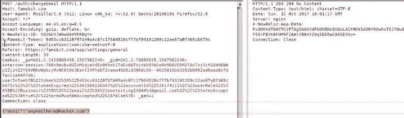
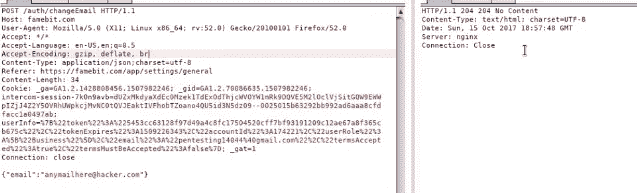

# 谷歌收购中的账户接管漏洞[Famebit]

> 原文：<https://infosecwriteups.com/account-take-over-vulnerability-in-google-acquisition-famebit-e93b1a0a7af9?source=collection_archive---------3----------------------->

问候，

我是哈桑·汗·优素福扎伊，今天我将分享我最近在谷歌收购中的发现，即“Famebit”。我能够通过绕过电子邮件更改功能中的 CSRF 保护来接管受害者帐户。

**什么是跨站脚本伪造？**

"**跨站点请求伪造** ( **CSRF** )是一种攻击，它迫使最终用户在他们当前已通过身份验证的 web 应用程序上执行不想要的操作"。

我希望你们都知道 csrf 的基础知识，我们不讨论基础知识，但如果你想学习，你可以在 [Owasp](https://www.owasp.org/index.php/Cross-Site_Request_Forgery_(CSRF)) 查看。

**让我们继续前进^^**

基本上，我的一个朋友给了我一个网站，让我测试一下。因为我喜欢只在 Bug 人群私有程序中做笔测试。有一天我太累了，所以我想我们还是去打猎吧。

每当我开始测试一个 Web 应用程序时，我通常从/settings 页面启动它，因为该页面包含了应用程序的基本功能。因此，当我寻找电子邮件更改功能时，我注意到没有“当前密码保护”。敏感操作中没有当前密码保护被认为是“bugcrowd”平台中的 **p4** 漏洞。所以，向谷歌举报是不值得的。

我检查了执行 CSRF 攻击的 POST 请求，但是在头中有 X-Famebit-Token 头&我的第一个反应是“它不可能绕过，因为它的 Google 收购站点。Lol？”但是我想让我们试一试。

**请求&带有反 CSRF 报头的响应**

**请求&没有反 CSRF 报头的响应**

WDF 同样回应:D

因此， **X-Famebit-Token** 没有服务器端验证。这意味着 CSRF 是可能的。我用 burp suite 制作了 CSRF POC，但是没有效果，响应是 404 :/。我当时就想。伙计，为什么这没用。？？？？？？？？？？？？？？？

我想到的第一件事可能是它是基于推荐人的 CSRF 保护，但后来我发现它不是基于推荐人的。

所以，就像我们让 JSON CSRF poc 在 post 数据的末尾追加额外的数据一样&在我的 POST 请求中是这样的

> { " email ":" attack @ hacker . com " }**=**

我也犯了一个错误，认为它的服务器端保护有些 how :P 但是后来，我明白它不是任何服务器端保护，它只是自动附加在 Json Csrf 中的额外数据！对吗？(**如不指正我**)

我是如何处理“ **=** ”这件事的？很简单，我在我的 post 数据中使用了一个额外的参数 ignore。Ignore 只是取“=”并忽略它:)

**最终漏洞:**

> <表单动作= "【https://famebit.com/auth/changeEmail】" method = " POST "/>
> <输入 type = " hidden " name = "&# 123；&quot；电子邮件&quot；&# 58；quot;Attacker@hacker.com&quot；&# 44；**&quot；忽略&quot；&# 58；&quot；**" value = "&quot；&# 125；/ >
> <输入 type = " Submit " value = " Submit Request ">
> </表单>
> < /html >

**发布数据:**

> { " email ":" attack @ hacker . com "，" ignore":"="}

因此，现在有了 CSRF，就有可能改变 vicitim 的电子邮件，然后攻击者也可以改变密码。**账户接管:** D

**概念验证:**

就是这样，谷歌安全团队一天就搞定了:)。我希望你们学到了一些新的东西:-)

#Hack_To_Live#

> **问候，**
> 
> 哈桑·汗·优素福扎伊
> 
> **安全研究员**