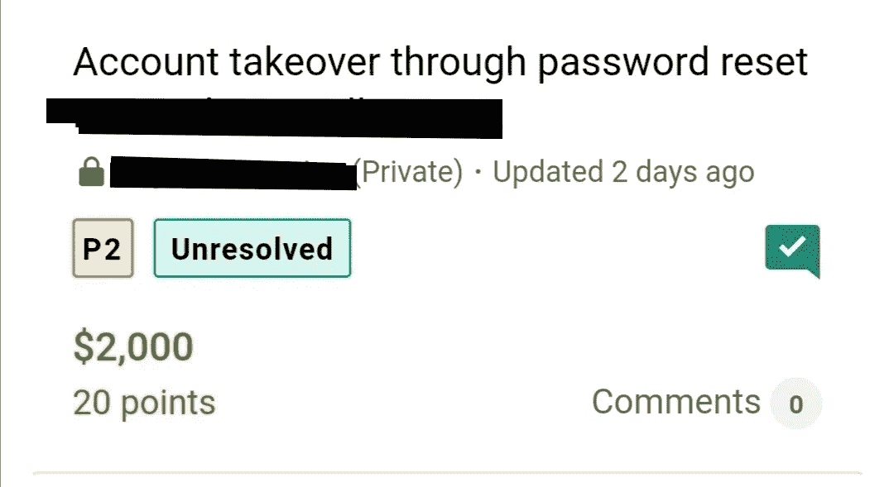
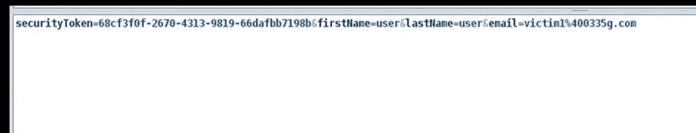
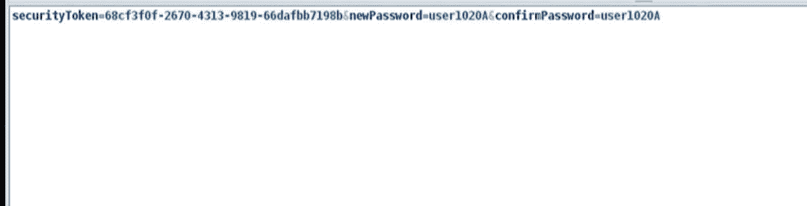

# 通过密码重置接管帐户

> 原文：<https://infosecwriteups.com/account-takeover-through-password-reset-82adc0c19248?source=collection_archive---------0----------------------->

大家好，

我是**奥马尔·哈姆迪** **【海员】**，今天我将解释我在 **Bugcrowd** 的私人程序中发现的最酷的 bug 之一

我们开始吧，

我有一个私人程序，姑且称之为**redacted.com**，经过一段时间的侦察程序，我开始检查密码重置功能，通常我寻找漏洞一样(ATO，主机头注入)

简单地说，当用户想要重置他的密码时，他输入他的名和姓以及电子邮件。密码重置链接将发送到他的电子邮件中。

我请求重设我的账户密码，然后拦截了这个请求(通过 **Zap 代理**)并仔细检查。

我发现请求是这样的:

密码重置链接是:

**https://redacted.com/Reset?token=04294876770750**

到目前为止没有什么令人兴奋的，我使用了链接，更改了我的密码并拦截了请求，在这里我发现了一些非常有趣的事情。

我发现请求是这样的:

如果查看这个请求，您会发现用于重置密码的令牌，它与用户请求重置其密码时发送的现有令牌相同

从这里，我可以通过更改受害者的密码来接管我想要的任何帐户

**再现**的步骤:

1-请求重置受害者帐户的密码，并用 Burpsuite 阻止该请求。

2-您将找到用于重置受害者密码的令牌。

3-为您的帐户请求密码重置，然后使用密码重置链接，更改您的密码并通过 Burpsuite 拦截请求。

4-您会发现请求如下:

5-将您的令牌替换为受害者的令牌，受害者的密码将被成功更改。

当我向该公司报告该漏洞时，他们降低了从 P2 到 P3 的风险，因为我需要知道受害者的名字和姓氏，但随着进一步的研究，我发现我只需要知道受害者的电子邮件，如果我输入的名字和姓氏不正确，我仍然可以获得受害者的令牌。

在 twitter @seaman00o 上关注我