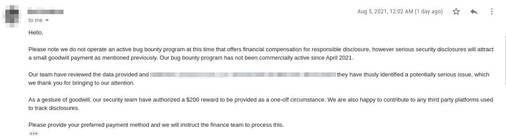

# 通过密码重置接管帐户(用户+管理员)

> 原文：<https://infosecwriteups.com/account-takeover-user-admin-via-password-reset-322b8020ea6?source=collection_archive---------0----------------------->

# 大家好！

我叫赫曼特·帕蒂达尔，是钦奈理工学院土木工程专业的大四学生。

一个土木工程师，一个网络安全爱好者，一个夜间的 Bug 赏金猎人。

# 我们开始吧...

当我和 [Ritesh Gohil](https://medium.com/u/b437fa5664a?source=post_page-----322b8020ea6--------------------------------) 对我们自己的帐户进行密码重置时，我们注意到发送到我们电子邮件的密码重置链接包含一个五位数的令牌。

后来，我们得出结论，当以连续的方式对两个不同的用户(即帐户 A 和 B)进行密码重置时，服务器将为这两个用户分配一个连续编号的令牌。因此，如果帐户 A 是攻击者的帐户，那么攻击者可以将令牌 ID 更改为下一个连续的数字，并且可以更改帐户 B(即受害者的帐户)的密码。这会导致账户被接管。

**举例:**

如果**账号 A** 收到链接:https://dashboard.example.com/password-reset/form?token=**28604**

然后**账户 B** 会收到:https://dashboard.example.com/password-reset/form?token=**28605**

**现在，让我们接管管理员帐户。**

经过一些研究，我们发现管理员用户没有单独的登录页面。这意味着管理员用户可以在同一个登录页面上预置。因此，让我们找出管理员用户的电子邮件地址，以便我们可以接管他们的帐户。我们只是进入网站的“关于我们”页面，找到了创始人的电子邮件地址。现在，让我们接管管理员帐户。

**复制步骤:**

1.  在两个不同的选项卡中打开 URL:https://dashboard.example.com/login，并使用电子邮件地址以连续的方式为两个帐户执行密码重置。(即 A -您的帐户，B -管理帐户)
2.  现在打开记事本，在记事本中复制账户 A 的密码重置链接(即 https://dashboard.example.com/password-reset/form?token=12345)
3.  现在将令牌 ID 更改为下一个连续的数字。(作为以连续方式分配的令牌 ID，如果您的是 12345，则管理令牌 ID 将是 12346)
4.  现在使用修改后的链接，即 https://dashboard.example.com/password-reset/form?token=12346 并重置管理员密码。
5.  嘣！！管理帐户接管。

**影响:**

任何人的帐户接管

#赏金

**时间线:**

> **Bug 报告:**2021 年 6 月 2 日
> 
> 2021 年 8 月 5 日悬赏:200 美元

**感谢阅读:)**

快乐黑客；)

你可以看到许多文章即将发表…

**如果你有任何关于昆虫赏金猎人的疑问，请随时给我发消息**

> *领英:*[*linkedin.com/in/HemantSolo*](https://www.linkedin.com/in/hemantsolo)
> 
> *网址:-*[*hemantpatidar . me*](http://hemantpatidar.me/)
> 
> *推特:-*[*twitter.com/HemantSolo*](https://twitter.com/HemantSolo)
> 
> *insta gram:-*[*instagram.com/hemant_solo*](https://www.instagram.com/hemant_solo/)