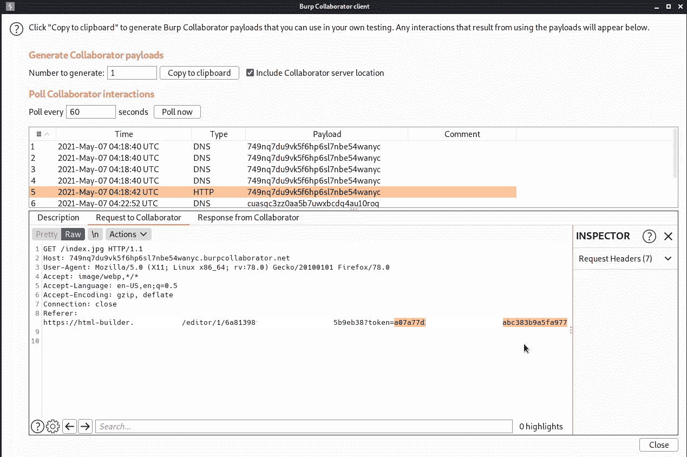
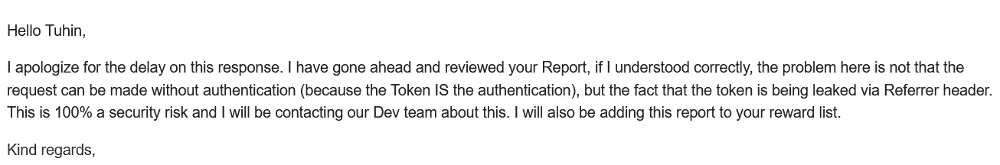

# 通过访问令牌泄漏的帐户接管

> 原文：<https://infosecwriteups.com/account-takeover-via-access-token-leakage-687276953408?source=collection_archive---------2----------------------->

大家好。我叫图欣·博斯( [@tuhin1729](https://instagram.com/tuhin1729) )。我是一名网络安全研究员和 bug 赏金猎人。在这篇文章中，我将分享我的一个有趣的发现。所以不浪费时间，让我们开始吧:


tuhin1729

# 简介:

基本上，目标是一个营销自动化网站，在那里你可以有效地自动化你的营销人员。就叫它 target.com 吧。我已经在目标上发现了超过 10 个 bug，并从那里赚了$$$。

现在，在测试档案更新功能时，我遇到了这个有趣的请求:

```
PUT /api/account/general-info/ HTTP/1.1
Host: services.target.com
User-Agent: Mozilla/5.0 (Windows NT 10.0; Win64; x64; rv:91.0) Gecko/20100101 Firefox/91.0
Accept: application/json, text/plain, */*
Accept-Language: en-US,en;q=0.5
Accept-Encoding: gzip, deflate
Referer: [https://bo.target.com/](https://bo.target.com/)
Content-Type: application/json
accessToken: 795b74eXXXXXXXXXXcba9abd3beaa3ec40b5d3ed
Content-Length: 213
Origin: [https://bo.target.com](https://bo.target.com)
DNT: 1
Connection: close
Sec-Fetch-Dest: empty
Sec-Fetch-Mode: cors
Sec-Fetch-Site: cross-site{"company":"DSPH","domain":"[https://darksocietypenetration.com](https://darksocietypenetration.com/)","cellphone":"+91-83xxxxxx36","companySize":"2","businessSector":20,"logo":{"height":0,"base64":"","square":true,"width":0}}
```

他们使用 accessToken 头来更改配置文件细节(对于其他经过身份验证的操作，没有这样的头)。我很快用我的第二个帐户更改了 accessToken 头的值，我的第二个帐户的详细信息也更改了。我尝试在其他认证请求中添加 accessToken 头，成功了，第二个帐户的详细信息被更改。在对此进行更多研究时，我发现 accessToken 的值是静态的，即 accessToken 即使在注销后也是相同的。这意味着，如果我能以某种方式获得受害者的访问令牌，我就能接管他的完整帐户。但是 accessToken 头的值是不可猜测的，所以我想找到一种方法来获得受害者的 accessToken。但当时，我无法这样做。经过 3-4 天的搜寻，我忘记了这一点，开始搜寻其他功能。

## 获取受害者的访问令牌

在网站中，在电子邮件营销下，有一个我们可以制作自己的电子邮件模板的部分。在测试该功能时，我试图在电子邮件中上传一个图像文件。有两种方法可以做到这一点，要么从我的设备或通过图片网址。我尝试了一些 DoS，SSRF，XSS 和文件上传技巧。但是看起来他们有很强的文件类型验证。此外，他们从客户端获取图像，所以 SSRF 是不可能的。现在，当我试图使用我的 burp 合作者的链接来查看请求时，我注意到一件有趣的事情:



tuhin1729

那么 accessToken 就会通过 Token 参数在 Referrer 头中泄漏。

那么攻击场景会是怎样的呢？

## 攻击场景

1.  受害者正在创建一个手动模板。
2.  受害者将来自第三方网站的图像添加到他的模板中。
3.  第三方网站所有者(或员工)获得受害者的访问令牌(从他们的日志)，并能够接管他们的完整帐户。

## 反应

我很快做了一个 POC 发给他们。一周后，他们回复我:



tuhin1729

**时间线**

2011 年 6 月 5 日—报告的漏洞

2011 年 5 月 14 日—回复了赏金邮件

在推特上关注我:@ [tuhin1729](https://twitter.com/tuhin1729_) _

感谢阅读。我希望你喜欢这个博客。