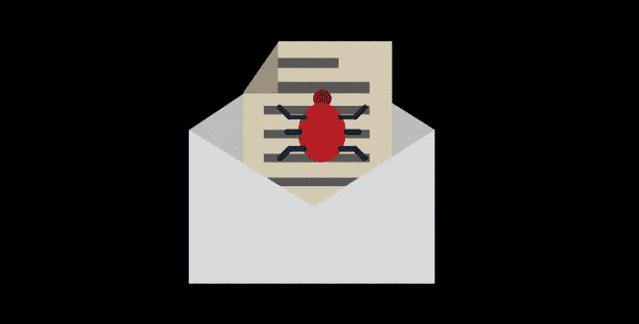
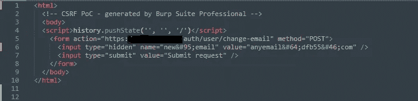
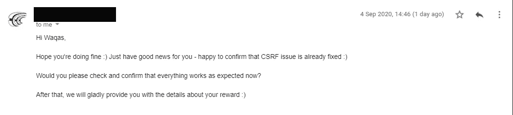
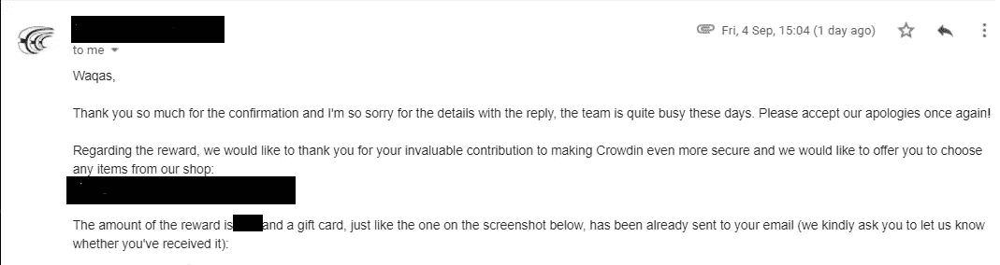

# 通过 CSRF 接管账户

> 原文：<https://infosecwriteups.com/account-takeover-via-csrf-78add8c99526?source=collection_archive---------1----------------------->

这是我的第一篇博客，所以如果我有任何错误，请忽略。

大家好

我通过 google dork 找到了一个负责任的披露程序，它在 CSRF 攻击中是不安全的，在更新记录时没有 CSRF 令牌存在。

对于不了解 CSRF 的人来说，这是一种 web 应用程序攻击，攻击者阻止或授权客户端提出他的恶意请求，而客户端并没有提出这些请求。

简单来说，如果服务器不批准客户端发送的请求，攻击者可以创建一个恶意请求，并阻止客户端点击它，这将导致用户帐户(如密码或电子邮件)的修改。

让我们从概念验证开始

*   首先，创建一个帐户作为攻击者，并填写所有的表格，检查您的帐户详细信息。
*   更改电子邮件并捕获请求，然后创建一个 CSRF 漏洞。
*   CSRF 漏洞如下所示。我已经将电子邮件值替换为 anyemail@*******。并在受害者的账户里提交了一个请求。

*   在接下来的阶段，我只是转发上面的请求和 vola！我的漏洞发挥了作用，因此通过这个漏洞，我将我的电子邮件更改为受害者的电子邮件，并通过使用忘记密码的方法来检索我的电子邮件的密码重置链接，我可以完全控制受害者的帐户。

报告提交日期:2020 年 6 月 1 日，星期一

修复确认:2020 年 9 月 4 日

最后，赠送礼品卡

我仍然需要学习很多东西，这激励我继续前进。

希望你觉得这有用，我尽力解释。请大家分享，让别人借鉴。

谢谢你。