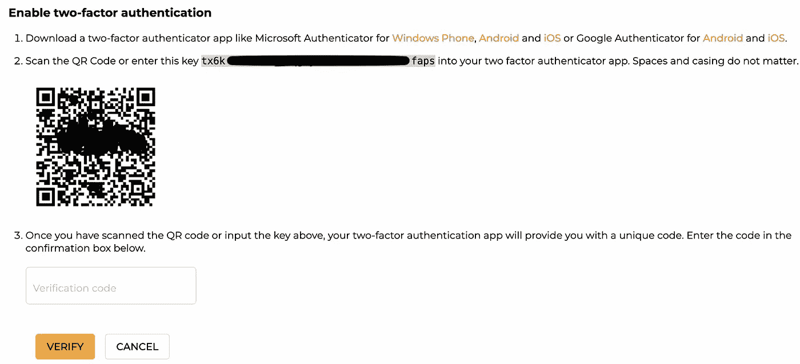
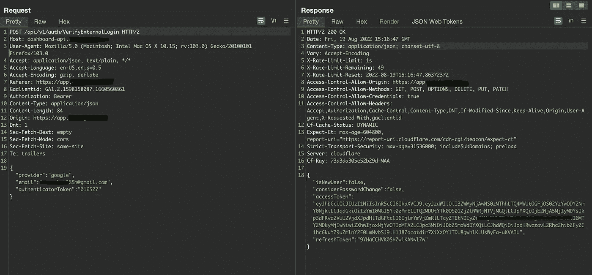
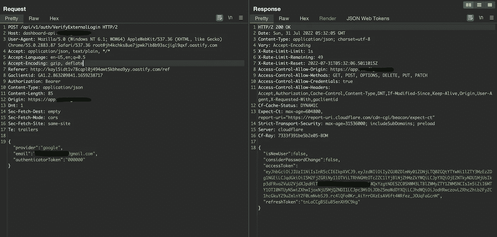
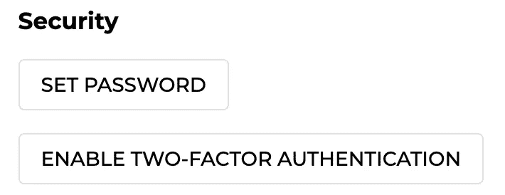
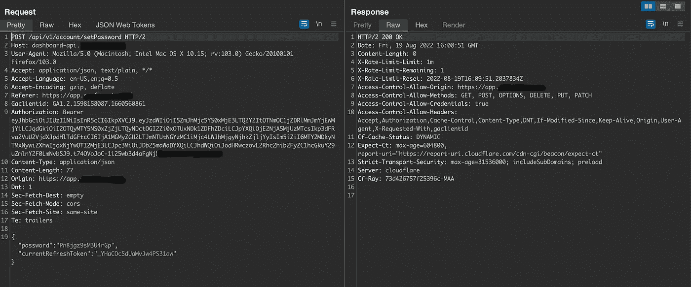
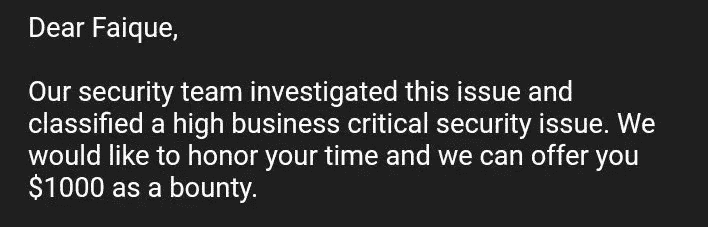

# 价值 1000 美元的帐户接管

> 原文：<https://infosecwriteups.com/account-takeover-worth-1000-611452063cf?source=collection_archive---------0----------------------->

# 介绍

> *大家好，我是 Faique，一名来自印度的 bug 赏金猎人，欢迎大家阅读我写的关于我如何在一个最大的组织中使用错误配置的 2FA 和 OAuth 获得帐户接管的文章。*

我不能透露目标，因为这是私人邀请。在进入漏洞之前，我想让你先了解一切是如何工作的，尤其是身份验证。这将有助于你更清楚地了解漏洞。登录网站有多种方式，但可以分为两种，第一种是使用普通的电子邮件和密码，另一种是使用 OAuth，包括 Google、GitHub 和…

该网站的一个安全特性是 2FA，它在这个 bug 中发挥了重要作用。客户可以使用它来增加额外的安全层。现在让我们来看看程序和 bug。

我开始了基本的侦察，但没有发现任何东西。所以我转向认证测试，创建了一个帐户，并测试了重复注册，忘记密码错误，SQL 注入等等。然后我启用了 2FA 并强行破解了 2FA 代码。我尝试了电子邮件、密码登录和 Oauth 登录，但都没有成功:(

第二天，我在 google oauth 帐户上启用了 2FA，拦截了每一个请求，并像网站向服务器发送 2FA 代码一样，将 juicy 发送到中继器。

我测试了更多的 2FA 错误，然后受够了，停止了帐户上的 2FA，与此同时，在我去我所有的中继器请求后，我再次发现了上述请求，再次发送，并收到了一个 JWT 令牌，我想为什么不用一些随机代码如 000000 来更改验证器代码，并再次发送请求，猜猜我收到了什么 JWT 令牌

即使在禁用了账户的 2FA 之后，我还是能够通过这个请求获得一个 JWT 代码。这个 JWT 令牌基本上是用来验证用户身份的 cookie。为了确认这确实是一个漏洞，我等了一天，然后再次发送请求，是的，我收到了 JWT 令牌。那一刻我太激动了。

我只是需要一种方法来直接登录到被黑的帐户。所以我开始浏览登录的网站，我看到有一个为 oauth 帐户设置密码的功能，这样任何人都可以使用电子邮件和密码登录。

我使用设置密码请求，并将 JWT 令牌替换为我收到并发送的令牌。密码被添加了。

我现在可以使用电子邮件和密码直接登录，绕过 oauth。这个 bug 不仅影响 google oauth 登录，还影响所有网站使用的 oauth 提供者:GitHub、微软、Bitbucket、Azure active directory

**注意**:只有当用户在其账户上启用然后禁用了 2FA 时，才可能出现该错误

> ***冲击:***
> 
> *一旦攻击者获得账户*
> 
> *1。攻击者可以看到并编辑 API 密钥等机密信息*
> 
> *2。编辑组织&产品名称*
> 
> *3。邀请成员加入帐户*
> 
> *4。从组织中删除用户*
> 
> *5。给账户添加密码*
> 
> *6。删除账户*

向站点报告了错误

> ***时间轴***
> 
> 8 月 1 日 00:09:*报告了 bug*
> 
> 8 月 1 日 02:20:*第一次被拒绝，因为他们认为这是假阳性*
> 
> 8 月 1 日 03:00:*接受并请求耐心*
> 
> 8 月 5 日 01:20:*将该漏洞标记为高业务关键安全问题，并给我 1000 美元*

## 谢谢你读到这里，我希望你喜欢并从中学习到新的东西。如果你有任何疑问，请随时给我发短信

## *跟着我上*

## *推特:*[*https://twitter.com/imfaiqu3*](https://twitter.com/imfaiqu3)

## *insta gram:*[https://www.instagram.com/faique.exe](https://www.instagram.com/faique.exe)

## *领英:*[*https://www.linkedin.com/in/faiqu3/*](https://www.linkedin.com/in/faiqu3/)

*来自 Infosec 的报道:Infosec 上每天都有很多事情发生，很难跟上。* [***加入我们的每周简讯***](https://weekly.infosecwriteups.com/) *以 5 篇文章、4 个线程、3 个视频、2 个 Github Repos 和工具以及 1 个工作提醒的形式免费获取所有最新的 Infosec 趋势！*