# 活动目录概述

> 原文：<https://infosecwriteups.com/active-directory-overview-98692e1b0233?source=collection_archive---------0----------------------->

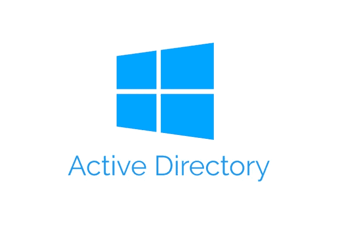

最近，我学习了更多关于 Active Directory 的知识，以及它在当今现代网络中是如何使用的。本文试图提供活动目录基础知识的概述，并利用由用户 [Cryillic](https://tryhackme.com/p/Cryillic) 创建的标题为“**活动目录基础知识**”的 [TryHackMe](https://tryhackme.com/room/activedirectorybasics) 房间，获得一些关于该服务的实践经验。

# 什么是活动目录？

Active Directory 是微软开发的用于管理 Windows 域网络的 [**目录服务**](https://jumpcloud.com/blog/what-is-active-directory-anyway) ，用于存储网络对象的信息。目录服务的目的是描述如何在 IT 网络中组织网络对象，以便允许 IT 管理员控制用户对这些网络资源的访问。如果用户想要访问网络资源，目录服务将要求用户使用用户名和密码根据目录的用户数据库来鉴定其身份。如果用户名和密码有效，用户就可以访问该资源。

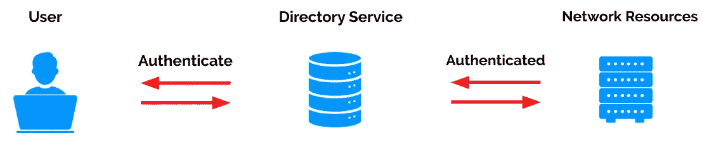

目录服务。

# Active Directory 是如何工作的？

活动目录由一个 [**数据库**](https://docs.microsoft.com/en-us/previous-versions/windows/it-pro/windows-server-2003/cc736627(v=ws.10)) 和一组 [**服务**](https://docs.microsoft.com/en-us/windows-server/identity/ad-ds/get-started/virtual-dc/active-directory-domain-services-overview) 组成，将用户与网络资源联系起来。服务控制网络环境中发生的活动，数据库包含关于网络对象的信息。主活动目录服务是**活动目录域服务(AD DS)** 。微软为 AD DS 提供如下描述:

> 目录服务(如 Active Directory 域服务(AD DS ))提供了存储目录数据并使这些数据可供网络用户和管理员使用的方法。例如，AD DS 存储有关用户帐户的信息，如姓名、密码、电话号码等，并使同一网络上的其他授权用户能够访问这些信息。

任何安装了 AD DS 服务器角色的 Windows 服务器都称为[**(DC)**](https://docs.microsoft.com/en-us/previous-versions/windows/it-pro/windows-server-2003/cc786438(v=ws.10))。组织可以有多个 DC，它们位于 Active Directory 的中心，控制域的其余部分。

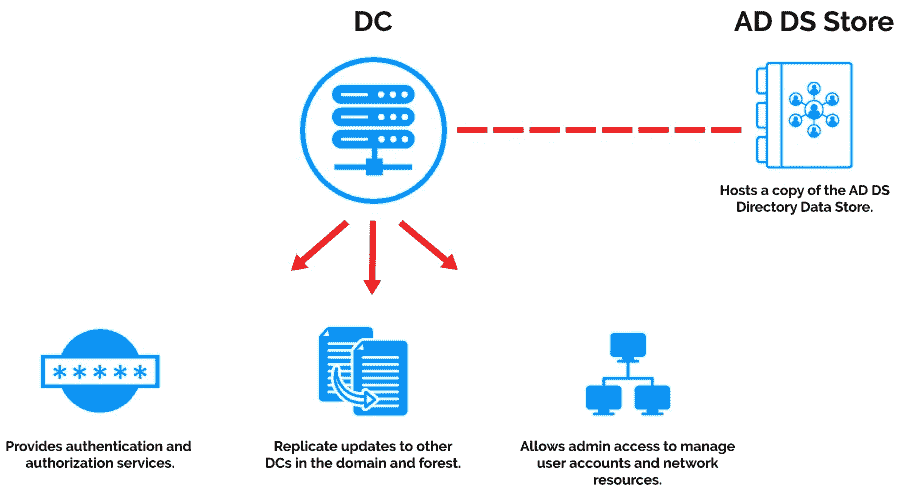

域控制器(DC)。

[**AD DS 存储数据库**](https://docs.microsoft.com/en-us/previous-versions/windows/it-pro/windows-server-2003/cc736627(v=ws.10)) (目录)包含域中 AD **对象**(即用户、计算机、应用程序、打印机、共享文件夹)的相关信息，只能通过域控制器进程和协议访问。它由 **Ntds.dit** 文件组成，这是一个包含所有活动目录 DC 信息以及域用户密码散列的数据库。

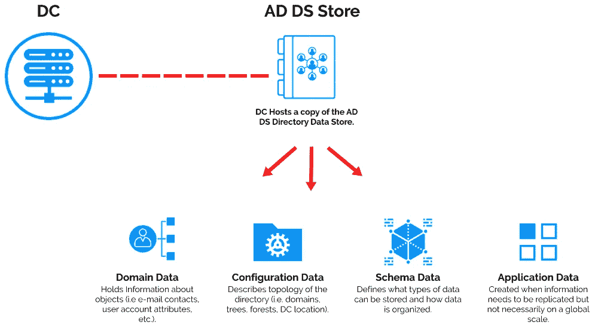

AD DS 存储数据目录。

创建 DC 时，它带有默认的 [**组**](https://docs.microsoft.com/en-us/windows/security/identity-protection/access-control/active-directory-security-groups) 和两个默认的**用户**(即管理员和访客)。活动目录中的用户和组由管理员决定。在 Active Directory 网络中，您会发现四种主要类型的用户，包括:

*   域管理员:控制域，并且是唯一可以访问 DC 的人。
*   **服务帐户**:除了服务维护之外，这些帐户大部分情况下从未使用过，它们是 Windows 服务(如 SQL)将服务与服务帐户配对所必需的
*   **本地管理员**:可以作为管理员对本地机器进行更改，甚至可以控制其他普通用户，但是不能访问域控制器
*   领域用户:这些是你的日常用户。

Active Directory 组通过将用户和对象组织到具有指定权限的组中，使得向用户和对象授予权限变得更加容易。Active Directory 组有两种主要类型:

*   **安全组**:用于为大量用户指定权限。
*   **分发组**:用于指定邮件分发列表。

# Active Directory 的结构是怎样的？

活动目录结构由几个逻辑层组成:

*   **组织单位(OU)** :组织域内的对象。包含用户、组、计算机和其他 ou。ou 允许您在一个域内组织对象，而不需要额外的工作和创建额外域的低效率。
*   **域**:用于分组和管理对象。一个域创建一个管理边界。
*   **树**:多个域的组合。
*   森林:一棵树或多棵树的集合。一个林创建一个安全边界，不同林中的对象不能相互交互，除非每个林的管理员在它们之间创建信任。

下图说明了 Active Directory 数据结构。

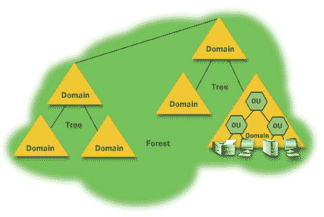

[活动目录结构。](https://www.distributednetworks.com/active-directory/module2/activeDirectory-logical-structure.php)

如果用户想要访问另一个域中的资源，则需要建立一个 [**信任关系**](https://docs.microsoft.com/en-us/azure/active-directory-domain-services/concepts-forest-trust) 。信任概述了林内部域的通信方式，并且可以扩展到外部域，在某些情况下甚至可以扩展到林。有两种类型的信任决定域如何通信:

*   **方向**:信任从信任域流向受信任域的方向。在下面的例子中，**单向**信任意味着*域 A* 中的用户可以访问*域 B* 中的资源，反之则不行。在**双向**信任中，*域 A* 信任*域 B* ，*域 B* 信任*域 A* 。

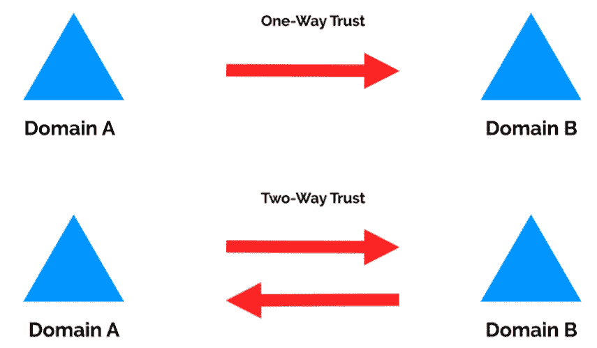

定向信任类型。

*   **可传递的**:信任关系扩展到两个域之外，包括其他受信任的域。**可传递信任**可用于扩展与其他域的信任关系。**不可传递的**信任可用于拒绝与其他域的信任关系。

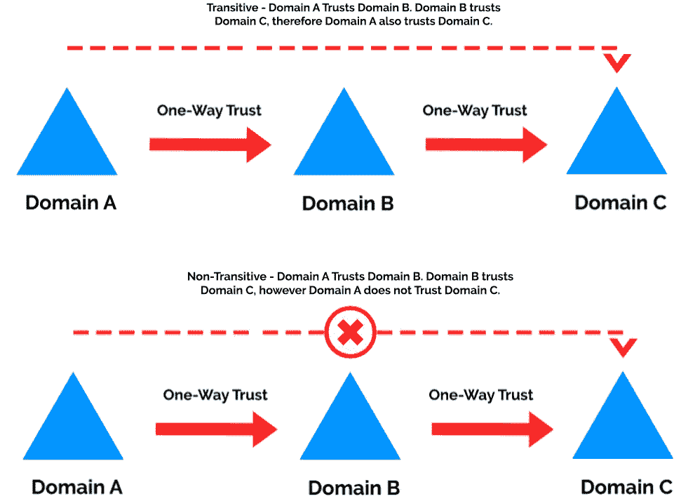

可传递信任类型。

Active Directory 还使用**域策略**，这些策略规定了服务器如何运行以及它将遵循和不遵循哪些规则。它们只是作为 Active Directory 的规则手册，域管理员可以根据需要进行修改和变更。

# Active Directory 域服务和身份验证

DC 向域或树的其余部分提供域服务，以管理身份、权限和对网络资源的访问。下面列出了默认的域服务:

*   **轻量级目录访问协议(LDAP)** :提供应用程序和目录服务之间的通信。
*   **证书服务**:允许域控制器创建、验证和撤销公钥证书。
*   **DNS，LLMNR，NBT-NS** :用于识别 IP 主机名的域名服务。

Active Directory 有两种主要的身份验证类型:

*   Kerberos:Active Directory 的默认认证服务使用票据授予票据和服务票据来认证用户，并允许用户访问域中的其他资源。
*   **NTLM** :默认的 Windows 认证协议使用加密的质询/响应协议。

# 活动目录结构示例

使用上面介绍的理论，我们可以开始考虑一个活动目录设置的例子是什么样子的。假设你有一家名为“ ***Techsy*** ”的公司。与任何公司一样， *Techsy* 拥有多种网络资源(即用户、组、计算机、打印机、应用程序、文件共享等。).这些网络资源可以放入称为**组织单位(OU)** 的逻辑管理组中，管理任务可以通过向 OU 分配权限来委托。

组织单位(OU)示例。

我们现在可以将相关的对象分组到**域**中。通常，域对应于公司中的部门或地理位置。例如，“ *Techsy* ”可能有财务、法律和销售部门。由于 Active Directory 域使用 **DNS 命名约定**，您可以创建被视为子域的子域。在创建任何其他域之前，您应该始终为整个网络创建顶级域(例如 techsy.com)。然后，您可以为每个部门创建子域。

域示例。

在上面的域示例中，至少有一个**域控制器(DC)** ，它是负责域的服务器。域名示例还代表了一个**树**结构，因为所有三个子域名(即销售、法律和财务)都来自一个公共根域名(即 techsy.com)。那些组成树的域通过**传递信任** *相互关联。*

这可以更进一步，两棵树可以连接起来创建一个**森林**。例如，假设“ *Techsy* ”收购了“ *Marketzen* ”，它已经有了自己的根域名“*market Zen . com”*，还有自己的几个子域。然后，您可以从这两个域树中创建一个林，这样这两个域就可以相互信任。

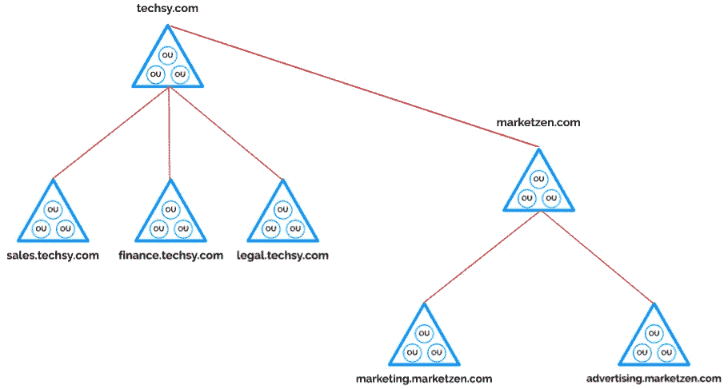

森林的例子。

Active directory 林还维护一个称为全局目录的数据库。 ***全局目录*** 是一种超级目录，它包含了一个目录林中所有对象的信息，与域无关。然后，如果在当前域中找不到用户帐户，将在全局目录中搜索该帐户。全局目录提供了对定义帐户的域的引用。

# 活动目录动手实验

为了获得一些实践经验，我将使用名为“ ***活动目录基础知识*** ”的 [TryHackMe](https://tryhackme.com/room/activedirectorybasics) 工作室。我在 TryHackMe 中启动了基于浏览器的机器。几分钟后，我的机器启动了，我看到了[服务器管理器管理控制台](https://docs.microsoft.com/en-us/windows-server/identity/ad-ds/manage/ad-ds-simplified-administration)。我可以看到安装了服务器角色 AD DS，这意味着这台计算机是 DC。

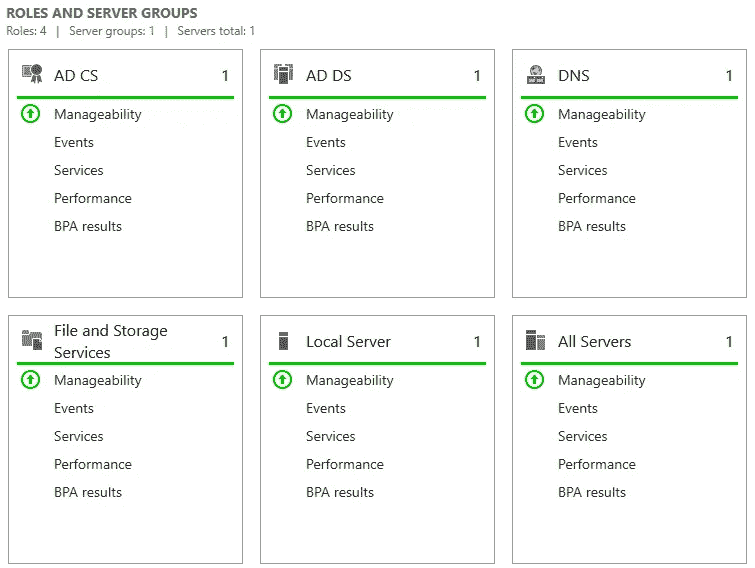

服务器角色。

我还可以看到安装了 [**Active Directory 证书服务(AD CS)**](https://social.technet.microsoft.com/wiki/contents/articles/1137.active-directory-certificate-services-ad-cs-introduction.aspx) 角色，该角色为颁发和管理公钥基础设施(PKI)证书提供可定制的服务。还安装了 **DNS** 服务器角色，这是 AD DS 在安装时需要的。我可以通过导航选项卡上的**工具**链接找到更多信息。

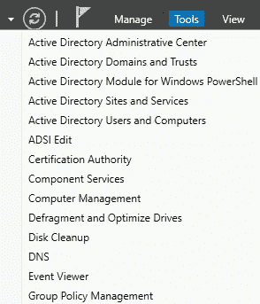

服务器管理器工具。

如果我选择“ *Active Directory 用户和计算机*，我可以看到安装 AD DS 时存在的默认 OU 列表。

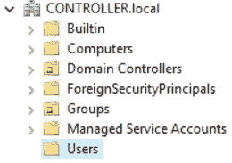

组织单位。

在 ***用户*** 中“默认 OU”为新用户和组，我可以得到该域上所有用户的列表。在下图中，我们可以看到两个默认用户(即管理员和来宾)以及由域管理员创建的其他用户。您可能还发现了 SQL 服务用户的密码在描述中被公开。

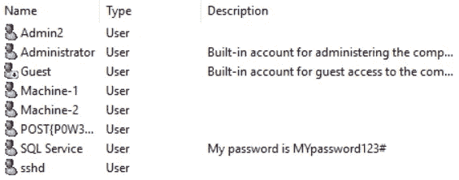

域用户。

我可以检查每个用户的属性，并查看他们被分配了哪些组。例如，“ *SQL 服务*用户帐户，其密码在描述中公开，具有管理员特权(不太安全😬！).

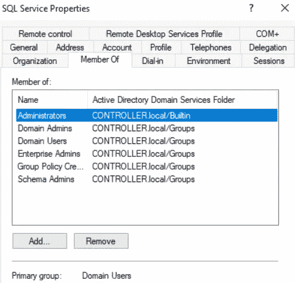

SQL Services 用户帐户组成员身份。

如果我选择“*活动目录域和信任关系*”，我可以看到计算机的 FQDN 是“ ***CONTROLLER.local*** ”，我还可以检查存在什么信任关系，在本例中是没有。该信息也应位于“ *Active Directory 用户和计算机*”下。

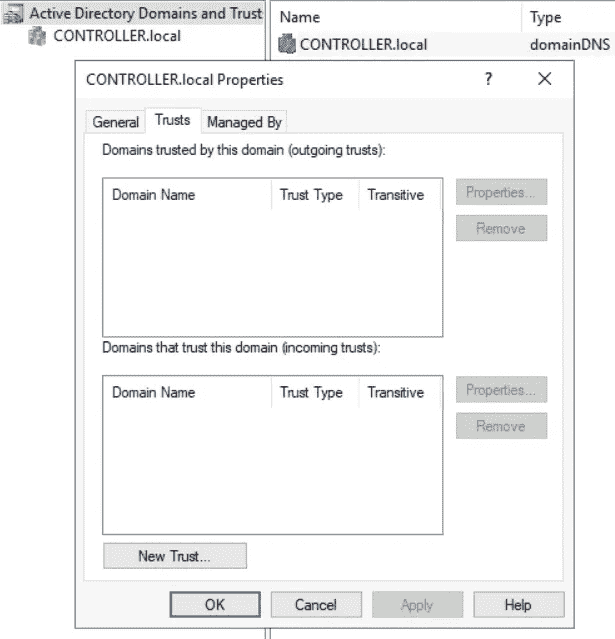

域名和信任关系。

## PowerShell

PowerShell 也可以用来查看活动目录的内部设置。 [**PowerView**](https://book.hacktricks.xyz/windows-hardening/basic-powershell-for-pentesters/powerview) 是一个方便的 PowerShell 工具，可以用来在渗透测试中执行 DC 的枚举。要使用 PowerView，我们可以导航到存储 PowerShell 脚本的位置，加载一个绕过执行策略的 PowerShell，并导入 PowerView 模块。

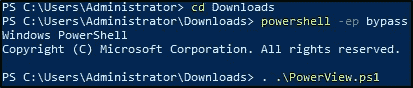

导入 PowerView 模块。

我们现在可以收集与前面看到的相同的信息，但是要使用 PowerShell。在列出域用户时，我可以看到之前没有列出的另一个用户(即“ *krbtgt* ”)。

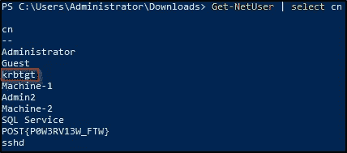

PowerShell 列出的域用户。

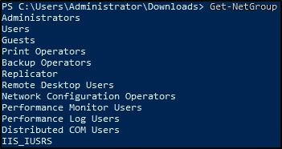

PowerShell 列出的域组。

这只是您使用 PowerView 可以收集的信息的皮毛，值得您自己花时间进一步探索。

# 结束语

希望这篇关于 Active Directory 的短文有助于提供它是什么以及它如何工作的基本概述。Active Directory 是一个值得深入了解的大话题，被大多数大公司广泛使用。谢谢你看完，继续黑！😄