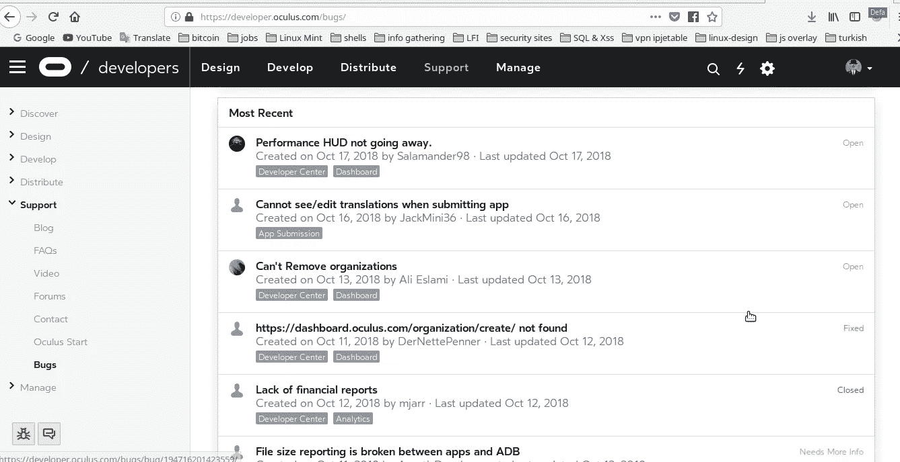
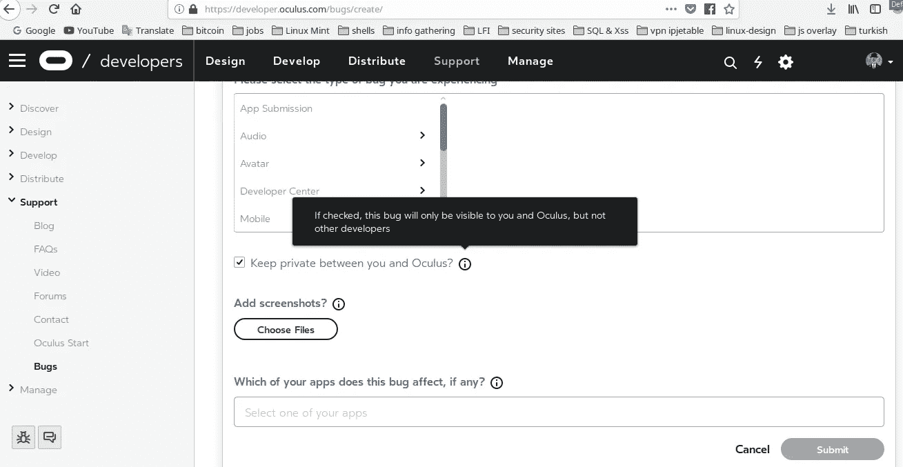
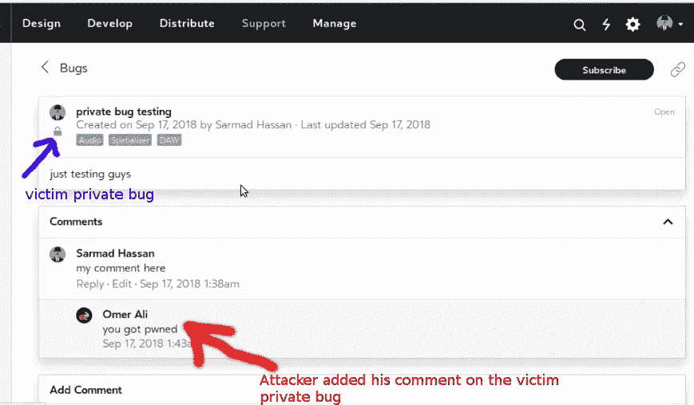
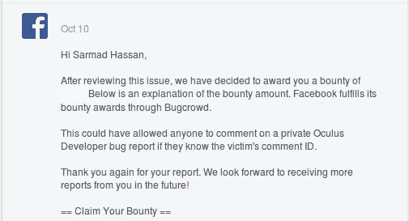

# 添加对 Oculus 开发者私人错误报告的评论

> 原文：<https://infosecwriteups.com/add-comment-on-a-private-oculus-developer-bug-report-93f35bc80b2c?source=collection_archive---------0----------------------->

大家好，这一次我想和大家分享我是如何在 Oculus 开发者支持上的私人错误报告中添加评论的，所以让我们开始吧。:)

# **什么是 Oculus**

Oculus VR 是一家美国科技公司，由 Palmer Luckey、Brendan Iribe、Jack McCauley、Michael Antonov、Nate Mitchell 于 2012 年 7 月在加州尔湾创立，现在由脸书拥有**更多详情见此 [**链接**](https://en.wikipedia.org/wiki/Oculus_VR) 。**

# **寻找的故事**

几个月前我已经测试了 oculus，但没有发现任何 bug。然后在 9 月 17 日，我决定再次测试它，所以在四处闲逛 [**Oculus 开发者域**](https://developer.oculus.com) 时，我注意到一个名为**报告 Bug、**的选项，用户可以在这里向 Oculus 支持团队提交他们的 Bug(不是安全 Bug)。

这是支持仪表板的样子，你可以看到其他用户的公共错误。

当我看到这个选项时，我决定测试它，但在此之前，让我们看看这个选项是如何工作的，让我们来分析一下:)

# 分析阶段

在分析这个选项时，我注意到以下情况:

*   用户可以通过两种方式提交 bug，公共 bug 和私有 bug。
*   在公共 bug 中，任何人都可以添加评论或回复其他评论。
*   在私有 bug 中，除了 bug 的所有者和支持团队，没有人可以添加评论。
*   从其他用户的角度来看，私有 bug 不会出现在仪表板中。

如上所示，你可以通过勾选“保留私有选项”来将你的 bug 设为私有

# **测试阶段**

我创建了一个公共 bug，并在我的 bug 中添加了注释，之后我回复了我的注释，并用 burpsuite 拦截了请求，以查看我们在这个选项中有什么样的参数，请求如下所示:

> POST /graphql？locale=user HTTP/1.1
> 主机:graph.oculus.com
> 
> access _ Token = My-Acces-Token & variables = { " input ":{ " client _ mutation _ id ":" 1 "，**" comment _ parent _ id "**:" 556190998150906 "，**" external _ post _ id "**:" 548709645565708 "，" message ":" what ever " } }&blabla

正如您在上面看到的，我们有两个有趣的参数:

1-**“comment _ parent _ ID”**= =>指我的 bug ID(你可以从 URL 链接中找到任何公开的 bug ID 为[https://developer.oculus.com/bugs/bug/your-bug-ID/)](https://developer.oculus.com/bugs/bug/your-bug-ID/))。

2-**“external _ post _ id”**= = =>是指我回复给它的评论(我的评论)的 ID。

当我看到上面的要求**时，我想到了两个计划【T30:)**

**计划 A :** 我想通过把我的 bug ID 替换成其他用户的 bug ID 来添加对其他用户私有 bug**的评论，**但是没用:(

**计划 B:** 我想通过将 **external_post_id** 值替换为其他用户值**来添加对其他用户私有 bug 的评论，这是他们在私有 bug** 中的评论 id，我创建了两个测试帐户来重现这一点，这非常有效，我绕过了他们的保护，因为他们只检查 **bug ID** 而不是 **external_post_id(评论 ID)。我在 A 计划阶段就知道 B 计划会成功，别问我怎么成功的！！，我就是感觉到了。**

攻击者绕过 oculus 保护，并在受害者私有 bug 上添加评论。

# **缺陷限制**

这个 bug 只有一个限制，问题是**攻击者如何从其他用户的私有 bug 中获取评论 ID**因为他们的 bug 被设置为私有，正如我之前提到的，除了 bug 的所有者和支持团队，没有人可以看到私有 bug！！！这确实是一个好问题，是的，这很难发现，但并非不可能，假设有人能够披露其他用户的评论 id，或者攻击者可以列出随机评论 id，可以进行随机攻击，并将他的评论添加到随机的私人错误中，谁知道呢？一切皆有可能:)，我也可以说修复这种错误总是正确的事情。

我直接向**脸书安全团队**报告了这个 bug，并认为它是有效的 bug。

我要感谢脸书安全团队的赏金。

**时间表:**
2018 年 9 月 17 日—初始报告
2018 年 9 月 19 日—报告已分类
2018 年 10 月 5 日—错误已修复
2018 年 10 月 5 日—修复已确认
2018 年 10 月 10 日—奖金已发放

**概念验证视频:**

**武道:**

1-试着像往常一样不时检查你的目标。

2-了解 web 应用程序。工作以及你有什么权限。

3-要有创意:)。

谢谢你

萨尔马德·哈桑 ( [朱巴巴格达](https://twitter.com/JubaBaghdad))