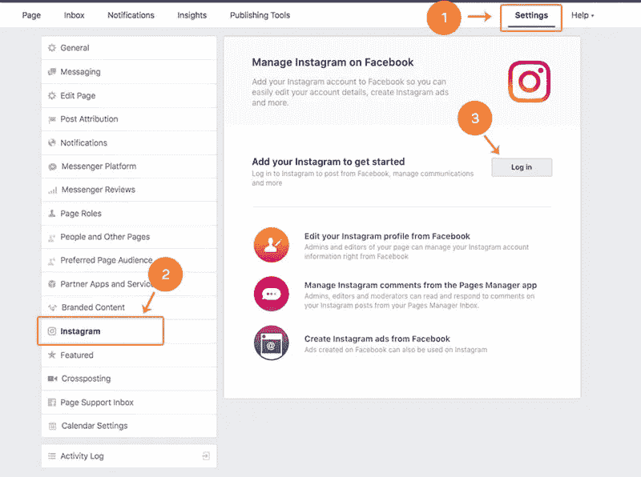
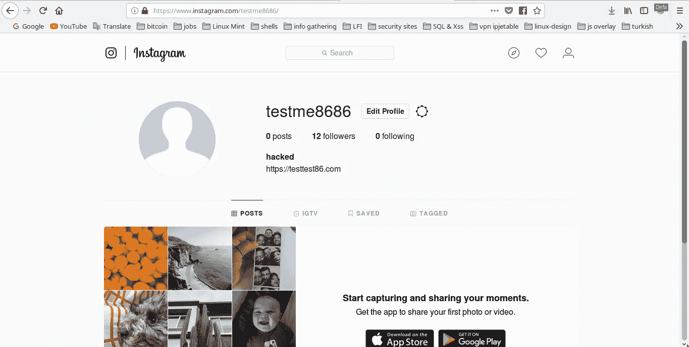
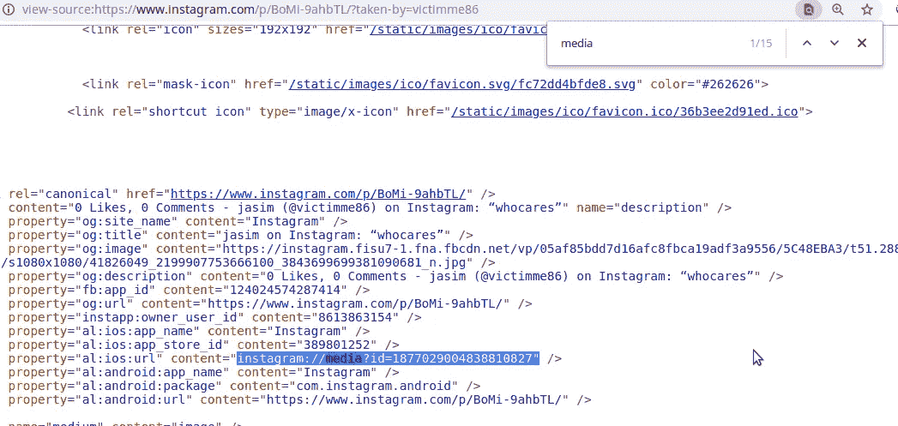
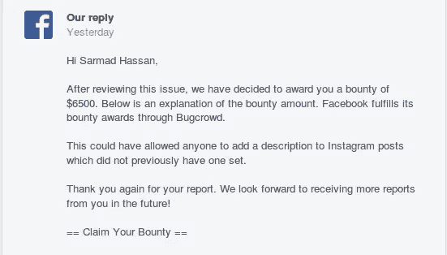

# 代表其他用户向 Instagram 帖子添加描述- 6500 美元

> 原文：<https://infosecwriteups.com/add-description-to-instagram-posts-on-behalf-of-other-users-6500-7d55b4a24c5a?source=collection_archive---------0----------------------->

大家好，又到了 [**朱巴巴格达**](https://twitter.com/JubaBaghdad) 了，今天我想和大家分享我在 Instagram 上发现的一个有趣的 bug，它让我能够给其他用户的帖子添加描述，你准备好了吗！！:)

# 寻找的故事

在 2018 年 8 月 6 日，我想到了一个主意，我想从脸书页面绕过 Instagram 的双因素认证 [**(2fa)**](https://help.instagram.com/566810106808145) ，因为脸书页面上有一个选项允许你管理 Instagram，更多详情请参见此 [**链接**](https://www.facebook.com/business/help/898752960195806) 。

我切换到我的**脸书测试页面**点击 Instagram 选项卡，尝试使用我的旧 Instagram 帐户登录，但我无法登录，因为我像往常一样忘记了密码:)

你可以从你的脸书页面管理你的 Instagram 账户

之后，我从我的 [**网络浏览器**](https://www.instagram.com/) 打开 Instagram，查看我的账户是否仍然存在，我看到了这个:

这是你从网络浏览器打开 Instagram 时的样子

如果你看上面的图片，也许你不会注意到任何有趣的事情，但对我来说，这真的很有趣！！为什么！！因为我已经测试过 Instagram web app 了。之前我有一个习惯，那就是记住选项和功能，这样我就可以很快注意到任何新功能，再看看上面的图片，你会看到有一个有趣的选项，叫做 **IGTV** 。

**什么是 IGTV:**

IGTV 是一项新功能，用于观看您最喜爱的 Instagram 创作者的长格式垂直视频，更多详情请参见此 [**链接**](https://instagram-press.com/blog/2018/06/20/welcome-to-igtv/) 。

从 [**Instagram Info Center、**](https://instagram-press.com/) 看了很多关于这个功能的东西，决定测试一下:)

所以我创建了一个 **IGTV 视频**，一旦我创建了它，我就点击编辑选项并用 burpsuite 拦截请求**以查看该功能中的参数，我看到了这个:**

> POST/media/1887820989027383407/edit/
> 
> **标题=** 测试&发布 _ 模式=igtv & **标题=** 测试

好了，让我们分析一下上面的请求，看看我们手里有什么:

1-**media id**= 1887820989027383407 = = =>是我的 IGTV 视频的 ID，我搜索了一下 **media ID** ，注意到 Instagram 是指任何带有 **media ID** 的帖子(照片、视频和 IGTV 视频)，我可以通过访问他们的帖子并查看源代码来获得其他用户帖子的任何媒体 ID:

你可以从源代码中获得任何文章的媒体 ID

2-获取**媒体 ID** 的另一种方法，只需访问用户帖子，点击 like 并用 burpsuite 拦截请求(我在我的 PoC 视频中使用了它)。

3-参数(**标题&标题)**

当你在 Instagram 中创建任何照片或视频时，网络应用程序会要求你为照片或视频添加描述(**这是可选的，你可以像数百万用户一样将其留空:)**，在 **IGTV** 中，标题也指描述。

酷，我们得到了所有我们想要的信息，接下来呢！！

如果你注意到了上面的请求，我们有**媒体 ID** ，所以**作为一个 bug 猎人**当然我们会尝试欺骗 Instagram 服务器，将媒体 ID 更改为另一个用户媒体 ID，看看**我们能否欺骗**系统，并代表他们向其他用户的帖子添加描述！！？？

# 检验阶段

在我的另一个测试账户上测试时，我注意到以下情况:

*   我可以给其他用户的帖子添加描述**(通过用他们帖子的媒体 ID 替换我的媒体 ID)** ，如果他们没有给他们的帖子添加任何描述。
*   它适用于所有类型的帖子，如照片、视频和 IGTV 视频。
*   它只对公共账户有效。
*   最奇怪的是，响应给了我**一个内部服务器错误**和一个错误消息**“哎呀，发生了一个错误”**，但是相反，这个错误工作得很好，你会在下面我的 **PoC 视频**中看到。

# **为什么这个 bug 如此危险**

*   Instagram 上的许多用户(数百万账户)将他们的个人资料设置为公开。
*   如果我们在任何一个公众账号上搜索，我们可以找到至少一个没有描述的帖子，这使得这个 bug 可以在数百万个账号上运行。
*   如果这个 bug 在坏人(黑帽)手里，他可以针对**最受关注的 _Instagram_accounts** 见此 [**链接**](https://en.wikipedia.org/wiki/List_of_most-followed_Instagram_accounts) 。
*   包括名人在内的大多数 Instagram 用户都容易受到这个 bug 的影响，因为他们过去常常在不添加描述的情况下发布帖子，例如:

**马克·扎克伯格**= = =>460 万追随者== > 参见他的 [**帖子**](https://www.instagram.com/p/aw9oRSQec-/?taken-by=zuck)

**赛琳娜·戈麦斯**= = =>1.4 亿关注者=== >参见她的 [**帖子**](https://www.instagram.com/p/BlMksIrgMqe/?taken-by=selenagomez)

**爱莉安娜·格兰德** ==== > 125 万关注者== >见她的 [**帖子**](https://www.instagram.com/p/BmT2ESrHPSh/?taken-by=arianagrande)

**碧昂斯** ===== > 117 百万粉丝==== >看她的 [**帖子**](https://www.instagram.com/p/BmI3AWyFVp7/?taken-by=beyonce)

**金·卡戴珊** === > 115 百万追随者== >参见她的 [**帖子**](https://www.instagram.com/p/Bl56N3UF3FH/?taken-by=kimkardashian)

**莱昂内尔梅西** :)==== > 97 百万追随者=== >见他的 [**帖子**](https://www.instagram.com/p/Bj2iTmAndC8/?taken-by=leomessi)

名单是如此之长:)，所以想象一下**高 bug** 像这样在一个坏人手里，它可能会导致一个针对名人的大媒体炒作，或者在像**苹果**和它的竞争对手**三星** :) 等巨头公司之间制造大问题。

我直接向**脸书安全团队**报告了这个 bug，他们仅在一天之内**就修复了它**，由于 bug 的严重性，修复如此之快，他们还奖励了我 6500 美元的巨额奖金

我要感谢脸书安全团队的慷慨解囊。

我还要感谢我的朋友[**Kassem Bazzoun**](https://www.facebook.com/Kassembazoun)对我这个 bug 的巨大支持和帮助。万分感谢兄弟。:)

**时间线:**
八月。2018 年 06 月—初步报告
8 月。2018 年 14 日—报告审判
8 月。2018 年 15 日— Bug 修复
八月。2018 年 15 日— Fix 确认
10 月。10，2018–奖励 6500 美元

**PoC 视频:**

**武道:**

*   不要只依赖于响应，有时它会给你一个错误，但相反你的错误会起作用，我知道当我几个月前看到我的朋友 **Abdellah Yaala** 的一个视频时，看到他的 [**视频**](https://www.youtube.com/watch?v=DvNHjh0EJNs)****1:22**，所以你必须从 web 应用程序检查你正在测试的内容。也是。**
*   **试着不时地检查你的目标，检查是否有任何新的选项或功能(当有新的功能时，就有新的错误)。**
*   **试着记住你的目标选项，它会让你像我一样快速识别任何新选项:)。**

**谢谢你**

**萨尔马德·哈桑**