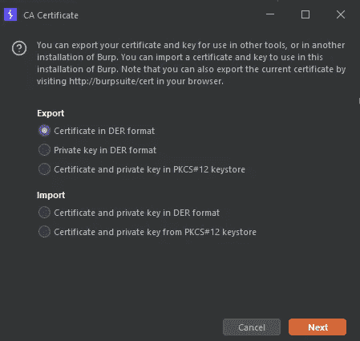
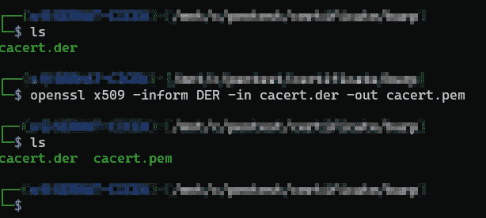
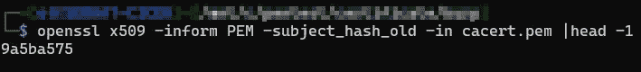
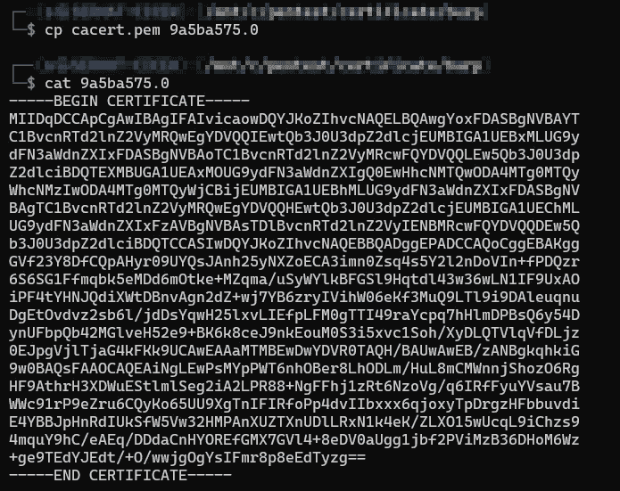
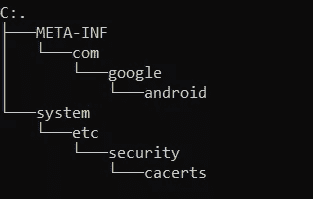
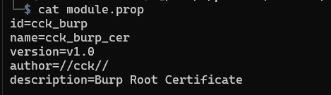
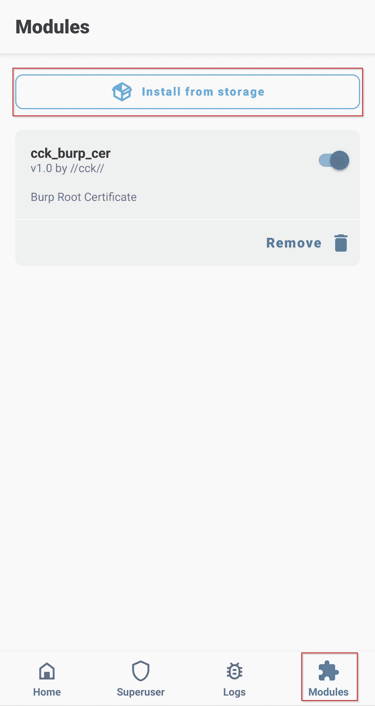

# 使用 Magisk 模块向 Android 添加根证书

> 原文：<https://infosecwriteups.com/adding-root-certificate-to-android-with-magisk-module-92493a7e9e4f?source=collection_archive---------5----------------------->

Android Pentesting

为了在 android 应用程序中执行动态渗透测试，我们需要绕过 sslpinning 安全措施。为了规避这一措施，有必要在 android 系统的根证书中添加 Burp Suite 证书。

用 Magisk 在有根的 android 设备上安装根证书非常容易。这个过程包括几个步骤。

## 导出 burp 套件证书

我们需要转到 Burp suite 工具中的“选项”选项卡，然后单击“导入/导出 CA 证书”按钮。

出口证明书

在”中导出证书后。der "格式，我们需要再执行几个步骤。

创建 X.509 证书表单”。der "文件:

*OpenSSL x509-通知 DER-in cacert . DER-out cacert . PEM*

用 openssl 创建 X.509

创建 pem 文件后，需要计算 x509(pem)文件的哈希值:

*OpenSSL x509-inform PEM-subject _ hash _ old-in cacert . PEM | head-1*

计算哈希

应该使用此输出值创建扩展名为. 0 的文件。Pem 文件应该导出到此“. 0”文件。

正在创建“. 0”

> 重要提示:您的哈希值和证书可能与上面的图片不同。

## 创建 Magisk 模块

有必要使用来自这个 [github repo](https://github.com/NVISOsecurity/MagiskTrustUserCerts) 的信息来创建 Magisk 模块。生成的证书的结构应该是这样的。

Magisk 模块结构

应该将创建的“. 0”扩展名文件移动到“/system/etc/security/cacerts”文件中。主目录中的 module.prop 文件包含有关该模块的信息。

模块.属性文件

该文件的内容可以更改。

/META-INF/com/Google/Android/update-binary 文件的内容应该如下所示。

## 安装 Magisk 模块

完成这些操作后，需要安装 magisk 模块。首先，需要将 magisk 文件存档为 zip 格式。

有必要创建包含主目录的 zip 文件。当 zip 文件打开时，module.prop、META-INF 和系统文件应该可以直接查看。

创建 zip 文件后，我们可以通过 magisk 安装我们创建的模块。

