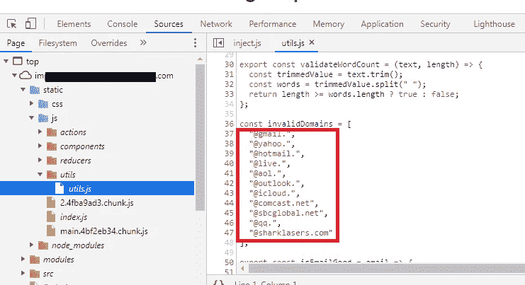
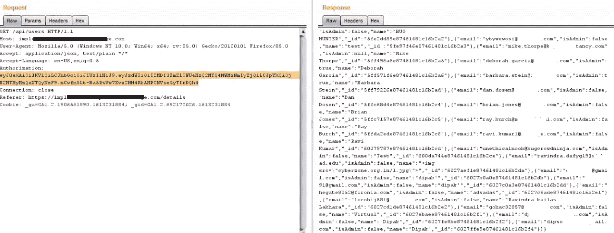
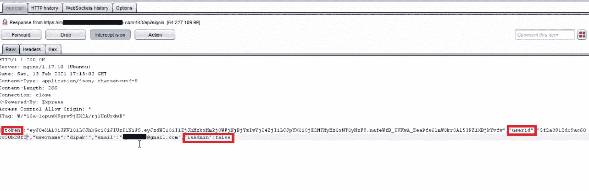

# 管理员权限！！

> 原文：<https://infosecwriteups.com/admin-access-799b50694965?source=collection_archive---------0----------------------->

大家好！我希望你一切都好！在这篇文章中，我将告诉你我是如何成为管理员的低权限用户的。所以不要再拖延了，让我们开始吧。

我在搜索 Bugcrowd 的私人程序。该公司提供云安全、网络安全等服务。(与网络安全相关)。我开始侦查，测试了 2-3 个域名，但一无所获。我搬到了另一个子域。那个子域是电子商务的类型。我们可以购买软件等等。我在测试登录页面的功能。创建帐户时进行了验证。

JS 验证

因此，我键入[something@example.com](mailto:something@example.com)并在点击提交按钮时拦截请求。我把 example.com 改成了 gmail.com，并转发了请求。我登录后，也没有电子邮件验证。

然后我开始玩打嗝历史。我得到了 sub.redacted.com/api/users 的**。我把它发送到中继器点击 go，得到了 **401 未授权**。我检查了其他请求，发现缺少授权标题。**

****

**有些东西不见了…**

**我复制了带有值( [**JWT**](https://jwt.io/) )的授权头。我得到了所有用户和 bug 猎人的信息，他们也在测试同一个网站，甚至是管理员。现在我可以看到他们的名字，电子邮件，ID，是否是管理员(JSON 格式)。有意思…**

****

**我再次登录网站拦截请求，检查它的响应。作为回应，管理参数引起了我的注意。该参数类似于 **IsAdmin:false** 。我将其更改为 true，并转发请求，关闭拦截。现在我是管理员。我试图找到另一个可以由管理员执行的错误。但是没有什么太考验人的。没有伊多、XSS、CSRF 等。**

****

**我试着和 JWT 一起玩。我破译了它。有一些值，如 email、ID 和 IsAdmin？正如你所知，我得到了所有用户的信息，我选择了第一个管理员的详细资料，并用我的价值观和创造 JWT 取代。现在，我再次登录另一封电子邮件，拦截请求并检查响应，我替换了我的 JWT，创建并粘贴它并转发请求。有用！因此，我可以执行管理访问响应操作和 JWT 攻击。就是这样。继续狩猎。继续分享！！**

****

**我有管理权力**

**Instagram: [th3.d1p4k](https://www.instagram.com/th3.d1p4k/)**

**推特:[迪帕克·潘查尔](https://twitter.com/DipakPanchal05)**