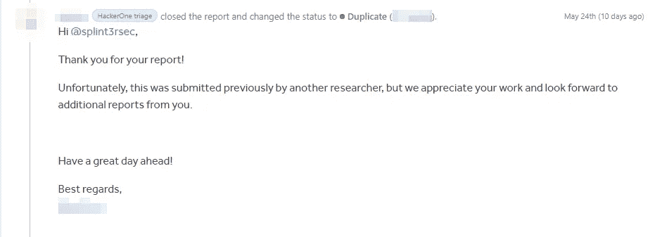
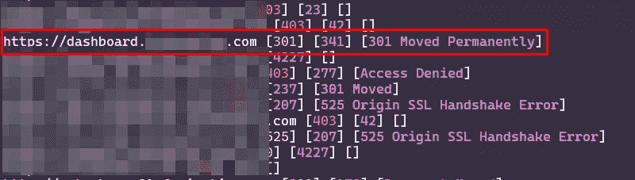
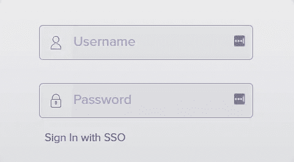
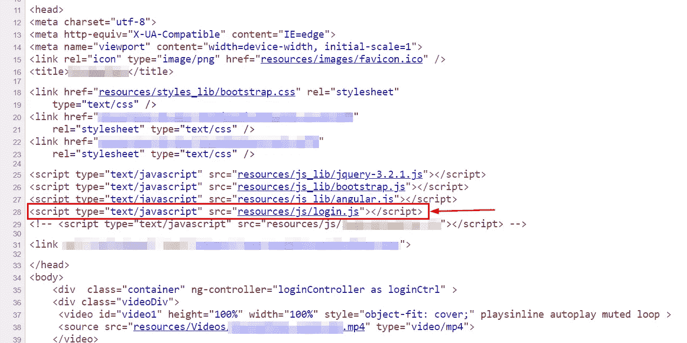
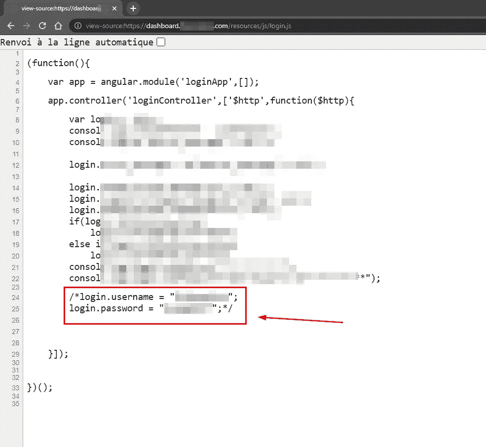
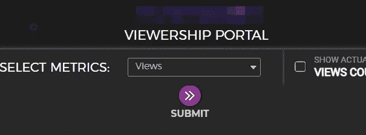

# 管理面板？Pwned！

> 原文：<https://infosecwriteups.com/admin-panel-pwned-89db333f3836?source=collection_archive---------0----------------------->

## 不可阻挡的侦察力量

大家好，欢迎来到我写的第一篇文章，讲的是一个有趣的故事，讲的是如今一些管理员是如何保存密码的。

在你开始阅读之前，我想提一下，这个发现是作为一个重复被关闭的，所以向第一个报道它的研究者致敬！

# 侦察阶段

在 HackerOne 上挑选了一个目标后(不会透露)，我开始了我的子域枚举…对于这一步我不喜欢把事情复杂化，我只是按照大家收集子域的做法(这我不推荐，总是尽量和别人不一样，以免被骗 lol)。以下是我的工作流程:

**Assetfinder + subfinder →带标题、状态码和内容长度的 httpx】**

所以我得到了大约 60 个活着的独特的子域名，太棒了:)！让我们开始主动枚举…

# 子域分析

有经验的 bug 猎人告诉我，不需要截图就可以检查子域，标题和状态码加上内容长度已经足够完成这项工作了，而且效率更高，因为你不会得到空白截图或重定向，可能会错过一些东西…

向下滚动子域名列表，我看到其中一个引起了我的注意

有趣的子域！

嗯……【dashboard.redacted.com】T2 和一个 **301 重定向**状态触发了我内心的声音；1 分钟的快速检查不会伤害你。我的意图是拦截重定向，并在那里做一些魔术，但当我打开网址，不，这不是你可以测试你的魔术，我得到了一个管理员登录页面。

登录面板

# Pwn 阶段

起初，我做了你们每个人都会做的事情，我开始猜测默认凭据，寻找隐藏的未赋值参数(XSS)，注入单引号和双引号(SQLi)…但是没有任何效果:/

没关系，现在下一步是你们大多数人不会做的，阅读源代码:)我强烈建议你每次访问一个端点时都这样做，正如我内心的声音早先所说的“*一分钟的快速检查不会伤害你:)*”有时你会感到惊讶。

好吧，让我们检查源代码

当然，在查看 javascript 文件之前，我不会关闭窗口并检查另一个子域！另外，它的名字应该真正引起你的注意。所以我去看了文件，你猜怎么着？

将您的凭证存储在 javascript 注释中？我不认为它们是有效的，让我看看…

Pwned :D

我们成功地 pwn 了我们的管理员:D

请注意，我不能截图整个仪表板，因为你可以很容易地从它的设计猜测公司…

我试图在仪表板中挖掘更多信息，以检查他们是否有上传端点或什么的，但什么都没有，你所能做的就是查看数据并下载它。

# 关键要点

*   永远不要低估侦察的力量，只要不浪费时间，适当地去做，你一定会得到一些结果。
*   不要错过阅读源代码，尤其是 javascript 文件，你可能会得到凭证，API 密钥，甚至敏感的隐藏端点…只是继续寻找，并打开你的眼睛！
*   永远相信你的直觉，潜意识是基于你以前的经验和你作为一个 bug 猎人的工作流程阶段而被触发的。
*   正确地黑客和永不放弃，我没有在这个副本后，得到了一个非常好的 bug triaged，一旦它被披露，我会与你分享。

如果你喜欢读我的第一篇文章，把它分享给你的朋友，并提醒他们阅读 JS 文件:)

谢谢你读到❤的这一部分，直到下一篇！

[https://twitter.com/splint3rsec](https://twitter.com/splint3rsec)