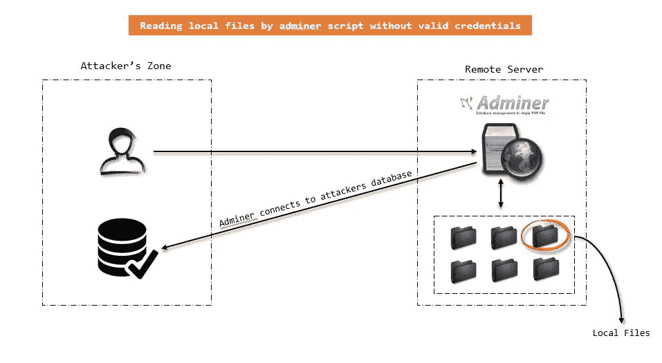
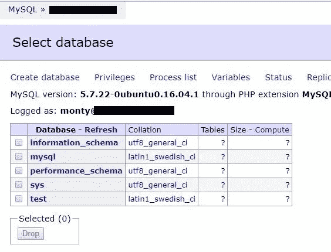
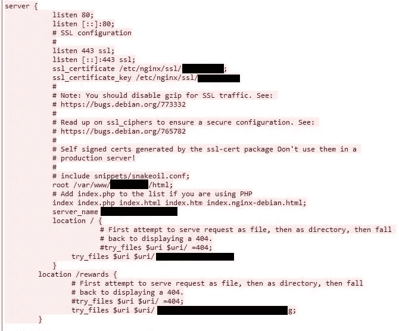
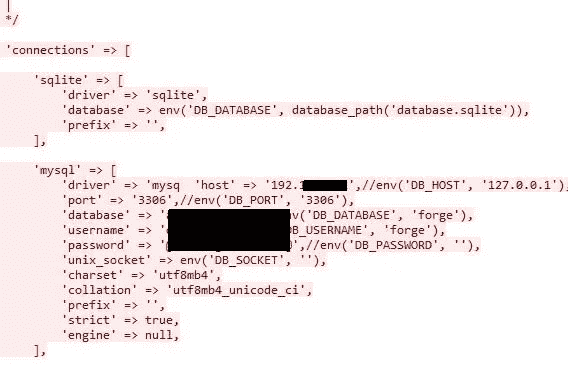

# 管理员脚本结果到 Pwning 服务器？私人昆虫赏金计划

> 原文：<https://infosecwriteups.com/adminer-script-results-to-pwning-server-private-bug-bounty-program-fe6d8a43fe6f?source=collection_archive---------0----------------------->

如果一个[管理员](https://www.adminer.org/)脚本留在服务器上，很可能这个服务器很快就会被典当掉。在这个故事中，我想介绍一种技术，以便在没有有效凭证的情况下利用管理员脚本。

# 侦察

虽然之前我参加了一个私人的 bug bounty 计划(在这个故事中，让我们命名为域`milk.tld`),我做了一些脚本，子域查找器等侦察，揭示了几个子域，其中之一是`support`重定向用户到主域。我通过以下语法由 [wfuzz](https://github.com/xmendez/wfuzz) 执行了一个动作暴力:

```
https://support.milk.tld/FUZZ
```

终于找到了`/login`端点。我测试了页面上太多的向量，但没有发现任何缺陷。后来，我用一些字表用 [wfuzz](https://github.com/xmendez/wfuzz) 对文件名进行了一次暴力破解，发现了一个名为`connect.php`的有趣文件，打开后，我看到了 adminer.php 脚本。


常见的情况是暴力攻击，我做了，但一无所获。

# 攻击媒介

受以下文章的启发:

> [https://w00 tsec . blogspot . com/2018/04/滥用-MySQL-local-infile-to-read . html](https://w00tsec.blogspot.com/2018/04/abusing-mysql-local-infile-to-read.html)
> 
> [https://phonexicum.github.io/infosec/sql-injection.html](https://phonexicum.github.io/infosec/sql-injection.html)

我设计了一个攻击场景:

1.  在公共 IP 地址内设置 MySQL 服务器
2.  将 adminer 连接到 MySQL 服务器(现在用户已经登录到 adminer)
3.  通过`read data local infile`命令读取本地文件，将结果插入表中



# 袭击

只是填写了我之前设置的服务器地址和凭证的 adminer 登录表单。已成功登录。



从客户端读取文件的正确 MySQL 命令是

```
LOAD DATA LOCAL INFILE '/etc/passwd' 
INTO TABLE test.test
FIELDS TERMINATED BY "\n"
```

结果是:


是啊！我有能力通过`mysql`用户读取文件。我去读了 Nginx 配置文件。由于每个站点在`/etc/nginx/sites-enabled/`中都有一个配置，但是我不知道文件名。我根据公司名称创建了一个列表，并开始强行输入名称。幸运的是，我找到了配置文件(文件名是`mil.tld`，与原始域名相比只差了一个字母，没有`.conf`扩展名):

```
/etc/nginx/sites-enabled/mil.tld
```

结果是:



我想要的只是一条路。读取`index.php`确认门户已被 [Laravel](https://laravel.com/) 写入。打开`database.php`显示了数据库的连接凭证:



我得到了所有数据库内的凭证显示。我用证书连接到管理员，因此，我有数据库。不幸的是，用户没有`FILE`权限，所以我没有通过`into outfile` MySQL 查询完成上传 shell 脚本。然而，主要的一点是关于管理员脚本，这可能会导致在类似的情况下典当服务器。与 [phpMyAdmin](https://www.phpmyadmin.net/) 相比，Admin 不太安全，因为它有 host 字段，这使得黑客在认证前进行了几次场景攻击。作为一个例子，揭示 CDNs 背后的服务器的真实 IP 地址为 [Cloud-flare](https://blog.christophetd.fr/bypassing-cloudflare-using-internet-wide-scan-data/) 。