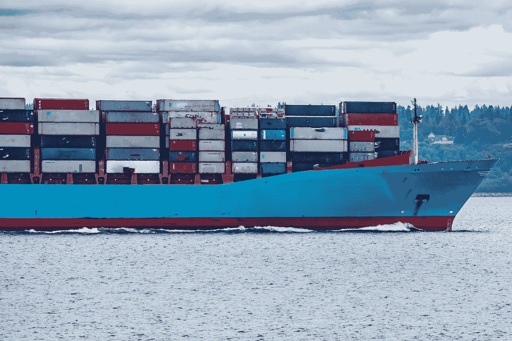
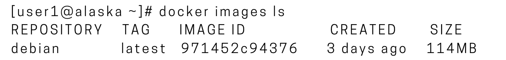
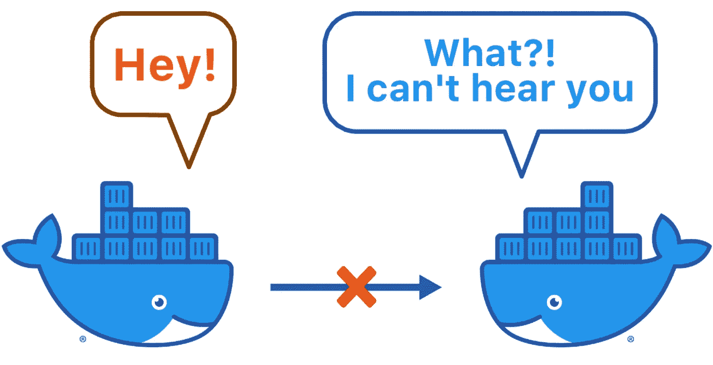
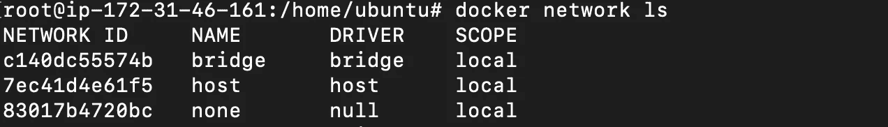
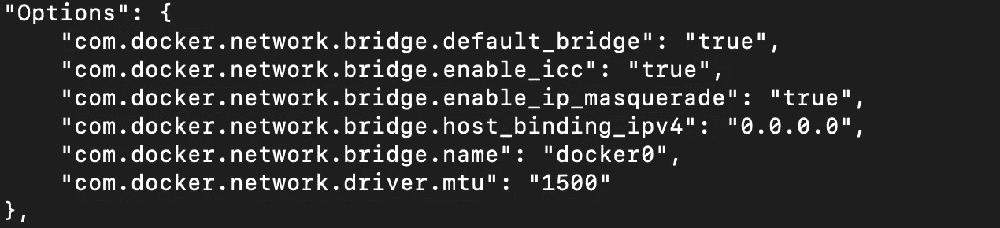
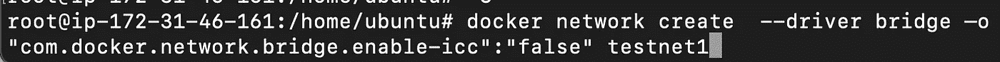
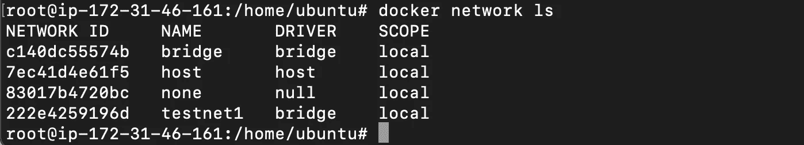

# 高级 Docker 安全性

> 原文：<https://infosecwriteups.com/advanced-docker-security-2ef31ac7547f?source=collection_archive---------0----------------------->



[伊恩·泰勒](https://unsplash.com/@carrier_lost?utm_source=medium&utm_medium=referral)在 [Unsplash](https://unsplash.com?utm_source=medium&utm_medium=referral) 上拍照

在当今世界，开发应用程序不仅仅需要编写代码。多种语言、框架和架构的使用，以及开发生命周期每个阶段的工具之间不连续的接口，导致了巨大的复杂性。Docker 简化并加速了您的过程，同时让开发人员有机会根据自己的需求，利用自己喜欢的工具、应用程序堆栈和每个项目的部署环境进行创作。

**简介**

Docker 让运营团队可以轻松地直接部署应用和网站，而不必担心依赖性、配置设置或服务器上安装的软件包版本。因为它简单到只需从注册表中获取图像并用一个命令执行它(docker run ),我们经常没有意识到它需要与任何其他实体相同的安全级别。

我们已经写了几篇关于 docker 安全最佳实践的文章，可以在[这里](https://medium.com/codex/docker-essentials-security-2ecf07e80966)和[这里](https://medium.com/codex/everything-about-docker-security-ba2e46afd0e2)找到。

在这篇博文中，我们将介绍一些关于 Docker 安全性的更高级的概念，如果您正在使用多个容器、想要防止权限提升等，这些概念肯定会有所帮助。

**诺登录外壳**


诺洛金壳

Docker 容器可以容纳多个用户帐户。Root 帐户是用户在容器中可以获得的最高权限，一旦他拥有 root 权限，他就可以实际执行 root 命令，或者在容器中执行更多操作。为了确保恶意用户不会升级到 root 帐户，即使他可以访问 root 帐户的密码，您也可以将 shell 更改为 **nologin** 。或者，您也可以为用户使用受限的 shells。要禁用 root 登录(在容器内部)，您所要做的就是修改 docker 文件并添加以下行。

```
**RUN chsh –s /usr/bin/nologin root**
```

nologin shells 用于拒绝对帐户的登录访问。这一行将确保即使恶意用户获得了根用户的帐户，他也无法登录，因为它在 nologin 文件中被拒绝，因此没有用户，甚至根用户都无法登录到他的帐户。

**使用 SUID 禁用权限提升**

在我们谈论缓解技术之前，我们应该理解什么是 SUID。SUID 代表**在执行时设置所有者用户 ID**是给予文件的一种特殊类型的文件权限。如果根用户将此权限授予可执行文件，则该权限可用于提升根用户的权限。根用户设置 SUID 位所要做的就是键入

```
chmod +x <binary_name>
```

这些在野外被利用来提升 docker 容器中的特权。为了防止这种情况，您可以在旋转 docker 容器时使用一个特殊的标签**—security-opt = " no-new-privileges**。

这个标记确保进程和子进程(由父进程产生)不会因为使用 SUID 或 SGID 位而获得任何额外的特权。

举个例子，

```
docker run –it <image_id> --security-opt=”no-new-privileges" /bin/bash
```

**注意**:这里 image_id 是你的 docker 容器的图片的 id。要找到容器的图像 id，只需输入 **docker 图像 ls**



docker 图像 ls

**创建只读文件系统**

只读文件系统确保用户不能在系统中创建任何文件。这将防止他们在 docker 容器中下载和安装恶意文件，这些文件可进一步用于其他恶意目的，如恶意软件、键盘记录器或 back connect shell。因此，通过创建一个只读文件系统来保护 docker 免受未经授权的访问是非常重要的。

要创建只读文件系统，我们可以使用以下命令

```
docker run --read-only –it <image_id> /bin/bash
```

可以理解，没有写权限的容器可能会给用户带来一些不便。所以，你能做的就是建立一个临时文件系统。在这个例子中，我为临时文件系统选择了我的 **/opt** 目录。因此，用户将只能下载指定目录中的文件，而不能将它们移动到主目录或任何其他目录。这可以通过运行以下命令来实现。

```
docker run --read-only --tmps /opt -it <image_id> /bin/bash
```

**阻止集装箱间通信**



[来源](https://maximorlov.com/4-reasons-why-your-docker-containers-cant-talk-to-each-other/)

一旦在生产环境中设置了 Docker，安装多个容器是很正常的，因为它们负责不同的活动。例如，您可能在一个容器中使用 MongoDB，而在另一个容器中托管应用程序。但是，您知道跨容器通信是可能的吗？以下场景:运行通过端口暴露的应用程序的易受攻击实例的 docker 容器暴露给外部世界。坐在另一个 docker 容器上的恶意用户有可能危及整个应用程序的安全。

因此，除非需要，否则您可以阻止容器间的通信。

您可以从查看 docker 内置的默认网络开始。

```
docker network ls
```



网络列表

在这里，我们将检查一种网络类型。在这个例子中，我们来看看桥接网络类型。

```
docker network inspect bridge
```



检查桥梁

如果你向下滚动，你会看到它将**com . docker . network . bridge . enable-ICC**设置为 **true。**

因为多个设备和容器可以被加入到一个桥连接中以便它们进行通信，所以桥连接被用来互连容器并使它们更容易被访问。

创建一个新的网络并将其设置为 false 是我们阻止容器间通信所需要做的全部工作。然后，当我们建立一个新的容器时，我们可以将它包含在我们已经建立的新建立的网络中。结果，集装箱将被分开，并且将只能容纳一个集装箱。

让我们从创建一个新网络开始

```
docker network create  --driver bridge –o “com.docker.network.bridge.enable-icc”:”false” testnet1
```



创建新网络

在这里，我们创建了一个类型为**桥**的网络，并将容器间的通信设置为 false。我们创建的网络名称被设置为 **testnet1**

完成所有这些后，我们可以运行一个 docker 容器，将网络设置为 testnet1。



列出网络

```
docker run –it –network testnet1 <image_id> /bin/bash
```

注意:这里 image_id 是 docker 容器的图像的 id。要找到容器的图像 id，只需输入 **docker 图像 ls**


列出 Docker 图像

**结论**

在这篇博客文章中，我们讨论了 Docker 安全的一些最重要的特性。尽管用户可以访问 root 密码，我们还是学习了如何阻止 root 登录。在接下来的课程中，我们学习了如何通过使用 **SUID** 或 **SGID** 文件来避免权限提升。在课程结束时，我们学习了如何构建只读文件系统，以及如何通过创建不同的网络来阻止容器间的通信。这些步骤对于保护 docker 安装至关重要。随着我们对 docker 安全性的了解越来越多，我们将在本系列中添加更多的文章。