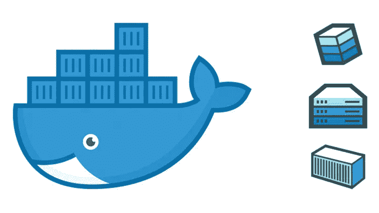
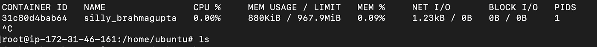
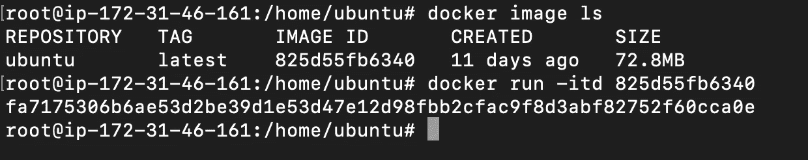
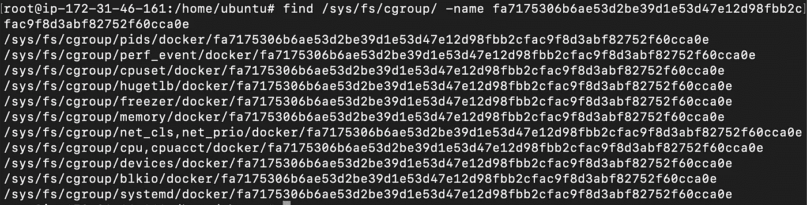
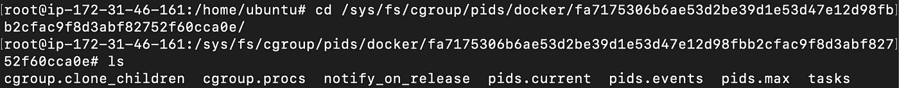
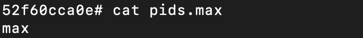
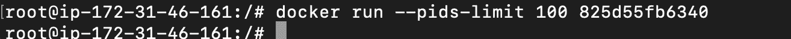
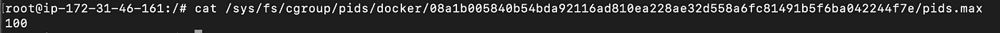
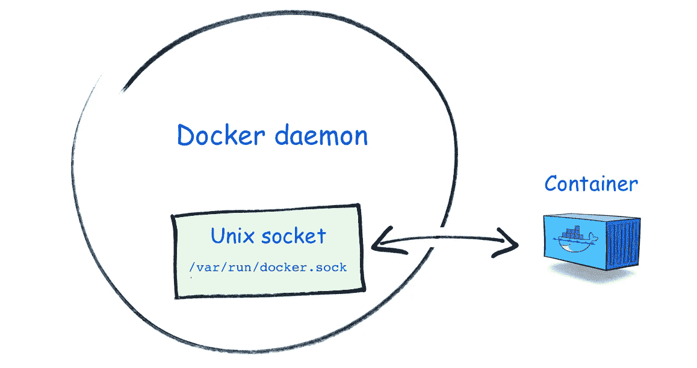

# 高级码头安全第二部分

> 原文：<https://infosecwriteups.com/advanced-docker-security-part-ii-4a6994f0c328?source=collection_archive---------0----------------------->



[来源](https://nickjanetakis.com/blog/differences-between-a-dockerfile-docker-image-and-docker-container)

# **简介**

这是高级 docker 系列的第二部分，我们将介绍一些高级概念，以保护您的 Docker 容器，并确保即使您的容器受到损害，攻击者也无法实现太多目标。如果你错过了这个系列的第一部分，你可以在这里查看。

# **限制资源**

Docker 的安全性和影响它的因素可以分为两个核心和关键的类别:名称空间和 cgroups 是用来描述它们的术语。

根据 Docker 网站的说法，名称空间“为正在运行的进程(容器)提供隔离，限制它们对系统资源的访问，而正在运行的进程并不知道这些约束。”Docker 没有引入名称空间。在撰写本文时，它已经作为 Linux 内核的一部分出现了。

第二个需要了解的最重要的事情是关于 cgroups。它是 Linux 内核的一个特性，允许您将对进程和容器的访问限制在特定的系统资源上，比如 CPU、RAM、IOPS 和网络连接。

# **限制 PID**

PID 是容器创建的进程或线程的数量。PIDS 列包含容器在上一步中创建的进程和内核线程的总数。Linux 内核称之为“线程”或者，“轻量级进程”或“内核作业”被用来描述同样的事情。PIDS 列中大量进程的出现和适度进程的出现(如 ps 或 top 所报告的)可能表明容器中的某些东西正在生成大量线程。如果攻击者获得了对您的容器的访问权，他可以通过耗尽服务器的所有资源并使其停止来削弱它。因此，建议减少系统中可以产生的进程数量。

让我们首先学习如何检查一个容器可以产生的 PID 的最大数量。

要检查当前的 PID，您可以通过键入 **docker stats** 找到它



码头统计

让我们以分离模式运行 docker 容器。

在分离模式下，容器启动并在后台运行。这意味着，您启动容器，并可以在启动后使用控制台执行其他命令。

与分离模式相对的是前台模式。当不使用-d 选项时，这是默认模式。在这种模式下，您用来执行 docker 运行的控制台将连接到标准输入、输出和错误。这意味着您的控制台附加到容器的进程。

你可以通过添加一个额外的标志 **d** 和**–it**在分离模式下运行 docker。



码头工人运行-itd<image_id></image_id>

我们可以看到，它为我们提供了一个 ID，**fa 7175306 b 6 AE 53 D2 be 39 D1 e 53d 47 e 12d 98 fbb 2 cfac 9 F8 d 3 abf 82752 f 60 cca0e**

这只是我们刚刚生成的容器的一个目录。这个目录的内容将包含重要的信息。

```
find /sys/fs/cgroup -name fa7175306b6ae53d2be39d1e53d47e12d98fbb2cfac9f8d3abf82752f60cca0e
```



匹配的目录列表

如果您查看第一个目录的命名约定，您会注意到其中的**PID**。这个目录将包含关于我们刚刚生成的容器的 PID 的信息。我们关注的目录是**/sys/fs/cgroup/pids/docker/fa7…ca0e**

查看内容，您会看到目录中存储了一堆文件。



切换到我们容器的 pids 目录

**pids.max** 文件包含了 docker 容器中可以产生的最大进程数。如果您查看 pids.max 文件的内容，您会发现它包含单词 **max。这意味着在我们的容器中可以产生任意数量的进程。**



pids.max 设置为 max

根据不同的用例，您可以设置可以产生的 PID 数量的上限。

```
docker run –pids-limit 100 825d55fb6340
```

注意:这里 825d55fb6340 是图像 ID。要查看您的图片 id，只需输入 **docker 图片**



pids-限制设置为 100

在上面的例子中，我设置了可以产生的进程数量的最大限制，实际上是 100。深入了解您的用例，您可以将其设置得更低或更高。

让我们通过访问**/sys/fs/cgroup/pids/docker/08 a1b 005840 b 54 BDA 92116 ad 810 ea 228 AE 32d 558 a6fc 81491 b 5f 6ba 042244 f 7e/pids . max 文件**来确认一下。



pids-限制设置为 100

如您所见，PID 的最大数量已经设置为 100。

# **对接插座**



[来源](https://betterprogramming.pub/about-var-run-docker-sock-3bfd276e12fd?gi=6426fa1d605a)

先来了解一下什么是 socket

套接字通常是指 IP 地址和端口。要与网站或界面交互，您只需要一个套接字，这意味着一个 IP 地址和一个与运行服务的 IP 地址相关联的端口。

然后，您可以向套接字发送请求并期待响应。这通常被称为 TCP 套接字。还有一种套接字叫做 UNIX 套接字。这些套接字通常用于同一计算机/系统内的进程间通信(IPC)。

Docker 套接字是一个 UNIX 套接字。当你输入一个 docker 命令，比如 docker pull、run 等。在后台，docker 客户机通过 UNIX 套接字与 docker 守护进程进行交互，以执行您的命令。

**docker.sock** 文件位于/var/run 目录中，文件的所有者是根。务必不要篡改该文件的权限，因为这会导致攻击者获得对底层主机系统的访问权限。

此外，不建议将此文件安装到新旋转的 docker 容器中，因为恶意用户可能会滥用它来获得对底层主机系统的访问权限。但是为什么会有人在容器上安装 **/var/run/docker.sock** 文件呢？

如果您有几个 docker 容器，并且您想从不同的 docker 容器访问/控制它们，那么您需要将这个文件挂载到 docker 容器，您想从这个容器控制/访问其余的 docker 容器。

挂载的过程是添加**–v**标签，然后是你希望挂载的内容和挂载的位置。

示例**，-v /opt/important:/tmp**

在这个例子中，我已经将主机系统中的 **/opt/important** 目录挂载到 docker 容器中的 **/tmp** 目录。

因此，如果您遇到一个 docker 文件，其行类似于下面提供的行，那么您可以肯定这样一个事实:任何恶意用户，只要访问 docker 容器，就能够安装主机文件系统并读取所有敏感文件。

```
docker run –it –name ubuntu –v /var/run/docker.sock:/var/run/docker.sock /bin/bash
```

# **结论**

这是一篇更侧重于实际的博客文章。我们了解了进程 id 的概念以及如何限制对它们的访问。后来，我们发现挂载 docker.sock 文件会导致 docker 容器中的安全漏洞。安全性在 Docker 环境中极其重要。除了复杂，技术安全也很难做到。因此，在部署之前，我们必须确保一切都得到正确的纠正和保护。