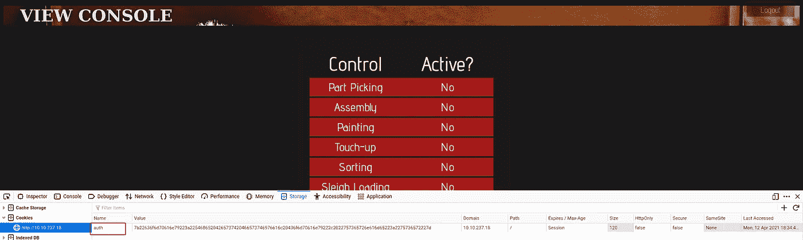
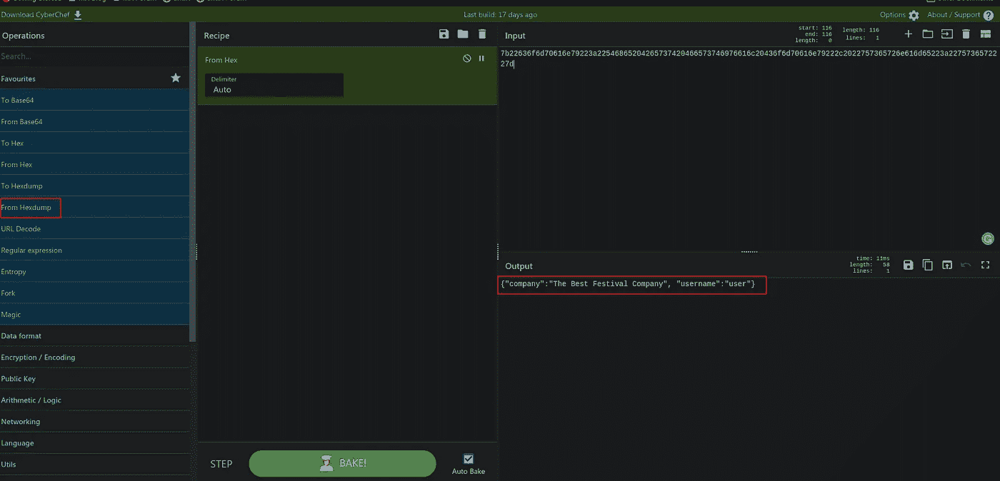
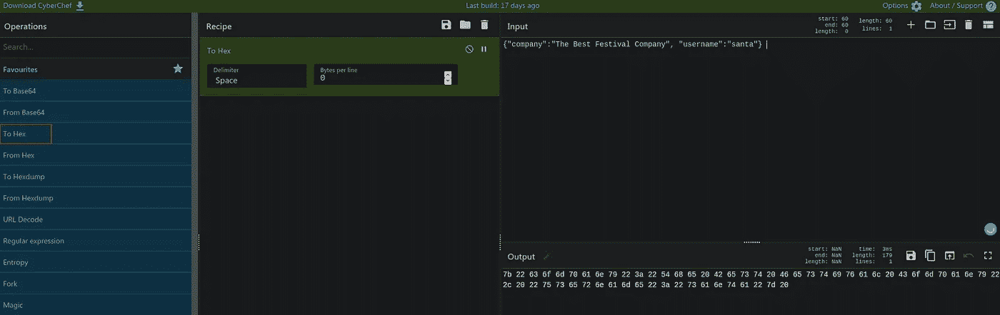
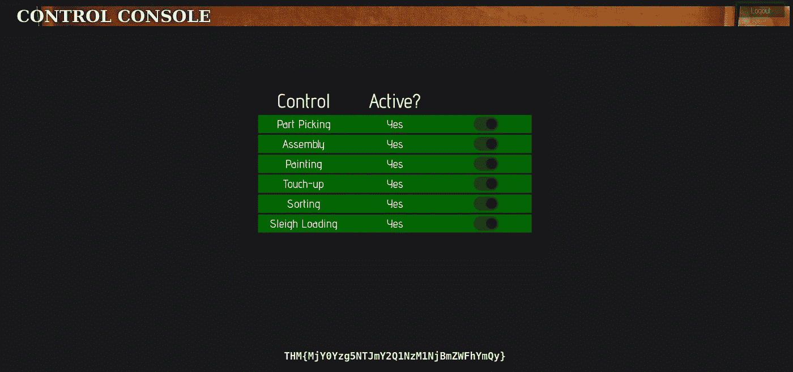

# 赛博 2 [2020]来临演练第一部分

> 原文：<https://infosecwriteups.com/advent-of-cyber-2-2020-walkthrough-part-1-a464aa56f55b?source=collection_archive---------4----------------------->

嗨伙计们，又回来了

来吧，我们去冒险旅行。是的，今天我们将踏上充满挑战的漫漫征途。这是一个神奇的 tryhackme 盒子，我喜欢它。

如果你完全是初学者，我建议你使用这台机器。因为这台机器帮助你学习很多攻击，给你一个基本的，强大的黑客基础知识。我已经告诉过你这是一个很长的 ctf 挑战，所以我把这个演练分成不同的部分。

学习目标[自学区]

#网络

#http 和 Https

#饼干

## 任务 6[第一天]网络开发圣诞节危机

Q1)用于身份验证的 cookie 的名称是什么？

回答:授权

> ANS 提示

> 打开网站，用任意用户名和密码注册一个用户。用相同的用户名和密码登录，然后按 ctrl+shift+i，打开开发工具。下一步是转到存储部分，然后打开 cookie 并找到答案

Q2)这个 cookie 的值是以什么格式编码的？

答案:十六进制

Q3)解码 cookie 后，数据以什么格式存储？

答:json

Q4)圣诞老人的饼干有什么价值？

ANS:7b 22636 f6d 70616 e 79223 a 2254686520426573742046657374697616 c 20436 f6d 70616 e 79222 c 2022757365726 e 616d 6523 a 2275736573657365727 e 65726 e 65227d

> ANS 提示:将 json 值重新编码为十六进制格式

Q5)当线路完全激活时，您会得到什么标志？

ANS:THM { mjy 0 yzg 5 ntjmy 2 q 1 nzm 1 njbmzwfhymqy }

> ANS 提示:
> 
> 我们的第一项工作是解码 cookie 值并找到相应的 JSON 值。转到[https://gchq.github.io/CyberChef/](https://gchq.github.io/CyberChef/)并解码十六进制 cookie 值。是的，我们破译了它。下一步是将 JSON 用户名值改为 santa。最后一步是将编辑过的 json 值重新编码成十六进制。将我们的新 cookie 值粘贴到 cookie 值区域(在粘贴值之前不要忘记一件事，请删除所有空格)。刷新页面并允许所有权限。

解码 cookie 值

编辑并将 cookie 值重新编码为十六进制

替换 cookie 值并允许所有权限

谢谢你们所有人