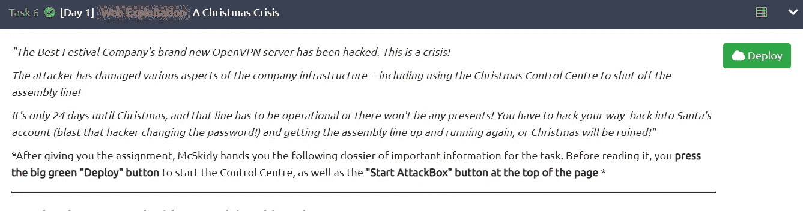
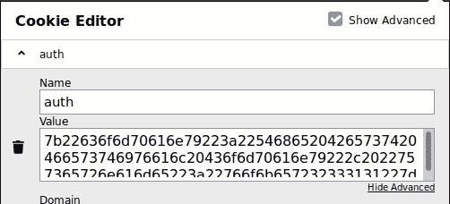
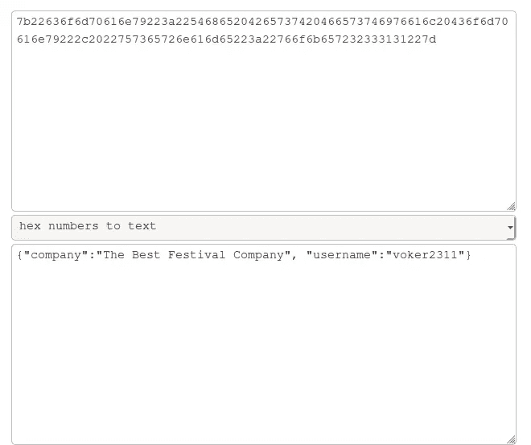
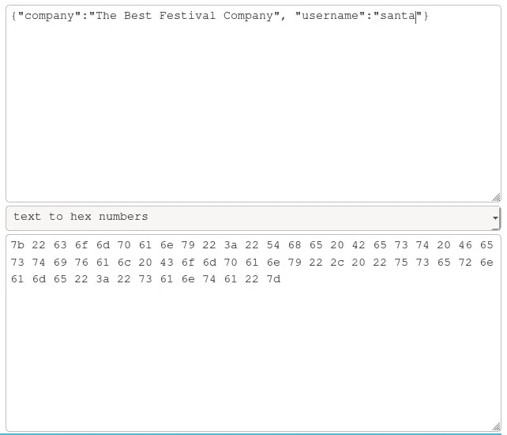
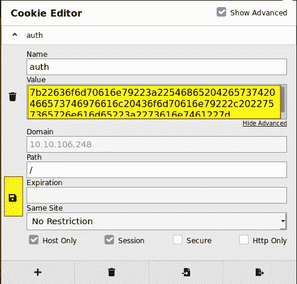
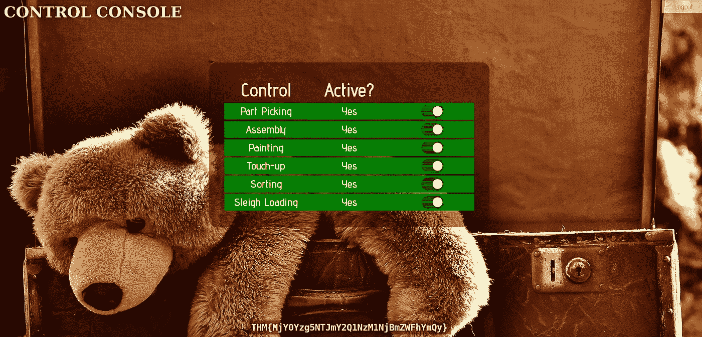

# 赛博 2 的来临:第一天

> 原文：<https://infosecwriteups.com/advent-of-cyber-2-day-1-tryhackme-319dcca59802?source=collection_archive---------1----------------------->

嘿伙计们，网络时代终于来临了，你们可以在 T [ryhackme](https://tryhackme.com/room/adventofcyber2) 玩游戏了。所以，第一天是关于网络开发，它涵盖了网络如何工作的基础知识。所以让我们开始吧。

任务 1

我们有很多问题，这些问题都很简单。

控制中心

我们到了这个控制中心，让我们注册用户，看看登录后我们能得到什么。

这里，我们必须找到用于身份验证的 cookie 的名称。

## 1.用于身份验证的 cookie 的名称是什么？

> ans:**auth**

所以第二个问题是基于曲奇的价值。它是用十六进制编码的，这给了我们第二个问题的答案。

## 2.这个 cookie 的值是以什么格式编码的？

> Ans。 ***十六进制***

让我们解码 cookie 的值，我们得到的是 JSON 格式的输出。

## 3.解码 cookie 后，数据以什么格式存储？

> Ans。 ***JSON***

我们可以操作 username 字段，将其更改为 ***santa*** 来访问他的帐户。

## 4.圣诞老人的饼干有什么价值？

> **回答:*7b 22636 f6d 70616 e 79223 a 22546865204265737420466573746976616 c 20616 e 79222 c 2022757365726 e 616d 6523 a 2273616 e 7461227d***

复制 ***圣诞老人的*** cookie 的值，粘贴到 cookie 编辑器中，获得 ***圣诞老人的*** 账号的访问权限。

Cookie 编辑器

获取标志

## 5.当线路完全激活时，给你的是什么标志？

> ans:***THM { mjy 0 yzg 5 ntjmy 2 Q1 nzm 1 njbmzwfhymqy }***

谢谢你🚀快乐黑客💻