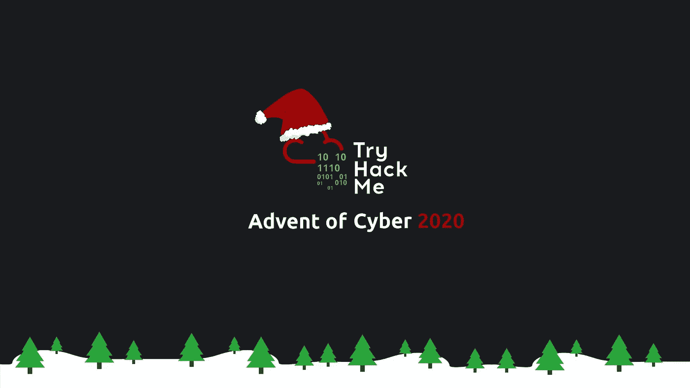
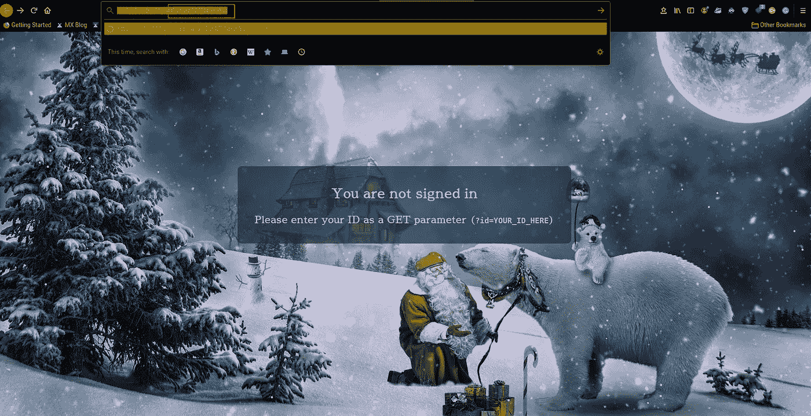
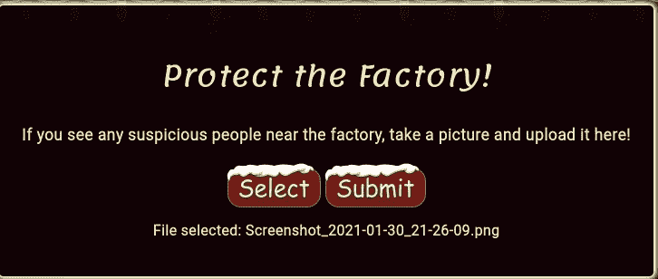
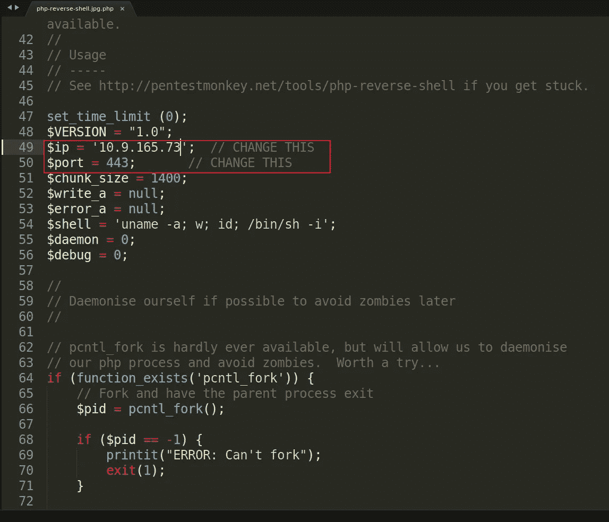
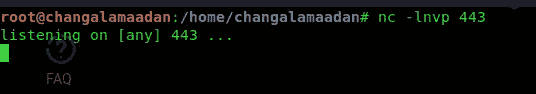
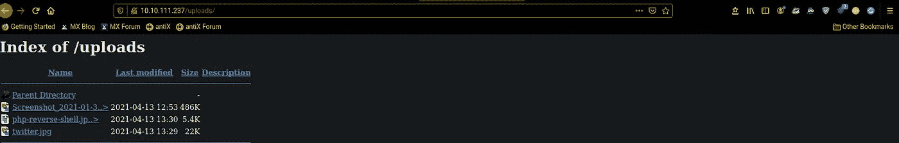
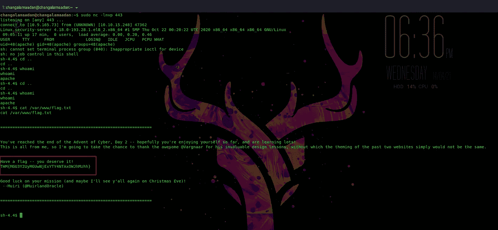

# 赛博 2 的来临演练第 2 部分

> 原文：<https://infosecwriteups.com/advent-of-cyber-2-walkthrough-part-2-cacbd704672b?source=collection_archive---------3----------------------->

嗨伙计们，
我们的第二天要从这里开始了。在上一节中，我们学习了更多关于 cookies 和认证的知识。在今天的部分中，我们将了解常见的文件上传漏洞和反向外壳。

## 注意:什么是反壳？

反向外壳是在连接上建立的外壳会话，从远程机器发起，而不是从攻击者的主机发起。成功利用远程命令执行漏洞的攻击者可以使用反向外壳获取目标机器上的交互式外壳会话，并继续他们的攻击。

**Q1)要访问上传页面，需要在 URL 中添加什么字符串？**

*ANS:？id = odizodi 5 mtniymww*

**Q2)工厂接受什么类型的文件？**

*答:图片*

我上传不同种类的扩展，比如。php，。Html，。py，。jpeg，。png。最后是。jpeg 和 png 扩展已成功上传。所以它只拿走我们的图像

**Q3)上传的文件存放在哪个目录下？**

回答:/上传/

**Q4)**`**/var/www/flag.txt**`**中的标志是什么？**

在这个问题中，我们需要展示我们的实践知识。好吧，

首先进入[https://raw . githubusercontent . com/pentest monkey/PHP-reverse-shell/master/PHP-reverse-shell . PHP](https://raw.githubusercontent.com/pentestmonkey/php-reverse-shell/master/php-reverse-shell.php)下载反向 php shell。并在您最喜欢的文本编辑器中打开它。因为我们需要用我们的 IP 和端口号替换当前的 IP 和端口号。

更改当前的 ip 和端口号，并将您的 tryhackme ip 和 443 端口

在下一步，我们知道我们只能上传。巴新和。jpeg 和。jpg 扩展。所以我们用一个技巧来上传我们的 php 反向 shell。重命名我们的 php shell 以添加任何一个可接受的扩展(例如:php-reverse-shell.jpg.php)并上传它。打开 yore 终端并(nc -lnvp 443)创建 netcat 反向 shell 监听器。

打开/uploads/目录，运行反向 shell。打开您的 netcat 监听器并找到标志

ANS:THM { mgu 3y 2 uymguwnjixyty 4 ntaxowjhmzhh }

谢谢你们，