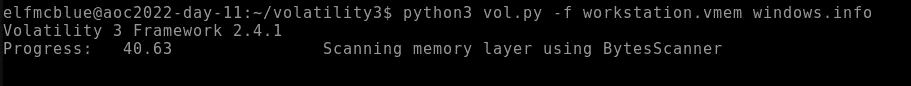
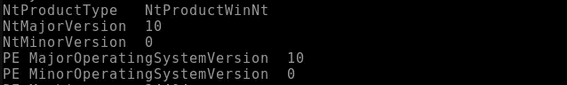
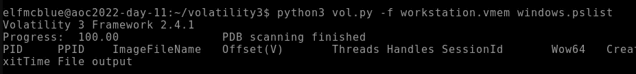
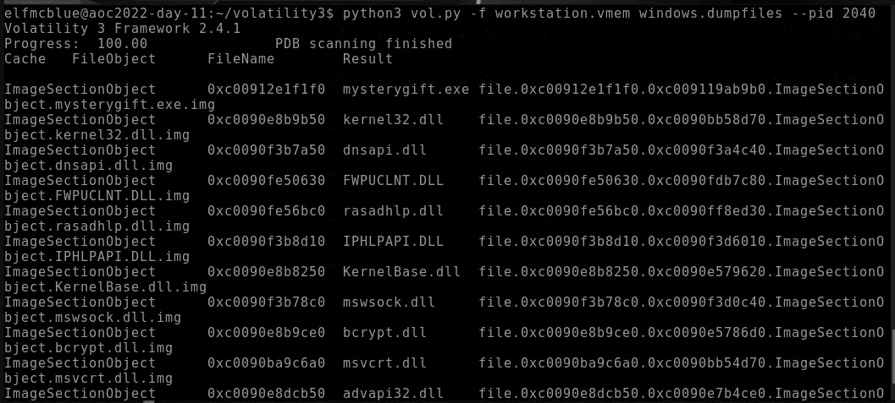

# 网络 2022 的来临[第 11 天]-记忆取证-不是所有的礼物都是好的

> 原文：<https://infosecwriteups.com/advent-of-cyber-2022-day-11-memory-forensics-not-all-gifts-are-nice-write-up-1ec97f6d8249?source=collection_archive---------0----------------------->

## 网络 2022 的来临【第 11 天】**记忆取证**不是所有的礼物都是好的|任务 16 答案


# 什么是内存取证？

*   内存取证是对计算机开机时使用的易失性内存的分析。
*   计算机使用称为随机存取存储器(RAM)的专用存储设备来记住当时计算机上正在执行的操作。RAM 速度极快，是存储和访问数据的首选方法。

让我们用**波动**进行调查吧！！

> ***波动率*** *是* *一个强大的工具，用于分析 Linux、Mac 和***Windows 系统上的内存转储。**

*你可以在这里下载[波动工具！！](https://github.com/volatilityfoundation/volatility.git)*

*[](https://github.com/volatilityfoundation/volatility.git) [## GitHub-volatility foundation/volatility:一个高级内存取证框架

### 易失性框架-易失性内存提取实用框架…

github.com](https://github.com/volatilityfoundation/volatility.git) *

# *任务 16——记忆取证——不是所有的礼物都是好的*

## *1.内存映像捕获的 Windows 版本号是多少？*

> **注意:此初始扫描可能需要 10 分钟才能完成。为什么不喝点水或者伸伸腿呢？**

*扫描图像以收集信息！！通过使用下面的命令，*

```
*python3 vol.py -f workstation.vmem windows.info*
```

**

*上面的扫描将提供图像的基本细节。*

*我们拿到结果了！*

**

```
*Ans: 10*
```

## *2.神秘圣诞老人留下的二进制/礼物的名字是什么？*

```
*python3 vol.py -f workstation.vmem windows.pslist*
```

**

*volatility 中的 Ps list 用于扫描和显示来自内存转储或映像的进程列表*

**

```
*Ans: mysterygift.ex*
```

## *3.这个二进制文件的进程 ID (PID)是什么？*

*我们已经利用了上述问题中的 PID！！*

**

```
*Ans: 2040*
```

## *4.转储该二进制文件的内容。转储了多少文件？*

*现在让我们使用下面的命令转储 PID 上的文件，*

```
*python3 vol.py -f workstation.vmem windows.dumpfiles --pid 2040*
```

**

```
*Ans: 16*
```

*感谢您的阅读！！*

*黑客快乐~*

```
*Author : Karthikeyan Nagaraj ~ Cyberw1ng*
```

*查询:*

*THM，TryHackMe，TryHackMe 2022 年网络时代的到来，TryHackMe 2022 年网络时代的到来第 11 天，道德黑客，写，走过，TryHackMe 2022 年网络时代的到来第 11 天答案*

## *来自 Infosec 的报道:Infosec 每天都有很多内容，很难跟上。[加入我们的每周简讯](https://weekly.infosecwriteups.com/)以 5 篇文章、4 个线程、3 个视频、2 个 GitHub Repos 和工具以及 1 个工作提醒的形式免费获取所有最新的 Infosec 趋势！*