# 网络 2022 的来临[第 12 天]-恶意软件分析法医麦克布鲁到 REVscue！写出来

> 原文：<https://infosecwriteups.com/advent-of-cyber-2022-day-12-malware-analysis-forensic-mcblue-to-the-revscue-write-up-44fc80e95c7?source=collection_archive---------0----------------------->

## Cyber 2022 来临[第 12 天] **恶意软件分析|** 法医 McBlue 到 REVscue！|任务 16 回答 Karthikeyan Nagaraj 的评论和演练


# 任务 16—恶意软件分析取证 McBlue 到 REVscue！

> 启动机器，进入状态

## 1.恶意软件示例的架构是什么？(32 位/64 位)

**让我们轻松打开文件**

> *Detect It Easy，简称“DIE”是一个用于确定文件类型的程序。*
> 
> *“DIE”是一个跨平台的应用，除了 Windows 版本还有 Linux 和 Mac OS 版本。*

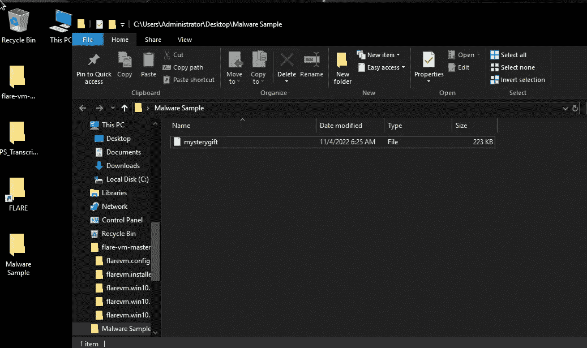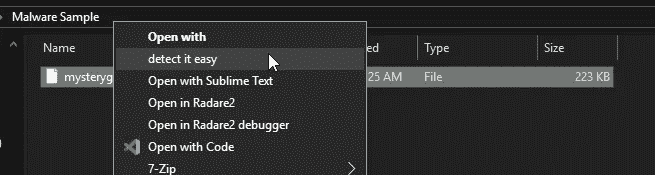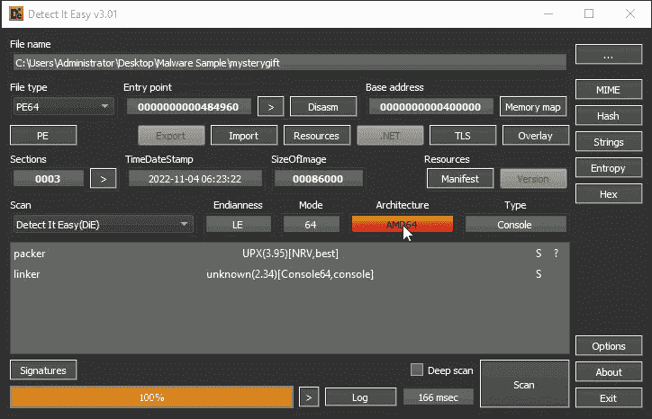

因此它是 64 位架构！！！

```
Ans: 64-bit
```

## 2.恶意软件示例中使用的打包程序是什么？(格式:小写)

分析上面的图像图像！

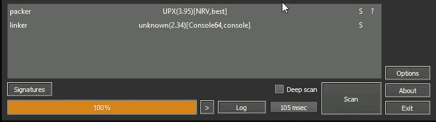

```
Ans: upx
```

## 3.用于构建恶意软件样本的编译器是什么？(格式:小写)

让我们用 capa 来分析这个文件

> *capa 检测可执行文件中的功能。你和一个 PE，ELF，对着干。NET 模块或外壳代码文件，它会告诉你它认为程序可以做什么。例如，它可能表示该文件是一个后门程序，能够安装服务，或者依赖 HTTP 进行通信。*

```
capa -vv mysterygift
```

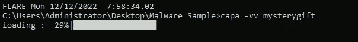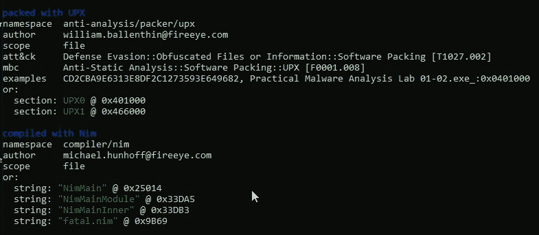

```
Ans: nim
```

## 4.有多少米特 ATT 和 CK 技术被发现归功于发现策略？

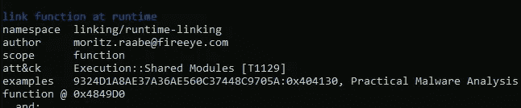

```
Ans: 2
```

## 5.恶意软件滥用的注册表项是什么？

这里我们想打开屏幕底部的进程监视器


将流程名称添加为 mysterygift.exe，然后单击添加

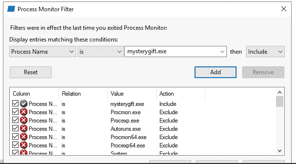

将文件扩展名更改为 exe


现在请注意进程监视器

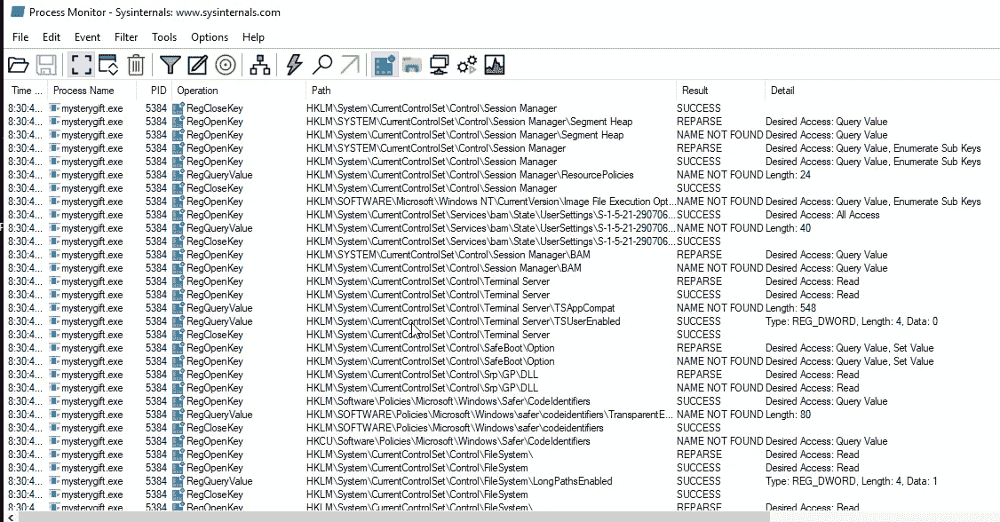

我们只需要 RegCreateKey 包含操作，或者您可以排除下面列出的不必要的包，

*   RegOpenKey
*   RegQueryValue
*   RegQueryKey
*   RegCloseKey


右键单击并单击排除！！

您可能会注意到只有一个注册表项同时具有 **RegCreateKey** 和 **RegSetValue** 。该密钥与名为**注册表运行密钥修改**的持久性技术相关，通常被恶意软件开发者用来安装后门。


```
Ans: HKCU\Software\Microsoft\Windows\CurrentVersion\Run
```

## 6.根据上一个问题，注册表项上写的值是什么？

双击我们找到的结果

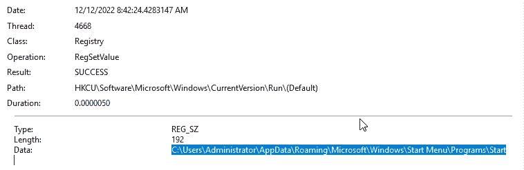

```
Ans: C:\Users\Administrator\AppData\Roaming\Microsoft\Windows\Start Menu\Programs\Startup\wishes.bat
```

## 7.恶意软件在**C:\ Users \ Administrator \**目录下创建的两个文件的名称是什么？(格式:文件 1、文件 2 按字母顺序排列)

点击下图右上角的文件夹过滤器，

仅包括 CreateFile 操作

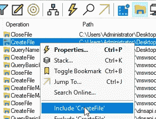

```
Ans: test.jpg, wishes.bat
```

## 8.恶意软件发起网络连接的两个域是什么？(格式:按字母顺序排列的域 1、域 2)

添加以下过滤器并搜索域

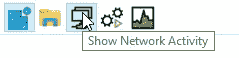

这里我们可以看到，网络活动中的 2 个领域是

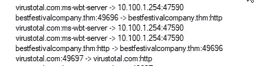

```
Ans: bestfestivalcompany.thm, virustotal.com
```

## 9.回到恶意软件示例中的字符串，用于下载恶意软件访问的第一个域中托管的文件的完整 URL 是什么？

在 CMD 上使用下面的命令！

```
cd "Desktop\Malware Sample" 
floss -n 6 mysterygift.exe | grep http://
```

或者你可以使用 Detect 很容易地找到 EXE 中的字符串


```
Ans: http://bestfestivalcompany.thm/favicon.ico
```

感谢您的阅读！！

黑客快乐~

```
Author : Karthikeyan Nagaraj ~ Cyberw1ng
```

查询:

THM，TryHackMe，TryHackMe 2022 年网络时代的到来，TryHackMe 2022 年网络时代的到来第 12 天，道德黑客，写，走过，TryHackMe 2022 年网络时代的到来第 12 天答案

## 来自 Infosec 的报道:Infosec 每天都有很多内容，很难跟上。[加入我们的每周简讯](https://weekly.infosecwriteups.com/)以 5 篇文章、4 条线索、3 个视频、2 个 GitHub Repos 和工具以及 1 个工作提醒的形式免费获取所有最新的 Infosec 趋势！