# Cyber 2022[第 13 天]来临-数据包分析|简单享受 pcap 时光-简单记录

> 原文：<https://infosecwriteups.com/advent-of-cyber-2022-day-14-packet-analysis-simply-having-a-wonderful-pcap-time-simple-write-37169e62c23f?source=collection_archive---------1----------------------->

## Cyber 2022 的来临[第 13 天]数据包分析|简单地享受 pcap 时光|任务 18 回答由 Karthikeyan Nagaraj 撰写和演练


## 为什么数据包分析仍然重要？

*   网络流量是一个纯粹而丰富的数据源。网络事件的数据包捕获(PCAP)为分析提供了丰富的数据源。
*   捕获实时数据可以集中在流量上，流量只提供网络流量的统计数据。另一方面，识别和深入研究网络模式是在数据包级别完成的。
*   因此，没有数据包分析，就无法进行威胁检测和实时性能故障排除。

## 用于此任务的工具和网站是！！

1.  [Wireshark](https://www.wireshark.org/) —用于数据包捕获和分析
2.  [赛博咖啡馆网络版](https://gchq.github.io/CyberChef/) —针对方得
3.  【Virustotal.com】T4—分析哈希

> 启动你的机器，并导航到它

# 任务 18[第 13 天]数据包分析|享受美好的 pcap 时光

## 1.“超文本传输协议”的“数据包百分比”值是多少？

> *查看“协议层级”菜单。*

将 pca 文件拖放到 Wireshark 中，并导航到**统计信息→协议层次结构**

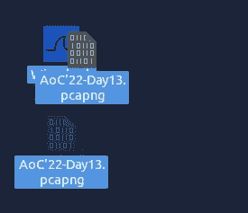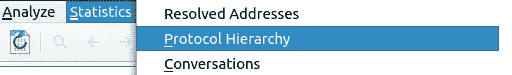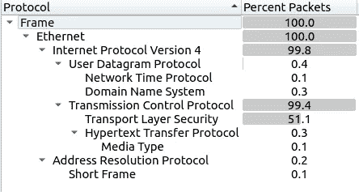

查看 HTTP 数据包的百分比

```
Ans:  0.3
```

## 2.哪个端口号收到了超过 1000 个数据包？

正如我们所知，TCP 已经收到了 1000 多个数据包

> *查看“对话”*

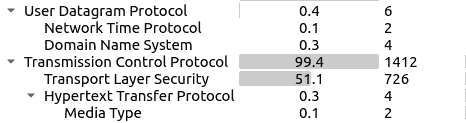

导航至**统计→对话**并选择 TCP

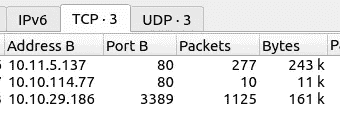

```
Ans: 3389
```

## 3.收到超过 1000 个数据包的协议的服务名称是什么？

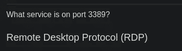

```
Ans: RDP
```

## 4.域名有哪些？
按字母顺序和默认格式输入域。(格式:域[。]zzz，域[。]zzz)

> *过滤 DNS 数据包。*

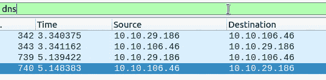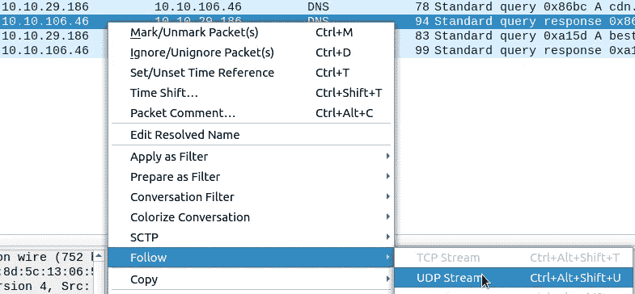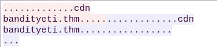

对于其他数据包，请遵循相同的步骤

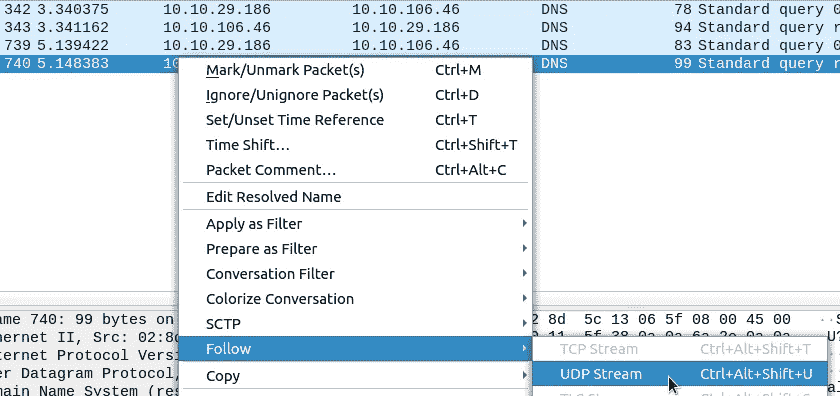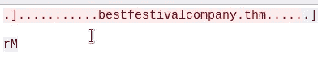

被拦截的网址位于 [**网吧**](https://github.com/gchq/CyberChef) 下方

```
Ans: bestfestivalcompany[.]thm,cdn[.]bandityeti[.]thm
```

## 5.请求的文件的名称是什么？
按**字母顺序输入姓名**，按默认格式输入**。**(格式:file.xyz，file.xyz)****

> *过滤 HTTP 数据包。*

应用 http 过滤器

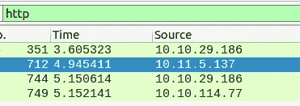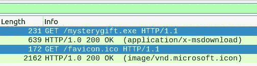

按字母顺序和预设格式归档(由[网络黑客](https://github.com/gchq/CyberChef))

```
Ans: favicon[.]ico,mysterygift[.]exe
```

## 6.哪个 IP 地址下载了可执行文件？
以**默认**格式输入您的答案。

在这种情况下，源是下载文件的主机！！

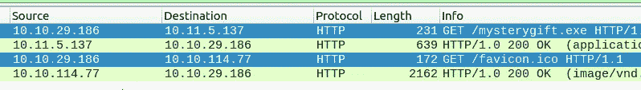

以下 Ip 是默认格式！

```
Ans: 10[.]10[.]29[.]186
```

## 7.哪个域地址托管恶意文件？
以**默认**格式输入您的答案。

右键点击使用 **GET 请求到 mysterygift.exe**的数据包，点击 **Follow → http Stream**

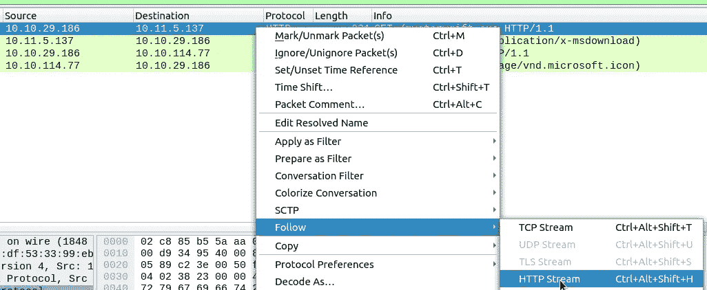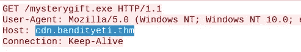

```
Ans: cdn[.]bandityeti[.]thm
```

## 8.用于下载不可执行文件的“用户代理”值是什么？

右键单击不可执行文件的数据包，然后跟随 http 流

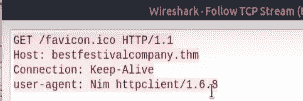

```
Ans: Nim httpclient/1.6.8
```

## 9.可执行文件的 sha256 哈希值是多少？

> *从 PCAP 文件中导出对象。
> 计算文件哈希值。*

点击**文件→导出对象- > HTTP** 保存文件

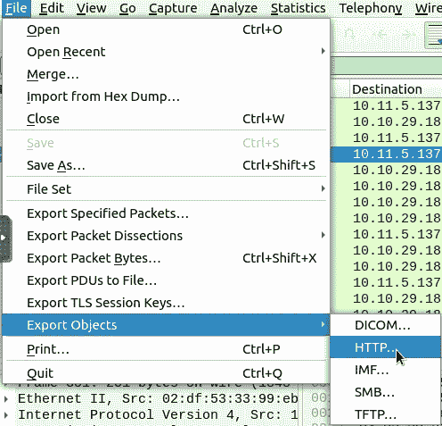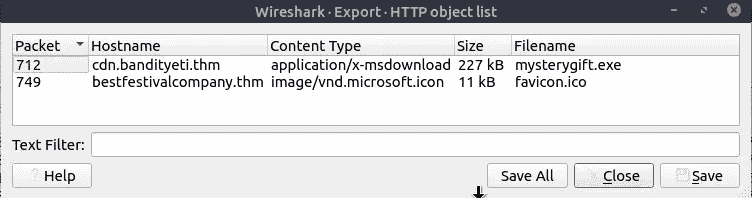

现在打开终端，输入命令！！**(如果需要，导航到该文件)**

```
sha256sum mysterygift.exe
```

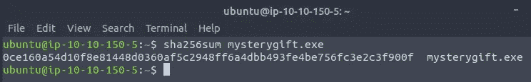

```
Ans: 0ce160a54d10f8e81448d0360af5c2948ff6a4dbb493fe4be756fc3e2c3f900f
```

## 10.连接的 IP 地址是什么？
按照**数字顺序**输入 IP 地址**和 IP 地址**。**(格式:IPADDR，IPADDR)**

> *在 Virustotal 上搜索可执行文件的哈希值。
> 导航至“行为”部分。
> 有多个 IP 地址与此文件相关联。*

打开 [Virustotal](https://www.virustotal.com/gui/home/search) 网站并搜索哈希

 [## 病毒总数

### 病毒总数

VirusTotalwww.virustotal.com](https://www.virustotal.com/gui/home/search) 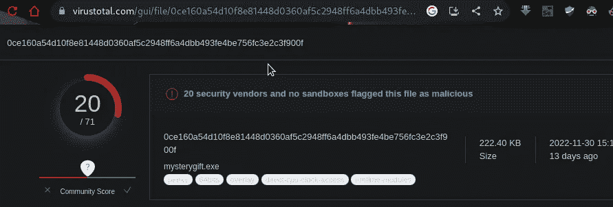

单击行为选项卡并向下滚动以查找 IP

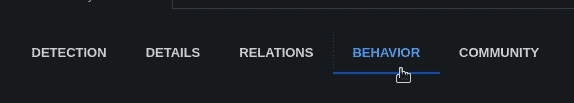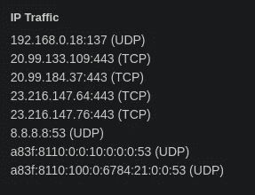

Ip 在 defanged 和字母顺序没有空间，我们不需要 8.8.8.8-谷歌的 Dns 服务器

> ***挑战更新，多加了一个 IP***

```
Ans: 20[.]99[.]133[.]109,20[.]99[.]184[.]37,23[.]216[.]147[.]64,23[.]216[.]147[.]76
```

感谢您的阅读！！

黑客快乐~

```
Author : Karthikeyan Nagaraj ~ Cyberw1ng
```

查询:

THM，TryHackMe，TryHackMe 2022 年网络时代的到来，TryHackMe 2022 年网络时代的到来第 13 天，道德黑客，写，走过，TryHackMe 2022 年网络时代的到来第 13 天答案

## 来自 Infosec 的报道:Infosec 每天都有很多内容，很难跟上。[加入我们的每周简讯](https://weekly.infosecwriteups.com/)以 5 篇文章、4 个线程、3 个视频、2 个 GitHub Repos 和工具以及 1 个工作提醒的形式免费获取所有最新的 Infosec 趋势！