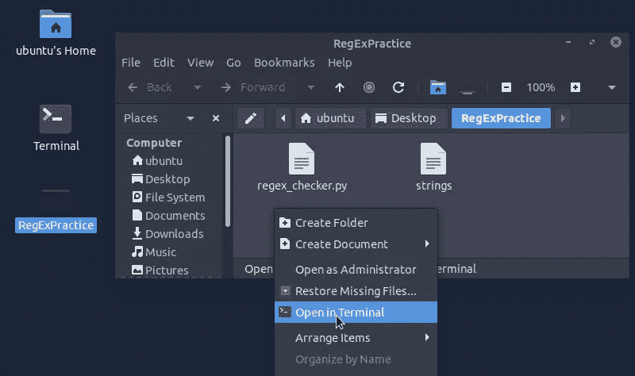
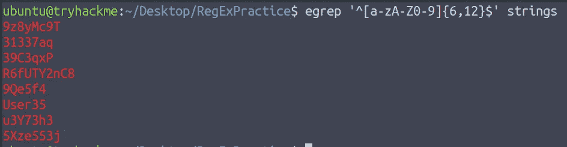
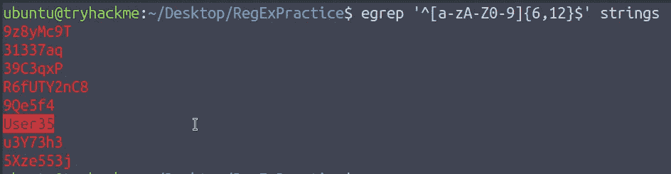
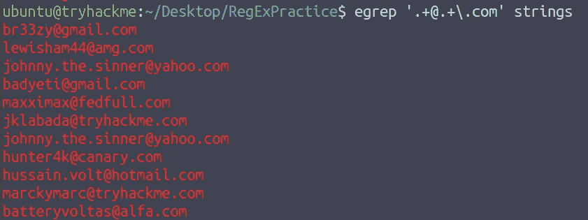
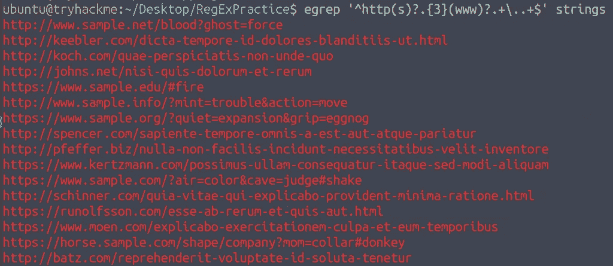

# Cyber 2022[第 17 天]安全编码的出现|在混乱中过滤出秩序-简单的记录

> 原文：<https://infosecwriteups.com/advent-of-cyber-2022-day-17-secure-coding-filtering-for-order-amidst-chaos-simple-write-up-64b7e2d94ae5?source=collection_archive---------0----------------------->

## 任务 22-安全编码|在混乱中过滤秩序|赛博 2022 的来临[第 17 天]-答案撰写和演练


## HTML5 和正则表达式

HTML5 的内置特性在验证用户提供的输入方面帮助很大，最大限度地减少了对 JavaScript 的依赖。

`<input>`元素特别提供了一系列围绕表单验证的非常有用的功能。

`<input>`类型可以被设置为专门过滤电子邮件、URL 甚至文件等，它会立即检查用户提供的输入是否符合表单要求的数据类型，因此，关于其有效性的反馈会立即返回给用户。

对于所提供的更细粒度的输入控制，可以将正则表达式(regex)集成到组合中。只需在`<input>`元素的“模式”属性中使用它，就万事俱备了。

[这里的](https://www.regular-expressions.info/quickstart.html)是开始学习正则表达式的好资源。下面是几个例子。

`1\. <input type="text" id="uname" name="uname" pattern="[a-zA-Z0-9]+">
2\. <input type="email" id="email" name="email" pattern=".+@0dayinventions\.com">`

> *启动机器，导航到 RegExPractice 文件夹，然后右键单击→在终端中打开*



# 任务 22【第 17 天】**安全编码-** 在混乱中过滤秩序

## 1.过滤用户名:有多少用户名符合上面的语法？

我们必须按照用户名的结构使用正则表达式



```
9z8yMc9T
31337aq
39C3qxP
R6fUTY2nC8
9Qe5f4
User35
u3Y73h3
5Xze553j
```

```
Ans: 8
```

## 2.过滤用户名:一个用户名由一个可读的单词和一个数字连接而成。这是什么？



```
Ans: User35
```

## 3.过滤邮件:有多少邮件符合上面的语法？

```
egrep ‘.+@.+\.com’ strings
```



```
br33zy@gmail.com
lewisham44@amg.com
johnny.the.sinner@yahoo.com
badyeti@gmail.com
maxximax@fedfull.com
jklabada@tryhackme.com
johnny.the.sinner@yahoo.com
hunter4k@canary.com
hussain.volt@hotmail.com
marckymarc@tryhackme.com
batteryvoltas@alfa.com
```

```
Ans: 11
```

## 4.过滤电子邮件:有多少独特的域名？


```
Ans: 8
```

## 5.过滤电子邮件:本地部分为“lewisham44”的电子邮件的域是什么？


```
Ans: amg.com
```

## 6.过滤电子邮件:带有本地部分“maxximax”的电子邮件的域是什么？


```
Ans: fedfull.com
```

## 7.过滤电子邮件:域名为“hotmail.com”的电子邮件的本地部分是什么？


```
Ans: hussain.volt
```

## 8.过滤 URL:有多少 URL 符合提供的语法？

```
egrep '^http(s)?.{3}(www)?.+\..+$' strings
```



```
http://www.sample.net/blood?ghost=force
http://keebler.com/dicta-tempore-id-dolores-blanditiis-ut.html
http://koch.com/quae-perspiciatis-non-unde-quo
http://johns.net/nisi-quis-dolorum-et-rerum
https://www.sample.edu/#fire
http://www.sample.info/?mint=trouble&action=move
https://www.sample.org/?quiet=expansion&grip=eggnog
http://spencer.com/sapiente-tempore-omnis-a-est-aut-atque-pariatur
http://pfeffer.biz/nulla-non-facilis-incidunt-necessitatibus-velit-inventore
https://www.kertzmann.com/possimus-ullam-consequatur-itaque-sed-modi-aliquam
https://www.sample.com/?air=color&cave=judge#shake
http://schinner.com/quia-vitae-qui-explicabo-provident-minima-ratione.html
https://runolfsson.com/esse-ab-rerum-et-quis-aut.html
https://www.moen.com/explicabo-exercitationem-culpa-et-eum-temporibus
https://horse.sample.com/shape/company?mom=collar#donkey
http://batz.com/reprehenderit-voluptate-id-soluta-tenetur
```

```
Ans: 16
```

## 9.过滤网址:这些网址中有多少是以“https”开头的？

从 https 开始计算 URL 的数量


```
Ans: 7
```

感谢您的阅读！！

黑客快乐~

```
Author : Karthikeyan Nagaraj ~ Cyberw1ng
```

查询:

THM，TryHackMe，TryHackMe 2022 年网络时代的到来，TryHackMe 2022 年网络时代的到来第 17 天，道德黑客，写，走过，TryHackMe 2022 年网络时代的到来第 17 天答案

## 来自 Infosec 的报道:Infosec 每天都有很多内容，很难跟上。[加入我们的每周简讯](https://weekly.infosecwriteups.com/)以 5 篇文章、4 条线索、3 个视频、2 个 GitHub Repos 和工具以及 1 个工作提醒的形式免费获取所有最新的 Infosec 趋势！