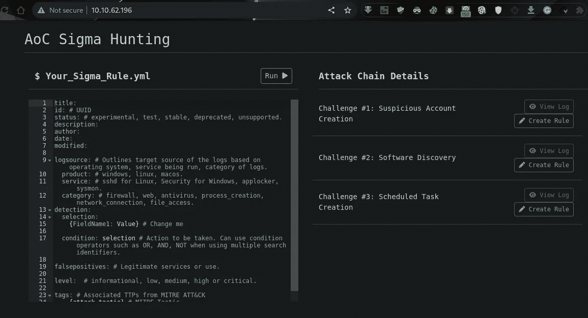
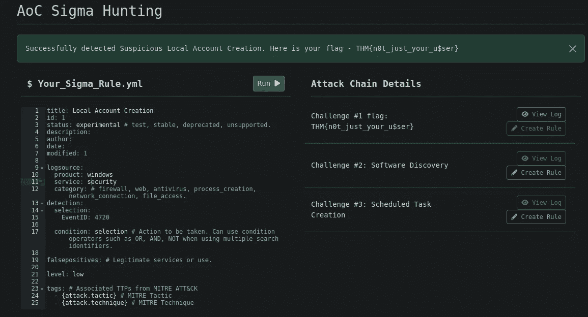
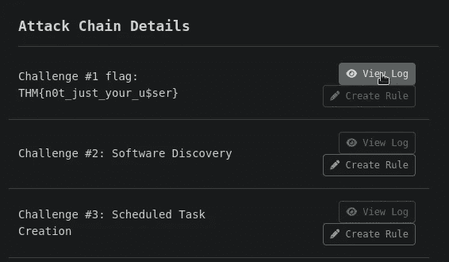
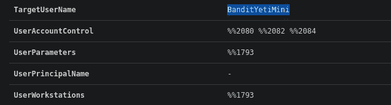
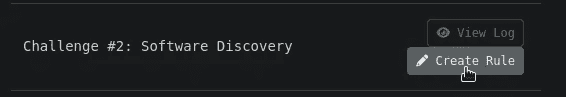
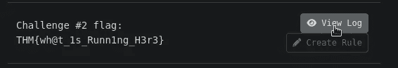
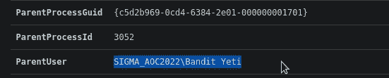
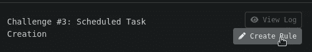
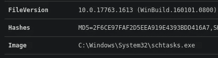

# 网络 2022 来临【第 18 天】适马|伐木工人莱尼学习新规则——简单记录

> 原文：<https://infosecwriteups.com/advent-of-cyber-2022-day-18-sigma-lumberjack-lenny-learns-new-rules-simple-write-up-205a403d6c08?source=collection_archive---------0----------------------->

## 任务 23-适马|伐木工人莱尼学习新规则|赛博 2022 的来临[第 18 天]-答案记录和演练


# 威胁检测

网络威胁和犯罪分子有先进的策略来确保他们窃取信息并造成破坏。正如你已经通过前几天看到的，有许多方法可以做到这一点。

安全团队也有一些方法来准备防御和识别这些威胁。显而易见的是，大多数蓝队活动都需要主动分析不同的日志、恶意软件和网络流量。这带来了威胁检测的实践。

> *在浏览器中打开机器的 IP 地址(确保您连接了 TryHackMe 的 VPN)*



# 任务 23【第 18 天】**适马** |伐木工人莱尼学习新规则

## 1.什么是挑战 1 标志？

[账户创建](https://attack.mitre.org/techniques/T1136/)技术要求

*   事件 ID: 4720
*   服务:安全

[](https://attack.mitre.org/techniques/T1136/) [## 创建帐户

### 对手可能会创建一个帐户来维护对受害者系统的访问。拥有足够的访问权限，创建…

attack.mitre.org](https://attack.mitre.org/techniques/T1136/) 

```
title: Local Account Creation
id: 1
status: experimental # test, stable, deprecated, unsupported.
description:
author:
date:
modified: 1

logsource: 
  product: windows 
  service: security
  category: # firewall, web, antivirus, process_creation, network_connection, file_access.
detection:
  selection:
    EventID: 4720

  condition: selection # Action to be taken. Can use condition operators such as OR, AND, NOT when using multiple search identifiers.

falsepositives: # Legitimate services or use.

level: low

tags: # Associated TTPs from MITRE ATT&CK
  - {attack.tactic} # MITRE Tactic
  - {attack.technique} # MITRE Technique 
```

```
Ans: THM{n0t_just_your_u$ser}
```

## 2.在挑战 1 日志中，创建了哪个用户帐户？

单击查看日志按钮并搜索用户帐户



```
Ans: BanditYetiMini
```

## 3.挑战 2 标志是什么？

我们必须为软件发现创建新的规则，它要求

*   类别:流程创建
*   事件 ID: 1
*   服务:Sysmon
*   image:C:\ Windows \ System32 \ reg . exe
*   命令行:`reg query “HKEY_LOCAL_MACHINE\Software\Microsoft\Internet Explorer” /v svcVersion`

[](https://attack.mitre.org/techniques/T1518/) [## 软件发现

### 对手可能试图获取安装在系统或云中的软件和软件版本的列表…

attack.mitre.org](https://attack.mitre.org/techniques/T1518/) 

```
title:
id: # UUID
status: # experimental, test, stable, deprecated, unsupported.
description:
author:
date:
modified:

logsource:
  product: windows
  service: sysmon
  category: process_creation
detection:
  selection:
    EventID:
    - 1
    Image|endswith:
    - reg.exe
    CommandLine|contains|all:
    - reg
    - query
    - /v
    - svcVersion

  condition: selection # Action to be taken. Can use condition operators such as OR, AND, NOT when using multiple search identifiers.

falsepositives: # Legitimate services or use.

level:  # informational, low, medium, high or critical.

tags: # Associated TTPs from MITRE ATT&CK
  - {attack.tactic} # MITRE Tactic
  - {attack.technique} # MITRE Technique 
```

```
Ans: THM{wh@t_1s_Runn1ng_H3r3}
```

## 4.挑战#2 日志文件中的用户路径是什么？

打开日志文件，这样我们就可以获得用户的路径



```
Ans: SIGMA_AOC2022\Bandit Yeti
```

## 5.挑战 3 标志是什么？

让我们为计划任务创建一个规则，它要求

*   类别:流程创建
*   事件 ID: 1
*   服务:Sysmon
*   image:C:\ Windows \ System32 \ schtasks . exe
*   父映像:C:\Windows\System32\cmd.exe
*   命令行:`schtasks /create /tn "T1053_005_OnLogon" /sc onlogon /tr "cmd.exe /c calc.exe"`

[](https://attack.mitre.org/techniques/T1053/005/) [## 计划任务/作业:计划任务

### 对手可能会滥用 Windows 任务计划程序来执行任务计划，以初始或重复执行…

attack.mitre.org](https://attack.mitre.org/techniques/T1053/005/) 

```
title:
id: # UUID
status: # experimental, test, stable, deprecated, unsupported.
description:
author:
date:
modified:

logsource: 
  product: windows
  service: sysmon
  category: process_creation
detection:
  selection:
    EventID: 1
    Image|endswith:
    - schtasks.exe
    CommandLine|contains|all:
    - schtasks
    - /create 

  condition: selection # Action to be taken. Can use condition operators such as OR, AND, NOT when using multiple search identifiers.

falsepositives: # Legitimate services or use.

level:  # informational, low, medium, high or critical.

tags: # Associated TTPs from MITRE ATT&CK
  - {attack.tactic} # MITRE Tactic
  - {attack.technique} # MITRE Technique 
```

```
Ans: THM{sch3dule_0npo1nt_101}
```

## 6.与挑战#3 日志关联的 MD5 哈希是什么？

打开哈希的日志文件



```
Ans: 2F6CE97FAF2D5EEA919E4393BDD416A7
```

感谢您的阅读！！

黑客快乐~

```
Author: Karthikeyan Nagaraj ~ Cyberw1ng
```

查询:

THM，TryHackMe，TryHackMe 2022 年的到来，TryHackMe 2022 年的到来第 18 天，道德黑客，写，走过，TryHackMe 2022 年的到来第 18 天答案

## 来自 Infosec 的报道:Infosec 每天都有很多内容，很难跟上。[加入我们的每周简讯](https://weekly.infosecwriteups.com/)以 5 篇文章、4 条线索、3 个视频、2 个 GitHub Repos 和工具以及 1 个工作提醒的形式免费获取所有最新的 Infosec 趋势！