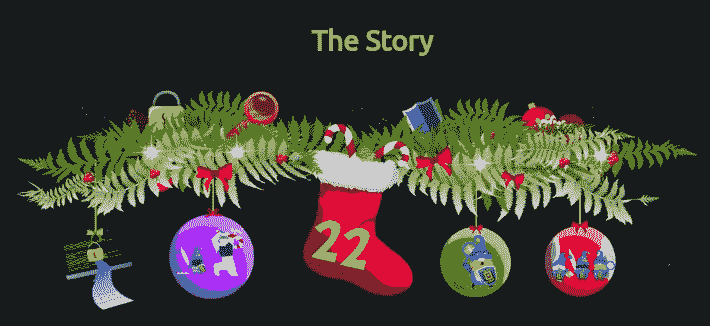
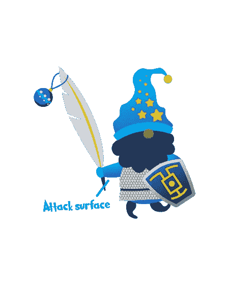
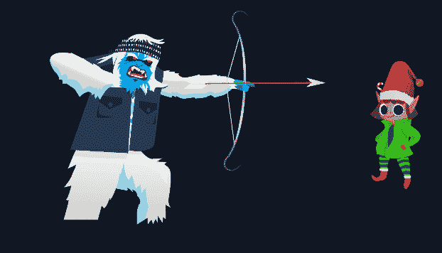

# 网络 2022 的来临[第 22 天]攻击面|减少威胁在我周围都失败了-简单的记录

> 原文：<https://infosecwriteups.com/advent-of-cyber-2022-day-22-attack-surface-reduction-threats-are-failing-all-around-me-simple-d23543635152?source=collection_archive---------2----------------------->

## 任务 27-攻击面减少|威胁正在我周围消失-赛博 2022 的来临[第 22 天]-答案撰写和演练



# 攻击媒介


攻击媒介是用来攻击计算机系统或网络的工具、技术或方法。如果我们将攻击向量映射到物理世界，攻击向量将是对手使用的武器，如剑、箭、锤子等。网络安全中的攻击媒介示例的不完全列表包括以下内容:

*   钓鱼邮件；欺骗性电子邮件，通常冒充某人并要求受害者执行危及其安全的操作。
*   拒绝服务(DoS)或分布式拒绝服务(DDoS)攻击；向网站或 web 应用程序发送太多请求，以至于网站或 web 应用程序达到极限，无法再满足合法请求。
*   Web 驱动攻击；网络浏览器中的缺陷，仅仅通过访问网站就危及受害者的安全。
*   未打补丁的漏洞利用；面向互联网的基础设施(如 web 服务器或网络接口)中的缺陷，被利用来控制基础设施。

# 攻击面



攻击面是攻击受害者的表面区域，可能受到攻击媒介的影响并造成损害。继续我们的物理世界的例子，攻击面将包括一个士兵的无盔甲的身体，这是一个剑，箭，或锤子等的攻击。，会损坏。在网络安全中，攻击面通常包含以下内容:

*   用于发送和接收电子邮件的电子邮件服务器。
*   面向互联网的 web 服务器，为访问者提供网站服务。
*   人们用来连接网络的最终用户机器。
*   人类可以被操纵和欺骗，通过社会工程将网络控制权交给攻击者。

# 任务 27 [Day 22] **攻击面缩小**我周围的威胁都失败了

1.  **按照附带的静态网站上的说明，帮助麦克斯基迪减少她的攻击面，抵御雪人的攻击。使用该标志作为答案来完成任务。**



```
Ans: THM{4TT4CK SURF4C3 R3DUC3D} 
```

感谢您的阅读！！

黑客快乐~

```
Author : Karthikeyan Nagaraj ~ Cyberw1ng
```

THM，TryHackMe，TryHackMe 2022 年网络时代的到来，TryHackMe 2022 年网络时代的到来第 22 天，道德黑客，写，走过，TryHackMe 2022 年网络时代的到来第 22 天答案

## 来自 Infosec 的报道:Infosec 每天都有很多内容，很难跟上。[加入我们的每周时事通讯](https://weekly.infosecwriteups.com/)以 5 篇文章、4 个线程、3 个视频、2 个 GitHub Repos 和工具以及 1 个工作提醒的形式免费获取所有最新的 Infosec 趋势！