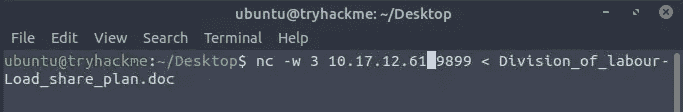
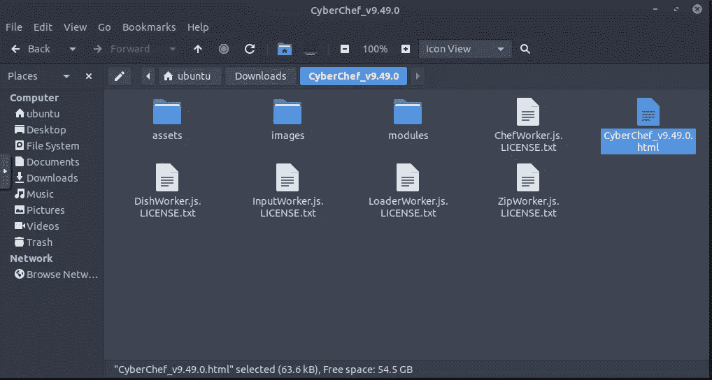
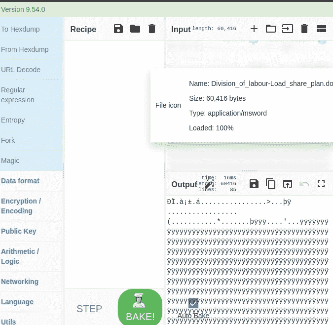
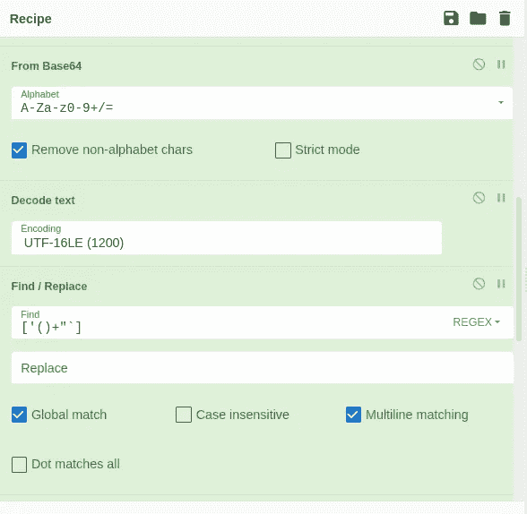
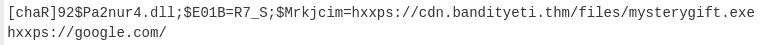
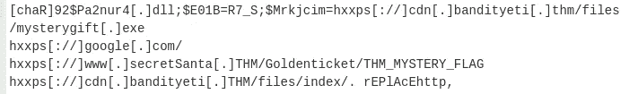

# 网络 2022【第 7 天】来临——网络厨师马尔多克斯在明火上烧烤

> 原文：<https://infosecwriteups.com/advent-of-cyber-2022-day-7-cyber-chef-maldocs-roasting-on-an-open-fire-writeup-by-karthikeyan-edd2f2f8a4b5?source=collection_archive---------0----------------------->

## 2022 年网络 4 的到来[第 7 天]网络厨师马尔多克斯在明火上烧烤-任务 12 答案


> ***让我们将文件从 TryHackMe 机器转移到我们的机器上，以便更好地调查！！***



发送者— TryHackMe 机器(确保您连接到 TryHackMe 机器)


接收器—我的机器

## **1。在连接的虚拟机中找到的 CyberChef 是什么版本？**

在攻击机器(TryHackMe Machine)中打开下载并检查标题



```
Ans: 9.49.0
```

## **2。从恶意文档中提取 URL 使用了多少方法？**



# 食谱——让我们来编写代码



```
Ans: 10
```

## **3。我们发现一个正在下载可疑文件的 URL 该恶意软件的名称是什么？**



```
Ans: mysterygift.exe
```

## **4。在最后一步中找到的 bandityeti 域的最后一个默认 URL 是什么？**

```
Ans: hxxps[://]cdn[.]bandityeti[.]THM/files/index/
```

## **5。在其中一个域中找到的票证是什么？(格式:Domain/<GOLDEN _ FLAG>)**



```
Ans: THM_MYSTERY_FLAG
```

感谢您的阅读！！

黑客快乐~

```
Author : Karthikeyan Nagaraj ~ Cyberw1ng
```

Tryhackme，网络 2022 的来临，网络 2022 答案的来临，网络 2022 第 7 天答案的来临，Karthikeyan nagaraj，网络安全

## 来自 Infosec 的报道:Infosec 每天都有很多内容，很难跟上。[加入我们的每周简讯](https://weekly.infosecwriteups.com/)以 5 篇文章、4 个线程、3 个视频、2 个 GitHub Repos 和工具以及 1 个工作提醒的形式免费获取所有最新的 Infosec 趋势！