# Cyber 2022 [Day6]电子邮件分析的出现——它开始看起来很像 Karthikeyan Nagaraj 的网络钓鱼

> 原文：<https://infosecwriteups.com/advent-of-cyber-2022-day5-email-analysis-its-beginning-to-look-a-lot-like-phishing-by-978dab792ebf?source=collection_archive---------1----------------------->

## 赛博 2022 第 6 天的到来——它开始看起来很像网络钓鱼演练的答案


1.  发件人的电子邮件地址是什么？

单击顶部的拆分视图，并在机器中打开文件

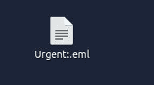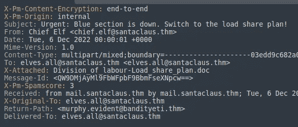

```
Ans: Answer is in the Above image --> (From: )
```

2.回信地址是什么？

> [*答案是上图中的*](https://cdn-images-1.medium.com/max/800/1*U-ychIky_A5FpDL5D6UshQ.png)

3.这封电子邮件是以谁的名义发出的？

> [T5 答案就在上图 ](https://cdn-images-1.medium.com/max/800/1*U-ychIky_A5FpDL5D6UshQ.png)

```
Ans: Chief elf
```

4.什么是 X-spam 分数？

> [*答案在上图*](https://cdn-images-1.medium.com/max/800/1*U-ychIky_A5FpDL5D6UshQ.png)

```
Ans: 3
```

5.Message-ID 字段的值中隐藏了什么？

我们必须解码 base64 字符串

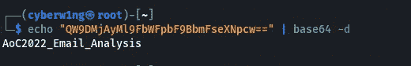

```
Ans: AoC2022_Email_Analysis
```

6.访问任务中提供的电子邮件信誉检查网站。
发件人邮箱的信誉结果如何？

打开网站[电子邮件回复](https://emailrep.io/)

 [## 简单电子邮件信誉

### 阐明电子邮件地址背后的声誉。

电子邮件地址](https://emailrep.io/) 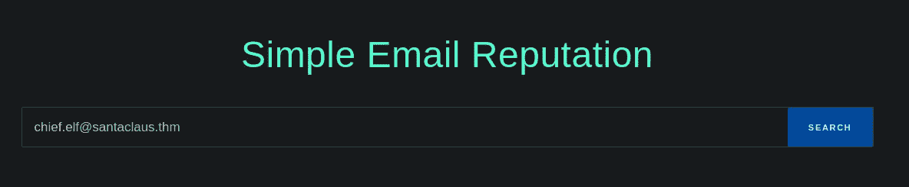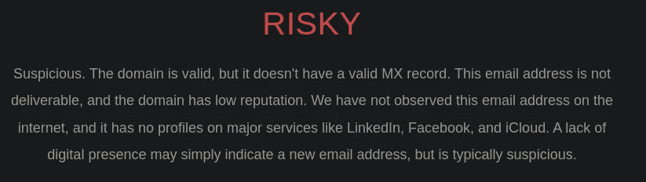

```
Ans: Risky
```

7.检查附件。附件的文件名是什么？

> 为了进一步调查，我将文件从远程机器发送到我的机器上！！

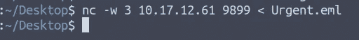

发送者—远程机器


接收器—我的机器

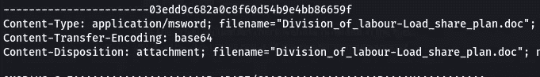

```
Ans: Answer is in the Above Image (filename: )
```

8.附件的哈希值是多少？

[使用该分析仪分析。eml 文件](https://eml-analyzer.herokuapp.com/)

 [## EML 分析仪

### 编辑描述

eml-analyzer.herokuapp.com](https://eml-analyzer.herokuapp.com/) 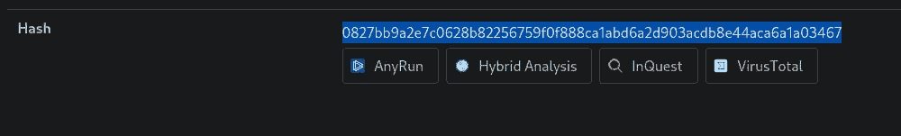

你会得到杂烩

```
Ans: Answer is in the Above Image
```

9.访问病毒总数网站，并使用哈希值进行搜索。
导航至行为部分。ATT 主教法冠& CK 部分的第二个战术是什么？

打开 Virustotal 并搜索哈希值

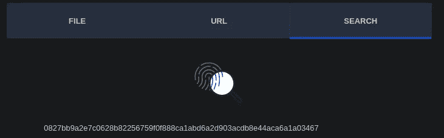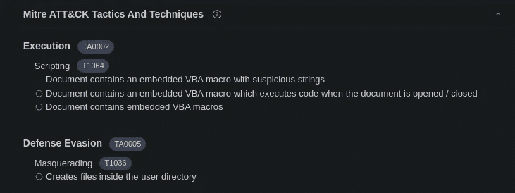

```
Ans: Answer is in the Above Image (2nd Subtitle)
```

10.访问研讯网站，使用哈希值进行搜索。
文件的子类别是什么。

> *打开 I*

[](https://labs.inquest.net/) [## 验尸实验室-InQuest.net

### 研讯实验室是一个开放的 API 和交互式研究门户网站，旨在使个人分析师与工具和…

labs.inquest.net](https://labs.inquest.net/) 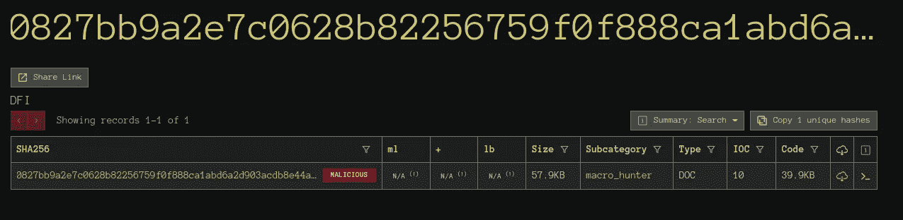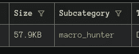

```
Ans: Macro_hunter
```

感谢阅读~~

黑客快乐~

```
Author : Karthikeyan Nagaraj ~ Cyberw1ng
```

Tryhackme，Cyber 4 2022 年的来临答案/文章/演练

## 来自 Infosec 的报道:Infosec 每天都有很多内容，很难跟上。[加入我们的每周简讯](https://weekly.infosecwriteups.com/)以 5 篇文章、4 条线索、3 个视频、2 个 GitHub Repos 和工具以及 1 个工作提醒的形式免费获取所有最新的 Infosec 趋势！