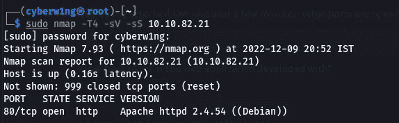
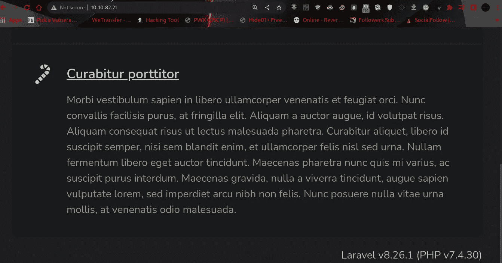
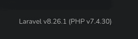
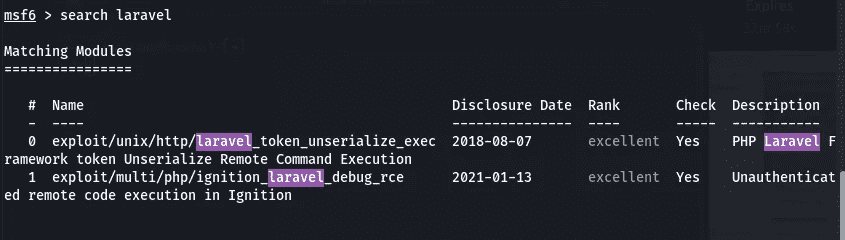
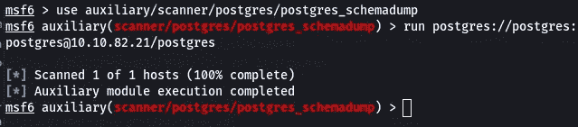
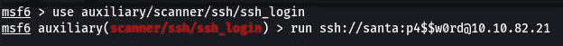
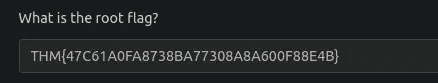

# 赛博 2022 的来临[第 9 天]——旋转|停靠大厅——短文和演练

> 原文：<https://infosecwriteups.com/advent-of-cyber-2022-day9-pivoting-dock-the-halls-short-writeup-and-walkthrough-ab510fdb36c8?source=collection_archive---------0----------------------->

## 赛博 2022 的来临[第 9 天]-旋转|停靠大厅记录和演练任务 14 答案


## 1.部署连接的虚拟机，并等待几分钟。开放哪些端口？

> *使用 Nmap 执行端口扫描*



```
Ans: 80
```

## 2.web 应用程序是用什么框架开发的？

> *在浏览器中打开< Machine-Ip >，在底部会显示字符串 Laravel*



```
Ans: laravel
```

## 3.应用程序容易受到什么 CVE 的攻击？


```
Ans: CVE-2021-3129
```

## 4.可以使用什么命令将上次打开的会话升级到 Meterpreter 会话？

```
Ans: sessions -u -1
```

## 5.哪个文件指示 Docker 容器中的会话已经打开？

## Docker 是什么？

Docker 是一种将应用程序和相关的依赖项打包到一个称为映像的单元中的方法。然后，该映像可以作为容器共享和运行，既可以作为开发人员在本地运行，也可以在生产服务器上远程运行。Santa 的 web 应用程序和数据库运行在 Docker 容器中，但是只有 web 应用程序可以通过暴露的端口直接使用。判断 Docker 容器中是否正在运行受损的应用程序的一种常见方法是验证文件系统根目录中是否存在一个`**/.dockerenv**`文件。

```
Ans: /.dockerenv
```

## 6.哪个文件通常包含对 web 应用程序有用的凭据？

env 文件包含覆盖/etc/environment 文件中设置的变量的单个用户环境变量。

```
Ans: .env
```

## 7.哪个数据库表包含有用的凭证？

```
Ans: users
```

## 8.圣诞老人的密码是什么？



1 远程代码执行



```
 use auxiliary/admin/postgres/postgres_sql
run postgres://postgres:postgres@<MACHINE_IP>/postgres sql='select * from users'
```

我们拿到密码了！！



```
Ans: p4$$w0rd
```

## 9.主机上打开了哪些端口？

```
Ans: 22,80
```

## 10.根旗是什么？



感谢您的阅读！！

黑客快乐~

```
Author: Karthikeyan Nagaraj ~ Cyberw1ng
```

查询:

THM，TryHackMe，TryHackMe 2022 年网络时代的到来，TryHackMe 2022 年网络时代的到来第 9 天，道德黑客，写，走过，TryHackMe 2022 年网络时代的到来第 9 天答案

## 来自 Infosec 的报道:Infosec 每天都有很多内容，很难跟上。[加入我们的每周简讯](https://weekly.infosecwriteups.com/)以 5 篇文章、4 个线程、3 个视频、2 个 GitHub Repos 和工具以及 1 个工作提醒的形式免费获取所有最新的 Infosec 趋势！